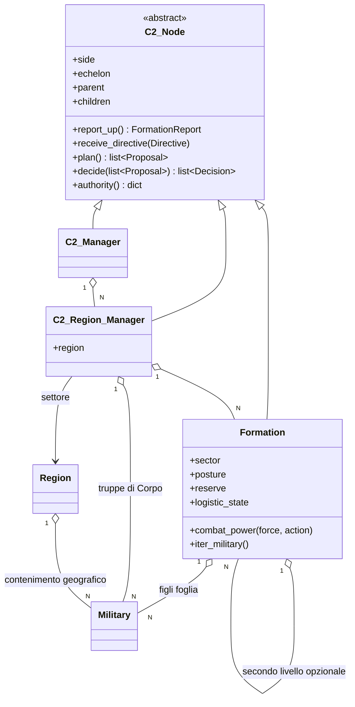
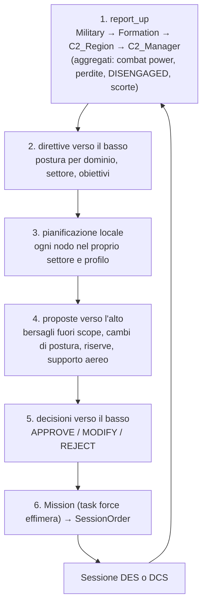

# Analisi: gerarchia delle unità militari e catena di comando

**Stato**: ANALISI E PROPOSTA (2026-09-25), in attesa delle decisioni dell'utente (§4.4, Fase 0).
Nessun file di codice modificato.
**Fonte storica**: `Analysis/Document/Forze.Armate.Mondiali.1960-1980.docx` (export di una
conversazione con Gemini). È un testo generato da un LLM che cita solo Reddit, Wikipedia e Scribd:
va usato per la **struttura** e per gli **ordini di grandezza**, mai come fonte di numeri da tarare.
Tutti i valori numerici proposti qui sotto sono **stime dichiarate**, da marcare come tali anche nei
commenti del codice.

## 1. Sintesi del documento storico

- **Piramide terrestre standard**: Gruppo d'Armate/Fronte (2-5 Armate) → Armata (2-5 Corpi, oppure
  direttamente 3-6 Divisioni) → Corpo d'Armata (2-4 Divisioni + supporto) → Divisione
  (10.000-18.000 uomini, su Brigate NATO o Reggimenti PdV) → Brigata/Reggimento (3-5 Battaglioni +
  supporto di fuoco) → Battaglione → Compagnia (80-150 uomini, 3-4 plotoni).
- **Aria**: Comando aereo/Armata aerea → Divisione aerea/Stormo → Gruppo/Squadron (12-24 velivoli).
  **Mare**: Flotta → Squadra navale → Flottiglia/Gruppo navale (task force).
- **Soglia di autonomia**: la Divisione è la più piccola unità capace di operare *in modo
  completamente autonomo per un periodo prolungato* (logistica e artiglieria organiche). Sotto la
  Brigata l'autonomia logistica è "limitata" (Battaglione) o "minima" (Compagnia).
- **Orizzonti di pianificazione**:

| Livello | Livello di guerra | Orizzonte | Autonomia logistica | Focus |
|---|---|---|---|---|
| Armata | Operativo/strategico | mesi/settimane | totale (teatro) | campagna |
| Corpo d'Armata | Operativo | settimane/giorni | elevata | sequenza di battaglie |
| Divisione | Tattico superiore | 72-24 h | autonoma | battaglia principale |
| Brigata | Tattico | 24-12 h | breve/medio termine | manovra combinata |
| Battaglione | Tattico elementare | ore/minuti | limitata (dalla Brigata) | obiettivo locale |
| Compagnia | Esecutivo | immediato | minima (dal Battaglione) | scontro a fuoco |

- **Differenze di modello rilevanti**: l'URSS combatte Fronte → Armata → Divisione → Reggimento,
  **senza Corpo d'Armata**; la NATO Gruppo d'Armate (NORTHAG/CENTAG) → Corpo → Divisione → Brigata,
  con la Brigata che negli anni '70 diventa il perno (ROAD negli USA, riforma italiana del 1975 in
  Brigate autonome); la Cina Grandi Regioni Militari → Armate di Campagna (≈ Corpi) → Divisioni; la
  Svezia Distretti militari → Brigate. Il numero di livelli *reali* varia quindi da 3 a 5 a seconda
  del paese.
- Fatto noto **non contenuto nel documento**, ma utile qui: sul fronte centrale NATO ogni Corpo
  aveva un **settore geografico proprio** (il cosiddetto *layer cake*). È la base storica per
  leggere una `Region` come settore di Corpo (§2.6).

## 2. Valutazione critica del ragionamento dell'utente

### 2.1 Cosa è corretto

Il nucleo del ragionamento è giusto. Un `Military` è un contenitore **piatto** di asset
(`Block/Block.py:119`, `Block/Military.py:54`). Se lo si chiama "Armata", i suoi asset non possono
rappresentare i mezzi delle Divisioni e delle Brigate in modo significativo, perché la struttura
interna (chi appartiene a chi, chi si ritira con chi) va persa. Anche l'intuizione di associare i
livelli alti ai C2 già progettati è corretta. Oggi le etichette `'Regiment'`, `'Battallion'`,
`'Company'`, `'Brigade'`, `'Division'` di `MILITARY_CATEGORY['Ground_Base']`
(`Context/Context.py:451-459`) sono stringhe e basta. Nessun codice di produzione le distingue:
l'unico uso è in `Test/Test_Session_Scenarios_S10_S18.py:1184` (S17), dove fanno da
**moltiplicatori di taglia** (da 1 a 6), cioè una "Divisione" di 30 asset.

### 2.2 Il ragionamento confonde tre gerarchie diverse

Il testo dell'utente passa da "classi per Armata, Divisione, Brigata" (gerarchia **organica**) a
"sistema gerarchico di C2 con logica decisionale" (gerarchia **di comando**). Nel progetto esiste
anche una terza gerarchia, quella **geografica** (`Region`, `Context/Region.py:80`). Sono tre cose
distinte:

- **organica**: chi appartiene a chi. Da sola è solo un dato e non cambia nessun esito;
- **di comando**: chi decide cosa, e con quale autonomia. È ciò che produce fedeltà nella catena
  decisionale;
- **geografica**: dove si combatte. `Region` possiede i `Block` e calcola priorità e combat power
  aggregati.

Ai fini della simulazione la gerarchia organica conta **solo attraverso i suoi effetti** sulle
decisioni (autonomia, orizzonte, riserve) e sulla logistica (autonomia di rifornimento). Un albero
organico senza logica decisionale non cambia nulla. Una logica decisionale senza albero produce un
C2 onnisciente che muove centinaia di compagnie come un'unica mente. La domanda giusta non è
"quante classi" ma **quali nodi decisionali servono**.

### 2.3 `Military` deve essere l'unità atomica: lo impone già il motore DES

Il motore DES fissa già la semantica di `Military`, indipendentemente dalla storia:

- è la **forza** del motore: `SessionOrder.force_ids` sono i `Military.name`
  (`Command/Session_Types.py:96-109`);
- il **disingaggio** è deciso per forza intera (`Context/Doctrine.py:105`, soglie di erosione 0.30
  e di shock 0.20, decisione utente del 2026-09-23). Un `Military` grande quanto una Divisione
  vera ritirerebbe l'intera Divisione dopo il 30% di perdite in un singolo ingaggio. È un esito
  assurdo, e S17 oggi lo rende possibile a livello di etichetta;
- la **potatura** dello scheduler lavora su coppie di `Block` (`Logic/Contact_Scheduler.py:41-48`
  e `:1096-1193`), e bersagli di priorità e di ricognizione sono `Block`.

Quindi `Military` = Compagnia / Batteria / Plotone / sito SAM, cioè ciò che in DCS è un **gruppo**.
La campagna DCE di riferimento (`documentazione_dcs/1975 Georgian War/.../Active/oob_ground.lua`)
ha **429 `groupId` e 903 `unitId`**, statici compresi: circa 2 unità per gruppo. La mappa
`Military` ↔ gruppo DCS 1:1 è naturale anche per il futuro adapter. Su questo punto l'utente ha
ragione, per un motivo in più di quelli che cita.

### 2.4 Ordini di grandezza: il collo di bottiglia non sono i `Military` ma gli asset

Stima con i numeri del documento. Compagnie di manovra per Divisione: 3-5 Brigate × 3-5
Battaglioni × 3-4 Compagnie = 27-100, con valore tipico 3×4×4 = 48. A queste si aggiungono batterie,
difesa aerea, genio ed esplorazione, circa +30-50%. Per gli asset si contano ~12 sistemi d'arma
principali per `Military`: 10-17 carri o VCI per compagnia, 6-8 pezzi per batteria. Camion e
fanteria appiedata sono esclusi.

| Livello (per lato) | `Military` (compagnie/batterie) | Asset 1:1 (stima) |
|---|---|---|
| Brigata | 12-25 | 150-300 |
| Divisione | 40-150 (tipico ~65) | 700-1.000 |
| Corpo d'Armata (3 Div. + truppe di Corpo) | 150-350 | 2.500-3.500 |
| Armata | 400-1.000 | 6.000-12.000 |
| Gruppo d'Armate / Fronte | 1.000-4.000 | 12.000-45.000 |

La sostenibilità va valutata per componente:

- **Scheduler dei contatti**: la potatura confronta due numeri per coppia di blocchi. Con 1.000
  `Military` per lato sono 10⁶ confronti aritmetici: è un costo trascurabile. Più `Military` più
  piccoli **non** sono un problema per il DES.
- **Numero di asset**: il limite teorico dichiarato del DES è **10.000 asset in totale**
  (`Logic/Contact_Scheduler.py:41-48`), cioè circa **un Corpo per lato** a rappresentazione 1:1.
  Un Fronte 1:1 è fuori portata di 1-2 ordini di grandezza. DCS ancora di più: la campagna DCE di
  riferimento ha meno di 1.000 unità in tutto, circa una Divisione equivalente. L'ultimo test di
  scala misurato (S8) usa 240 asset con un tetto largo di 90 s (`Test/Test_Session_Scenarios.py:696-697`),
  e il tempo è dominato da `sympy.Point3D` nel CPA. È un bug di prestazioni noto e non corretto.
- **Priorità di targeting**: `Region.update_military_priorities` (`Context/Region.py:668`) valuta
  ogni `Military` amico contro **tutti** i bersagli nemici e **tutti** gli amici della Region
  (`Logic/Tactical_Evaluation.py:876-948`), con una ricerca di rotta per coppia. In un settore di
  Corpo sono ~2 × 250² ≈ 10⁵ valutazioni per lato e per ciclo C2, senza alcuna località: una
  compagnia a nord valuta i bersagli a 80 km a sud. È una stima d'ordine di grandezza, non
  misurata. Qui un livello intermedio **riduce** davvero il costo, perché filtra i bersagli per
  settore.

**Conclusione**: rendere `Military` atomico è sostenibile. Non è invece sostenibile l'ambizione di
scala implicita nel dubbio: un "C2 di scenario = Gruppo d'Armate" con asset 1:1 non è
rappresentabile. Con il modello attuale (asset concreti, nessun asset aggregato) lo scenario
massimo realistico è **un settore di Corpo per lato**, e le sessioni DCS ne vedranno una frazione.
Chiamare "Gruppo d'Armate" il C2 globale è quindi solo un'etichetta, a meno di introdurre asset
aggregati (§3, punto 7). Questa decisione di scala va presa **prima** di scegliere il numero di
livelli (Fase 0, D1).

### 2.5 Serve modellare ogni livello? No: il criterio è l'orizzonte decisionale

Il C2 gira **solo fra una sessione e l'altra** (prima e dopo ogni sessione, sessioni di circa 2 ore
di gioco, 6 virtuali per ciclo, v. memoria `project_c2_hierarchy_design`). Dentro la sessione
decidono solo il DES e i suoi parametri: `Context/Reaction_Profile.py`, `fire_control`, le soglie
di disingaggio. Da qui un criterio netto:

> un livello merita un **nodo decisionale persistente** solo se il suo orizzonte di pianificazione
> è **più lungo** del periodo del ciclo C2. Le decisioni con orizzonte pari o inferiore a una
> sessione non sono prendibili da un nodo che gira solo fra le sessioni: appartengono al DES o
> all'ordine di sessione.

| Livello storico | Orizzonte | Dove si rappresenta | Nuova classe? |
|---|---|---|---|
| Gruppo d'Armate / Fronte | mesi | `C2_Manager` (già progettato) + attributo `echelon` | no |
| Armata / Corpo d'Armata | settimane/giorni | `C2_Region_Manager` (già progettato) + `echelon` | no |
| Divisione / Brigata (Reggimento) | 72-12 h | **nodo nuovo `Formation`**, 1 o 2 livelli della **stessa** classe | **sì, una** |
| Battaglione | ore/minuti ≈ 1 sessione | **missione effimera** del pianificatore di sessione (raggruppamento di `Military` impegnati insieme) | no |
| Compagnia / Plotone / Batteria | immediato | `Military` + DES (reazione, fuoco, disingaggio) | no |

Questo criterio riduce sei livelli a **tre nodi decisionali persistenti di due tipi** (i C2 già
previsti più `Formation`), più un raggruppamento effimero. Divisione e Brigata non richiedono
classi distinte: la differenza fra le due sta nei **parametri** (orizzonte, autonomia logistica,
ampiezza di comando, deleghe), non nel comportamento.

### 2.6 Il vincolo simulator-agnostic

Il vincolo non vieta la gerarchia, perché la gerarchia vive interamente nel core (pianificazione)
e il contratto `SessionOrder`/`SessionOutcome` resta invariato. Impone però due limiti utili:

1. **nessuna decisione di comando dentro la sessione.** Un comandante di battaglione che riassegna
   le compagnie a metà sessione non è eseguibile in DCS, dove i gruppi AI seguono rotte e compiti.
   Se il risolutore sintetico lo facesse, i due esecutori divergerebbero. È un secondo motivo,
   indipendente dal primo, per non modellare Battaglione e Compagnia come nodi decisionali;
2. **l'adapter vede solo i `Military`** (gruppi): `Formation` non ha controparte DCS e non deve
   comparire nel contratto di sessione. Gli esiti risalgono l'albero per aggregazione nel core.

### 2.7 Compatibilità con il design C2 già concordato

L'ipotesi "C2 regionale = Corpo d'Armata, C2 di scenario = Gruppo d'Armate" è **compatibile** e non
richiede di ridefinire il design. Lo **generalizza**, a tre condizioni:

- **Region = settore di Corpo**. È storicamente fondato per la NATO (*layer cake*). Per il PdV la
  stessa `Region` è il settore di un'**Armata**, che non ha Corpi. L'attributo `echelon` del
  `C2_Region_Manager` diventa quindi un dato di lato (Corpo per la NATO, Armata per il PdV), non
  una costante. Se invece una Region fosse più piccola di un settore di Corpo, il
  `C2_Region_Manager` corrisponderebbe a una Divisione e il Corpo non esisterebbe. È una scelta di
  scenario da fissare (Fase 0, D3).
- **Il protocollo proponi/approva diventa generico**: oggi è definito solo per il targeting
  regionale → globale. Con `Formation` vale per ogni coppia figlio → padre e per più tipi di
  richiesta (bersagli, cambio di postura, rilascio di riserve, supporto aereo). Il punto aperto già
  registrato in memoria, cioè la meccanica del ciclo di negoziazione, va chiuso adesso (D6).
- **Tempistica**: `C2_Manager.py` e `C2_Region_Manager.py` **non esistono ancora**. Solo
  `Command/Command_Types.py` è scritto. È il momento giusto: definire ora la base comune evita di
  riscrivere i due manager dopo.

### 2.8 Rischi: senza gerarchia esplicita e con gerarchia completa

| Senza nodi intermedi (solo 2 C2 + `Military`) | Con una classe per ognuno dei 6 livelli |
|---|---|
| **Ampiezza di comando irrealistica**: un `C2_Region_Manager` dirige 150-350 `Military` direttamente, senza attrito né delega. Il comando storico lavora su 3-5 subordinati per livello. | **Esplosione di classi**: 6 livelli × 3 domini, ognuno con una propria logica, con comportamenti in gran parte identici tranne i parametri. |
| **Nessuna coesione**: l'ottimizzazione avida delle priorità disperde le compagnie di una stessa Brigata su bersagli lontani fra loro. | **Livelli non implementabili**: Battaglione e Compagnia hanno orizzonti inferiori alla sessione e non possono decidere fra le sessioni (§2.5). Duplicherebbero il DES o violerebbero il vincolo agnostico (§2.6). |
| **Nessun luogo per l'autonomia logistica intermedia**: il riarmo oggi è globale per ogni asset dopo ogni sessione. | **Gusci vuoti**: con scenari DCS da circa una Divisione equivalente, i livelli da Armata in su avrebbero un solo figlio. |
| **Nessuna asimmetria dottrinale**: comando per obiettivi (NATO) e comando centralizzato (PdV) non sono rappresentabili, perché manca il livello a cui applicare deleghe diverse. | **Taratura impossibile**: nessuna fonte dà soglie di autonomia per 6 livelli. Si inventerebbero numeri, contro la regola del progetto. |
| **Costo di priorità quadratico** sull'intera Region, senza filtro per settore (§2.4). | **Costo di sviluppo e test** molto maggiore, a fronte di un guadagno di fedeltà non osservabile negli esiti. |
| **Nessun consumatore** per il re-instradamento dopo `DISENGAGED`, rimandato "al primo consumatore reale" (manuale DES §9.1, R4). | |

## 3. Raccomandazione

**Sì a una gerarchia di comando esplicita; no a una classe per livello storico.**

1. **`Military` resta l'unità atomica** (Compagnia / Batteria / Plotone / sito SAM = gruppo DCS).
   Nessuna modifica alla classe e nessuna al motore DES.
2. **Una sola classe nuova, `Formation`**, ricorsiva (pattern Composite): i figli sono altre
   `Formation` oppure `Military`. Il livello storico (Divisione, Brigata, Reggimento) è un
   **attributo `echelon`**, non una sottoclasse. Granularità minima sufficiente: **un livello**
   intermedio obbligatorio (Brigata NATO / Divisione PdV). Il secondo livello (Divisione sopra la
   Brigata) è ammesso dalla stessa classe ma è opzionale e va attivato solo se la scala lo giustifica.
3. **Una base comune `C2_Node`** per `C2_Manager`, `C2_Region_Manager` e `Formation`, con la
   stessa forma a 5 funzioni già concordata, il protocollo proponi/approva generico e un profilo di
   autorità. I due manager già progettati diventano i due nodi più alti dello stesso albero.
4. **Battaglione = missione effimera** del pianificatore di sessione, cioè un insieme di `Military`
   impegnati insieme per una sessione: `SessionOrder.force_ids`/`committed` bastano già. Nessuna
   classe per Battaglione o Compagnia.
5. **L'autonomia è un dato, non una sottoclasse**: una tabella *echelon × lato* in
   `Context/Doctrine.py`, come le soglie di disingaggio, con valori dichiarati come stime.
6. **Farlo ora**, prima di scrivere `C2_Manager.py`/`C2_Region_Manager.py`.
7. **Fuori perimetro, e da decidere a parte se mai servisse**: asset aggregati, cioè un `Military`
   che rappresenti statisticamente un reparto intero. È l'unica strada per scenari da Armata/Fronte
   (§2.4) ed è un progetto di risoluzione variabile a sé (wiki `concepts/variable-resolution-modeling`),
   con i problemi di consistenza fra risoluzioni documentati in `concepts/cross-resolution-modeling`.
   Non va mescolato con questa proposta.

## 4. Soluzione architetturale proposta

### 4.1 Moduli e responsabilità

| Modulo | Tipo | Responsabilità |
|---|---|---|
| `Context/Echelon.py` (nuovo) | dati, stateless | `Echelon` enum (`ARMY_GROUP`, `ARMY`, `CORPS`, `DIVISION`, `BRIGADE`, `REGIMENT`) + `ECHELON_PROFILE`: orizzonte di ri-pianificazione, autonomia logistica (giorni), ampiezza di comando indicativa. Valori ripresi dalla tabella §1 e dichiarati come stime. |
| `Context/Doctrine.py` (esteso) | dati | `DEFAULT_COMMAND_AUTHORITY[side][echelon]` + `validate_command_authority`/`get_command_authority`, sul modello di `DEFAULT_DISENGAGEMENT_THRESHOLDS` (`:105-175`). |
| `Command/Command_Types.py` (esteso) | tipi | `Proposal` (tipo, origine, payload, priorità), `Decision` (`APPROVE`/`MODIFY`/`REJECT` + payload modificato), `Directive` (postura per dominio, settore, obiettivi), `FormationReport` (aggregati verso l'alto). |
| `Command/C2_Node.py` (nuovo) | stateful | Base astratta: `parent`, `children`, `echelon`, `side`; ciclo `report_up` → `receive_directive` → `plan` → `propose` → `decide(proposals)`; controllo di autorità; ordine deterministico per id. |
| `Command/Formation.py` (nuovo) | stateful | `C2_Node` concreto per Divisione/Brigata: figli `Formation`/`Military`, settore (sottoinsieme dei `limes` della Region), postura corrente, riserva, stato logistico, `combat_power(force, action)` aggregato con lo **stesso contratto** di `Military.combat_power` (`Block/Military.py:203`), `c2_efficiency` letta dal `Military` comando (ruolo `C2`, `Block/Military.py:514`). |
| `Command/C2_Region_Manager.py`, `Command/C2_Manager.py` (da costruire) | stateful | Sottoclassi di `C2_Node` con `echelon` di lato (Corpo/Armata; Gruppo d'Armate/Fronte). Sono i proprietari dell'aria centralizzata, dell'approvazione dei bersagli e delle riserve di Corpo e di teatro. |
| `Command/Session_Mission_Planner.py` (da costruire) | stateful | `Mission` = raggruppamento effimero di `Military` (il "Battaglione"/task force), tradotto in `SessionOrder`. |

**Perché in `Command/` e non come sottoclasse di `Block` con parent/child**:

- un `Block` è un contenitore **fisico**, con asset, posizione, `Resource_Manager` e `State`
  (`Block/Block.py:103-122`). `Formation` non possiede asset propri: li deriva dai figli;
- `Region.get_blocks_by_criteria`, `Contact_Scheduler.block_pair_candidates` e
  `Tactical_Evaluation.calc_attack_priority` enumerano i `Block` come **bersagli e forze**. Una
  `Formation`-`Block` andrebbe esclusa esplicitamente ovunque, oppure verrebbe presa di mira,
  contata due volte o messa in coppia nella potatura;
- `Region` è geografica: una Divisione può trovarsi a cavallo di due Region o essere trasferita
  da un settore all'altro dal `C2_Manager`, un `Block` no;
- la separazione *stateful* `Command/` / *stateless* `Logic/` è già decisa, e `Formation` è per
  natura stato di comando.

**Invariante di appartenenza**: ogni `Military` appartiene ad **al più una** `Formation`. Il
registro inverso `military_id → Formation` vive nell'albero del lato, non sul `Military`, così la
classe resta intatta. Un `Military` senza `Formation` dipende direttamente dal `C2_Region_Manager`
(truppe di Corpo: artiglieria pesante, difesa aerea d'area).

### 4.2 Autonomia e dipendenza decisionale

Ogni nodo agisce da solo **entro** il proprio profilo di autorità. Oltre quel profilo produce una
`Proposal` per il padre. È lo stesso protocollo del targeting regionale → globale, esteso a tutti
i livelli e a più tipi di richiesta. Contenuto proposto del profilo (valori da fissare come stime
dichiarate, per lato ed echelon):

| Campo | Significato | Esempio d'uso |
|---|---|---|
| `posture_transitions` | transizioni di postura (Attack / Maintain / Defense / Retreat) consentite senza approvazione | una Brigata passa da Maintain a Defense da sola; Attack e Retreat richiedono il padre |
| `max_self_commit` | frazione massima delle proprie forze impegnabile in un'azione di propria iniziativa | contrattacco locale ≤ 1/3 della Brigata |
| `target_scope` | bersagli decidibili da soli: nel proprio settore **e** alla portata di asset organici | fuori settore, o con asset altrui (aria, artiglieria di Corpo), serve una `Proposal` |
| `reserve_release` | rilascio della riserva propria | di solito sempre al padre |
| `replan_period` | ogni quanti cicli C2 il nodo ripianifica, derivato da `ECHELON_PROFILE` | Brigata ~12-24 h, Divisione ~24-72 h. Fuori periodo ripianifica solo su **evento** (direttiva nuova, perdite oltre soglia, richiesta di un figlio) |
| `c2_degraded_policy` | comportamento con il comando degradato (`c2_efficiency` del `Military` comando sotto soglia) | NATO: prosegue l'ultima direttiva con autonomia allargata; PdV: congela la postura e non propone |

**Asimmetria dottrinale**: il comando per obiettivi NATO si traduce in profili più ampi, quello
centralizzato del PdV in profili più stretti e periodi più lunghi. È questo il guadagno di fedeltà
più visibile della gerarchia, ed è coerente con la dottrina per lato già introdotta (TASK 1,
`Context/Region.py:111-116`).

**Ciclo C2 con la gerarchia**, eseguito prima di ogni sessione dal `Theater_Session_Manager` per
ciascun lato, in ordine deterministico per id:

**Latenza delle proposte**: due opzioni (D6). (a) **Stessa passata**: il punto 5 risponde subito,
nessun ritardo. È semplice ma elimina l'attrito di comando. (b) **Un ciclo per livello
attraversato**: una richiesta che sale di due livelli viene eseguita due sessioni dopo. È più
realistica ma rallenta tutto. Proposta: (a) come default, e (b) solo quando il nodo intermedio ha
il comando degradato.

### 4.3 Impatto sul codice esistente

**Motore DES (strati 0-3)**: **nessuna modifica**.

- La forza resta il `Military`. `SessionOrder.force_ids`/`committed` coprono già la missione
  effimera, compreso l'impegno parziale di un `Military`.
- Disingaggio per forza intera, potatura, `fire_control` e controllo di portata restano identici.
  Con `Military` più piccoli il disingaggio diventa anzi **più realistico**: si ritira la
  compagnia, non la Divisione.
- `SessionOutcome` risale l'albero: `Formation` somma perdite ed esiti. Una **regola di
  formazione**, valutata fra le sessioni e non nel DES (per esempio "oltre il 50% dei figli
  `DISENGAGED` o distrutti → la Formation propone Retreat"), dà finalmente un consumatore al
  re-instradamento dopo il disingaggio, rimandato nella seconda parte di R4 (manuale DES §9.1 e §9.3).
- Fog-of-war: l'albero è solo del proprio lato. Il nemico resta visto come `Military` (ricognizione
  per `Block`). Ricostruire le formazioni nemiche è un'inferenza **non** necessaria nella prima
  versione.

**Combat power e priorità**:

- `Formation.combat_power(force, action)` somma i figli con il contratto di
  `Military.combat_power`. `Tactical_Analysis.representative_combat_power`
  (`Logic/Tactical_Analysis.py:197`) è annotata su `Military`: va verificato se funziona per duck
  typing o se serve un adattatore.
- `Tactical_Evaluation.calc_attack_priority`/`calc_defense_priority` (`:876`, `:911`) **non
  cambiano**, perché già ricevono `enemy_items`/`friendly_items` come tuple dal chiamante. La
  `Formation` le chiama passando **solo i bersagli del proprio settore** e i propri figli. Il filtro
  è tutto nel chiamante, e il costo scende di un fattore pari al numero di settori.
- `Region.update_military_priorities` (`Context/Region.py:668`) resta come percorso piatto di
  ripiego e per i `Military` senza `Formation`.
- La postura `Region._attack_weight[side]` (`Context/Region.py:111`) diventa il valore di default
  del `C2_Region_Manager`. Ogni `Formation` può sovrascriverlo con la propria postura, cioè con
  l'"indirizzo strategico" (memoria `feedback_combat_power_action_selection`) declinato per nodo.
- `Military.combat_state` (`Block/Military.py:789`) pesa già la `c2_efficiency` al 70%: il nodo di
  comando di una `Formation` distrutto degrada coerentemente tutto il sottoalbero, senza logica
  nuova nel DES.

**Logistica**: `Formation.logistic_state` (giorni di autonomia) è il punto naturale per un
rifornimento gerarchico: un `Military` si riarma solo se la sua `Formation` ha scorte e una linea
(`Context/Logistic_Lines.py`). Questo **cambia** però la regola già data dall'utente il 2026-09-23
("riarmare gli asset dopo ogni sessione"), quindi va deciso esplicitamente (D7).

### 4.4 Piano di implementazione a fasi

**Fase 0 — Decisioni dell'utente, prima di scrivere codice**

| # | Decisione | Opzioni | Raccomandazione |
|---|---|---|---|
| D1 | Scala massima dello scenario, per lato | Brigata / Divisione / settore di Corpo (con asset 1:1) | settore di Corpo come tetto (≈ limite DES); Armata e Fronte solo con asset aggregati (fuori perimetro) |
| D2 | Livelli intermedi `Formation` | 1 (Brigata NATO / Divisione PdV) oppure 2 (Divisione + Brigata) | 1 obbligatorio, il 2° attivabile per scenario |
| D3 | Significato di `Region` | settore di Corpo (NATO) / di Armata (PdV) oppure più piccola | settore di Corpo/Armata, `echelon` del `C2_Region_Manager` per lato |
| D4 | Battaglione come missione effimera | sì / nodo persistente | sì |
| D5 | `Formation` a cavallo di più Region | vietato / ammesso | vietato nella v1; trasferimento fra Region solo tramite `C2_Manager` |
| D6 | Latenza delle proposte e ciclo di negoziazione (punto aperto in memoria) | stessa passata / 1 ciclo per livello / misto | misto (§4.2) |
| D7 | Riarmo | globale per asset (regola attuale) / tramite scorta della `Formation` | globale nella v1, gerarchico come fase successiva |
| D8 | Etichette di livello in `MILITARY_CATEGORY['Ground_Base']` | mantenerle / deprecarle a favore di `Echelon` | mantenerle come "taglia dell'unità atomica" (Company/Battery), deprecare `Brigade`/`Division`/`Regiment`; rinominare le taglie di S17 |
| D9 | Profilo di autorità NATO/PdV | stessi valori / asimmetrici | asimmetrici, dichiarati come stime |

**Fasi successive**

| Fase | Obiettivo | Verifica | Rischio |
|---|---|---|---|
| 1 | `Context/Echelon.py` + `Command/Formation.py` solo **strutturale**: albero, invariante di appartenenza, `iter_military`, `combat_power`/`c2_efficiency`/`combat_state` aggregati. | Test unitari: aggregato = somma delle foglie per ogni `(force, action)`; niente cicli; un `Military` in una sola Formation; ordine deterministico. Suite completa verde. | Basso: nessun codice esistente toccato. |
| 2 | `Command/C2_Node.py` + `Proposal`/`Decision`/`Directive` in `Command_Types.py`: protocollo generico e controllo di autorità. **Da fare insieme alla costruzione di `C2_Region_Manager`/`C2_Manager`**, non prima e non dopo. | Test del protocollo: proposta dentro il profilo → nessuna `Proposal`; fuori profilo → `Proposal` al padre; `MODIFY` applicato; riproducibilità dell'ordine. | Medio: definisce la forma dei due manager ancora da scrivere. |
| 3 | `DEFAULT_COMMAND_AUTHORITY` in `Context/Doctrine.py` con `validate_`/`get_`, sul modello delle soglie di disingaggio. | Test di validazione (chiavi, intervalli, coerenza delle transizioni); valori marcati come stime. | Basso tecnicamente, alto di taratura: non esistono fonti. |
| 4 | Ciclo decisionale della `Formation`: settore, postura, priorità sul settore tramite `calc_attack_priority` con bersagli filtrati, `replan_period` ed eventi di ri-pianificazione. | Test di comportamento (un bersaglio fuori settore genera una `Proposal`; con postura Defense non si attacca oltre `max_self_commit`); test di costo che conta le valutazioni di priorità con e senza settori. | Medio: primo codice decisionale nuovo. |
| 5 | `Mission` → `SessionOrder` nel pianificatore di sessione. | Uno scenario esistente (S1 o S17) rigirato con ordini prodotti dall'albero: `run_session` invariata, stesso esito a parità di seed e forze. | Basso sul DES (non toccato), medio sul pianificatore. |
| 6 | Risalita degli esiti: aggregazione di `SessionOutcome` nella `Formation`, regola di formazione su `DISENGAGED`/perdite, primo consumatore del re-instradamento. | Scenario tipo S10 a livello di formazione: oltre soglia la `Formation` propone Retreat e il padre decide. | Medio. |
| 7 | Scenari di validazione nuovi: asimmetria dottrinale (stesse forze, profili NATO contro PdV); comando distrutto (degrado dell'autonomia); due settori di Corpo con trasferimento della riserva. | Proprietà strutturali, non coefficienti, come da regola P3 della batteria S1-S18. | Basso. |

## 5. Alternativa minima (se non si vuole introdurre `Formation`)

Se l'utente preferisce rimandare, la soluzione minima che rende possibile un'autonomia
multilivello senza classi nuove è questa:

- due attributi facoltativi su `Military`: `formation_id: Optional[str]` (etichetta della
  Brigata/Divisione di appartenenza) ed `echelon_parent: Optional[str]` (etichetta del livello
  superiore). Oggi non esiste alcun riferimento padre/figlio, verificato con grep;
- la tabella `DEFAULT_COMMAND_AUTHORITY[side][echelon]` in `Context/Doctrine.py`, identica a §4.2;
- il `C2_Region_Manager`, quando verrà scritto, raggruppa i `Military` per `formation_id` e applica
  il profilo del gruppo come se fosse un nodo.

Pro: nessuna classe nuova, e la migrazione a `Formation` resta semplice se `formation_id` è un id
stabile. Contro: lo **stato** del livello intermedio (postura, settore, riserva, scorte, ultima
direttiva) non ha dove vivere e finisce sparso in dizionari del manager; il protocollo di
proposta resta a due livelli; la logica di gruppo si duplica. Va considerata una tappa, non una
soluzione.

## 6. Reperti collaterali (fuori perimetro, non corretti)

1. **`Block/Military.py:463`** chiama `self.is_helibase()`, che non esiste in nessun punto del
   codice. Per esempio, un `Air_Base` con un asset `Vehicle` arriva a quel ramo e solleva
   `AttributeError` dentro `_is_attack_asset`, da `time_to_direct_line_attack`.
2. **`MILITARY_CATEGORY['Ground_Base']`** (`Context/Context.py:453`) mescola **etichette di
   livello** (`Regiment`, `Battallion`, `Company`, `Brigade`, `Division`) con **tipi di
   installazione** (`Stronghold`, `Farp`, `Command_&_Control_C2/C4`). Il commento sopra
   (`:437-447`, "Brigata: 2 Reggimenti - 3600 men") non coincide con il documento storico (Brigata
   = 3-5 Battaglioni). Inoltre `Battallion` è scritto con due "l". V. D8.
3. **S17** (`Test/Test_Session_Scenarios_S10_S18.py:1162-1184`) usa le etichette di livello come
   moltiplicatori 1-6: con una gerarchia reale diventerebbe fuorviante. Va rinominato in taglie
   neutre (D8).
4. `Logic/Scenario_Manager.py:27` (`CommandControl`) è da eliminare secondo la memoria, previa
   estrazione della docstring. Il suo stato `military: {}` per lato è l'antenato di quanto proposto
   qui: da rileggere quando si costruisce `C2_Node`.
