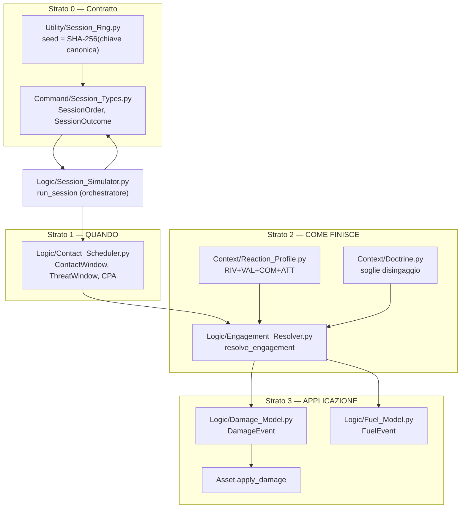

# Capitolo 1 — Scopo e motivazioni

## 1.1 Il problema: simulare ore di combattimento in minuti di calcolo

Il design C2 della campagna (`Analysis/WIKI_LLM_SIMULATION/wiki/decisions/c2-hierarchy-design.md`)
prevede sessioni "virtuali" — turni sintetici eseguiti senza un giocatore DCS — che devono
coprire ore di tempo di gioco in un budget di calcolo dichiarato dall'utente di **fino a
minuti**. Serviva un motore capace di farlo. Nella fase di analisi (documentata per esteso in
`Analysis/Document/Architettura_esecuzione_sessioni_virtuali_ANALISI.md`) erano state proposte
due strategie candidate.

### Perché non il tick a 1 ms

La prima proposta scomponeva il comportamento di ogni asset in quattro fasi di reazione — RIV
(rilevazione), VAL (valutazione), COM (comando), ATT (attuazione), un OODA loop esplicito — e le
faceva avanzare con un ciclo a passo fisso di 1 ms, dimensionato sul missile ipersonico. Il
conto è insostenibile: 2 ore di sessione × 10.000 asset (limite superiore teorico dichiarato
dall'utente, non un caso tipico) fanno 6,687·10¹⁰ aggiornamenti. Anche al solo costo del loop
vuoto di CPython (senza fare nulla dentro) servono 3,2 ore; al costo reale di un motore ad agenti
comparabile (Mesa, 95,7 µs/agente-step) servono **74 giorni**; se il rilevamento fra asset è
O(N) per asset (come sarebbe con un controllo ingenuo a ogni tick) si arriva a 3,6–21 **anni**.
Nessun simulatore entity-level reale in letteratura funziona a tick fissi su questa scala: JTLS è
a passo fisso ma **aggregato** (battaglione/brigata, equazioni di Lanchester); JCATS, BRAWLER,
AFSIM, ESAMS sono tutti **event-driven**.

Quello che la prima proposta aveva comunque di valido — e che il motore descritto in questo
manuale conserva — è la decomposizione RIV/VAL/COM/ATT: è l'unica cosa che risponde alla domanda
"chi spara per primo", cioè all'iniziativa, la cui assenza è ciò che fa fallire empiricamente i
modelli puramente aggregati a rapporto di forze. Nel motore reale queste latenze non contano
cicli: sono **parametri per tipo di sistema** che schedulano eventi futuri ("questo asset
lancerà fra 26 secondi"). V. capitolo 7, `Context/Reaction_Profile.py`.

### Perché non la sola risoluzione probabilistica

La seconda proposta risolveva l'esito di un ingaggio per via probabilistica, senza simulazione
passo-passo. La direzione è giusta ma la proposta è incompleta: non specifica **quando e se** due
forze si incontrano affatto. È il buco più grave delle due proposte, e va colmato
analiticamente — con geometria e tempo, non con un tick — non ignorato.

### La scelta: DES a coda eventi con contatti analitici

Il motore descritto in questo manuale è un **DES (discrete event simulation) a coda eventi**, in
secondi assoluti, senza alcun tick globale. Non c'è un orologio che avanza a passi fissi: la
simulazione salta da un evento al successivo (un lancio, un impatto, la fine di un movimento),
qualunque sia la distanza in tempo fra i due. Un micro-passo fine è ammesso **solo dentro una
finestra di ingaggio attiva**, mai come passo globale.

Il pezzo che mancava a entrambe le proposte originali — **quando** due forze si incontrano — è
risolto in modo **analitico**: intersezione rotta↔cilindro di minaccia (via
`Cylinder.getIntersection`, già esistente) e CPA/TCPA (*closest point of approach* / *time of
closest approach*) fra mobili con la formula del moto relativo rettilineo uniforme
`t* = -(Δr·Δv)/|Δv|²`, applicata su ogni tratto a velocità relativa costante di una rotta a
spezzata. Nessun campionamento nel tempo: si risolve un'equazione, non si itera un ciclo.
V. capitolo 3, `Logic/Contact_Scheduler.py`.

## 1.2 I quattro strati

L'architettura è a quattro strati, in secondi assoluti dall'inizio della sessione
(`Logic/Contact_Scheduler.py:1-19`, `Logic/Engagement_Resolver.py:1-11`):

0. **Contratto** — `SessionOrder`/`SessionOutcome`, solo tipi di dominio, più l'RNG di sessione
   seedato esplicitamente. È la "porta" a cui qualunque esecutore di sessione deve conformarsi:
   il risolutore sintetico del core oggi, un adapter DCS domani
   (`Command/Session_Types.py:1-33`).
1. **Scheduler dei contatti** — risponde a **quando** (rotta↔volume di minaccia, CPA/TCPA,
   potatura gerarchica a livello `Block` prima delle coppie di asset).
2. **Risolutore d'ingaggio** — risponde a **come finisce**: Pd → latenza di reazione → regole
   d'ingaggio (`fire_control`) → salva e saturazione (Hughes) → danno per colpo → disingaggio.
3. **Applicazione dello stato** — per-asset (danno, munizioni, carburante) → `SessionOutcome`,
   in un'unica passata per componente connessa di forze (l'orchestratore, capitolo 6).

*Nota sul diagramma D1*: la freccia da `ORCH` a `ST` rappresenta l'uscita
(`assemble_session_outcome`, che produce il `SessionOutcome`), non una dipendenza a tempo di
import.

## 1.3 I vincoli di progetto, non negoziabili

Questi vincoli sono dell'utente, non conclusioni dell'analisi tecnica (v.
`Analysis/WIKI_LLM_SIMULATION/wiki/decisions/virtual-session-engine-des.md`, sezione "Vincoli
dell'utente registrati"), e si ritrovano nel codice come regole verificabili:

1. **10.000 asset è un limite superiore teorico**, non un caso tipico da ottimizzare al centro
   della distribuzione. La potatura gerarchica a livello `Block`
   (`Logic/Contact_Scheduler.py:1096-1193`, meccanismo C) esiste proprio per rendere quel limite
   trattabile senza un confronto O(N²) di tutte le coppie di asset.
2. **Riproducibilità da seed**, e l'**ordine di risoluzione degli eventi fa parte del
   contratto**: salvare solo il seed non basta, perché un PRNG riproduce la stessa sequenza solo
   a parità di ordine delle chiamate (`Utility/Session_Rng.py:1-9`). Concretamente: le liste di
   `ContactWindow` sono sempre ordinate per tempo e, a parità di tempo, per identificativo di
   dominio (`Logic/Contact_Scheduler.py:58-60`); la coda eventi del risolutore usa un tie-break
   deterministico `(t, tipo, id, sequenza)` (`Logic/Engagement_Resolver.py:118-123`); l'RNG di
   ogni ingaggio è derivato da una chiave canonica che non dipende dall'ordine di iterazione di
   un dizionario Python (`Logic/Session_Simulator.py:71-99`, `engagement_event_id`).
3. **Perdite e danni per singolo asset**, mai aggregati. È il motivo per cui esiste
   `Logic/Damage_Model.py` (un `DamageEvent` per colpo risolto, non un delta di forza) e per cui
   `Logic/Tactical_Evaluation.calcFightResult` — il modello aggregato a rapporto di forze
   preesistente — resta un **fallback**, mai il risolutore primario
   (`Logic/Engagement_Resolver.py:140`).
4. **Budget di calcolo per sessione: fino a minuti.** Non verificato in questo manuale con
   misure a runtime; lo scenario S8 (capitolo 8) è quello dedicato esplicitamente a misurare il
   tempo di calcolo su una scala di decine di blocchi.

## 1.4 Il vincolo "core indifferente al simulatore"

Un vincolo architetturale trasversale, non specifico del motore DES ma che il motore DES deve
rispettare: il core Python deve restare **indifferente al simulatore** che esegue la sessione. Il
test operativo dichiarato è: *cancellando l'adapter DCS, la campagna deve continuare a girare con
sole sessioni sintetiche* (`Analysis/WIKI_LLM_SIMULATION/wiki/decisions/core-simulator-agnostic.md`,
memoria `feedback_core_simulator_agnostic`).

Concretamente, per il motore descritto in questo manuale, questo si traduce in:

- le porte `SessionOrder`/`SessionOutcome` e tutti i tipi atomici che trasportano (`ForceOutcome`,
  `DamageEvent`, `AmmunitionEvent`, `InterceptionEvent`, `FuelEvent`) contengono **solo tipi di
  dominio**: stringhe (id di dominio, mai id del simulatore), secondi assoluti come float, interi,
  frazioni, booleani — mai un concetto del simulatore (`Command/Session_Types.py:9-18`);
- nessun modulo dello strato 0-3 importa alcunché legato a un simulatore specifico (lettori
  `.miz`/Lua, orologio del simulatore);
- oggi (a questo commit) **non esiste alcun adapter DCS** nell'albero Python
  (`Code/Dynamic_War_Manager/Source/`): l'integrazione con DCS vive interamente a livello di file
  `.miz`/Lua, fuori da questo albero. Il test "cancellando l'adapter la campagna gira" non ha
  quindi, oggi, nulla da cancellare — è un test di **contratto**, verificato staticamente
  (struttura dei tipi) e funzionalmente (l'intera catena gira end-to-end con dati costruiti solo
  in Python). Il dettaglio della verifica è nel capitolo 8.

## 1.5 Le due decisioni di modello che attraversano tutti gli strati

Due scelte di modello, prese durante l'analisi e verificate nel codice, meritano di essere
enunciate prima di entrare nel dettaglio strato per strato, perché ricorrono in più capitoli:

- **Il modello a salva di Hughes** per gli scenari molti-contro-molti: i colpi che arrivano su
  una forza nello stesso evento-salva sono prima confrontati con la capacità di intercettazione
  del bersaglio (saturazione), poi il surplus raggiunge il modello di danno colpo per colpo. Vive
  nello strato 2 (`Logic/Engagement_Resolver.py`, capitolo 4).
- **RNG di sessione seedato**, mai `random` di modulo: ogni estrazione stocastica dell'intero
  motore passa da un `random.Random` costruito da `Utility/Session_Rng.session_rng(session_id,
  mission_id, event_id, counter)`, il cui seed è un hash SHA-256 di una codifica canonica della
  chiave — mai `hash()` di Python, che è randomizzato per processo. V. capitolo 7.

