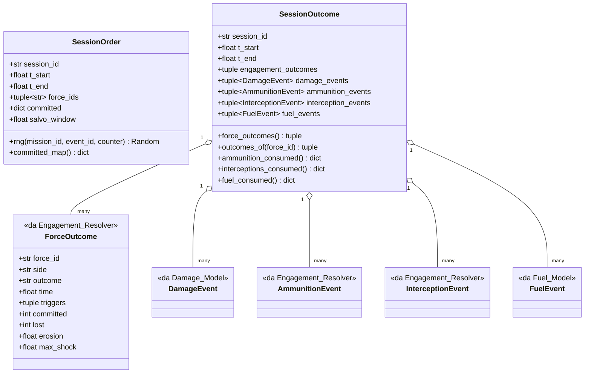

# Capitolo 2 — Lo strato 0: il contratto delle porte

Modulo: `Command/Session_Types.py`.

## 2.1 Scopo

Definisce le due "porte" di dominio a cui qualunque esecutore di sessione deve conformarsi: il
risolutore sintetico del core oggi, un adapter DCS domani
(`Command/Session_Types.py:4-18`). `SessionOrder` è la porta di ingresso (core → sessione),
`SessionOutcome` la porta di uscita (sessione → core). Il modulo non contiene alcuna logica di
calcolo oltre a validazione e aggregazione — stesso stile di `Command/Command_Types.py`
(`Command/Session_Types.py:31-33`).

Cosa **non** c'è, di proposito (`Command/Session_Types.py:20-29`): nessun campo per missioni
strutturate aria/terra/mare, rotte assegnate o obiettivi dentro `SessionOrder` (nascerà con
l'orchestratore e con il futuro `Theater_Session_Manager`); nessuna scrittura in
`Campaign_State`; nessun componente LLM.

## 2.2 `SessionOrder` — porta di ingresso

`Command/Session_Types.py:82-168`. Dataclass frozen. Campi:

| Campo | Tipo | Significato |
|---|---|---|
| `session_id` | `str` | Id di dominio della sessione. È anche la **radice del seed**: tutte le estrazioni della sessione derivano da `Session_Rng.session_seed(session_id, ...)`. |
| `t_start` | `float` | Inizio sessione, secondi assoluti. |
| `t_end` | `Optional[float]` | Fine dichiarata; `None` = sessione aperta, la durata la decide l'esecutore (v. capitolo 6, §6.6). |
| `force_ids` | `Tuple[str, ...]` | Id di dominio delle forze coinvolte (i `Military.name`). |
| `committed` | `Optional[Mapping[str, Tuple[str, ...]]]` | `{force_id: (asset_id, ...)}` per impegnare solo una parte di una forza; stessa forma di `resolve_engagement(committed=...)`. |
| `salvo_window` | `float` | Secondi che raggruppano impatti successivi in un unico evento-salva, passato tale e quale a `resolve_engagement` (default 0.0). |

Metodi: `rng(mission_id=None, event_id=None, counter=0)` (`Command/Session_Types.py:162-164`)
restituisce il `random.Random` di questa sessione per la chiave data; `committed_map()`
(`:166-168`) converte `committed` in un dict ordinario per `resolve_engagement`.

## 2.3 `SessionOutcome` — porta di uscita

`Command/Session_Types.py:173-246`. Dataclass frozen, immutabile.

| Campo | Tipo | Significato |
|---|---|---|
| `session_id`, `t_start`, `t_end` | | Intervallo effettivamente coperto (`t_start`/`t_end` possono essere `None` se la sessione non ha prodotto nulla). |
| `engagement_outcomes` | `Tuple[Tuple[ForceOutcome, ...], ...]` | Per ogni ingaggio, nell'ordine di risoluzione, gli esiti delle forze coinvolte. Tenuti raggruppati per ingaggio: un `ForceOutcome` è relativo al SUO ingaggio (v. §2.5). |
| `damage_events` | `Tuple[DamageEvent, ...]` | Ordinati per tempo (v. §2.4). |
| `ammunition_events` | `Tuple[AmmunitionEvent, ...]` | Solo fuoco offensivo (salve), non intercettazioni. |
| `interception_events` | `Tuple[InterceptionEvent, ...]` | Solo intercettazioni. |
| `fuel_events` | `Tuple[FuelEvent, ...]` | Consumo carburante per movimento. |

Nessuno di questi tipi atomici è duplicato qui: `ForceOutcome`/`AmmunitionEvent`/
`InterceptionEvent`/`EngagementResult` vengono da `Logic/Engagement_Resolver.py`, `DamageEvent`
da `Logic/Damage_Model.py`, `FuelEvent` da `Logic/Fuel_Model.py`
(`Command/Session_Types.py:16-18`). Il modulo definisce solo i contenitori.

Metodi di lettura (nessuna mutazione, nessun ricalcolo): `force_outcomes`
(`:204-207`, appiattisce tutti gli esiti di forza), `outcomes_of(force_id)` (`:209-211`),
`ammunition_consumed()` (`:213-227`, colpi sparati offensivamente per asset),
`interceptions_consumed()` (`:229-236`), `fuel_consumed()` (`:238-245`).

Nota sul conteggio munizioni (`Command/Session_Types.py:213-221`): fino al 2026-09-23
`ammunition_consumed()` sommava anche le intercettazioni; ora sono due contatori distinti,
perché un cannone AA e un SAM consumano scorte fisicamente diverse (v. capitolo 4, §4.4). Per un
SAM puro (`Mobile.interceptor_shares_ammunition`) il calo totale della scorta fisica è la somma
dei due conteggi.

## 2.4 `assemble_session_outcome` — la funzione pura di aggregazione

`Command/Session_Types.py:257-347`. Firma:

```python
assemble_session_outcome(session_id, engagement_results, fuel_events=(),
                          t_start=None, t_end=None) -> SessionOutcome
```

Aggrega gli esiti di più chiamate a `resolve_engagement` (una per componente connessa di forze,
v. capitolo 6) in un unico `SessionOutcome`. È una **funzione pura**: non tocca alcun asset, non
scrive `Campaign_State`, non estrae numeri casuali (`:262-263`).

Regole rilevanti:

- I risultati `None` (che `resolve_engagement` restituisce quando un ingaggio non è risolvibile,
  v. capitolo 4) sono saltati con un log di debug, non un errore (`:303-313`).
- **Ordine degli eventi nel risultato**: per ciascun tipo, ordinamento **stabile** per `time`
  sulla concatenazione degli eventi nell'ordine degli ingaggi (`:277-281`, `:323-327`). Dentro un
  ingaggio gli eventi sono già in ordine di tempo non decrescente (la coda del risolutore); a
  parità di istante fra ingaggi diversi vale l'ordine degli ingaggi. Stesso input → stesso
  output.
- Se `t_start`/`t_end` sono dichiarati, ogni ingaggio ed evento deve caderci dentro, altrimenti
  `ValueError` (`:334-338`); se non dichiarati, sono ricavati come min/max delle attività
  (`:329-332`, `:341-342`).
- **Limite noto, dichiarato** (`:283-287`, `_warn_shared_targets` a `:350-360`): se due ingaggi
  della stessa sessione coinvolgono lo stesso asset e sono stati risolti **senza** applicare il
  primo esito prima di risolvere il secondo, i campi `health_before`/`health_after` dei loro
  `DamageEvent` non sono concatenabili (ogni ingaggio ha letto la salute di partenza). I delta
  restano applicabili in sequenza; un warning segnala il caso. Evitarlo è responsabilità
  dell'orchestratore — che infatti, dalla Fase 6, risolve ogni **componente connessa** con una
  sola chiamata e applica subito l'esito (v. capitolo 6, §6.3): con componenti disgiunte questo
  limite non si presenta mai nella pratica di `run_session`.

## 2.5 Diagramma D2 — tipi di dominio delle porte



I tipi con lo stereotipo `<<da ...>>` sono definiti nel loro modulo di origine (capitoli 4 e 5)
e solo riesposti come contenuto di `SessionOutcome`: `Session_Types.py` non li ridefinisce
(v. §2.1). Il campo `engagement_outcomes` è in realtà una tupla **di tuple** di `ForceOutcome`
(una tupla interna per ogni ingaggio, v. §2.3): il diagramma lo mostra semplificato a `tuple` per
restare leggibile in sintassi mermaid; la relazione di composizione con `ForceOutcome` sotto
resta corretta nella cardinalità "molti".
