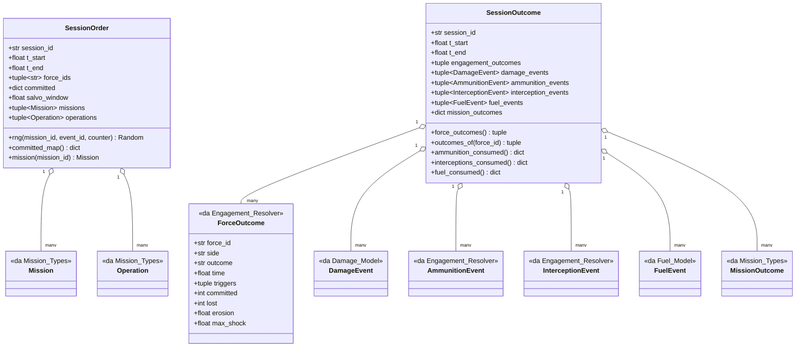
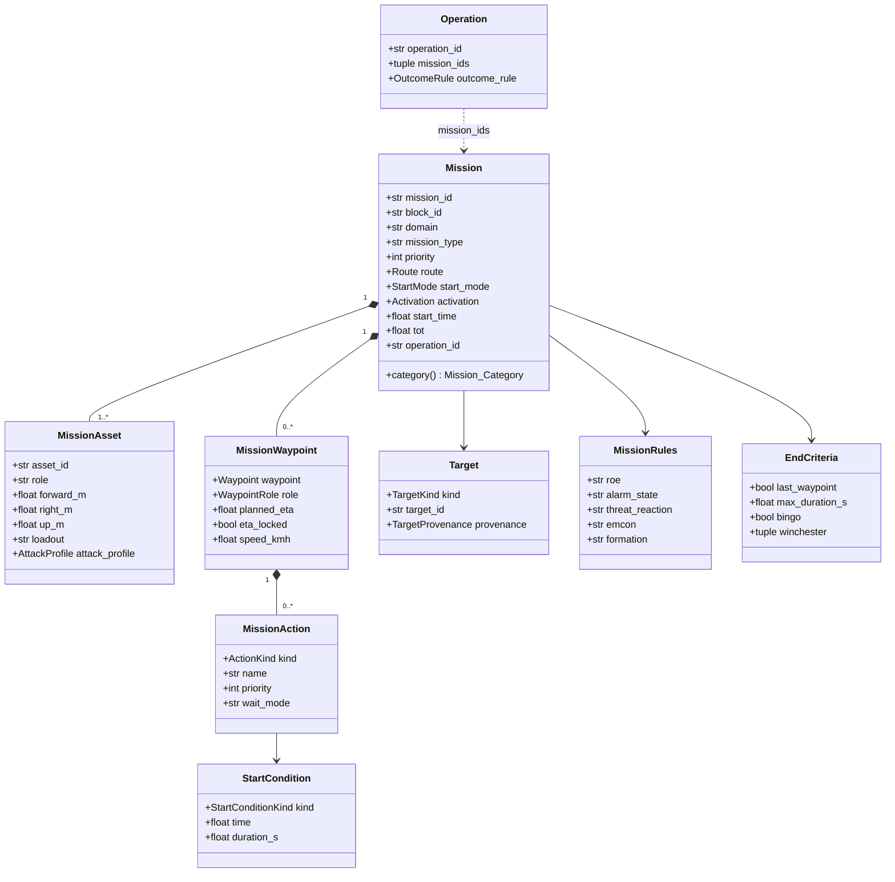
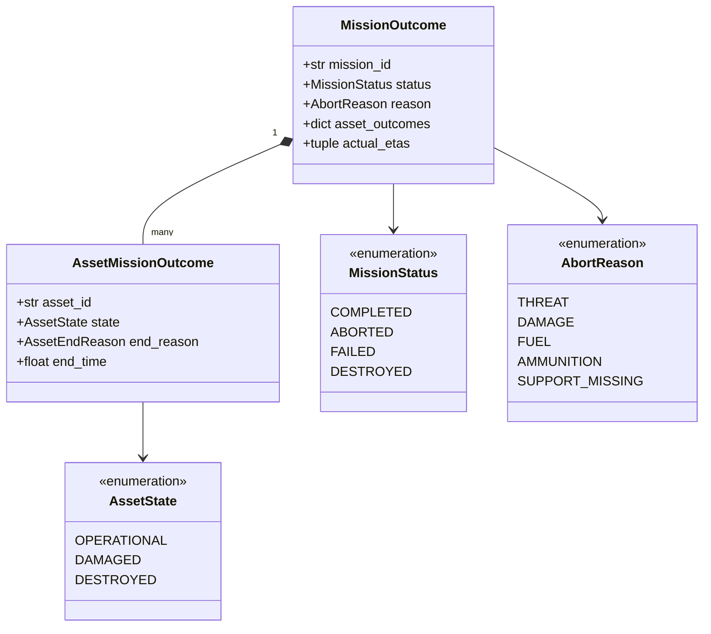
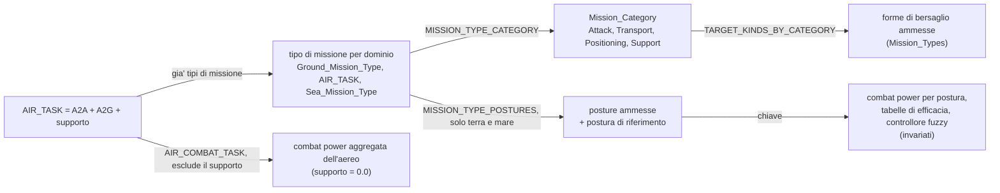

# Capitolo 2 — Lo strato 0: il contratto delle porte

Moduli: `Command/Session_Types.py` (le due porte) e, dalla fase F3 del piano della Missione
(`533cd1f5`), `Command/Mission_Types.py` (i tipi di dominio della Missione che attraversano la porta,
§2.6) con la tassonomia dei tipi di missione di `Context/Context.py` (§2.7).

## 2.1 Scopo

Definisce le due "porte" di dominio a cui qualunque esecutore di sessione deve conformarsi: il
risolutore sintetico del core oggi, un adapter DCS domani
(`Command/Session_Types.py:4-18`). `SessionOrder` è la porta di ingresso (core → sessione),
`SessionOutcome` la porta di uscita (sessione → core). Il modulo non contiene alcuna logica di
calcolo oltre a validazione e aggregazione — stesso stile di `Command/Command_Types.py`
(`Command/Session_Types.py:38-40`).

**Aggiornamento a `533cd1f5` (fase F3 della Missione, 2026-10-05).** Alla stesura iniziale la porta non
portava nessuna missione: rotte, partenze e velocità degli asset entravano in `run_session` come tre
mappe separate. Ora `SessionOrder` porta le `Mission` e le `Operation` (`Command/Session_Types.py:20-26`) e
`SessionOutcome` porta l'esito di ogni missione (`mission_outcomes`): **le missioni sono l'unica
strada** con cui un asset riceve rotta, partenza e velocità in una sessione (le tre mappe sono state
rimosse da `run_session`, capitolo 6 §6.1). La Missione è un tipo di dominio: stringhe (id), secondi
dall'inizio della sessione, metri, km/h, enum di valori di dominio — nessun concetto del simulatore
(§2.6, §2.9).

Cosa **non** c'è, di proposito (`Command/Session_Types.py:28-36`): nessun concetto che il codice
non ha ancora — obiettivi di campagna, finestre di sessione di campagna (fase F8), re-scheduling (il
livello superiore nascerà con il futuro `Theater_Session_Manager`); nessuna scrittura in
`Campaign_State`; nessun componente LLM.

## 2.2 `SessionOrder` — porta di ingresso

`Command/Session_Types.py:127-295`. Dataclass frozen. Campi (`:159-166`):

| Campo | Tipo | Significato |
|---|---|---|
| `session_id` | `str` | Id di dominio della sessione. È anche la **radice del seed**: tutte le estrazioni della sessione derivano da `Session_Rng.session_seed(session_id, ...)`. |
| `t_start` | `float` | Inizio sessione, secondi assoluti. |
| `t_end` | `Optional[float]` | Fine dichiarata; `None` = sessione aperta, la durata la decide l'esecutore (v. capitolo 6, §6.6). |
| `force_ids` | `Tuple[str, ...]` | Id di dominio delle forze coinvolte (i `Military.name`). |
| `committed` | `Optional[Mapping[str, Tuple[str, ...]]]` | `{force_id: (asset_id, ...)}` per impegnare solo una parte di una forza; stessa forma di `resolve_engagement(committed=...)`. |
| `salvo_window` | `float` | Secondi che raggruppano impatti successivi in un unico evento-salva, passato tale e quale a `resolve_engagement` (default 0.0). |
| `missions` | `Tuple[Mission, ...]` | Le missioni della sessione (F3), default nessuna: gli asset senza missione restano fermi. |
| `operations` | `Tuple[Operation, ...]` | Le operazioni della sessione (F3), default nessuna. |

Metodi: `rng(mission_id=None, event_id=None, counter=0)` (`Command/Session_Types.py:289-291`)
restituisce il `random.Random` di questa sessione per la chiave data; `committed_map()`
(`:293-295`) converte `committed` in un dict ordinario per `resolve_engagement`;
`mission(mission_id)` (`:281-287`) restituisce la missione dell'ordine o solleva `KeyError`.

**Validazione di `missions` e `operations`** (`_validate_missions`, `:220-243`;
`_validate_operations`, `:245-279`; solo validazione strutturale, l'appartenenza degli asset al
blocco si verifica con gli oggetti del modello in `run_session`, capitolo 6 §6.1):

- `mission_id` unici nell'ordine;
- `block_id` di ogni missione fra i `force_ids`, se `force_ids` non è vuoto;
- un asset in **al più una** missione della sessione (regola dell'utente, 2026-10-05); un blocco può
  invece avere **più missioni nella stessa sessione** (es. fighter e fighter-bomber nella stessa
  missione, ciascuno col proprio loadout, oppure in due missioni distinte);
- `operation_id` unici; ogni `mission_ids` di un'operazione riferisce missioni di **questo** ordine; una
  missione sta in al più un'operazione e, se dichiara un `operation_id`, deve essere quello
  dell'operazione che la elenca.

## 2.3 `SessionOutcome` — porta di uscita

`Command/Session_Types.py:300-392`. Dataclass frozen, immutabile.

| Campo | Tipo | Significato |
|---|---|---|
| `session_id`, `t_start`, `t_end` | | Intervallo effettivamente coperto (`t_start`/`t_end` possono essere `None` se la sessione non ha prodotto nulla). |
| `engagement_outcomes` | `Tuple[Tuple[ForceOutcome, ...], ...]` | Per ogni ingaggio, nell'ordine di risoluzione, gli esiti delle forze coinvolte. Tenuti raggruppati per ingaggio: un `ForceOutcome` è relativo al SUO ingaggio (v. §2.5). |
| `damage_events` | `Tuple[DamageEvent, ...]` | Ordinati per tempo (v. §2.4). |
| `ammunition_events` | `Tuple[AmmunitionEvent, ...]` | Solo fuoco offensivo (salve), non intercettazioni. |
| `interception_events` | `Tuple[InterceptionEvent, ...]` | Solo intercettazioni. |
| `fuel_events` | `Tuple[FuelEvent, ...]` | Consumo carburante per movimento. |
| `mission_outcomes` | `Mapping[str, MissionOutcome]` | `{mission_id: MissionOutcome}`, mapping immutabile (`MappingProxyType`), una voce per missione dell'ordine (F3); vuoto se l'ordine non ha missioni. La chiave deve coincidere con `MissionOutcome.mission_id` (`_check_mission_outcomes`, `:96-117`). |

Nessuno di questi tipi atomici è duplicato qui: `ForceOutcome`/`AmmunitionEvent`/
`InterceptionEvent`/`EngagementResult` vengono da `Logic/Engagement_Resolver.py`, `DamageEvent`
da `Logic/Damage_Model.py`, `FuelEvent` da `Logic/Fuel_Model.py`, `MissionOutcome` da
`Command/Mission_Types.py` (`Command/Session_Types.py:16-18`, `:20-26`). Il modulo definisce solo i
contenitori.

Metodi di lettura (nessuna mutazione, nessun ricalcolo): `force_outcomes`
(`:336-339`, appiattisce tutti gli esiti di forza), `outcomes_of(force_id)` (`:341-343`),
`ammunition_consumed()` (`:345-359`, colpi sparati offensivamente per asset),
`ammunition_consumed_by_weapon()` (`:361-374`, `{asset: {arma | None: unità}}`: la scorta per arma
non va appiattita all'uscita, è la forma che la porta verso il simulatore riceverà dall'altro lato),
`interceptions_consumed()` (`:376-383`), `fuel_consumed()` (`:385-392`).

Nota sul conteggio munizioni (`Command/Session_Types.py:346-352`): fino al 2026-09-23
`ammunition_consumed()` sommava anche le intercettazioni; ora sono due contatori distinti per
scopo — fuoco offensivo e intercettazione restano due eventi diversi anche quando è la stessa
arma a farli entrambi (v. capitolo 4, §4.4). **Aggiornamento 2026-09-26** (v. capitolo 4, §4.19):
per un'arma modellata per scorta che ha anche un ruolo antiaereo, le due voci
(`ammunition_consumed()` e `interceptions_consumed()`) scalano la **stessa** voce fisica di
`Mobile.stores` — il calo totale della scorta fisica di quel modello d'arma è quindi la somma dei
due conteggi, non più solo per il caso speciale del "SAM puro" (regola ormai eliminata,
`Mobile.interceptor_shares_ammunition` non esiste più), ma per costruzione per ogni asset con
scorta per arma.

## 2.4 `assemble_session_outcome` — la funzione pura di aggregazione

`Command/Session_Types.py:404-499`. Firma:

```python
assemble_session_outcome(session_id, engagement_results, fuel_events=(),
                          t_start=None, t_end=None, mission_outcomes=None) -> SessionOutcome
```

Aggrega gli esiti di più chiamate a `resolve_engagement` (una per componente connessa di forze,
v. capitolo 6) in un unico `SessionOutcome`. È una **funzione pura**: non tocca alcun asset, non
scrive `Campaign_State`, non estrae numeri casuali (`:411-413`). `mission_outcomes` (F3) sono
riportati **tali e quali** (`None` = nessuna missione): sono già calcolati dall'esecutore, la funzione
non li ricalcola (`:425-426`, `:499`).

Regole rilevanti:

- I risultati `None` (che `resolve_engagement` restituisce quando un ingaggio non è risolvibile,
  v. capitolo 4) sono saltati con un log di debug, non un errore (`:454-458`).
- **Ordine degli eventi nel risultato**: per ciascun tipo, ordinamento **stabile** per `time`
  sulla concatenazione degli eventi nell'ordine degli ingaggi (`:428-432`, `:474-478`). Dentro un
  ingaggio gli eventi sono già in ordine di tempo non decrescente (la coda del risolutore); a
  parità di istante fra ingaggi diversi vale l'ordine degli ingaggi. Stesso input → stesso
  output.
- Se `t_start`/`t_end` sono dichiarati, ogni ingaggio ed evento deve caderci dentro, altrimenti
  `ValueError` (`:485-489`); se non dichiarati, sono ricavati come min/max delle attività
  (`:480-483`, `:492-493`).
- **Limite noto, dichiarato** (`:434-438`, `_warn_shared_targets` a `:502-512`): se due ingaggi
  della stessa sessione coinvolgono lo stesso asset e sono stati risolti **senza** applicare il
  primo esito prima di risolvere il secondo, i campi `health_before`/`health_after` dei loro
  `DamageEvent` non sono concatenabili (ogni ingaggio ha letto la salute di partenza). I delta
  restano applicabili in sequenza; un warning segnala il caso. Evitarlo è responsabilità
  dell'orchestratore — che infatti, dalla Fase 6, risolve ogni **componente connessa** con una
  sola chiamata e applica subito l'esito (v. capitolo 6, §6.3): con componenti disgiunte questo
  limite non si presenta mai nella pratica di `run_session`.

## 2.5 Diagramma D2 — tipi di dominio delle porte


```mermaid
classDiagram
    class SessionOrder {
        +str session_id
        +float t_start
        +float t_end
        +tuple~str~ force_ids
        +dict committed
        +float salvo_window
        +tuple~Mission~ missions
        +tuple~Operation~ operations
        +rng(mission_id, event_id, counter) Random
        +committed_map() dict
        +mission(mission_id) Mission
    }

    class SessionOutcome {
        +str session_id
        +float t_start
        +float t_end
        +tuple engagement_outcomes
        +tuple~DamageEvent~ damage_events
        +tuple~AmmunitionEvent~ ammunition_events
        +tuple~InterceptionEvent~ interception_events
        +tuple~FuelEvent~ fuel_events
        +dict mission_outcomes
        +force_outcomes() tuple
        +outcomes_of(force_id) tuple
        +ammunition_consumed() dict
        +interceptions_consumed() dict
        +fuel_consumed() dict
    }

    class ForceOutcome {
        <<da Engagement_Resolver>>
        +str force_id
        +str side
        +str outcome
        +float time
        +tuple triggers
        +int committed
        +int lost
        +float erosion
        +float max_shock
    }

    class DamageEvent {
        <<da Damage_Model>>
    }
    class AmmunitionEvent {
        <<da Engagement_Resolver>>
    }
    class InterceptionEvent {
        <<da Engagement_Resolver>>
    }
    class FuelEvent {
        <<da Fuel_Model>>
    }
    class Mission {
        <<da Mission_Types>>
    }
    class Operation {
        <<da Mission_Types>>
    }
    class MissionOutcome {
        <<da Mission_Types>>
    }

    SessionOutcome "1" o-- "many" ForceOutcome
    SessionOutcome "1" o-- "many" DamageEvent
    SessionOutcome "1" o-- "many" AmmunitionEvent
    SessionOutcome "1" o-- "many" InterceptionEvent
    SessionOutcome "1" o-- "many" FuelEvent
    SessionOutcome "1" o-- "many" MissionOutcome
    SessionOrder "1" o-- "many" Mission
    SessionOrder "1" o-- "many" Operation
```

I tipi con lo stereotipo `<<da ...>>` sono definiti nel loro modulo di origine (capitoli 4 e 5 e,
per `Mission`/`Operation`/`MissionOutcome`, §2.6) e solo riesposti come contenuto delle porte:
`Session_Types.py` non li ridefinisce (v. §2.1). `mission_outcomes` è in realtà un mapping
`{mission_id: MissionOutcome}`: il diagramma lo mostra come composizione per leggibilità.
Il campo `engagement_outcomes` è in realtà una tupla **di tuple** di `ForceOutcome`
(una tupla interna per ogni ingaggio, v. §2.3): il diagramma lo mostra semplificato a `tuple` per
restare leggibile in sintassi mermaid; la relazione di composizione con `ForceOutcome` sotto
resta corretta nella cardinalità "molti".

## 2.6 La Missione: `Command/Mission_Types.py` (fase F1, 2026-10-05, commit `20b6de72`, `680dfcb6`)

Modulo nuovo (1189 righe) con i tipi di dominio della **Missione**, dalle decisioni D1-D6 e N1-N3 di
`Analysis/Document/Proposta_Struttura_Missione_Decisioni.md` e dal piano
`Analysis/Document/Piano_Implementazione_Missione.md` (fasi F0-F9; a `533cd1f5` sono fatte F0-F3, v.
capitolo 9 §9.5). Stile di `Command/Attack_Types.py` e `Command/Session_Types.py`: dataclass immutabili,
validazione in `__post_init__`, mapping resi immutabili con `MappingProxyType`; dipendenze `sympy`,
`Context`, `DataType` e `Command.Attack_Types`, **nessun** modulo di `Logic` (nessun ciclo d'import,
`Command/Mission_Types.py:1-50`; `:33-41` "Cosa NON c'è"). Contiene solo **struttura e validazione**: nessuna logica di calcolo
(ETA derivate, posizioni di formazione, esito di un'operazione): dalla F3 la logica che ricava rotta,
partenza e velocità per asset è in `Logic/Mission_Adapter` (capitolo 6 §6.10), e l'esito di missione lo
produce `Logic/Session_Simulator` (capitolo 6 §6.11).

**Terminologia** (D3.a, dal documento originale dell'utente): **Missione** = azioni di attacco,
trasporto, posizionamento o supporto svolte da asset di **un solo** blocco, con un bersaglio (o nessuno),
una rotta di riferimento e le direttive (ROE, ...); **Operazione** = insieme facoltativo di missioni
(anche di blocchi diversi) per uno stesso scopo, con TOT comune facoltativo e una regola d'esito.

### I tipi

| Tipo | Contenuto | Riga |
|---|---|---|
| `Target` | forma `TargetKind` (`ASSET`, `GROUP`, `POINT`, `AREA`, `ZONE`, `NONE`) e **provenienza** `TargetProvenance` (`OBSERVED`: `target_id` + `observed_at`; `ESTIMATED`: posizione + `estimated_at` + `uncertainty_m`). Gli istanti possono essere negativi (osservazione precedente alla sessione). Un `ASSET`/`GROUP` è sempre `OBSERVED`: una posizione stimata è un bersaglio `POINT`/`AREA`. Il DES userà la posizione **stimata**, non quella vera (nebbia di guerra, F7) | `:408-498` |
| `StartCondition` | condizione d'avvio **pre-calcolabile** di un'azione: `ON_ARRIVAL`, `AT_TIME` (istante), `AFTER_DURATION` (secondi dall'arrivo); nessuna dipende dallo stato della sessione | `:503-541` |
| `MissionAction` | `ActionKind` (`TASK`, `RULE`, `COMMAND`, `WAIT`), nome di dominio, `params` (mapping immutabile, valori non validati), priorità (0 = massima), `StartCondition`; per `WAIT`: `wait_mode` (`hold`/`orbit`) e **uno** fra `wait_duration_s` e `wait_until` | `:544-599` |
| `MissionWaypoint` | **contiene** un `DataType.Waypoint` (lo stesso oggetto della `Route`): ruolo `WaypointRole` (12 valori: `DEPARTURE`, `JOIN`, `NAV`, `IP`, `ATTACK`, `EGRESS`, `SPLIT`, `LAND`, `STATION`, `ASSEMBLY`, `OBJECTIVE`, `HOLD`), ETA pianificata (`planned_eta`, `eta_locked` = istante bloccato), velocità del tratto in arrivo, riferimento di quota (`MSL`/`AGL`), azioni | `:602-652` |
| `MissionAsset` | `asset_id`, **ruolo = posizione nella formazione**, offset di formazione (`forward_m`, `right_m`, `up_m` nella terna della direzione di marcia), `loadout` e `attack_profile` **per asset** (solo aria) | `:660-697` |
| `EndCriteria` | criteri di fine **dichiarati**: `last_waypoint` (default `True`), `max_duration_s`, `bingo` (default `True`), `winchester` (categorie d'arma), `abort_on_threat`, `damage_threshold`, `target_destroyed`; almeno uno fra `last_waypoint` e `max_duration_s` | `:700-751` |
| `MissionRules` | ROE, stato di allerta, reazione alla minaccia, EMCON, formazione; un campo `None` = default del dominio, risolto da `for_domain` | `:757-799` |
| `Mission` | `mission_id`, `block_id`, `domain`, `mission_type`, asset, bersaglio, priorità, rotta di riferimento (`DataType.Route`) e `MissionWaypoint`, `start_time`, `start_mode`, `activation`, `tot`, regole, criteri di fine, `operation_id` | `:804-1012` |
| `Operation` | `operation_id`, scopo, `mission_ids`, TOT comune, `OutcomeRule` (`MAIN_MISSION`, `ALL`, `ANY`), `main_mission_id` | `:1047-1091` |
| `AssetMissionOutcome` | `asset_id`, `AssetState` (`OPERATIONAL`, `DAMAGED`, `DESTROYED`), `AssetEndReason` (10 valori, fra cui `ROUTE_COMPLETED`, `BINGO`, `WINCHESTER`, `DESTROYED`, `SESSION_END`), istante di fine | `:1096-1122` |
| `MissionOutcome` | `MissionStatus` (`COMPLETED`, `ABORTED` con `AbortReason`, `FAILED`, `DESTROYED`), esiti per asset, ETA effettive per waypoint | `:1125-1189` |

La rotta resta **geometrica** (`DataType.Route`, decisione N2.a = C): tempi, ruoli e azioni dei punti
vivono in `MissionWaypoint`, che *contiene* il waypoint. `route_waypoints(route)` (`:387-403`) dà i
waypoint nell'ordine di percorrenza (l'ordine di inserimento di `route.edges`; `Route.getWaypoints()` non
serve, è un heap ordinato per nome).

### Validazioni di `Mission` (`__post_init__`, `:850-891`, e sottofunzioni)

- `mission_type` è una chiave di `Context.MISSION_TYPES[domain]` (§2.7);
- **asset** (`_validate_assets`, `:893-913`): almeno uno, id distinti, ruolo ammesso per il dominio
  (`MISSION_ASSET_ROLES`), `loadout`/`attack_profile` solo in missioni aeree;
- **bersaglio coerente con la categoria** (`TARGET_KINDS_BY_CATEGORY`, `:260-266`): `ATTACK` accetta
  asset/gruppo/punto/area/zona; `TRANSPORT` e `POSITIONING` zona/punto/area/gruppo; `SUPPORT`
  zona/punto/nessuno;
- **rotta e waypoint** (`_validate_route_and_waypoints`, `:915-936`): `route_type` ammesso per il dominio
  (`ROUTE_TYPES_BY_DOMAIN`); se c'è la rotta, i `MissionWaypoint` devono contenere **gli stessi oggetti**
  waypoint, nello stesso ordine; una missione aerea ha sempre waypoint;
- **partenza** (`_validate_start`, `:938-965`): `start_mode` ammesso e di default per dominio (aria:
  `PARKING_COLD`, dal parcheggio a motori spenti; terra e mare: `GROUND`); una missione aerea non già in
  volo inizia con un waypoint `DEPARTURE` e **finisce con `LAND`** (D2.c); `ON_EVENT` richiede
  `activation_event` ed è **solo dichiarabile**: nessun esecutore lo esegue (re-scheduling non
  implementato);
- **tempi** (`_validate_times`, `:967-999`): almeno **un istante bloccato** (`start_time`, `tot` o un
  waypoint con `eta_locked`); ETA pianificate strettamente crescenti e non anteriori a `start_time`;
  `tot` non anteriore a `start_time`;
- le regole sono conservate **già risolte** per il dominio; `target_destroyed` richiede un bersaglio
  distruggibile (non `NONE`/`ZONE`).

`check_mission_assets(mission, block)` (`:1015-1042`) è separata dal costruttore: verifica che il
blocco sia quello della missione e che ogni asset ne faccia parte, con il criterio d'identità del
motore (`id`, poi `name`) sugli oggetti, non sulle chiavi del dizionario; la chiama `run_session`
(capitolo 6 §6.1). `MissionOutcome` impone la coerenza: `reason` obbligatorio se e solo se `ABORTED`;
`DESTROYED` se e solo se tutti gli asset sono distrutti; ETA effettive non decrescenti
(`:1125-1189`).

### Elenchi chiusi

`MISSION_ASSET_ROLES` (`:199-203`), `FORMATIONS` (`:225-229`), `DEFAULT_RULES` (`:234-241`),
`DEFAULT_START_MODE` (`:250-252`) e i default del bingo sono **rivisti e confermati dall'utente il
2026-10-05**; `EMCON_STATES` (`:221`) e `THREAT_REACTIONS` (`:217-218`) restano di **prima stesura**
(stime di progetto, non dati tarati; la seconda è il vocabolario di DCS reso di dominio). Indicazione
dell'utente (2026-10-05, commit `680dfcb6`): **lead/wingman sono ruoli, strike/SEAD/scorta sono tipi di
missione** — i ruoli sono posizioni nella formazione e nella catena di comando della missione (aria:
`lead`, `element_lead`, `wingman`; terra: `lead`, `main`, `rear`; mare: `lead`, `main`, `screen`), ciò
che un asset *fa* dipende dal tipo di missione e dal **suo** loadout. Default delle regole per dominio:
ROE `weapon_free`, reazione `evade_fire` (aria), allerta `auto` (terra e mare), EMCON `free`,
formazione `None` (lasciata alla dottrina dell'esecutore). Valori d'ammissibilità: ROE aria a 5 livelli,
terra/mare a 3; allerta solo terra/mare; reazione alla minaccia solo aria.

**Vincolo simulator-agnostic**: solo id di dominio (stringhe), secondi dall'inizio della sessione, metri,
km/h; le regole sono valori di dominio che un adapter tradurrà nel proprio vocabolario (DCS è stato solo
uno spunto per gli elenchi, `Command/Mission_Types.py:22-31`).

### Diagramma D16 — modello dei tipi della Missione (e, più sotto, D17: esiti)


```mermaid
classDiagram
    class Mission {
        +str mission_id
        +str block_id
        +str domain
        +str mission_type
        +int priority
        +Route route
        +StartMode start_mode
        +Activation activation
        +float start_time
        +float tot
        +str operation_id
        +category() Mission_Category
    }
    class MissionAsset {
        +str asset_id
        +str role
        +float forward_m
        +float right_m
        +float up_m
        +str loadout
        +AttackProfile attack_profile
    }
    class MissionWaypoint {
        +Waypoint waypoint
        +WaypointRole role
        +float planned_eta
        +bool eta_locked
        +float speed_kmh
    }
    class MissionAction {
        +ActionKind kind
        +str name
        +int priority
        +str wait_mode
    }
    class StartCondition {
        +StartConditionKind kind
        +float time
        +float duration_s
    }
    class Target {
        +TargetKind kind
        +str target_id
        +TargetProvenance provenance
    }
    class MissionRules {
        +str roe
        +str alarm_state
        +str threat_reaction
        +str emcon
        +str formation
    }
    class EndCriteria {
        +bool last_waypoint
        +float max_duration_s
        +bool bingo
        +tuple winchester
    }
    class Operation {
        +str operation_id
        +tuple mission_ids
        +OutcomeRule outcome_rule
    }

    Mission "1" *-- "1..*" MissionAsset
    Mission "1" *-- "0..*" MissionWaypoint
    MissionWaypoint "1" *-- "0..*" MissionAction
    MissionAction --> StartCondition
    Mission --> Target
    Mission --> MissionRules
    Mission --> EndCriteria
    Operation ..> Mission : mission_ids
```

I due ultimi attributi di `Mission` non mostrati (`waypoints`, `assets`) sono le tuple delle composizioni
sopra; `Mission.rules` è sempre un `MissionRules` già risolto (`for_domain`). Gli **esiti** hanno un
diagramma a parte, perché sono prodotti dall'esecutore e non dal pianificatore:

*Diagramma D17 — esiti della Missione (`MissionOutcome`, `AssetMissionOutcome` e relativi enum).*


```mermaid
classDiagram
    class MissionOutcome {
        +str mission_id
        +MissionStatus status
        +AbortReason reason
        +dict asset_outcomes
        +tuple actual_etas
    }
    class AssetMissionOutcome {
        +str asset_id
        +AssetState state
        +AssetEndReason end_reason
        +float end_time
    }
    class MissionStatus {
        <<enumeration>>
        COMPLETED
        ABORTED
        FAILED
        DESTROYED
    }
    class AbortReason {
        <<enumeration>>
        THREAT
        DAMAGE
        FUEL
        AMMUNITION
        SUPPORT_MISSING
    }
    class AssetState {
        <<enumeration>>
        OPERATIONAL
        DAMAGED
        DESTROYED
    }

    MissionOutcome "1" *-- "many" AssetMissionOutcome
    MissionOutcome --> MissionStatus
    MissionOutcome --> AbortReason
    AssetMissionOutcome --> AssetState
```

## 2.7 La tassonomia dei tipi di missione in `Context/Context.py` (fase F2, commit `4e18d7d8`, `8f16cc3c`)

Il **tipo di missione** è un asse **separato** dalla **postura tattica** (decisione N3.f = B,
`Proposta_Struttura_Missione_Decisioni.md`): la postura (`Ground_Action`, `Sea_Task`,
`Context/Context.py:356-360`, `:437-440`) resta l'output del controllore fuzzy
(`Tactical_Evaluation.evaluateGroundTacticalAction`) e la chiave della combat power e delle tabelle di
efficacia, **invariata** (salvo il rename `Retrait` → `Retreat`, v. sotto); il tipo di missione è un
attributo della Missione, sotto un livello comune `Mission_Category`. Per ora la tabella che collega i
due assi (`MISSION_TYPE_POSTURES`) è **solo un dato**: nessun modulo di produzione la legge
(`Context/Context.py:452-467`, verificato con una ricerca sull'albero); l'unico consumatore della
tassonomia è `Mission.category` (`Command/Mission_Types.py:1003-1008`), che usa `MISSION_TYPE_CATEGORY` per
validare la forma del bersaglio. Il secondo stadio "postura → tipi di missione compatibili" andrà
progettato con il pianificatore.

| Elemento | Contenuto | Riga |
|---|---|---|
| `Mission_Category` | `Attack`, `Transport`, `Positioning`, `Support` (N3.a, con il "Supporto" di N3.a-bis); `Command/Mission_Types.py` lo riesporta come `MissionCategory` | `:468-474` |
| `Ground_Mission_Type` | `Attack`, `Defense`, `Maintain`, `Retreat` (coincidono per nome con le posture di `Ground_Action`) + `Fire_Support`, `Movement`, `Recon`, `Supply` | `:479-488` |
| `Sea_Mission_Type` | `Attack`, `Defense`, `Retreat` (coincidono con `Sea_Task`) + `Patrol`, `Escort`, `Shore_Bombardment`, `Transport` | `:493-501` |
| `Air_Support_Task` | `AWACS`, `Tanker`, `Transport`: task di **supporto**, non di combattimento | `:416-424` |
| `AIR_COMBAT_TASK` | `AIR_TO_AIR_TASK \| AIR_TO_GROUND_TASK`: i soli task aerei con un `combat_score` e che entrano nella combat power aggregata dell'aereo | `:431` |
| `AIR_TASK` | `AIR_COMBAT_TASK \| AIR_SUPPORT_TASK`: **tutti** i task aerei, cioè i tipi di missione aerea (i task di combattimento restano in testa nell'ordine di inserimento) | `:435` |
| `MISSION_TYPES` | `{dominio: tipi}`; per l'aria sono i task di `AIR_TASK` | `:506-510` |
| `MISSION_TYPE_CATEGORY` | tipo → `Mission_Category` (valori di progetto, **confermati dall'utente il 2026-10-05**) | `:515-550` |
| `MISSION_TYPE_POSTURES` | tipo → posture ammesse e postura di riferimento per la combat power (terra e mare soltanto; **confermata dall'utente il 2026-10-05**, N3.f = B) | `:558-578` |
| `mission_category_of`, `postures_for` | funzioni di lettura (sollevano `TypeError`/`ValueError` per dominio o tipo non validi; `postures_for('air', ...)` dà `ValueError`: l'aria non ha posture) | `:598-606`, `:609-624` |

Categorie dei tipi (`MISSION_TYPE_CATEGORY`): **Attack** — terra `Attack`, `Fire_Support`; aria
`Fighter_Sweep`, `Intercept`, `CAS`, `Strike`, `Pinpoint_Strike`, `SEAD`, `Anti_Ship`; mare `Attack`,
`Shore_Bombardment`. **Positioning** — terra `Defense`, `Maintain`, `Retreat`, `Movement`; aria `CAP`,
`Escort`; mare `Defense`, `Retreat`, `Patrol`, `Escort`. **Support** — terra `Recon`; aria `Recon`,
`AWACS`, `Tanker`. **Transport** — terra `Supply`; aria `Transport`; mare `Transport`.

Esempi di `MISSION_TYPE_POSTURES` (ammesse → riferimento): terra `Fire_Support` → (`Attack`, `Defense`) →
`Attack`; `Movement` → (`Maintain`, `Retreat`) → `Maintain`; `Recon` → (`Defense`, `Maintain`) → `Defense`;
`Supply` → (`Defense`) → `Defense` (nessuna postura offensiva, la combat power di autodifesa); mare
`Patrol` → (`Defense`, `Attack`) → `Defense`; `Transport` → (`Defense`, `Retreat`) → `Defense`;
`Shore_Bombardment` → (`Attack`) → `Attack`.

**Effetti collaterali dei nuovi task aerei** (F2): `Aircraft.set_combat_power` assegna `0.0` ai task di
supporto (`Asset/Aircraft.py:449`: un AWACS o un tanker non aggiunge combat power); i punteggi per task
di `Aircraft_Data` (`:807`, `:907-919`, `:989`) e la valutazione tattica
(`Logic/Tactical_Evaluation.py:635`) iterano su `AIR_COMBAT_TASK`, non su `AIR_TASK`, così i task di
supporto non cambiano quei valori; 13 loadout di `Aircraft_Loadouts` (AWACS, tanker, trasporti) hanno
ora un task di supporto.

**Rename `Retrait` → `Retreat`** (decisione N3, commit `1d5dc863`, 2026-10-05): `Ground_Action.RETREAT` e
`Sea_Task.RETREAT`, valore `'Retreat'` (etichetta fuzzy di `evaluateGroundTacticalAction` e test
allineati, 11 file); nessun dato salvato conteneva il valore. I documenti storici del progetto
conservano la grafia precedente.

### Diagramma D18 — i due assi: postura e tipo di missione


```mermaid
flowchart LR
    MT["tipo di missione per dominio<br/>Ground_Mission_Type, AIR_TASK, Sea_Mission_Type"] -->|MISSION_TYPE_CATEGORY| MC["Mission_Category<br/>Attack, Transport, Positioning, Support"]
    MC -->|TARGET_KINDS_BY_CATEGORY| TK["forme di bersaglio ammesse<br/>(Mission_Types)"]
    MT -->|MISSION_TYPE_POSTURES, solo terra e mare| PO["posture ammesse<br/>+ postura di riferimento"]
    PO -->|chiave| CP["combat power per postura,<br/>tabelle di efficacia, controllore fuzzy<br/>(invariati)"]
    AIR["AIR_TASK = A2A + A2G + supporto"] -->|gia' tipi di missione| MT
    AIR -->|AIR_COMBAT_TASK, esclude il supporto| CA["combat power aggregata dell'aereo<br/>(supporto = 0.0)"]
```

## 2.8 La Missione attraversa la porta: cosa fa la porta e cosa fa l'esecutore

La porta (`Session_Types`) fa solo **validazione strutturale** dell'ordine (§2.2: unicità e riferimenti).
Tre cose restano all'esecutore, `Logic/Session_Simulator.run_session` (capitolo 6):

1. verificare che ogni missione si riferisca a un blocco passato fra le forze e che i suoi asset gli
   appartengano (`_check_missions`, `check_mission_assets`);
2. ricavare da ogni missione rotta, partenza e velocità di ogni asset (`Logic/Mission_Adapter`);
3. produrre il `MissionOutcome` di ogni missione, nella **prima forma** (completata, distrutta o non
   completata entro la sessione, nessun criterio di stato: capitolo 6 §6.11), che
   `assemble_session_outcome` riporta in `SessionOutcome.mission_outcomes`.

Il `mission_id` **non** entra ancora nell'RNG di sessione (`order.rng(mission_id=None, ...)`): l'ingaggio
è ancora fra forze (blocchi), non fra missioni; entrerà con la fase F4 (capitolo 6 §6.4, capitolo 9 §9.5).

## 2.9 Test di contratto esteso alle porte della Missione

Il test di agnosticismo (capitolo 8 §8.3) è stato esteso nella stessa fase F3: `Operation`,
`MissionOutcome` e `AssetMissionOutcome` sono fra i tipi della catena delle porte; gli **enum di dominio**
(valori stringa) sono ammessi come tipi di campo; la `Mission` è un tipo di dominio composto che porta la
geometria `DataType.Route` e il profilo d'attacco, accettato come foglia e coperto da
`Test/Test_Mission_Types.py`, ma i **nomi dei campi** di tutti i tipi di `Mission_Types` sono comunque
controllati contro il lessico del simulatore (`Test/Test_Session_Validation.py:141-151`, `:165-175`).
