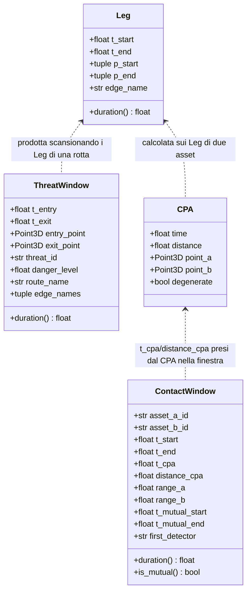

# Capitolo 3 — Lo strato 1: lo scheduler dei contatti

Modulo: `Logic/Contact_Scheduler.py`.

## 3.1 Scopo e confine

Risponde a **quando** due forze si incontrano. Non risolve alcun ingaggio: non decide chi rileva
davvero (Pd), chi spara per primo (latenze di reazione), chi colpisce (Pk) — è il lavoro dello
strato 2 (`Logic/Engagement_Resolver.py`), che consuma ciò che qui viene prodotto. Il confine è
netto di proposito: questo strato è **deterministico e verificabile con la sola
trigonometria**, quello stocastico e ha bisogno dell'RNG di sessione
(`Logic/Contact_Scheduler.py:12-19`).

## 3.2 I tre meccanismi

### A — Rotta contro volume di minaccia

`threat_windows`/`route_threat_windows` (`Logic/Contact_Scheduler.py:433-517`, `:584-612`). Una
rotta attraversa il cilindro di un `ThreatAA`: si compone `Cylinder.getIntersection` (geometria
già esistente e testata) con la scansione temporale della rotta (`route_legs`, equivalente a
`Route.travelTimeToEdge` + `Route.positionAtTime`). Si lavora **solo** su `DataType.Route/Edge/
Waypoint`, il modello canonico di dominio confermato dalla decisione Q1 (v. wiki
`decisions/route-model-unification`), mai sul modello interno di `Air_Route_Manager`
(`:22-29`).

Tre casi degeneri disambiguati (`:439-455`): arco interamente dentro il cilindro (nessun
attraversamento di superficie: `getIntersection` restituirebbe `(False, None)`, indistinguibile
da "nessuna intersezione" — disambiguato con `Cylinder.innerPoint` sugli estremi); arco con un
solo estremo dentro; tangenza (un solo punto, nessun estremo interno: `getIntersection` solleva
`ValueError` "Intersezione anomala", trattato come contatto di misura nulla, non un errore di
programmazione, `:449-451`, `:532-538`). Le finestre di archi consecutivi sono **fuse**: una
rotta che entra sull'arco *i* ed esce sull'arco *i+2* produce una sola `ThreatWindow`
(`:453-455`, `_merge_threat_intervals` a `:563-581`).

### B — CPA/TCPA fra mobili

`closest_point_of_approach` (`:683-750`) e `range_intervals` (`:753-814`). Due asset su rotte
proprie: `t* = -(Δr·Δv)/|Δv|²` dà l'istante di massimo avvicinamento, valido per moto relativo
rettilineo uniforme. Poiché una rotta è una **spezzata**, il calcolo non si fa una volta sulla
rotta intera ma su ogni sottointervallo delimitato dai waypoint **di entrambe** le rotte
(`_breakpoints`, `:634-658`), dove le due velocità sono costanti per costruzione; il risultato
globale è il minimo dei minimi locali. Il caso degenere `|Δv|² ~ 0` (fermi, o paralleli alla
stessa velocità) non divide per zero: la distanza è costante e si prende l'estremo iniziale
(`:727-729`, costante `VELOCITY_EPS` a `:94-98`).

Per il rilevamento non basta il solo CPA (dice *quanto* ci si è avvicinati, non *da quando a
quando* si è stati a tiro): `range_intervals` risolve l'equazione completa
`|Δr + Δv s|² = R²` su ogni sottointervallo, e fonde gli intervalli disgiunti risultanti
(due rotte che si incrociano più volte entrano e escono dal raggio più volte, `:753-814`).

### C — Potatura gerarchica a livello `Block`

`block_pair_candidates`/`region_block_pairs` (`:1096-1193`). Valutare il CPA di tutte le coppie
di asset è O(N²), impraticabile fino al limite dichiarato di 10.000 asset
(`Logic/Contact_Scheduler.py:41-48`). Si scartano prima le coppie di `Block`/`Military` il cui
**inviluppo di movimento** nella finestra considerata non può in nessun caso produrre un
contatto: due blocchi più distanti di

```
(v_max_A + v_max_B) * orizzonte + portata_A + portata_B [+ margin]
```

non si incontrano, punto (`:1099-1113`). Il test è un confronto fra due numeri per coppia di
**blocchi**, ordini di grandezza meno numerosi degli asset. Il criterio è **conservativo**: un
blocco senza posizione nota non viene mai scartato (`:1111-1113`, l'assenza di dato non è una
prova di lontananza — la stessa logica, applicata al contrario, della memoria
`feedback_no_visibility_low_priority`). `block_max_speed` (`:1006-1041`) considera anche il ramo
`off_road` dei veicoli, perché il movimento tattico non avviene su strada e usare solo il regime
stradale sottostimerebbe l'inviluppo — sottostimare l'inviluppo scarterebbe coppie che si
sarebbero incontrate, l'unico errore inaccettabile per un filtro conservativo.

## 3.3 Convenzioni rispettate da tutto il modulo

(`Logic/Contact_Scheduler.py:50-65`)

- **Tempo in secondi assoluti**: ogni rotta ha il proprio `t0`, due asset che partono in momenti
  diversi sono la norma.
- **Nessuna sorgente di casualità**: lo strato è puramente geometrico.
- **Ordinamento deterministico dei risultati**: fa parte del contratto di riproducibilità
  (v. capitolo 1, §1.3, vincolo 2).
- **Mai eccezioni per dati mancanti** (asset senza rotta, senza `detection_range`, rotta con
  velocità indefinita): `None` o lista vuota, più un log. Le eccezioni restano per gli argomenti
  fuori dominio.

## 3.4 Da rotta a `Leg`: `route_legs`/`static_legs`

`route_legs(route, t0=0.0, speed=None, horizon=None)` (`:262-321`) è la porta d'ingresso di
tutto il modulo: da qui in poi non si parla più di rotte ma di `Leg` (tratto a velocità costante,
in tempo assoluto). Lista vuota se la rotta è vuota o ha un arco a velocità indefinita — mai
un'eccezione (`:283-286`).

`static_legs(position, t_start, t_end)` (`:324-345`) produce il `Leg` unico di un asset **fermo**
(sito SAM, deposito, blocco in posizione): il caso più frequente di contatto in campagna non è
rotta contro rotta ma rotta contro bersaglio fermo, e senza questa funzione il chiamante dovrebbe
fabbricare una rotta fittizia solo per interrogare lo scheduler (`:324-330`).

## 3.5 Da rilevamento geometrico a `ContactWindow`

`contact_windows(asset_a, legs_a, asset_b, legs_b, range_a=None, range_b=None, range_type=...)`
(`:891-964`) è l'uscita principale del modulo verso lo strato 2. Le portate, se non fornite dal
chiamante, sono ricavate da `mutual_detection_ranges` (`:851-888`), che interroga ciascun asset
**sul dominio dell'altro** — `Mobile.detection_range(mode, range_type=...)`, dove `mode` è
'ground'/'air'/'sea' a seconda della classe del bersaglio (`DETECTION_MODE_BY_CLASS`,
`:104-109`) — perché lo stesso radar ha portate diverse contro un carro e contro un aereo.
`range_type` di default `DEFAULT_DETECTION_RANGE_TYPE = 'acquisition_range'`
(`Asset/Mobile.py:85`); con `'engagement_range'` la stessa funzione risponde a "quando sono a
tiro" invece che "quando si vedono" (`:907-909`).

La distinzione fra rilevamento **unidirezionale** e **bidirezionale** è esplicita perché decide
chi spara per primo (`:196-204`):

- `[t_start, t_end]` usa la portata **maggiore** delle due: il primo contatto in assoluto, e chi
  lo ottiene è `first_detector`;
- `[t_mutual_start, t_mutual_end]` usa la portata **minore**: da quel momento entrambi si vedono;
  `None` se uno dei due non vede mai l'altro.

## 3.6 Orchestrazione: `schedule_contacts`

`schedule_contacts(blocks_a, blocks_b, horizon, routes=None, starts=None, speeds=None, t0=0.0,
margin=0.0, range_type=..., skip_same_side=True)` (`:1197-1274`) mette insieme i tre meccanismi
nell'ordine che li rende trattabili: prima la potatura a livello blocco (C), poi il CPA solo
sulle coppie di asset superstiti (B). Un asset senza rotta in `routes` non è ignorato: se ha una
posizione, è trattato come **fermo** per tutta la finestra (`static_legs`, `:1211-1213`) — il
caso più comune in campagna (un sito SAM, un deposito, una base).

Restituisce una lista di `ContactWindow` ordinata per `(t_start, asset_a_id, asset_b_id)`:
**l'ordine è parte del contratto**, è ciò che rende la sessione riproducibile a parità di seed,
non il seed da solo (`:1224-1227`).

## 3.7 Diagramma D3 — tipi di dominio dello scheduler



Le frecce tratteggiate (`<..`) indicano una dipendenza funzionale (una funzione che consuma un
tipo per produrne un altro), non un'associazione strutturale permanente: nessuno di questi
oggetti mantiene un riferimento agli altri dopo la costruzione.
