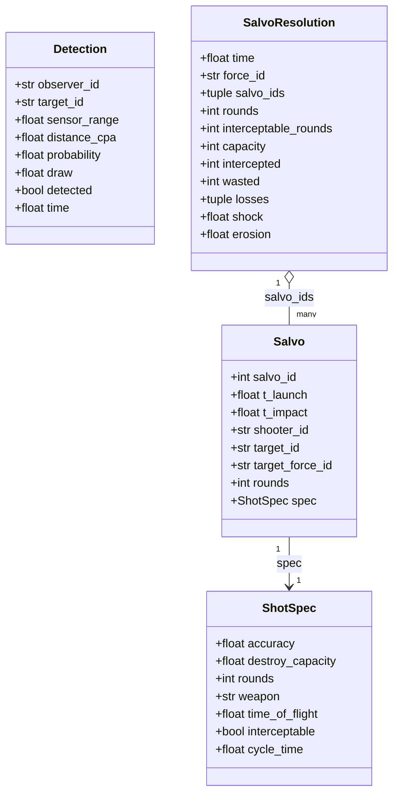
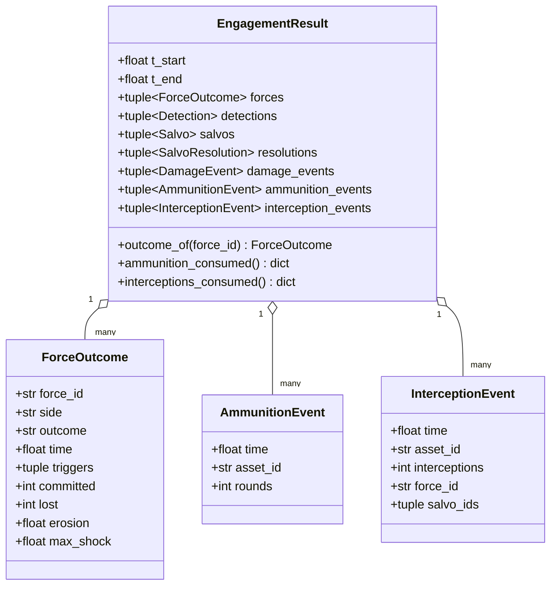
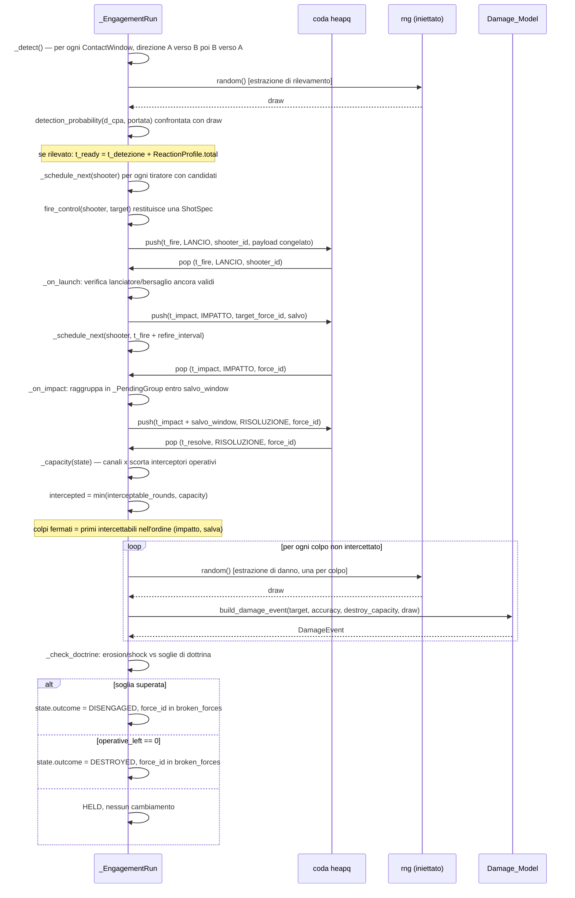
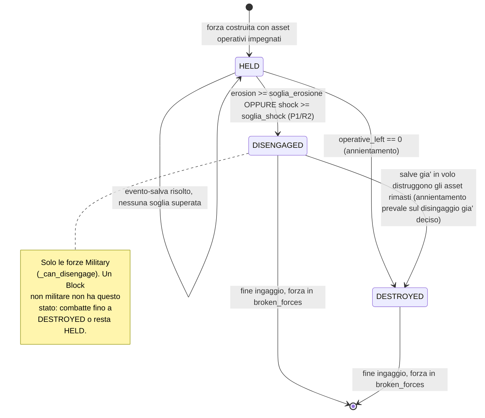

# Capitolo 4 — Lo strato 2: il risolutore d'ingaggio

Modulo: `Logic/Engagement_Resolver.py`. È il modulo più esteso del motore (1510 righe) e il primo
punto in cui entra la casualità, sempre e solo attraverso l'RNG di sessione passato dal
chiamante (`Logic/Engagement_Resolver.py:8-10`).

## 4.1 La catena, per ogni ingaggio

Per due o più forze in contatto, la catena è (`:12-58`):

1. **Pd — chi rileva davvero** (§4.2). Un'estrazione contro `detection_probability(d_cpa,
   portata)` decide sia *se* sia *a che distanza* avviene il rilevamento, e quindi *quando*.
2. **Latenza di reazione — chi spara per primo** (§4.3). Dal rilevamento al primo lancio passa
   `ReactionProfile.total`; le salve successive sono separate da `refire_interval`.
3. **Dottrina di fuoco / ROE — se e con cosa si spara** (§4.4). `fire_control(shooter, target)`,
   iniettata, restituisce una `ShotSpec` o `None` (non ingaggia).
4. **Salva e saturazione — modello di Hughes** (§4.5). I colpi che arrivano su una forza nello
   stesso evento-salva sono prima confrontati con `Military.salvo_interceptors`: i primi N
   intercettabili sono fermati, il surplus raggiunge integralmente il modello di danno.
5. **Danno per singolo colpo** (§4.6). Ogni colpo superstite passa da
   `Damage_Model.build_damage_event`, con un `draw` estratto qui dall'RNG iniettato.
6. **Disingaggio — P1 + R2** (§4.7). Dopo ogni evento-salva la forza colpita confronta le proprie
   perdite con la dottrina di lato: erosione cumulata *oppure* shock della singola salva.

## 4.2 Percezione: la legge di Pd

`detection_probability(distance, sensor_range, factor=1.0)` (`:460-487`):

```
Pd(d) = factor * (1 - (1 - PD_AT_ACQUISITION_RANGE) * (d / R)^4)    per d <= R
Pd(d) = 0                                                            per d > R
```

**STIMA DICHIARATA di forma** (`:466-469`): 1 a distanza nulla, `PD_AT_ACQUISITION_RANGE = 0.5`
sul bordo della portata dichiarata dal registro (la più prudente delle due convenzioni con cui si
dichiara la portata di un radar — Pd 0.5 o 0.9 a quella distanza —, da ricalibrare,
`:162-165`), decrescente con la quarta potenza della distanza (`PD_RANGE_EXPONENT = 4`, la
dipendenza R⁴ dell'equazione radar, SNR ∝ 1/R⁴; la curva Pd(SNR) reale di Swerling è sigmoide,
questa legge ne è una semplificazione monotona, `:167-170`). `factor` in [0, 1] è la degradazione
(meteo, notte, disturbo) applicata dal chiamante, v. capitolo 7, §7.4.

`detection_radius(draw, sensor_range, factor=1.0)` (`:490-519`) è l'**inversa**: il rilevamento
avviene quando `draw < Pd(d)`, cioè quando il bersaglio entra nel raggio restituito. Così **una
sola** estrazione decide sia se il sensore rileva sia quando, senza campionare la finestra nel
tempo (`:490-497`).

L'istante esatto del rilevamento (`_detection_time`, `:925-951`) usa i `Leg` di entrambe le
rotte se disponibili (primo istante in cui la distanza scende sotto il raggio estratto, via
`Contact_Scheduler.range_intervals`, esatto); senza, ricade sull'istante geometrico della
finestra (`t_start` se la propria portata è la maggiore, `t_mutual_start` altrimenti, ultimo
ripiego `t_cpa`).

## 4.3 Latenze di reazione

Il risolutore consuma `ReactionProfile.total` (rilevamento → primo lancio) e
`ReactionProfile.refire_interval` (fra una salva e la successiva contro un bersaglio già in
traccia) da `Context/Reaction_Profile.py`, v. capitolo 7, §7.3, per il dettaglio dei valori e
della loro provenienza.

## 4.4 Dottrina di fuoco: `fire_control` e `ShotSpec`

`fire_control(shooter, target) -> ShotSpec | None` è **iniettata dal chiamante**, non
implementata dal risolutore (`:24-26`). `ShotSpec` (`:213-258`) trasporta:

| Campo | Significato |
|---|---|
| `accuracy` | Ph — probabilità di colpo a segno, [0,1], dal registro d'arma. |
| `destroy_capacity` | Pk\|h — probabilità di distruzione dato il colpo, [0,1]. |
| `rounds` | Colpi lanciati per salva (≥1). |
| `weapon` | Modello d'arma di dominio, per tracciabilità. |
| `time_of_flight` | Secondi fra lancio e impatto (≥0). |
| `interceptable` | `True` se i colpi possono essere intercettati (missili, bombe guidate); `False` per proiettili d'artiglieria/carro. |
| `cycle_time` | Intervallo fra due salve del tiratore; `None` = `refire_interval` del profilo di reazione. |

**Cosa il risolutore non fa (ancora)** (`:129-140`): non seleziona l'arma dai registri
(`fire_control` è iniettata — è il pezzo su cui lavora, in parallelo a questo manuale, un altro
filone di sviluppo, v. capitolo 10); non applica il meteo da sé (`detection_factor` è iniettato);
ripartisce il fuoco fra i tiratori di una forza solo con una regola greedy locale
(round-robin, `_schedule_next`, `:992-1030`), non con un'assegnazione ottima.

## 4.5 Salva e saturazione — modello di Hughes

Ogni evento-salva (`SalvoResolution`, prodotto da `_on_resolve`, `:1180-1269`) confronta i colpi
**intercettabili** in arrivo con la capacità di intercettazione disponibile in quell'istante
(`_capacity`, `:1167-1178`, stessa formula di `Military.salvo_interception_capacity`, v. capitolo
7, §7.5):

```
capacity = Σ_i min(canali_i, scorta_i)     sugli interceptori operativi della forza
intercepted = min(interceptable_rounds, capacity)
```

Ogni intercettazione consuma la scorta di **intercettori** dell'asset che intercetta
(`Mobile.interceptor_stock`), un contatore **distinto** dalle munizioni offensive
(`Mobile.ammunition`), tranne per un SAM puro (`Mobile.interceptor_shares_ammunition`), dove i
due contatori condividono lo stesso pool fisico di missili (v. capitolo 7, §7.6 per il dettaglio
e la ricalibrazione 2026-09-23 che ha separato i due contatori). Ogni intercettazione produce un
`InterceptionEvent`, mai un `AmmunitionEvent` (`:344-372`).

I colpi fermati sono i **primi intercettabili nell'ordine (impatto, salva)**, indipendentemente
da chi li ferma (`:1228-1238`): il modello non assegna intercettori a salve specifiche, confronta
la capacità totale con i colpi intercettabili dell'intero evento.

Il **raggruppamento in evento-salva** avviene in `_on_impact` (`:1157-1165`): impatti entro
`salvo_window` secondi da un impatto già in coda per la stessa forza finiscono nello stesso
`_PendingGroup`; default `salvo_window=0.0` (solo impatti simultanei — la scelta più
conservativa, un punto aperto di modello da decidere con la taratura, `:1397-1400`).

## 4.6 Danno per singolo colpo

Ogni colpo non intercettato passa da `Damage_Model.build_damage_event` con un `draw` estratto qui
(`:1251-1255`). Nessuna reimplementazione del contratto del danno — dettaglio in capitolo 5, §5.1.
Un colpo che arriva su un bersaglio già distrutto (payload congelato, salva già partita) non
genera un'estrazione: viene contato come `wasted` (`:1245-1249`).

## 4.7 Disingaggio: soglie P1 + R2

`_check_doctrine(time, state, shock, erosion, operative_left)` (`:1273-1310`) confronta le
perdite della forza intera con `Context/Doctrine.get_disengagement_thresholds(side, thresholds)`
(dettaglio dei valori in capitolo 7, §7.2), dopo **ogni** evento-salva:

- `erosion` = frazione **cumulata** dell'organico impegnato non più operativo;
- `shock` = frazione persa nella **singola salva** appena risolta;
- qualunque delle due superi la propria soglia, l'esito è `DISENGAGED`; se invece
  `operative_left == 0` l'esito è `DESTROYED` (annientamento, che prevale su un disingaggio già
  deciso nello stesso istante — la forza è stata distrutta mentre rompeva il contatto, da salve
  già in volo, `:1283-1291`).

**Solo le forze militari possono disingaggiarsi** (`_can_disengage`, `:688-699`, decisione di
progetto 2026-09-23): un `Block` non-`Military` (Transport, Storage, Urban, Production, o un
`Block` generico con `category` 'Logistic'/'Civilian') non può fisicamente rompere il contatto e
ripiegare — riceve `thresholds=None` incondizionatamente, senza il warning di dottrina mancante
(non manca nulla: è una scelta di modello, non un dato assente). Un oggetto che non è affatto un
`Block` (stub duck-typed nei test, adapter futuri) resta trattato come forza combattente. Il
controllo è sulla gerarchia di classe (`validate_class`), non su un campo testuale come
`category` (`:56-58`).

## 4.8 Ingaggi a N forze (2+) e forze rotte

`resolve_engagement(force_a, force_b, ..., extra_forces=(...))` risolve, in **una** run con
**una** coda eventi condivisa, tutte le forze `(force_a, force_b, *extra_forces)`, trattate in
modo uniforme (`:60-66`). Chi combatte contro chi lo dicono solo le finestre di contatto passate;
il lato serve solo a leggere la dottrina, e più forze possono condividerlo.

Perché serve (`:68-75`): se la forza X è in contatto con A e con B in finestre sovrapposte,
risolvendo (X,A) e (X,B) con due chiamate separate l'ordine delle chiamate deciderebbe chi
"arriva prima" a salute e scorte di X. In una sola run la salute e le scorte ombra di X evolvono
in un'unica timeline, consumata da entrambi i fronti nell'ordine esatto degli eventi. Con
`extra_forces=()` il comportamento è identico all'ingaggio a due.

Una forza che raggiunge `DESTROYED` o `DISENGAGED` entra in `broken_forces: set`
(**per-forza, non un flag globale** della run, `:82-97`, `:731-733`): da quel momento nessun suo
tiratore riceve un nuovo lancio (i lanci schedulati e non ancora eseguiti sono annullati); nessun
tiratore di altre forze può più sceglierla come bersaglio (un bersaglio disingaggiato è vivo ma
"andato via" — un lancio già schedulato contro di essa è annullato e il tiratore decide di nuovo);
le salve **già partite**, da o verso di essa, arrivano comunque (payload congelato, R4).

## 4.9 Congelamento del payload (R4, prima parte)

Il bersaglio, la `ShotSpec` e il numero di colpi sono fissati quando il lancio viene schedulato
e, una volta che la salva è partita, nessun evento successivo li modifica — nemmeno la
distruzione del lanciatore dopo il lancio: una salva in volo arriva comunque
(`:99-107`). Prima del lancio un evento programmato può solo essere **annullato** (lanciatore
fuori combattimento, bersaglio già fuori combattimento o uscito dalla finestra, scorte
insufficienti, contatto rotto), mai *riscritto*: la decisione successiva è un nuovo evento con un
nuovo payload.

**Re-scheduling delle finestre NON implementato (R4, seconda parte, rimandato)**: una forza che
si disingaggia è solo *segnalata* nell'esito; il nuovo instradamento e il ricalcolo delle
finestre di contatto spettano a un livello superiore (C2/campagna), non ancora costruito
(`:108-110`). V. la nota di divergenza col testo originale della decisione wiki nel capitolo 10.

## 4.10 Stato ombra: `_Shadow`

Il risolutore **non muta gli asset**: lavora su una copia di lavoro (`_Shadow`, `:605-646`) —
salute e scorte evolvono lì, non sull'asset — e restituisce gli eventi in un `EngagementResult`
immutabile. Applicarli è un passo separato ed esplicito, `apply_engagement_result`
(capitolo 5, §5.3): è la stessa separazione calcolo/applicazione già scelta da `Damage_Model`
(`:111-115`). `_Shadow` espone `id` e `health` perché `Damage_Model.build_damage_event` la tratti
come un asset per duck typing (`:608-609`). Per un SAM puro, `interceptor_stock` è una *vista* di
`ammunition` (proprietà con getter/setter che ridirige sullo stesso campo, `:629-638`): senza
questa vista lo stato ombra concederebbe a un Buk sia 4 salve sia 4 intercettazioni da un pool
fisico di soli 4 missili.

## 4.11 Ordine delle estrazioni RNG (parte del contratto)

(`:118-123`) Prima **tutte** le estrazioni di rilevamento, nell'ordine canonico delle finestre
`(t_start, id_a, id_b, t_end)` e per ognuna la direzione a→b poi b→a; poi un'estrazione per colpo
non intercettato, nell'ordine degli eventi. La coda eventi ha tie-break deterministico
`(t, tipo, id, sequenza)`, con i tipi nell'ordine `LANCIO(0) < IMPATTO(1) < RISOLUZIONE(2)`: a
parità di istante tutti i lanci leggono lo stato *prima* dei danni (risoluzione simultanea,
`_LAUNCH`/`_IMPACT`/`_RESOLVE` a `:205-208`).

## 4.12 `apply_engagement_result` e `resolve_engagement`: le due funzioni pubbliche

`resolve_engagement(force_a, force_b, contacts, fire_control, rng, *, extra_forces=(), legs=None,
committed=None, thresholds=None, reaction_profile_for=None, detection_factor=None,
salvo_window=0.0, provenance=DM.DERIVED)` (`:1358-1435`) costruisce una `_EngagementRun` e ne
esegue `run()`. Restituisce `None` (con un log) se meno di due forze hanno asset impegnabili
(`:1403-1406`).

`apply_engagement_result(result, *forces)` (`:1438-1509`) applica un `EngagementResult` agli
asset reali: `DamageEvent` con `Damage_Model.apply_damage_event` (nell'ordine di produzione, i
cui delta sono coerenti con quell'ordine), `AmmunitionEvent` con `Mobile.consume_ammunition`,
`InterceptionEvent` con `Mobile.consume_interceptor_stock`. Un asset non trovato è registrato e
saltato, non un errore.

## 4.13 Diagramma D4 — tipi di dominio dell'ingaggio

Per leggibilità, il diagramma è diviso in due parti: i tipi "di lavoro" (ciò che accade durante
la risoluzione) e i tipi "di esito" (ciò che esce da `resolve_engagement`).





## 4.14 Diagramma D5 — sequenza della coda eventi dentro un ingaggio

Esempio minimo: un tiratore, un bersaglio, una salva intercettabile, saturazione parziale.
`heapq` con chiave `(t, tipo, id, sequenza)`; tipi nell'ordine `LANCIO(0) < IMPATTO(1) <
RISOLUZIONE(2)` (§4.11). Le estrazioni RNG sono annotate dove avvengono.



## 4.15 Diagramma D6 — stati di una forza durante un ingaggio


