# Capitolo 4 — Lo strato 2: il risolutore d'ingaggio

Modulo: `Logic/Engagement_Resolver.py`. È il modulo più esteso del motore (2858 righe a `533cd1f5`,
2063 a `6754bf1c`) e il primo punto in cui entra la casualità, sempre e solo attraverso l'RNG di
sessione passato dal chiamante (`Logic/Engagement_Resolver.py:9-10`).
Tutti i riferimenti `:riga` di questo capitolo, se non diversamente indicato, valgono per questo
file a `533cd1f5`.

Il capitolo copre anche `Logic/Fire_Control.py` (§4.16-4.17, §4.16bis, §4.20), un modulo satellite
che **non modifica** il contratto del risolutore: fornisce una `fire_control` reale, dai registri
d'arma, da iniettare al posto di una tabella di test, con il cannone di bordo come arma candidata
(§4.16bis, decisione A2, commit `8bd69727`) e, per le bombe, gittata e tempo di caduta da una
balistica reale (§4.20, decisione B6, commit `6754bf1c`); la nebbia di guerra (§4.18), due
costruttori del fattore `detection_factor` già previsto dal contratto del §4.2; la **scorta per
modello d'arma** (§4.19, `Asset/Weapon_Stores.py`, commit `1d0c1127`).

**Aggiornamento a `533cd1f5`.** Dal 2026-09-28 al 2026-09-30 il risolutore ha acquisito sei
meccanismi, descritti nelle sezioni nuove §4.21-4.26 e integrati nelle sezioni preesistenti:

| Meccanismo | Commit | Sezione |
|---|---|---|
| Soglia di rottura stocastica (tempra per forza, morale, rapporto di forze percepito, fuoco senza risposta, postura) | `72c7f7c8` | §4.7, §4.21 |
| Efficacia antiaerea E(N), sistema di puntamento condiviso, minaccia su dotazione stimata | `72c7f7c8`, `4d225ffb` | §4.22 |
| RWR per classi e modalità, classificazione SAM per sistema | `4d225ffb`, `d261062c` | §4.23 |
| Minaccia percepita dalla sola RWR pesata sulla classe (regola R-CLS) | `440a8823` | §4.23 |
| Difesa dai missili (A6): capacità `Anti_Missile` (regola D), ordine F, regole L1/L2/L3 | `37ca477e`, `24a43d10`, `6f31333e`, `aedd7fa5` | §4.5, §4.24 |
| Dottrina di tiro contro l'overkill (saturazione, "due missili, poi guarda") | `22cbe91e` | §4.25 |
| Intercettazione con traccia del colpo e tempo di reazione (regola R-INT) | `a500fdf3` | §4.26 |

I riferimenti di quelle sezioni sono stati verificati sul codice a `533cd1f5`. Quelli delle sezioni
preesistenti (§4.1-§4.20) sono stati **ricontrollati simbolo per simbolo** durante questo
aggiornamento: alcuni, già sfasati rispetto a `6754bf1c`, sono stati corretti.

## 4.1 La catena, per ogni ingaggio

Per due o più forze in contatto, la catena è (`:12-73`, docstring del modulo):

1. **Pd — chi rileva davvero** (§4.2). Un'estrazione contro `detection_probability(d_cpa,
   portata)` decide sia *se* sia *a che distanza* avviene il rilevamento, e quindi *quando*.
2. **Latenza di reazione — chi spara per primo** (§4.3). Dal rilevamento al primo lancio passa
   `ReactionProfile.total`; le salve successive sono separate da `refire_interval`.
3. **Dottrina di fuoco / ROE — se e con cosa si spara** (§4.4). `fire_control(shooter, target)`,
   iniettata, restituisce una `ShotSpec` o `None` (non ingaggia).
4. **Salva e saturazione — modello di Hughes** (§4.5). I colpi che arrivano su una forza nello
   stesso evento-salva sono prima confrontati con `Military.salvo_interceptors`: i colpi
   intercettabili sono fermati **salva per salva** dagli intercettori che ne hanno titolo
   (arma `Anti_Missile`, regola D; lancio da fuori dal proprio volume, regola L1; traccia del
   colpo e tempo di reagire, regola R-INT; §4.24, §4.26), il surplus raggiunge integralmente il
   modello di danno.
5. **Danno per singolo colpo** (§4.6). Ogni colpo superstite passa da
   `Damage_Model.build_damage_event`, con un `draw` estratto qui dall'RNG iniettato.
6. **Disingaggio — P1 + R2 con soglia di rottura stocastica** (§4.7, §4.21). Dopo ogni
   evento-salva la forza colpita confronta le proprie perdite con la **soglia di rottura B(t)**
   propria della forza (mediana di dottrina, modulata da morale, rapporto di forze percepito,
   fuoco senza risposta, postura, e da una "tempra" estratta una volta): erosione cumulata
   *oppure* shock della singola salva.

Prima della scelta del bersaglio (punto 3) agisce inoltre la **dottrina di tiro** (§4.25): un
bersaglio già condannato dalle salve in volo, o su cui il tiratore ha già "due missili" in volo,
non riceve altre salve; e la scelta del bersaglio dà la precedenza ai lanciatori di armi
aria-superficie contro la forza del tiratore (regole L2/L3, §4.24).

## 4.2 Percezione: la legge di Pd

`detection_probability(distance, sensor_range, factor=1.0)` (`:652-679`):

```
Pd(d) = factor * (1 - (1 - PD_AT_ACQUISITION_RANGE) * (d / R)^4)    per d <= R
Pd(d) = 0                                                            per d > R
```

**STIMA DICHIARATA di forma** (`:658-661`): 1 a distanza nulla, `PD_AT_ACQUISITION_RANGE = 0.5`
sul bordo della portata dichiarata dal registro (la più prudente delle due convenzioni con cui si
dichiara la portata di un radar — Pd 0.5 o 0.9 a quella distanza —, da ricalibrare,
`:279-282`), decrescente con la quarta potenza della distanza (`PD_RANGE_EXPONENT = 4`, la
dipendenza R⁴ dell'equazione radar, SNR ∝ 1/R⁴; la curva Pd(SNR) reale di Swerling è sigmoide,
questa legge ne è una semplificazione monotona, `:284-287`). `factor` in [0, 1] è la degradazione
(meteo, notte, disturbo) applicata dal chiamante, v. capitolo 7, §7.4.

`detection_radius(draw, sensor_range, factor=1.0)` (`:682-711`) è l'**inversa**: il rilevamento
avviene quando `draw < Pd(d)`, cioè quando il bersaglio entra nel raggio restituito. Così **una
sola** estrazione decide sia se il sensore rileva sia quando, senza campionare la finestra nel
tempo (`:685-689`).

L'istante esatto del rilevamento (`_detection_time`, `:1547-1573`) usa i `Leg` di entrambe le
rotte se disponibili (primo istante in cui la distanza scende sotto il raggio estratto, via
`Contact_Scheduler.range_intervals`, esatto); senza, ricade sull'istante geometrico della
finestra (`t_start` se la propria portata è la maggiore, `t_mutual_start` altrimenti, ultimo
ripiego `t_cpa`).

## 4.3 Latenze di reazione

Il risolutore consuma `ReactionProfile.total` (rilevamento → primo lancio) e
`ReactionProfile.refire_interval` (fra una salva e la successiva contro un bersaglio già in
traccia) da `Context/Reaction_Profile.py`, v. capitolo 7, §7.3, per il dettaglio dei valori e
della loro provenienza.

## 4.4 Dottrina di fuoco: `fire_control` e `ShotSpec`

`fire_control(shooter, target) -> ShotSpec | Sequence[ShotSpec] | None` è **iniettata dal
chiamante**, non implementata dal risolutore (`Logic/Engagement_Resolver.py:24-28`). Dal
2026-09-26 (decisione A1, v. §4.19) il contratto accetta anche una **sequenza** di `ShotSpec`, in
ordine di preferenza: il risolutore prova le opzioni nell'ordine dato e sceglie la prima la cui
arma ha ancora scorta (`_first_with_stock`, `:1952-1969`, v. §4.19); una `ShotSpec` singola resta
un valore valido (sequenza di un elemento), quindi una `fire_control` scritta prima di questa
data non cambia comportamento. `ShotSpec` (`:353-415`) trasporta:

| Campo | Significato |
|---|---|
| `accuracy` | Ph — probabilità di colpo a segno, [0,1], dal registro d'arma. |
| `destroy_capacity` | Pk\|h — probabilità di distruzione dato il colpo, [0,1]. |
| `rounds` | Colpi lanciati per salva (≥1). |
| `weapon` | Modello d'arma di dominio, per tracciabilità e per la scorta per arma (v. §4.19). |
| `time_of_flight` | Secondi fra lancio e impatto (≥0). |
| `interceptable` | `True` se i colpi possono essere intercettati (missili, bombe guidate); `False` per proiettili d'artiglieria/carro. |
| `cycle_time` | Intervallo fra due salve del tiratore; `None` = `refire_interval` del profilo di reazione. |
| `max_range` | Portata massima dell'arma [m] (distanza 3D tiratore-bersaglio); `None` = nessun vincolo di portata (comportamento precedente al 2026-09-24, v. §4.17). |
| `stock_per_round` | Unità di scorta consumate da UN colpo della salva (decisione A3, 2026-09-26, v. §4.19): 1 per missili/bombe/proietti singoli, i colpi di una raffica per le armi a tiro rapido (il cui "colpo" è una raffica, v. §4.16). |

**Cosa il risolutore non fa da sé (ancora)** (`:230-253`): non seleziona l'arma dai registri —
`fire_control` resta sempre **iniettata**, il contratto non è cambiato; una fire control che la
seleziona dai registri esiste come modulo satellite (`Logic/Fire_Control.py`, §4.16) e la
modulazione della Pk con la posizione nell'inviluppo resta da fare; non conta le munizioni da sé —
la scorta per arma la legge dallo stato ombra (`_Shadow`, §4.10/§4.19), non dalla `fire_control`,
il cui ordine di preferenza non dipende dalla scorta residua né dal tipo di missione (il filtro
delle armi per tipo di missione e bersaglio è la fase F7 del piano della Missione, non ancora
fatta: a `533cd1f5` l'entità `Mission` esiste e attraversa la porta di sessione, capitolo 2 §2.6 e
capitolo 6, ma il risolutore non la consulta, v. capitolo 9); non applica il meteo né la nebbia di
guerra da sé (`detection_factor` è iniettato, entrambi disponibili come fabbriche di quello stesso
fattore, §4.18); ripartisce il fuoco fra i tiratori di una forza con una regola greedy locale
(round-robin, `_schedule_next`, `:1614-1779`) a cui si aggiungono, dal 2026-09-28/29, la priorità
ai lanciatori (§4.24) e la dottrina di tiro (§4.25), non con un'assegnazione ottima. Dal
2026-09-29 non spreca più salve su bersagli già condannati: prima un tiratore poteva spendere
tutta la scorta di un'arma prima del primo impatto (§4.25).

## 4.5 Salva e saturazione — modello di Hughes

Ogni evento-salva (`SalvoResolution`, prodotto da `_on_resolve`, `:2251-2362`) confronta i colpi
**intercettabili** in arrivo con la capacità di intercettazione disponibile in quell'istante
(`_capacity`, `:2089-2100`, stessa formula di `Military.salvo_interception_capacity`, v. capitolo
7, §7.5):

```
capacity = Σ_i min(canali_i, scorta_i)     sugli intercettori operativi della forza
```

**Dal 2026-09-28 `capacity` è un tetto, non più il numero di colpi fermabili.** Fino a quella data
`intercepted = min(interceptable_rounds, capacity)`: tutti gli intercettori della forza potevano
fermare ogni colpo. Oggi l'allocazione è **per salva** (`:2269-2309`, regola L1 della proposta SAM,
`Analysis/Document/Proposta_Regole_Allocazione_SAM.md` §7.9): le salve dell'evento, nell'ordine
`(impatto, salva)`, scorrono gli intercettori della forza nell'ordine della regola F (soli cannoni
prima, poi per id, v. §4.24); ogni intercettore può fermare i colpi di una salva solo se

1. la salva è intercettabile (`ShotSpec.interceptable`), e
2. ha ancora canali e scorta liberi nell'evento (`min(canali, scorta)` totale per evento, non per
   salva), e
3. il punto di lancio della salva è **fuori** dal suo volume d'intercettazione (`_may_intercept`,
   `:2137-2160`, regola L1), e
4. ha una traccia del colpo e il tempo di reagire prima dell'impatto (`_in_time`, `:2225-2249`,
   regola R-INT, §4.26).

I colpi fermati sono quindi `Σ_salve (colpi − residuo)`, mai più di `min(interceptable_rounds,
capacity)`; coincide con quel minimo solo se nessun intercettore è escluso da (3) e (4) (v. il
commento a `:2274-2277`: senza vincoli geometrici il risultato coincide con l'allocazione sul totale
usata fino al 2026-09-28). Il *quale* intercettore ferma *quale* salva è ora tracciato internamente
(`used` per intercettore, `stopped` per salva), ma l'`InterceptionEvent` resta per intercettore e
arma, e la sua `salvo_ids` referenzia **tutte** le salve dell'evento (non quella specifica, v. §4.13).

Ogni intercettazione consuma la scorta di **intercettori** dell'asset che intercetta
(`Mobile.interceptor_stock`), un contatore **distinto per scopo** dalle munizioni offensive
(`Mobile.ammunition`) — due tipi di evento diversi, `InterceptionEvent` mai un `AmmunitionEvent`
(`:487-541`) — ma dal 2026-09-26 (decisione A1, v. §4.19) **la stessa voce di scorta per arma**
quando l'asset ha armi AD modellate per arma (`Mobile.stores`/`Asset/Weapon_Stores.py`): un
missile antiaereo che intercetta e uno sparato offensivamente sono lo stesso oggetto fisico, e
scalano la stessa voce del dizionario `{modello_arma: quantità}`. La vecchia regola del "SAM
puro" (`Mobile.interceptor_shares_ammunition`, che condivideva un intero pool solo per gli asset a
missile-solo) è stata **eliminata**: non serve più un caso speciale, la condivisione è per
costruzione su qualunque asset con scorta per arma (v. §4.19 per il dettaglio e per l'ordine di
consumo, regola F dentro l'asset: prima i cannoni, poi i missili).

Il consumo è applicato per intercettore, nell'ordine F, dopo l'allocazione (`:2311-2326`): un
`InterceptionEvent` per intercettore **e per arma** (un asset che ha esaurito i cannoni e prosegue
coi missili nello stesso evento ne produce due).

Il **raggruppamento in evento-salva** avviene in `_on_impact` (`:2079-2087`): impatti entro
`salvo_window` secondi da un impatto già in coda per la stessa forza finiscono nello stesso
`_PendingGroup`; default `salvo_window=0.0` (solo impatti simultanei — la scelta più
conservativa, un punto aperto di modello da decidere con la taratura, `:2665`, `:2703-2705`).

## 4.6 Danno per singolo colpo

Ogni colpo non intercettato passa da `Damage_Model.build_damage_event` con un `draw` estratto qui
(`:2339-2342`). Nessuna reimplementazione del contratto del danno — dettaglio in capitolo 5, §5.1.
Un colpo che arriva su un bersaglio già distrutto (payload congelato, salva già partita) non
genera un'estrazione: viene contato come `wasted` (`:2330-2337`). Dal 2026-09-29, quando un colpo
porta un bersaglio da operativo a non operativo, il risolutore registra **chi** l'ha messo fuori
combattimento (`state.loss_shooters[target_id] = (shooter_id, time)`, `:2346-2348`): serve al
"fuoco senza risposta" della soglia di rottura (§4.21).

## 4.7 Disingaggio: soglie P1 + R2, con soglia di rottura stocastica

`_check_doctrine(time, state, shock, erosion, operative_left, salvo_losses=0)` (`:2366-2410`)
confronta le perdite della forza intera con la dottrina di lato
(`Context/Doctrine.get_disengagement_thresholds(side, thresholds)`, dettaglio dei valori in
capitolo 7, §7.2), dopo **ogni** evento-salva:

- `erosion` = frazione **cumulata** dell'organico impegnato non più operativo;
- `shock` = frazione persa nella **singola salva** appena risolta;
- se `operative_left == 0` l'esito è `DESTROYED` (annientamento, che prevale su un disingaggio già
  deciso nello stesso istante — la forza è stata distrutta mentre rompeva il contatto, da salve
  già in volo, `:2379-2387`);
- altrimenti, per una forza con dottrina e senza esito già deciso, si calcola la **soglia di
  rottura** B(t) della forza (`_breakpoint`, `:2561-2604`, §4.21) e l'esito è `DISENGAGED` se
  - `erosion >= B(t)` (trigger `TRIGGER_EROSION`), **oppure**
  - la salva ha tolto almeno `shock_min_losses` asset **e** `shock >= (shock_mediana /
    erosion_mediana) × B(t)` (trigger `TRIGGER_SHOCK`) — `:2392-2402`. I due trigger possono
    scattare insieme.

**Cambiamento rispetto a `6754bf1c`** (2026-09-29, `72c7f7c8`): prima la soglia di erosione era un
numero fisso (0.30) e quella di shock un altro (0.20), uguali per tutti. Con *n* mezzi la perdita
minima è 1/*n*, quindi per le forze piccole le soglie erano un interruttore: in S1 cinque carri si
ritiravano per un carro perso in 7 repliche su 8 (`Analysis/Document/Proposta_Soglia_Rottura_Stocastica.md`
§1). Ora `erosion` è la **mediana** di una distribuzione, propria di ogni forza e di ogni ingaggio
(§4.21). Una dottrina che dichiara le sole chiavi `erosion`/`shock` riproduce esattamente le soglie
fisse precedenti (`Context/Doctrine.py:110-113`, modalità deterministica usata da test e scenari
"ad oltranza"); `erosion = 1.0` resta "combatte fino all'annientamento", senza modulazione
(`_breakpoint`, `:2566-2569`).

**Solo le forze militari possono disingaggiarsi** (`_can_disengage`, `:1157-1168`, decisione di
progetto 2026-09-23): un `Block` non-`Military` (Transport, Storage, Urban, Production, o un
`Block` generico con `category` 'Logistic'/'Civilian') non può fisicamente rompere il contatto e
ripiegare — riceve `thresholds=None` incondizionatamente, senza il warning di dottrina mancante
(non manca nulla: è una scelta di modello, non un dato assente). Un oggetto che non è affatto un
`Block` (stub duck-typed nei test, adapter futuri) resta trattato come forza combattente. Il
controllo è sulla gerarchia di classe (`validate_class`), non su un campo testuale come
`category` (docstring `:63-73`).

## 4.8 Ingaggi a N forze (2+) e forze rotte

`resolve_engagement(force_a, force_b, ..., extra_forces=(...))` risolve, in **una** run con
**una** coda eventi condivisa, tutte le forze `(force_a, force_b, *extra_forces)`, trattate in
modo uniforme (`:161-168`). Chi combatte contro chi lo dicono solo le finestre di contatto
passate; il lato serve solo a leggere la dottrina, e più forze possono condividerlo.

Perché serve (`:169-176`): se la forza X è in contatto con A e con B in finestre sovrapposte,
risolvendo (X,A) e (X,B) con due chiamate separate l'ordine delle chiamate deciderebbe chi
"arriva prima" a salute e scorte di X. In una sola run la salute e le scorte ombra di X evolvono
in un'unica timeline, consumata da entrambi i fronti nell'ordine esatto degli eventi. Con
`extra_forces=()` il comportamento è identico all'ingaggio a due.

Una forza che raggiunge `DESTROYED` o `DISENGAGED` entra in `broken_forces: set`
(**per-forza, non un flag globale** della run, `:183-198`, campo a `:1283`): da quel momento
nessun suo tiratore riceve un nuovo lancio (i lanci schedulati e non ancora eseguiti sono
annullati); nessun tiratore di altre forze può più sceglierla come bersaglio (un bersaglio
disingaggiato è vivo ma "andato via" — un lancio già schedulato contro di essa è annullato e il
tiratore decide di nuovo); le salve **già partite**, da o verso di essa, arrivano comunque
(payload congelato, R4).

## 4.9 Congelamento del payload (R4, prima parte)

Il bersaglio, la `ShotSpec` e il numero di colpi sono fissati quando il lancio viene schedulato
e, una volta che la salva è partita, nessun evento successivo li modifica — nemmeno la
distruzione del lanciatore dopo il lancio: una salva in volo arriva comunque
(`:202-208`). Prima del lancio un evento programmato può solo essere **annullato** (lanciatore
fuori combattimento, bersaglio già fuori combattimento o uscito dalla finestra, scorte
insufficienti, contatto rotto), mai *riscritto*: la decisione successiva è un nuovo evento con un
nuovo payload.

**Re-scheduling delle finestre NON implementato (R4, seconda parte, rimandato)**: una forza che
si disingaggia è solo *segnalata* nell'esito; il nuovo instradamento e il ricalcolo delle
finestre di contatto spettano a un livello superiore (C2/campagna), non ancora costruito
(`:209-211`). V. la nota di divergenza col testo originale della decisione wiki nel capitolo 10.

## 4.10 Stato ombra: `_Shadow`

Il risolutore **non muta gli asset**: lavora su una copia di lavoro (`_Shadow`, `:1020-1093`) —
salute e scorte evolvono lì, non sull'asset — e restituisce gli eventi in un `EngagementResult`
immutabile. Applicarli è un passo separato ed esplicito, `apply_engagement_result`
(capitolo 5, §5.3): è la stessa separazione calcolo/applicazione già scelta da `Damage_Model`.
`_Shadow` espone `id` e `health` perché `Damage_Model.build_damage_event` la tratti come un asset
per duck typing (`:1022-1024`).

Dal 2026-09-26 (decisione A1, v. §4.19) `_Shadow` porta anche una **copia** della scorta per
modello d'arma dell'asset reale (`stores: Optional[Dict[str, int]]`, `:1045-1050`), con lo stesso
schema di `Mobile`: il pool anonimo `anonymous` (usato solo quando `stores` è `None`, per gli
stub duck-typed senza scorta per arma), le armi non modellate `unmodelled` (mitragliatrici/CIWS
contate a unità nei registri, senza vincolo), le armi AD `interceptor_weapons` su cui
`interceptor_stock` è una **vista** (`:1069-1071`), e il pool anonimo di intercettori
`anonymous_interceptors`, usato solo quando la vista non è attiva. La contabilità è quella
**condivisa** con l'asset reale, `Asset/Weapon_Stores.py` (v. §4.19): così `apply_engagement_result`
ritrova sull'asset esattamente i consumi che l'ombra ha concesso, per costruzione, senza una
seconda implementazione che potrebbe divergere. Prima di questa data la condivisione fra scorta
offensiva e scorta di intercettori esisteva solo per il caso speciale del "SAM puro"
(`interceptor_stock` come *vista* diretta di `ammunition`, un solo pool per l'intero asset); ora è
per arma, per ogni asset che ha armi AD modellate.

### Le altre strutture interne, come cambiate dopo `6754bf1c`

- **`_Candidate`** (`:1096-1110`): un bersaglio rilevato da un tiratore, ingaggiabile in `[t_ready, t_end]`;
  porta `t_cpa`/`distance_cpa` (ripiego del controllo di portata senza tratti di rotta) e `not_before`
  (istante di ingresso in portata quando il tiro è rimandato, §4.17). Invariata nei campi.
- **`_ForceState`** (`:1113-1137`): oltre a `force_id`, `side`, `committed`, `thresholds`, `interceptors`,
  `outcome`, `time`, `triggers`, `max_shock`, porta dal 2026-09-29 lo stato della soglia di rottura
  (`force`, `air`, `temper`, `temper_z`, `morale`, `enemy_estimate`, `stationary`, `loss_shooters`,
  `breakpoint`, `force_ratio`, `unanswered_fraction`, §4.21) e la dottrina di tiro di lato (`fire`, §4.25).
- **`_EngagementRun`** (`:1216-2655`, costruttore `:1219-1297`): nuovi ingressi `breakpoint_rng`,
  `morale_for`, `enemy_estimate_for`, `fire_doctrine`, `rwr_catalogue`; nuovo stato di percezione
  (`seen_by`, `identified_by`, `rwr_class`, `class_weights`, `surface_weights`: §4.21, §4.23), della prelazione
  (`launchers_against`, `launch_generation`, `pending_decide`, `may_intercept_cache`: §4.24) e dell'R-INT
  (`detected_at`, `air_range_cache`, `in_time_cache`, `zone_cache`: §4.26); `_init_breakpoints()` è chiamato
  alla fine della costruzione se la run è utilizzabile (`:1296-1297`). Il ciclo `run()` (`:2608-2627`) esegue
  `_detect()`, poi `_schedule_next` per ogni tiratore con candidati, poi svuota la coda gestendo anche il
  quarto tipo `_DECIDE`.

## 4.11 Ordine delle estrazioni RNG (parte del contratto)

(`:219-224`) Prima **tutte** le estrazioni di rilevamento, nell'ordine canonico delle finestre
`(t_start, id_a, id_b, t_end)` e per ognuna la direzione a→b poi b→a; poi un'estrazione per colpo
non intercettato, nell'ordine degli eventi. La coda eventi ha tie-break deterministico
`(t, tipo, id, sequenza)`, con i tipi nell'ordine `LANCIO(0) < IMPATTO(1) < RISOLUZIONE(2) <
RIDECISIONE(3)`: a parità di istante tutti i lanci leggono lo stato *prima* dei danni (risoluzione
simultanea) e una ridecisione dopo una prelazione o un'attesa vede tutti i lanci avvenuti in quell'istante
(`_LAUNCH`/`_IMPACT`/`_RESOLVE`/`_DECIDE`, `:343-348`). `_DECIDE` è nato con la prelazione L3 e
con l'attesa della dottrina di tiro (§4.24, §4.25).

Due precisazioni dal 2026-09-29/30, che **non** spostano le estrazioni di `rng`:

- la **tempra** delle forze (§4.21) è estratta da un flusso **separato**, `breakpoint_rng`, una
  sola volta per forza, in `_init_breakpoints` (`:2414-2445`) nell'ordine di ingresso delle forze e
  prima di ogni rilevamento: non consuma estrazioni di `rng`;
- le regole R-INT (§4.26) e L1 (§4.24), la saturazione e il tetto di tiro (§4.25) e la percezione
  RWR (§4.23) sono **deterministiche**: nessuna estrazione, quindi l'ordine di quelle esistenti
  non cambia per averle introdotte (ogni differenza di esito si deve alla regola, non a un
  flusso spostato).

## 4.12 `apply_engagement_result` e `resolve_engagement`: le due funzioni pubbliche

`resolve_engagement(force_a, force_b, contacts, fire_control, rng, *, extra_forces=(), legs=None,
committed=None, thresholds=None, reaction_profile_for=None, detection_factor=None,
salvo_window=0.0, provenance=DM.DERIVED, breakpoint_rng=None, morale_for=None,
enemy_estimate_for=None, fire_doctrine=None, rwr_catalogue=None)` (`:2658-2765`) costruisce una
`_EngagementRun` e ne esegue `run()` (`:2608-2627`). Restituisce `None` (con un log) se meno di due
forze hanno asset impegnabili (`_build_forces`, `:1372-1375`; `resolve_engagement`, `:2762-2763`).
I cinque parametri dopo `provenance` sono dal 2026-09-29/30 e tutti facoltativi, con default che
riproducono il comportamento precedente: `breakpoint_rng` (flusso separato per la tempra, §4.21),
`morale_for` e `enemy_estimate_for` (ingressi della soglia di rottura, §4.21), `fire_doctrine`
(dottrina di tiro, tabella al posto di `Doctrine.DEFAULT_FIRE_DOCTRINE`, `{}` = nessuna regola,
§4.25), `rwr_catalogue` (emettitori per il peso di classe della RWR, §4.23). `run_session`
(capitolo 6 §6.1) passa `breakpoint_rng` (costruito da `order.rng(event_id=temper_event_id(...))`),
`morale_for`, `enemy_estimate_for` e `fire_doctrine`; **non** passa `rwr_catalogue`, disponibile solo
chiamando `resolve_engagement` direttamente.

`apply_engagement_result(result, *forces)` (`:2780-2858`) applica un `EngagementResult` agli
asset reali: `DamageEvent` con `Damage_Model.apply_damage_event` (nell'ordine di produzione, i
cui delta sono coerenti con quell'ordine), `AmmunitionEvent` con `Mobile.consume_ammunition(rounds,
weapon=...)`, `InterceptionEvent` con `Mobile.consume_interceptor_stock(interceptions,
weapon=...)`. Dal 2026-09-26 i due tipi di evento portano il campo `weapon` (v. §4.19): i consumi
si riapplicano nell'ordine temporale con cui lo stato ombra li ha prodotti — a parità di istante
prima i lanci poi le intercettazioni (`:2822-2831`) — perché con la scorta per arma un consumo
sull'aggregato e un'intercettazione sulla stessa voce non commutano quando la voce si esaurisce.
Un asset non trovato è registrato e saltato, non un errore.

## 4.13 Diagramma D4 — tipi di dominio dell'ingaggio

Per leggibilità, il diagramma è diviso in due parti: i tipi "di lavoro" (ciò che accade durante
la risoluzione) e i tipi "di esito" (ciò che esce da `resolve_engagement`). `ShotSpec.max_range`/
`stock_per_round` e il campo `weapon` di `AmmunitionEvent`/`InterceptionEvent` sono le aggiunte
del 2026-09-24/2026-09-26 (controllo di portata, §4.17; scorta per arma, §4.19). I cinque campi di
`ForceOutcome` dopo `max_shock` (`temper`, `breakpoint`, `morale`, `force_ratio`,
`unanswered_fraction`, `:572-576`) sono del 2026-09-29: spiegano l'esito di disingaggio (§4.21) e
valgono `None`/`0.0` per una forza senza dottrina o con la modalità deterministica. In
`SalvoResolution` il campo `capacity` è, dal 2026-09-28, un **tetto** (§4.5) e `intercepted` può
essere minore di `min(interceptable_rounds, capacity)`.

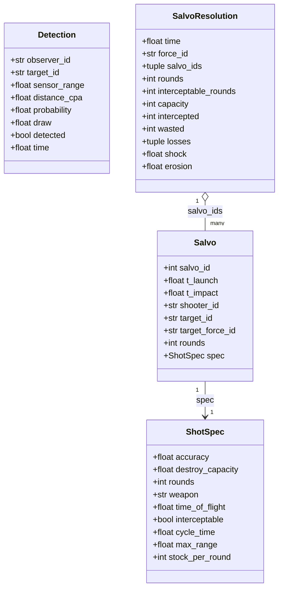
```mermaid
classDiagram
    class ShotSpec {
        +float accuracy
        +float destroy_capacity
        +int rounds
        +str weapon
        +float time_of_flight
        +bool interceptable
        +float cycle_time
        +float max_range
        +int stock_per_round
    }

    class Detection {
        +str observer_id
        +str target_id
        +float sensor_range
        +float distance_cpa
        +float probability
        +float draw
        +bool detected
        +float time
    }

    class Salvo {
        +int salvo_id
        +float t_launch
        +float t_impact
        +str shooter_id
        +str target_id
        +str target_force_id
        +int rounds
        +ShotSpec spec
    }

    class SalvoResolution {
        +float time
        +str force_id
        +tuple salvo_ids
        +int rounds
        +int interceptable_rounds
        +int capacity
        +int intercepted
        +int wasted
        +tuple losses
        +float shock
        +float erosion
    }

    Salvo "1" --> "1" ShotSpec : spec
    SalvoResolution "1" o-- "many" Salvo : salvo_ids
```

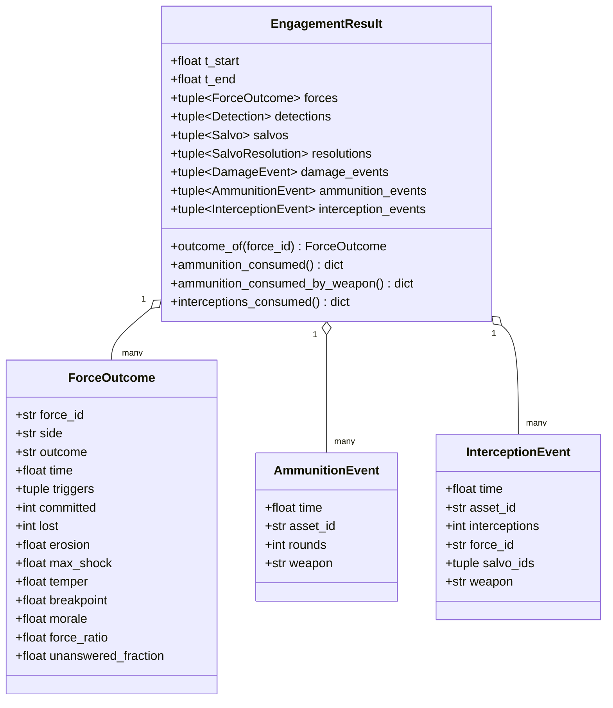
```mermaid
classDiagram
    class ForceOutcome {
        +str force_id
        +str side
        +str outcome
        +float time
        +tuple triggers
        +int committed
        +int lost
        +float erosion
        +float max_shock
        +float temper
        +float breakpoint
        +float morale
        +float force_ratio
        +float unanswered_fraction
    }

    class AmmunitionEvent {
        +float time
        +str asset_id
        +int rounds
        +str weapon
    }

    class InterceptionEvent {
        +float time
        +str asset_id
        +int interceptions
        +str force_id
        +tuple salvo_ids
        +str weapon
    }

    class EngagementResult {
        +float t_start
        +float t_end
        +tuple~ForceOutcome~ forces
        +tuple~Detection~ detections
        +tuple~Salvo~ salvos
        +tuple~SalvoResolution~ resolutions
        +tuple~DamageEvent~ damage_events
        +tuple~AmmunitionEvent~ ammunition_events
        +tuple~InterceptionEvent~ interception_events
        +outcome_of(force_id) ForceOutcome
        +ammunition_consumed() dict
        +ammunition_consumed_by_weapon() dict
        +interceptions_consumed() dict
    }

    EngagementResult "1" o-- "many" ForceOutcome
    EngagementResult "1" o-- "many" AmmunitionEvent
    EngagementResult "1" o-- "many" InterceptionEvent
```

## 4.14 Diagramma D5 — sequenza della coda eventi dentro un ingaggio

Esempio minimo: un tiratore, un bersaglio, una salva intercettabile, saturazione parziale. Il
diagramma è quello della stesura iniziale, aggiornato nei soli passi della risoluzione della salva e
del disingaggio; le regole di scelta del bersaglio aggiunte dopo (priorità ai lanciatori,
saturazione, tetto "due missili", attesa) sono nei diagrammi di §4.24-4.25, e il calcolo di B(t)
in quello di §4.21.

`heapq` con chiave `(t, tipo, id, sequenza)`; tipi nell'ordine `LANCIO(0) < IMPATTO(1) <
RISOLUZIONE(2) < RIDECISIONE(3)` (§4.11). Le estrazioni RNG sono annotate dove avvengono. Per semplicità il passo
`fire_control(shooter, target)` è mostrato come se restituisse una sola `ShotSpec`: dal
2026-09-26 può restituire una sequenza, con la scelta della prima arma con scorta intercalata fra
la fire control e l'accodamento del lancio — il dettaglio è nel diagramma di §4.19, per non
sovraccaricare questo.

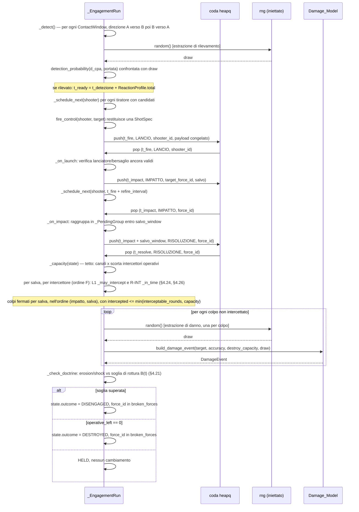
```mermaid
sequenceDiagram
    participant Run as _EngagementRun
    participant Q as coda heapq
    participant RNG as rng (iniettato)
    participant DM as Damage_Model

    Run->>Run: _detect() — per ogni ContactWindow, direzione A verso B poi B verso A
    Run->>RNG: random() [estrazione di rilevamento]
    RNG-->>Run: draw
    Run->>Run: detection_probability(d_cpa, portata) confrontata con draw
    Note over Run: se rilevato: t_ready = t_detezione + ReactionProfile.total

    Run->>Run: _schedule_next(shooter) per ogni tiratore con candidati
    Run->>Run: fire_control(shooter, target) restituisce una ShotSpec
    Run->>Q: push(t_fire, LANCIO, shooter_id, payload congelato)

    Q->>Run: pop (t_fire, LANCIO, shooter_id)
    Run->>Run: _on_launch: verifica lanciatore/bersaglio ancora validi
    Run->>Q: push(t_impact, IMPATTO, target_force_id, salvo)
    Run->>Run: _schedule_next(shooter, t_fire + refire_interval)

    Q->>Run: pop (t_impact, IMPATTO, force_id)
    Run->>Run: _on_impact: raggruppa in _PendingGroup entro salvo_window
    Run->>Q: push(t_impact + salvo_window, RISOLUZIONE, force_id)

    Q->>Run: pop (t_resolve, RISOLUZIONE, force_id)
    Run->>Run: _capacity(state) — tetto: canali x scorta intercettori operativi
    Run->>Run: per salva, per intercettore (ordine F): L1 _may_intercept e R-INT _in_time (§4.24, §4.26)
    Note over Run: colpi fermati per salva, nell'ordine (impatto, salva), con intercepted <= min(interceptable_rounds, capacity)

    loop per ogni colpo non intercettato
        Run->>RNG: random() [estrazione di danno, una per colpo]
        RNG-->>Run: draw
        Run->>DM: build_damage_event(target, accuracy, destroy_capacity, draw)
        DM-->>Run: DamageEvent
    end

    Run->>Run: _check_doctrine: erosion/shock vs soglia di rottura B(t) (§4.21)
    alt soglia superata
        Run->>Run: state.outcome = DISENGAGED, force_id in broken_forces
    else operative_left == 0
        Run->>Run: state.outcome = DESTROYED, force_id in broken_forces
    else
        Run->>Run: HELD, nessun cambiamento
    end
```

## 4.15 Diagramma D6 — stati di una forza durante un ingaggio

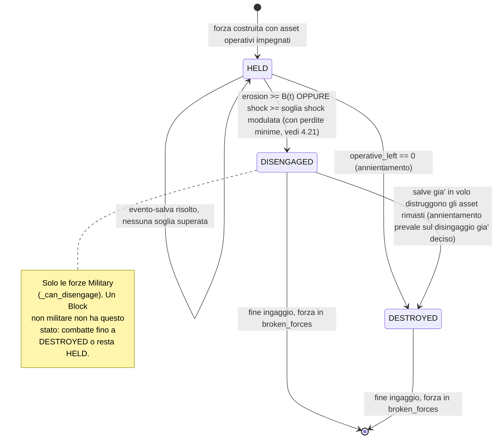
```mermaid
stateDiagram-v2
    [*] --> HELD: forza costruita con asset operativi impegnati
    HELD --> HELD: evento-salva risolto, nessuna soglia superata
    HELD --> DISENGAGED: erosion >= B(t) OPPURE shock >= soglia shock modulata (con perdite minime, vedi 4.21)
    HELD --> DESTROYED: operative_left == 0 (annientamento)
    DISENGAGED --> DESTROYED: salve gia' in volo distruggono gli asset rimasti (annientamento prevale sul disingaggio gia' deciso)
    DISENGAGED --> [*]: fine ingaggio, forza in broken_forces
    DESTROYED --> [*]: fine ingaggio, forza in broken_forces

    note right of DISENGAGED
        Solo le forze Military
        (_can_disengage). Un Block
        non militare non ha questo
        stato: combatte fino a
        DESTROYED o resta HELD.
    end note
```

## 4.16 `Logic/Fire_Control.py`: selezione dell'arma dai registri (D10)

Modulo satellite (2026-09-24, decisione utente, v. proposta B1
`Analysis/Document/Proposta_Efficacia_Antiaerea.md`; aggiornato 2026-09-26, decisione A5 della
proposta A, `Analysis/Document/Proposta_Munizioni_Compatibili_e_Rotte_Attacco.md`; aggiornato di
nuovo il 2026-09-26 per il cannone di bordo, decisione A2, commit `8bd69727`, e il 2026-09-27 per
la gittata delle bombe, decisione B6, commit `6754bf1c`, v. §4.20), che **non tocca** il contratto
di `Engagement_Resolver`: fornisce una `fire_control` che consulta i registri d'arma reali
(`Aircraft_Weapon_Data`, `Ground_Weapon_Data`, `Ship_Weapon_Data`) invece della tabella a ruoli di
test (`Test/Scenario_Fixtures.py`), da iniettare al posto di quest'ultima senza toccare il
chiamante:

```python
fire_control = make_registry_fire_control()
run_session(order, forces_a, forces_b, fire_control, ...)   # rotte dalle missioni di `order`
```

Dal 2026-09-26 la fire control restituisce **tutte** le armi adatte del tiratore, come tupla di
`ShotSpec` **in ordine di preferenza** (`Fire_Control.py:14-17`), non solo la migliore: il
risolutore spara con la prima che ha ancora scorta per quel modello d'arma (`_first_with_stock`,
v. §4.4 e §4.19). Per ogni coppia (tiratore, bersaglio), la catena (`Fire_Control.py:19-64`, righe
di questo paragrafo sempre relative a questo file, non a `Engagement_Resolver.py`):

1. **Armi candidate del tiratore**, dal registro giusto per la sua classe (`_candidate_weapons`,
   `:350-413`): `Vehicle` → `Vehicle_Data._registry[model].weapons` → `GROUND_WEAPONS`; `Ship` →
   `Ship_Data._registry[model].weapons` → `SHIP_WEAPONS`; `Aircraft` → i piloni del loadout
   **assegnato** (`Aircraft.assigned_loadout`) → `AIR_WEAPONS`, **più il cannone di bordo**
   (decisione A2, 2026-09-26, `:375-385`, v. §4.16bis) se il loadout gli assegna colpi; senza
   loadout assegnato, nessuna arma candidata (cannone compreso). Qualunque altro asset
   (`Structure`, ...): nessuna arma.
2. **Chiave del bersaglio** (`:32-40`): per un aereo in volo, la sottoclasse di
   `Context.get_air_target_class` (dal registro del modello, con fallback `'Aircraft'` se l'arma
   non ha quella riga); per ogni altro bersaglio,
   `get_weapon_target_class(get_target_classification(asset_type))` — nessuna classificazione
   trovata, nessun tiro (`None`).
3. **Filtro di adeguatezza** (`:41-53`): un bersaglio aereo richiede una riga aerea nel template
   dell'arma (sono state aggiunte solo alle armi antiaeree: un cannone da carro o un ATGM non è
   mai candidato contro un aereo); un bersaglio di superficie richiede almeno un task che non sia
   puramente antiaereo (`AIR_ONLY_TASKS`, `:169`) — un SAM o un AAM non spara mai a superficie,
   anche se il template ha righe terrestri "inutili"; in ogni caso Pk = accuracy ×
   destroy_capacity deve essere > 0.
4. **Filtro di quota** (solo bersagli aerei, v. sotto).
5. **Ordine di preferenza — decisione A5, "compromesso Pk/costo"** (`:55-64`, `rank_weapons`,
   `:551-587`): **tutte** le armi adatte, ordinate per punteggio decrescente
   (`preference_score`, `:539-548`):

   ```
   punteggio = Pk / costo ** WEAPON_COST_EXPONENT     (Pk = accuracy x destroy_capacity)
   ```

   applicata **solo se tutte** le armi adatte della coppia hanno un `cost` positivo nel registro
   (`WEAPON_COST_EXPONENT = 0.5`, **STIMA DICHIARATA** non tarata, `:202-223`); altrimenti si
   ripiega sulla sola Pk (criterio precedente al 2026-09-26). Oggi hanno il costo tutte le armi
   di `Aircraft_Weapon_Data`, un solo modello su ~110 di `Ground_Weapon_Data` (2A46M) e nessuno
   di `Ship_Weapon_Data`: per veicoli e navi la mancanza di un costo dichiarato fa quindi
   ricadere sulla sola Pk, senza inventare costi. A parità di punteggio: Pk maggiore, poi nome
   del modello, poi tipo d'arma (tie-break deterministico). I valori sono letti **grezzi** da
   `efficiency[classe][dimensione]`, mai dagli scorer di pianificazione (`calc_weapon_efficiency`
   usa il `random` di modulo e romperebbe il determinismo di sessione).

Il **perché** del compromesso (`:202-216`, dichiarato, non tarato): con scorte finite per arma
(v. §4.19) la massima Pk da sola spende sempre i missili migliori anche su bersagli leggeri; la
pura efficienza economica (`WEAPON_COST_EXPONENT = 1`) preferirebbe sempre la bomba da costo 3
al missile da costo 100 anche con Pk molto minore. `0.5` sta nel mezzo: un'arma che costa 4 volte
tanto deve avere Pk doppia per essere preferita. Il punteggio è invariante per l'unità del costo
(un fattore di scala comune non cambia l'ordine): i `cost` dei registri, che non dichiarano
l'unità (plausibilmente migliaia di USD), non vanno quindi normalizzati.

### Quota (`:66-88`)

La quota corrente è `asset.position.z` [m]: il motore non aggiorna `position` durante la sessione
(le rotte sono consumate dal `Contact_Scheduler`, non scritte sull'asset), quindi per un aereo in
rotta a quota costante coincide con la quota di volo di partenza. Unità verificate per registro:
`Ground_Weapon_Data`/`Ship_Weapon_Data` — `min_altitude`/`max_altitude` in **metri**, relativi al
tiratore; `Aircraft_Weapon_Data` — `max_height` in **km**, quota assoluta. Armi senza dato di
quota (CIWS, cannoni navali, autocannoni, HMG): il vincolo diventa geometrico — una traiettoria
non sale oltre la propria portata — non una costante stimata. Se la posizione di tiratore o
bersaglio non è disponibile, il filtro **non si applica** (stessa politica "None = non modellato"
di munizioni e carburante, v. capitolo 7 §7.6).

### `air_range_m` vs `range_m` (`_air_range_m`, `:304-316`)

Per un'arma terra-aria il cui registro dichiara `range` come `{direct, indirect}`, contro un
bersaglio **aereo** si usa la portata di tiro **diretto** (a vista), non quella indiretta contro
superficie: un cannone AA S-68 con `indirect` 12 km ingaggia un aereo solo entro `direct` 4 km.
Per `Ship`/`Air` esiste solo l'unica portata del registro.

### Velocità stimata e tempo di volo (`_speed_ms`, `:319-335`; `shot_spec_for`, `:598-643`)

`_speed_ms` legge `speed`/`muzzle_speed` dal registro; per gli AAM di `Aircraft_Weapon_Data`
converte `max_speed` (in Mach) tramite `SPEED_OF_SOUND_MS = 340.3` m/s (atmosfera ISA a 15 °C:
una definizione, non una stima); per i siluri converte i nodi in m/s tramite `KNOT_MS`.
`time_of_flight = ENGAGEMENT_RANGE_FRACTION × max_range / velocità` quando il registro dà
entrambi — **STIMA DICHIARATA**: si assume l'ingaggio a metà portata
(`ENGAGEMENT_RANGE_FRACTION = 0.5`, `:178`), non nota alla fire control (la distanza vera la
calcola il risolutore, dopo); altrimenti `DEFAULT_TIME_OF_FLIGHT_S` per categoria (`:184`, ordini
di grandezza non tarati).

### Campi derivati della `ShotSpec` (`:90-124`, `shot_spec_for`, `:598-643`)

- `weapon`: nome del modello d'arma — dal 2026-09-26 anche la chiave della scorta consumata (v.
  §4.19).
- `max_range` [m] (**controllo di portata del risolutore**, v. §4.17): la portata del registro
  convertita in metri; contro un bersaglio aereo, per le armi terrestri, la portata di tiro
  diretto; `None` quando il registro non dichiara una portata. **Dal 2026-09-27 (decisione B6,
  commit `6754bf1c`, v. §4.20)** questo vale ancora per un aereo bersaglio, ma non più per le
  bombe contro un bersaglio di **superficie**: per quelle, `max_range` (gittata obliqua) e
  `time_of_flight` (tempo di caduta) vengono dalla balistica di rilascio di
  `Logic/Weapon_Delivery.bomb_engagement_estimate`, non dal registro. Restano senza vincolo di
  portata solo le tre bombe senza dati di rilascio (KGBU-2AO/2PTAB/96r, D4 — chiusa il 2026-09-28: oggi nessuna) e i
  casi senza posizione nota di tiratore o bersaglio.
- `interceptable`: `True` per missili e bombe guidate (`type == 'Guided bombs'`); `False` per
  proiettili, razzi non guidati, bombe a caduta libera e siluri.
- `rounds`/`cycle_time`: per le armi a tiro rapido (`fire_rate >= AUTOMATIC_FIRE_RATE_RPM = 200`
  colpi/min) un colpo della `ShotSpec` è una **raffica** di `GUN_BURST_ROUNDS = 50` colpi; per le
  armi a tiro singolo un colpo è un proietto; per missili/bombe/razzi/siluri `rounds =
  SALVO_ROUNDS` per categoria e `cycle_time = None` (intervallo del profilo di reazione).
- `stock_per_round` (decisione A3, 2026-09-26, `:121-124`): unità di scorta consumate da UN
  colpo della salva — `GUN_BURST_ROUNDS` per le armi a tiro rapido (un colpo è una raffica: uno
  Shilka con 2000 colpi spara 40 raffiche, non 2000 colpi), `1` per tutte le altre. Un cannone
  senza `fire_rate` nel registro resta a `1` (non si sa se sparerebbe a raffiche).

### Memoizzazione (`:126-133`)

La scelta è una funzione **pura** di (tiratore: classe, modello, loadout; bersaglio: chiave,
dimensione; quote): ogni fire control creata da `make_registry_fire_control` ha una propria cache
per quella chiave, senza stato che dipenda dall'ordine delle chiamate — il determinismo di
sessione non cambia (due run con lo stesso seed restano identiche, cache calda o fredda). Le armi
candidate sono memoizzate per (classe, modello, loadout); le scelte per (tiratore, chiave del
bersaglio, dimensione, quote).

### Cosa non fa (`:135-144`)

Non modula la Pk con la posizione nell'inviluppo (distanza, aspetto): valori di template. Non
conta le munizioni: è pura, e la scorta per arma la legge il risolutore dallo stato ombra (v.
§4.19) — l'ordine di preferenza non dipende dalla scorta residua né dalla missione (filtro ROE
per tipo di missione rimandato, decisione A4: l'entità `Mission` esiste dalla fase F1 del piano della
Missione, ma il filtro delle armi per missione è la fase F7, non ancora fatta). Non distingue stealth,
contromisure o ECM. Nessun componente LLM, nessun uso del modulo `random`.

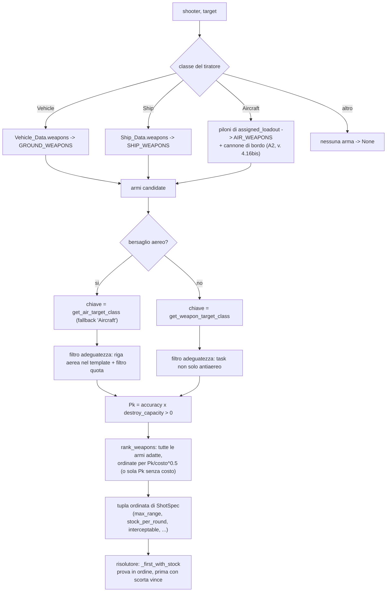
```mermaid
flowchart TD
    A["shooter, target"] --> B{"classe del tiratore"}
    B -->|Vehicle| C1["Vehicle_Data.weapons -> GROUND_WEAPONS"]
    B -->|Ship| C2["Ship_Data.weapons -> SHIP_WEAPONS"]
    B -->|Aircraft| C3["piloni di assigned_loadout -> AIR_WEAPONS<br/>+ cannone di bordo (A2, v. 4.16bis)"]
    B -->|altro| C4["nessuna arma -> None"]
    C1 --> D["armi candidate"]
    C2 --> D
    C3 --> D
    D --> E{"bersaglio aereo?"}
    E -->|si| F1["chiave = get_air_target_class (fallback 'Aircraft')"]
    E -->|no| F2["chiave = get_weapon_target_class"]
    F1 --> G["filtro adeguatezza: riga aerea nel template + filtro quota"]
    F2 --> G2["filtro adeguatezza: task non solo antiaereo"]
    G --> H["Pk = accuracy x destroy_capacity > 0"]
    G2 --> H
    H --> I["rank_weapons: tutte le armi adatte,<br/>ordinate per Pk/costo^0.5 (o sola Pk senza costo)"]
    I --> J["tupla ordinata di ShotSpec<br/>(max_range, stock_per_round, interceptable, ...)"]
    J --> K["risolutore: _first_with_stock<br/>prova in ordine, prima con scorta vince"]
```

## 4.16bis Il cannone di bordo come arma candidata (decisione A2, 2026-09-26, commit `8bd69727`)

I 13 cannoni interni reali erano già completamente modellati nei registri (Pk, portata, cadenza,
v. `AIR_WEAPONS['CANNONS']`/`['MACHINE_GUNS']`), ma **esclusi** da `_candidate_weapons` e i loro
colpi scartati dalla scorta per arma della Proposta A (§4.19): mancava solo l'associazione
aereo → cannone. Colmata con un nuovo campo opzionale `gun` di `Aircraft_Data`
(`Asset/Aircraft_Data.py`, validato da `_validate_gun`): il nome **esatto** di una voce di
`AIR_WEAPONS` (`str`, un solo cannone), oppure un `dict {modello: colpi del carico completo
reale}` per un armamento **misto** (il solo caso reale: il MiG-15bis porta un N-37 da 40 colpi più
due NR-23 da 80). Assente/`None`: nessun cannone d'ingaggio modellato — bombardieri strategici,
trasporti, AWACS/ISR, droni e tanker, e le torrette difensive di coda dei bombardieri (Tu-22M,
Tu-95MS, Tu-142, Il-76MD), non sono armi d'ingaggio nel senso di questo modulo. **Anomalia dati
segnalata, non risolta**: l'AJ/ASJ 37 Viggen ha `gun_rounds` nel loadout ma nessun cannone interno
proprio nel registro (l'Oerlikon-KCA appartiene alla variante JA 37; l'AJ 37 portava storicamente
un pod ADEN esterno, non modellato) — lasciato senza `gun` piuttosto che assegnargli un'arma
sbagliata.

`get_aircraft_gun_rounds(model, gun_rounds)` (`Asset/Aircraft_Data.py:3745-3773`) converte i colpi
del loadout (`stores['gun_rounds']`) nella scorta per arma del cannone: `{gun: gun_rounds}` per un
cannone singolo; per un armamento misto, ripartizione **proporzionale** ai colpi del carico
completo reale dichiarato in `gun`, con parte intera per difetto e i colpi residui assegnati uno
alla volta ai resti maggiori (a parità, nome del cannone) — deterministico, somma sempre
`gun_rounds`, voci a 0 colpi omesse. Restituisce `{}` (nessun vincolo) se il modello non ha `gun`,
non è nel registro, o `gun_rounds` non è un intero positivo.

Tre punti consumano la stessa funzione, con lo stesso risultato per costruzione:

- `Aircraft.stores_from_registry()` (`Asset/Aircraft.py:271-278`, v. §7.6): il cannone ottiene la
  **propria** voce di scorta, mai sommata a quella di un'arma dei piloni — fino a questa data i
  colpi del cannone finivano nello scalare aggregato e pagavano i missili (il difetto del
  contatore aggregato di §4.19, "un A-10 con 4 Maverick ne lanciava 642");
- `Fire_Control._candidate_weapons` (`Logic/Fire_Control.py:375-385`): il cannone è candidato
  **solo** se il loadout gli assegna colpi (`get_aircraft_gun_rounds(...)` non vuoto), con la
  stessa voce di `AIR_WEAPONS` delle altre armi del loadout — da qui in poi segue esattamente la
  stessa catena di adeguatezza/quota/ranking del resto del capitolo;
- la fire control stessa (`make_registry_fire_control`, righe citate sopra), che quindi
  restituisce anche il cannone fra le opzioni ordinate.

**Comportamento cambiato**: un aereo in missione CAP (o comunque senza altre armi adatte contro un
bersaglio di superficie) può ora ingaggiarlo col cannone di bordo — prima non sparava affatto.
Nessun filtro per tipo di missione (decisione A4 rimandata alla fase F7, come per il resto della fire control):
il cannone è un'arma candidata generica.

## 4.17 Controllo di portata: `ShotSpec.max_range` e il rimando `not_before` (D11)

Decisione utente 2026-09-24 (`Logic/Engagement_Resolver.py:110-134`). Prima di questa data il tiro
partiva al primo istante utile dopo rilevamento + latenza, **qualunque fosse la distanza**: una
fire control che restituiva un'arma da 20 km faceva sparare un aereo rilevato a 60 km. Ora, se
`ShotSpec.max_range` è dichiarato, il **lancio** parte solo quando la distanza 3D
tiratore-bersaglio è ≤ `max_range`.

La geometria "bersaglio entro la portata" è isolata (primo caso dei futuri "volumi d'ingaggio",
v. il commento a `:1171-1181`) in due funzioni sostituibili, senza toccare la schedulazione:

- **`engagement_intervals(legs_shooter, legs_target, max_range)`** (`:1185-1192`): con i tratti
  di rotta di entrambi, è esattamente `Contact_Scheduler.range_intervals` — la stessa geometria
  esatta già usata per il rilevamento (sfera di raggio `max_range` centrata sul tiratore,
  soluzione esatta di `|dr + dv·s| <= R` su ogni sottointervallo a velocità relativa costante).
- **`engagement_intervals_without_legs(t_cpa, distance_cpa, t_end, max_range)`** (`:1195-1211`):
  ripiego quando `resolve_engagement` è chiamato senza `legs` — la sola `ContactWindow` non
  ricostruisce la distanza nel tempo, il solo dato certo è il massimo avvicinamento: `distance_cpa`
  ignota → nessun vincolo (`[(-inf, +inf)]`); `distance_cpa > max_range` → mai in portata (`[]`);
  altrimenti `[(t_cpa, t_end)]` (prima del CPA il tiro aspetta il CPA, dopo il CPA la distanza non
  è verificabile e il tiro è ammesso fino a fine finestra).

`_EngagementRun._range_entry(shooter_id, candidate, max_range, t_from)` (`:1971-2004`) usa una
delle due per trovare il primo istante ≥ `t_from` con il bersaglio in portata, memoizzato per
`(tiratore, bersaglio, max_range)` in `self.range_cache` (`:1276`).

`_schedule_next` (`:1614-1779`, il controllo di portata a `:1760-1774`) applica il controllo al
momento della scelta del tiro, **dopo** aver scelto l'arma con scorta (v. §4.19: la fire control
è consultata e la prima opzione con scorta è già fissata prima del controllo di portata, non il
contrario — v. il limite dichiarato più sotto):

- `t_in_range is None` → il candidato è **esaurito** (`candidate.exhausted = True`), come un
  `fire_control` che restituisce `None`, ma solo per quella coppia/finestra;
- `t_in_range > t_fire` → il candidato è **rimandato** (`candidate.not_before = t_in_range`, campo
  di `_Candidate`, `:1110`) e la scelta si ripete: il tiratore, nel frattempo, può ingaggiare un
  altro bersaglio già in portata;
- `t_in_range <= t_fire` → il lancio parte a `t_fire`.

**R4 rispettato**: la portata è valutata allo **scheduling** (prima del lancio), il payload resta
congelato al lancio, che avviene poi all'istante già calcolato. Il controllo non estrae numeri
casuali: l'ordine delle estrazioni RNG resta invariato, e con `max_range=None` il percorso di
codice è identico a quello precedente al 2026-09-24 — nessuna regressione per chi non passa una
fire control con controllo di portata.

**Limite dichiarato (2026-09-26, v. §4.19 e capitolo 9 §9.1): la scelta per scorta precede il
controllo di portata.** `_schedule_next` chiama prima `_first_with_stock` (scelta dell'arma fra
le opzioni della fire control con scorta disponibile) e solo sul risultato applica
`_range_entry`. Se l'opzione preferita (Pk/costo più alta) ha ancora scorta ma è fuori portata,
il candidato è rimandato o esaurito **anche se** un'opzione successiva della stessa `fire_control`
— meno preferita, magari già esaurita per stock più basso o con `max_range` maggiore — sarebbe
già in portata: il tiratore non "scende" alla seconda opzione per motivi di portata, solo per
motivi di scorta. Non è stato corretto: richiederebbe che `_first_with_stock` conoscesse anche la
geometria della finestra, oggi calcolata solo dopo la scelta dell'arma.

Per isolare il solo controllo di portata, il diagramma mostra la fire control come se
restituisse direttamente la `ShotSpec` scelta: il passo intermedio "prima opzione con scorta"
(`_first_with_stock`, appena descritto) è nel diagramma di §4.19.

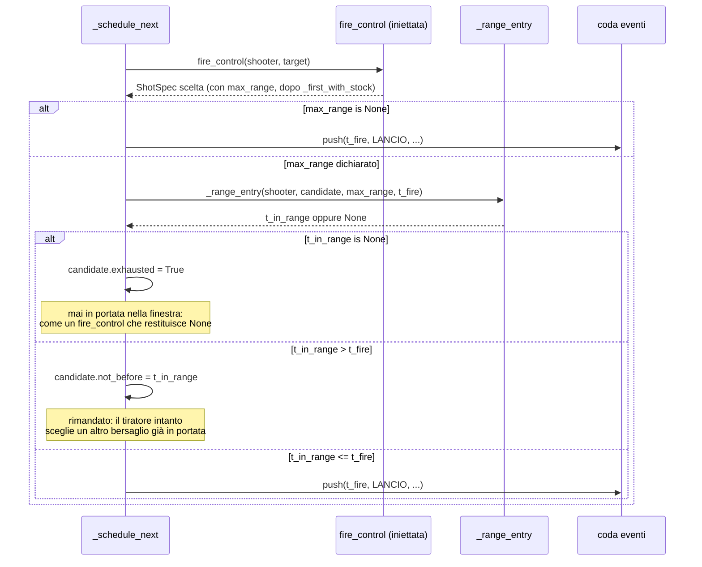
```mermaid
sequenceDiagram
    participant Sched as _schedule_next
    participant FC as fire_control (iniettata)
    participant RE as _range_entry
    participant Q as coda eventi

    Sched->>FC: fire_control(shooter, target)
    FC-->>Sched: ShotSpec scelta (con max_range, dopo _first_with_stock)

    alt max_range is None
        Sched->>Q: push(t_fire, LANCIO, ...)
    else max_range dichiarato
        Sched->>RE: _range_entry(shooter, candidate, max_range, t_fire)
        RE-->>Sched: t_in_range oppure None

        alt t_in_range is None
            Sched->>Sched: candidate.exhausted = True
            Note over Sched: mai in portata nella finestra:<br/>come un fire_control che restituisce None
        else t_in_range > t_fire
            Sched->>Sched: candidate.not_before = t_in_range
            Note over Sched: rimandato: il tiratore intanto<br/>sceglie un altro bersaglio già in portata
        else t_in_range <= t_fire
            Sched->>Q: push(t_fire, LANCIO, ...)
        end
    end
```

## 4.18 Nebbia di guerra: fattore di rilevamento da ricognizione (D12)

Vive anch'essa in `Engagement_Resolver.py` (attività C, 2026-09-25), come costruttori del fattore
già iniettato `detection_factor`, lo stesso punto usato dal meteo (§4.2,
`weather_detection_factor_fn`): **il motore non cambia**, chi non passa questi fattori ottiene
esattamente il comportamento precedente (`:795-802`). La nebbia è **per lato** (ognuno vede
secondo la propria ricognizione) e **statica**: l'istantanea è presa **prima** della sessione
(decisione utente, niente nebbia dinamica né RNG nel motore); il fattore non consuma l'RNG di
sessione — sposta solo la soglia di `detection_probability`, l'estrazione di rilevamento avviene
comunque, una per direzione, nell'ordine del contratto (`:795-802`).

### `recon_detection_factor_fn(seen_block_ids, observer_side, unseen_factor, seen_factor=1.0)` (`:820-857`)

La callable `(observer, target) -> float` di un lato: `seen_factor` se il blocco del bersaglio è
nell'istantanea `seen_block_ids` oppure è dello stesso lato dell'osservatore (le proprie forze
sono note); `unseen_factor` altrimenti (blocco non confermato dalla ricognizione, o bersaglio
senza blocco). Per un osservatore di lato diverso da `observer_side` (o senza blocco/lato) il
fattore è `1.0`: la nebbia di un lato non tocca l'altro — per applicarla a entrambi si combinano
due fattori.

### `combine_detection_factors(*fns)` (`:860-894`)

Un solo `detection_factor` dal **prodotto** di più componenti (meteo, nebbia Blue, nebbia Red),
ognuno riportato in [0, 1] prima del prodotto: serve a passare a `resolve_engagement` un'unica
callable quando più degradazioni si applicano insieme.

### `region_recon_detection_factor(region, observer_side, ...)` (`:970-1015`)

Costruisce il fattore per un lato dall'istantanea di ricognizione di una `Region`, con la
**stessa ricetta** di `Region.update_military_priorities(use_recon=True)`:

```
seen = Tactical_Analysis.build_recon_cp_snapshot(
    region.get_recon_reports(enemySide(observer_side))
).keys()
```

L'istantanea è scattata **qui**, una sola volta, prima di lanciare la sessione (`:1005`).
`unseen_factor` è poi modulato dall'efficienza di ricognizione dell'osservatore
(`recon_unseen_factor`, `:897-926`):

```
e      = side_recon_efficiency(region, observer_side)     # in [0,1], 0.0 se assente
unseen = UNSEEN_DETECTION_FACTOR + (seen_factor - UNSEEN_DETECTION_FACTOR) × RECON_EFFICIENCY_FOG_RELIEF × e
```

con `UNSEEN_DETECTION_FACTOR = 0.5` e `RECON_EFFICIENCY_FOG_RELIEF = 0.5` (`:303-316`, **STIME
DICHIARATE**, nessuna fonte del progetto le fornisce, da ricalibrare). Con ricognizione nulla
(`e=0`) il fattore resta `0.5`; con ricognizione massima (`e=1.0`) sale a `0.75` — **mai** fino a
`1.0`: anche la ricognizione migliore non rende un blocco NON confermato equivalente a uno
confermato, ne dimezza solo lo svantaggio (razionale dichiarato: cueing su settori coperti/tracce
parziali, non conferma).

`side_recon_efficiency(region, side)` (`:929-967`) è l'efficienza di ricognizione di un **lato**,
aggregata come il **massimo** fra le sue `Military` nella regione
(`Military.get_recon_efficiency()`, mediana per blocco degli asset con ruolo `RECONNAISSANCE`).
Scelta deliberata: basta un buon sensore per "illuminare" l'area — una regione con cinque
battaglioni corazzati e un solo ottimo squadrone da ricognizione non deve risultare poco
ricognita. **Diversa** da `Region.get_region_recon_efficiency`, che fa la **media** su tutti i
blocchi `Military` del lato (inclusi quelli senza asset di ricognizione, che valgono 0.0): quella
misura quanto la ricognizione è diffusa nel lato, resta intatta con un caso d'uso diverso — non va
confusa con l'aggregazione usata qui, che misura invece se l'area è "illuminata" da almeno un
buon sensore. Limite dichiarato: il massimo ignora la copertura geografica (un buon sensore
illumina tutta la regione, ovunque sia).

`observer_side == 'Neutral'` non è un lato belligerante (stesso guard di
`update_military_priorities`): warning e fattore neutro, `1.0` ovunque (`:1000-1003`).

Blocchi osservatori/osservati selezionati come in `Region.get_recon_reports`
(`get_blocks_by_criteria(side, category='Military')`, `:945`, `:952`): osservatori e osservati seguono
quindi la stessa regola — **ma** v. il bug noto su questo filtro in capitolo 9, §9.1, che impatta
sia questa funzione sia `get_recon_reports`.

Verificato su scenario S9 con una `Region` vera (memoria di sessione 2026-09-25): tasso di
rilevamento Blue 0.948 (bersaglio visto) → 0.726 (ricognizione buona) → 0.496 (bersaglio non
visto, ricognizione nulla).

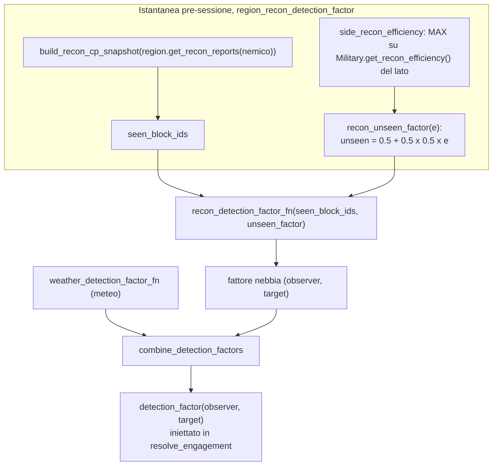
```mermaid
flowchart TD
    subgraph Istantanea["Istantanea pre-sessione, region_recon_detection_factor"]
        A["build_recon_cp_snapshot(region.get_recon_reports(nemico))"] --> B["seen_block_ids"]
        C["side_recon_efficiency: MAX su Military.get_recon_efficiency() del lato"] --> Dd["recon_unseen_factor(e):<br/>unseen = 0.5 + 0.5 x 0.5 x e"]
    end
    B --> E["recon_detection_factor_fn(seen_block_ids, unseen_factor)"]
    Dd --> E
    E --> F["fattore nebbia (observer, target)"]
    G["weather_detection_factor_fn (meteo)"] --> H["combine_detection_factors"]
    F --> H
    H --> I["detection_factor(observer, target)<br/>iniettato in resolve_engagement"]
```

## 4.19 Scorta per modello d'arma: `Asset/Weapon_Stores.py` (decisione A1/A3, 2026-09-26)

### Il difetto che ha motivato la riscrittura

Fino al 2026-09-26 la scorta di un asset era **un contatore scalare aggregato**
(`Mobile.ammunition`, introdotto dalla decisione R3 del 2026-09-23): la fire control sceglieva
un'arma per nome (`ShotSpec.weapon`), ma il risolutore scalava sempre lo stesso scalare,
**indipendentemente** da quale arma fosse stata scelta. Difetto verificato con un caso reale
(`Analysis/Document/Proposta_Munizioni_Compatibili_e_Rotte_Attacco.md §1`): un A-10 con 4
AGM-65D Maverick a bordo ne lanciava **642**, pagati dai colpi del cannone di bordo nello stesso
contatore; un BMP-2 con 4 missili Konkurs poteva lanciarne 252.

### Stato primario e viste

`Mobile._stores: Optional[Dict[str, int]]` = `{modello_arma: quantità}` (`Asset/Mobile.py:346`)
è ora lo stato primario; `ammunition`/`interceptor_stock` sono **viste calcolate** su di esso,
tramite funzioni **pure** condivise fra l'asset reale e lo stato ombra del risolutore
(`Asset/Weapon_Stores.py`, 298 righe, senza stato né import di dominio né uso di `random`):
questo garantisce che le due implementazioni non possano divergere (l'ombra non può concedere
una salva che l'asset reale non potrebbe poi pagare).

Per un'arma richiesta `weapon`, la contabilità distingue **quattro forme della scorta**
(`Weapon_Stores.py:21-37`):

1. `stores is None` → **pool anonimo** (`anonymous`): il comportamento precedente al 2026-09-26,
   usabile da qualunque arma — la forma degli stub di test e di chi imposta `Mobile.ammunition =
   n` a mano (`Mobile.py:759-783`).
2. `weapon` presente in `stores` → **la sua voce**, e solo quella.
3. `weapon` in `unmodelled` → **arma reale senza dato di scorta** (`Mobile.UNIT_COUNTED_WEAPON_TYPES`:
   mitragliatrici, CIWS — il registro dà il numero di armi installate, non i colpi): nessun
   vincolo, non paga né è pagata da altre armi.
4. `weapon` `None` o nome estraneo all'asset (tabelle di fuoco di test, fire control che non
   dichiara l'arma) → **l'aggregato**: la richiesta è pagata dall'insieme delle voci, nell'ordine
   `drain_order` (`Weapon_Stores.py:155-172`: prima le armi non-AD, poi i cannoni AD, poi i
   missili AD, a parità il nome del modello) — la scelta conservativa per chi non ha
   informazione per arma, con lo stesso totale e stesso esaurimento di prima del 2026-09-26. La
   fire control dai registri (`Logic/Fire_Control.py`, §4.16) sceglie solo armi del registro
   dell'asset, quindi non passa mai da questo caso.

Le funzioni principali (`Weapon_Stores.py`): `total_stock` (`:119-124`, la vista `ammunition`),
`available_stock` (`:127-139`, unità spendibili da un'arma), `has_stock` (`:142-152`, almeno
un'arma può ancora sparare), `consume_stock` (`:175-212`, muta `stores` sul posto e ritorna le
unità consumate — mai sotto zero: con scorta insufficiente consuma il residuo e lo dichiara nel
valore di ritorno).

### Intercettori: stessa voce dell'arma offensiva, regola F

`interceptor_weapons = {modello: è_cannone}` elenca le armi **intercettrici** dell'asset
(`Mobile.interceptor_weapons_from_registry`, `Asset/Mobile.py:1047-1117`): le armi AD di
`Mobile.air_defense_volume` (v. capitolo 7 §7.5) **ristrette dal 2026-09-28 a quelle che
dichiarano il task `Anti_Missile`** (regola D, §4.24) ed estese ai CIWS navali, trattati come
cannoni AD con scorta `impianti × rounds_per_mount` (`_mount_rounds`, `Asset/Mobile.py:204-216`).
Con `stores` presente e `interceptor_weapons`
non vuoto, la scorta di intercettori è (`interceptor_stock`, `Weapon_Stores.py:228-234`):

```
sum(stores[missile] per ogni missile AD) + sum(stores[cannone] // ROUNDS_PER_GUN_INTERCEPT per ogni cannone AD)
```

e un'intercettazione consuma 1 missile o `ROUNDS_PER_GUN_INTERCEPT = 100` colpi **dalla stessa
voce** usata dal fuoco offensivo: un lanciatore che intercetta e tira diretto con lo stesso
missile scala naturalmente lo stesso numero. **La vecchia regola del "SAM puro"
(`Mobile.interceptor_shares_ammunition`, tre condizioni sul registro, introdotta il 2026-09-23
perché un contatore aggregato non poteva condividere per arma) è stata eliminata**: non serve più
un caso speciale — un M6-Linebacker (Stinger condivisi con l'intercettazione, M242 separato) o un
Arleigh Burke (SM-2/ESSM condivisi, Harpoon/Mk-45 separati) sono corretti per costruzione, senza
bisogno di rilevare il caso "solo missili". Ordine di consumo — **regola F** della proposta SAM
(`interceptor_order`, `Weapon_Stores.py:237-239`; fra asset, `interceptor_rank`, `Weapon_Stores.py:242-249`, §4.24): prima i cannoni, poi i missili, a parità il
nome del modello. Senza vista attiva (pool anonimo, o scorta impostata a mano col setter) la
scorta di intercettori resta il pool anonimo `anonymous_interceptors`, distinto dalle munizioni
come prima del 2026-09-26.

`plan_interceptions`/`apply_interception_plan` (`Weapon_Stores.py:252-293`) calcolano e applicano
la ripartizione per arma di un numero di intercettazioni **senza mutare** `stores` nel primo
passo (per lo stato ombra, v. sotto) e mutandolo nel secondo (per l'asset reale, v. `Mobile.
consume_interceptor_stock`, `Mobile.py:1012-1045`).

### Come lo consuma il risolutore: `_first_with_stock` e `_on_launch`

Allo **scheduling** (`_schedule_next`, `:1614-1779`), il risolutore chiede alla `fire_control`
tutte le opzioni adatte (v. §4.16) e prende la **prima** la cui arma ha scorta per almeno un
colpo (`_first_with_stock`, `:1952-1969`):

```
colpi = min(spec.rounds, scorta_disponibile // spec.stock_per_round)     con scorta vincolante
colpi = spec.rounds                                                      con scorta non vincolante (None)
```

Se nessuna opzione ha scorta, il candidato è trattato come se la fire control avesse restituito
`None`: quel bersaglio non verrà più ingaggiato da questo tiratore (v. §4.16). Il numero di colpi
così calcolato viaggia **congelato** nel payload del lancio, insieme alla `ShotSpec` (R4, §4.9).

Al **lancio** (`_on_launch`, `:2009-2075`), il consumo effettivo è `rounds * spec.stock_per_round`
unità dalla voce dell'arma scelta (`:2045-2058`); se la scorta si è erosa fra scheduling e lancio
— può succedere quando un'intercettazione nel frattempo ha consumato la stessa voce, v. sopra — il
lancio è annullato come un bersaglio già fuori combattimento, difendendo l'invariante "la scorta
non va mai sotto zero" (`:2048-2054`). L'`AmmunitionEvent` prodotto porta l'arma e le **unità di
scorta** consumate (colpi × `stock_per_round`, non i soli colpi), e viene poi riapplicato
all'asset reale da `apply_engagement_result` (§4.12) nello stesso ordine temporale in cui lo
stato ombra li ha prodotti.

### Diagramma D13 — dalla fire control al consumo di scorta

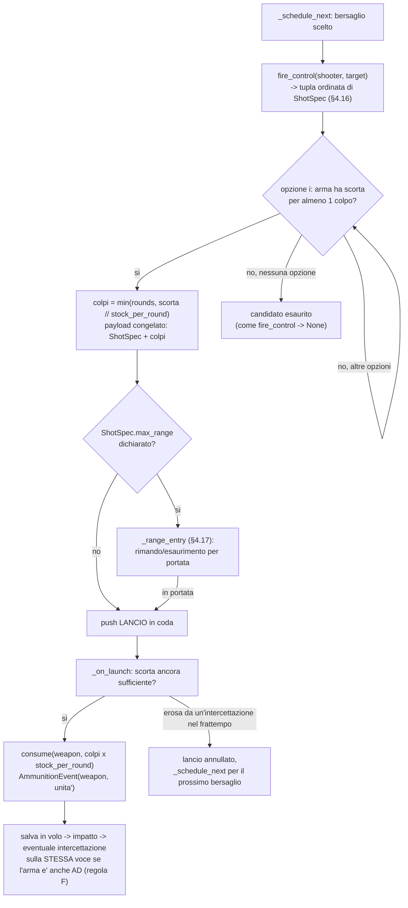
```mermaid
flowchart TD
    A["_schedule_next: bersaglio scelto"] --> B["fire_control(shooter, target)<br/>-> tupla ordinata di ShotSpec (§4.16)"]
    B --> C{"opzione i: arma ha scorta<br/>per almeno 1 colpo?"}
    C -->|si| D["colpi = min(rounds, scorta // stock_per_round)<br/>payload congelato: ShotSpec + colpi"]
    C -->|no, altre opzioni| C
    C -->|no, nessuna opzione| E["candidato esaurito<br/>(come fire_control -> None)"]
    D --> F{"ShotSpec.max_range<br/>dichiarato?"}
    F -->|si| G["_range_entry (§4.17):<br/>rimando/esaurimento per portata"]
    F -->|no| H["push LANCIO in coda"]
    G -->|in portata| H
    H --> I["_on_launch: scorta ancora sufficiente?"]
    I -->|si| J["consume(weapon, colpi x stock_per_round)<br/>AmmunitionEvent(weapon, unita')"]
    I -->|erosa da un'intercettazione nel frattempo| K["lancio annullato,<br/>_schedule_next per il prossimo bersaglio"]
    J --> L["salva in volo -> impatto -> eventuale intercettazione<br/>sulla STESSA voce se l'arma e' anche AD (regola F)"]
```

## 4.20 Bombe: gittata e tempo di caduta dalla balistica di `Weapon_Delivery` (decisione B6, 2026-09-27, commit `6754bf1c`)

Fino al 2026-09-27 le bombe a caduta libera (`AIR_WEAPONS['BOMBS']`) non hanno `range` né dato di
velocità nel registro: `shot_spec_for` produceva quindi `max_range = None` (nessun controllo di
portata, v. §4.17) e `time_of_flight = DEFAULT_TIME_OF_FLIGHT_S['bomb']` — un F-16 armato di bombe
libere poteva sganciarle da qualunque distanza entro il rilevamento. Con B6 il risolutore riusa,
per le sole bombe contro un bersaglio di **superficie** (`kind == 'bomb' and not is_air`,
`Logic/Fire_Control.py:613-614`), la **stessa** balistica del pianificatore d'attacco
(`Logic/Weapon_Delivery.bomb_engagement_estimate`, v. §7.9): "una fisica, un pianificatore, due
esecutori" — il DES e un futuro adapter DCS condividono la stessa legge di caduta, non due
implementazioni che potrebbero divergere.

**Quota di rilascio** (`make_registry_fire_control`, `Logic/Fire_Control.py:706-720`): la
differenza di quota fra tiratore e bersaglio (`shooter_z - target_z`, entrambe da `asset.position.z`,
la stessa fonte del filtro di quota di §4.16), letta anche per un tiratore aereo contro un
bersaglio di superficie — prima di B6 le quote si leggevano solo per bersagli **aerei** (filtro
d'inviluppo); ora anche per questo caso (`bomber = not is_air and shooter_key[0] == 'Aircraft'`).
La **velocità** è `attack.speed` del loadout assegnato (`_attack_speed_kmh`, `:646-654`), `None`
se il loadout non dichiara un profilo `attack` (nessuna bomba, o loadout senza dati) — in quel
caso `bomb_engagement_estimate` usa il centro della finestra di velocità dell'arma.

`bomb_engagement_estimate` (v. §7.9) sceglie un rilascio **livellato** (picchiata a metà fascia se
il livellato non è ammesso dalla finestra), e porta quota/velocità fuori finestra al valore
ammesso più vicino — lo stesso comportamento dichiarato dell'IA di DCS ("will choose closest
altitude"): il risolutore non rifiuta un aereo troppo alto o troppo veloce per l'arma, gli assegna
la soluzione balistica al bordo della finestra. Il risultato (`ReleaseSolution`) alimenta
`ShotSpec.max_range = slant_range_m` (gittata **obliqua**, coerente con la sfera di portata che il
risolutore confronta in §4.17: con un rilascio livellato l'ingresso nella sfera coincide col punto
di sgancio) e `ShotSpec.time_of_flight = fall_time_s` (`Logic/Fire_Control.py:623-625`).

Senza dati di rilascio (erano le tre KGBU-2AO/2PTAB/96r; D4 chiusa il 2026-09-28, oggi nessuna bomba) o senza le due posizioni,
`release` resta `None` e il comportamento è quello precedente a B6 (nessun vincolo di portata,
tempo di volo di ripiego): **non una regressione silenziosa**, lo stesso ramo di codice che girava
prima del 2026-09-27 per ogni bomba.

**Memoizzazione** (v. "Memoizzazione" sopra): la chiave della cache delle scelte include ora le
quote anche per un tiratore aereo contro un bersaglio di superficie (non solo contro un bersaglio
aereo), perché la gittata di una bomba dipende dalla quota di sgancio — la purezza della funzione
non cambia, cambia solo la granularità della chiave.

**Limiti dichiarati** (v. anche capitolo 9, §9.1, e il docstring di `Weapon_Delivery.py`): la
geometria della picchiata/cabrata non entra nel tratto valutato qui, solo nella balistica (gittata
e caduta); la sfera di portata del DES non ha una distanza minima, quindi un aereo già sopra il
bersaglio "sgancia" comunque; quota e velocità fuori finestra sono portate (clampate) al bordo
ammesso invece di far fallire il tiro.

## 4.21 Soglia di rottura stocastica (D1-D9, 2026-09-29, commit `72c7f7c8`)

Documento di decisione: `Analysis/Document/Proposta_Soglia_Rottura_Stocastica.md` (approvata il
2026-09-29; le decisioni D1-D9 e D4a-D4e sono al suo §10). Sostituisce le due soglie fisse del
disingaggio (§4.7) con una **distribuzione**: "forze analoghe cedono a livelli di perdita molto
diversi" (proposta §1). Il disingaggio resta per **forza intera** (decisione P1).

### La formula (`_breakpoint`, `:2561-2604`; dottrina in `Context/Doctrine.py:60-178`)

```
B(t)      = logistic( logit(mu_eff(t)) + dispersion * z )            z = Phi^-1(u)
mu_eff(t) = clamp( erosion * M * R(t) * U(t) * P ,  median_bounds )
```

| Simbolo | Cosa | Dove nel codice |
|---|---|---|
| `erosion` | **mediana** della soglia di rottura (default 0.30); `1.0` = "combatte fino all'annientamento", nessuna modulazione (`:2566-2569`) | `Doctrine.py:161`, `:132` |
| `u`, `z` | **tempra** della forza: quantile `u` estratto **una volta** per forza e per ingaggio, `z = Phi^-1(u)` (`statistics.NormalDist().inv_cdf`), `u` limitato a `[1e-9, 1-1e-9]`; estratta solo se `dispersion > 0` **e** `breakpoint_rng` è fornito, altrimenti `z = 0` (soglia alla mediana modulata) | `_init_breakpoints`, `:2414-2445` |
| `dispersion` | σ della logit-normale (default 0.5: circa 90% delle soglie fra 0.16 e 0.49 attorno a 0.30, `Doctrine.py:123-124`) | `Doctrine.py:163` |
| `M` | morale: `1 + morale_weight × (2m − 1)`, neutro se `morale_for` è `None` o dà `None` (default `morale_weight = 0.3`) | `_morale_of`, `:2447-2461`; `:2574-2575` |
| `R(t)` | rapporto di forze percepito: `clamp(rho ** force_ratio_exponent, force_ratio_bounds)` (esponente 0.5, limiti 0.6-1.5); neutro se `rho` non è definito | `_perceived_ratio`, `:2505-2539`; `:2577-2583` |
| `U(t)` | fuoco senza risposta: `1 − unanswered_fire_weight × frazione` (peso 0.3) | `_unanswered_fraction`, `:2550-2559`; `:2585-2586` |
| `P` | postura: `defensive_posture_factor` (1.2) se tutti gli asset con tratti di rotta sono fermi per tutto l'ingaggio | `_stationary`, `:2479-2495`; `:2588-2589` |
| `median_bounds` | limiti di `mu_eff` (0.05, 0.95), applicati **solo** se il prodotto dei fattori ≠ 1 | `:2591-2595` |
| `shock` | resta una soglia alla mediana (0.20): durante l'ingaggio vale `(shock/erosion) × B(t)` e scatta solo se la salva ha tolto almeno `shock_min_losses` asset (default 2) | `_check_doctrine`, `:2392-2402` |

`B(t)` è ricalcolata a **ogni** risoluzione di salva contro la forza (docstring del modulo,
`:106`), perché `R(t)` e `U(t)` dipendono da ciò che la forza ha percepito entro `t`. Tutti i valori
numerici sono **STIME DI PARTENZA DICHIARATE**, non dati validati (`Doctrine.py:115-127`): da
ricalibrare con il processo ATCAL interno, mai con coefficienti dei documenti Lanchester ingeriti.
I due lati hanno **gli stessi** valori di default (`Doctrine.py:128-131`).

**Compatibilità** (`Doctrine.py:110-113`, `DISENGAGEMENT_NEUTRAL`, `:147-157`): le chiavi oltre
`erosion`/`shock` sono facoltative; se mancano valgono i valori neutri (dispersione 0, morale 0,
esponente 0, peso del fuoco senza risposta 0, postura 1, perdite minime dello shock 1) e la soglia
è quella fissa di prima. La tabella di default `DEFAULT_DISENGAGEMENT_THRESHOLDS`
(`Doctrine.py:174-178`) dichiara invece tutti i parametri. Validazione in
`validate_disengagement_thresholds` (`:231-278`) e `_validate_optional` (`:197-228`);
`disengagement_parameter(entry, key)` (`:304-312`) restituisce il valore o il neutro.

### Da dove viene ciascun ingresso

- **Tempra**: flusso casuale **separato** (decisioni D1, D8). In `run_session` è
  `order.rng(mission_id=None, event_id=temper_event_id(*forze), counter=0)`
  (`Logic/Session_Simulator.py:276-286`, `:717-719`), con tag `'temper'` diverso da `'engagement'`:
  estrarre la tempra non sposta le estrazioni di rilevamento e danno (§4.11).
- **Morale**: ingresso `morale_for(force) -> [0, 1] | None`. Il risolutore **non** legge
  `Block.morale` (`Block/Block.py:434-449`: vale `0.0` quando manca il dato, quindi "sconosciuto"
  diventerebbe "morale nullo", e nessun modulo registra gli esiti delle missioni, proposta §2.1).
  Un valore fuori `[0, 1]` è trattato come sconosciuto con un warning (`:2456-2459`). Nessun
  chiamante di produzione fornisce `morale_for` né `enemy_estimate_for`: `run_session` li inoltra
  soltanto (capitolo 9, §9.1).
- **Rapporto di forze percepito** `rho` (`:2505-2539`): per le forze **aeree** (tutti gli asset
  impegnati sono `Aircraft`, `state.air`, `:2429-2430`) `rho = aerei propri operativi /
  (air_force_ratio_scale × minaccia)`, con minaccia = somma dei pesi dei nemici percepiti entro `t`
  (`_air_threat`, §4.22-4.23: E(N) con la scorta di **dotazione** stimata, perché chi osserva non
  conosce quella residua; 1 per i caccia); per le forze di **superficie**
  `rho = Σ surface_threat_weight propri / Σ surface_threat_weight nemici` (SAM puri a peso 0). I
  nemici distrutti sono esclusi, quelli danneggiati inclusi. Con `enemy_estimate_for` (stima a priori
  dal C2/ricognizione, nella stessa misura) la forza nemica è il **massimo** fra stima e rilevato.
  Rapporto non definito (minaccia o forza propria nulle) → `None` → fattore neutro.
- **Percezione dei nemici** (`seen_by[forza][asset] = primo istante`): alimentata dal
  rilevamento dei sensori della forza (`_perceive`, `:1503-1506`, chiamata in
  `_detect_direction`, `:1481`) e, per una forza aerea, dalla RWR (§4.23).
- **Fuoco senza risposta**: `loss_shooters` registra, per ogni asset messo fuori combattimento, il
  tiratore e l'istante (`:2346-2348`); la frazione è la quota di quei tiratori **non ancora
  percepiti** dalla forza al momento della perdita (`:2550-2559`).
- **Postura**: `_stationary` è `True` se ogni asset impegnato con tratti di rotta ha tutti i tratti
  fermi (tolleranza `STATIONARY_EPS = 1e-6` m, `:329`), `None` se nessuno ha tratti.

### Cosa il risolutore restituisce per spiegare l'esito

`ForceOutcome` porta `temper`, `breakpoint`, `morale`, `force_ratio`, `unanswered_fraction`
(`:555-576`, §4.13), valorizzati solo per le forze con dottrina e (per `temper`) con dispersione e
flusso dedicato.

### Esiti misurati (proposta §7, 2026-09-29)

| Scenario | Prima | Dopo |
|---|---|---|
| S1 senza CAS (Blue-Armor, 5 carri) | rottura alla 1ª perdita in 7 repliche su 8 | 3 su 8, sempre sotto artiglieria non rilevata e con tempra bassa |
| S1 con CAS (Red-Line) | ritirata in 8 su 8 | ritirata in 8 su 8, fra la 1ª e la 3ª perdita, sempre sotto fuoco senza risposta (gli A-10 non sono rilevati) |
| S5 (4 F-15E, dottrina di default) | sempre fermi al 1° strato | 4 fermi al 1° strato, 2 arrivano al Buk |

Sono misure della proposta (non rieseguite per questo aggiornamento): vanno lette come effetto
qualitativo dichiarato dal progetto, non come numeri calibrati.

*Diagramma D22 — composizione della soglia di rottura B(t) (§4.21).*

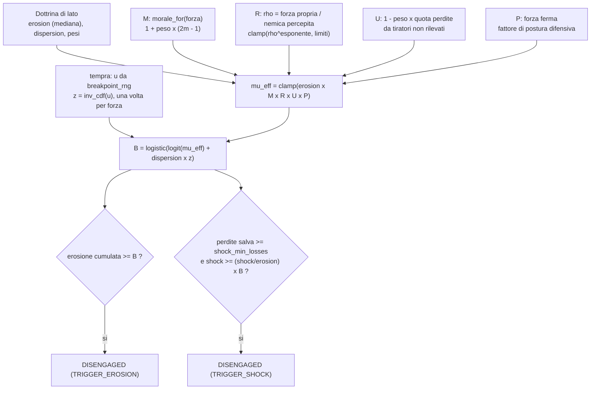
```mermaid
flowchart TD
    D["Dottrina di lato<br/>erosion (mediana), dispersion, pesi"] --> MU["mu_eff = clamp(erosion x M x R x U x P)"]
    M["M: morale_for(forza)<br/>1 + peso x (2m - 1)"] --> MU
    R["R: rho = forza propria / nemica percepita<br/>clamp(rho^esponente, limiti)"] --> MU
    U["U: 1 - peso x quota perdite<br/>da tiratori non rilevati"] --> MU
    P["P: forza ferma<br/>fattore di postura difensiva"] --> MU
    T["tempra: u da breakpoint_rng<br/>z = inv_cdf(u), una volta per forza"] --> LG["B = logistic(logit(mu_eff) + dispersion x z)"]
    MU --> LG
    LG --> E{"erosione cumulata >= B ?"}
    LG --> S{"perdite salva >= shock_min_losses<br/>e shock >= (shock/erosion) x B ?"}
    E -->|si| DIS["DISENGAGED (TRIGGER_EROSION)"]
    S -->|si| DIS2["DISENGAGED (TRIGGER_SHOCK)"]
```

## 4.22 Efficacia difensiva antiaerea E(N) e pesi di minaccia (D4a-D4e, 2026-09-29, commit `72c7f7c8`, `4d225ffb`)

Modulo nuovo: `Context/Air_Defense_Efficacy.py` (725 righe). Risponde a una domanda che la combat
power non sa porre: quanto pesa, nel rapporto di forze percepito, un SAM, un'AAA o una nave? SAM,
AAA ed EWR valgono 0 nelle tabelle di efficacia per definizione e `Military.air_defense_power()`
(capitolo 7, §7.5) è un'altra grandezza su un'altra scala; contare un Kub come un Buk, d'altra
parte, non distingue difese di capacità molto diversa (docstring `:1-8`). La decisione D4 della
proposta (conteggio puro) è stata **respinta** dall'utente.

### E(N): aerei abbattuti attesi (`expected_kills`, `:356-397`)

Per un asset di difesa aerea e `N` aerei nemici che attraversano la sua zona:

```
E(N) = N * (1 - prod_w (1 - p_w) ** (K_w / N))
```

- `p_w` — potenza dell'arma antiaerea `w` contro **un** aereo: `accuracy × destroy_capacity` della
  riga `efficiency['Aircraft_Attacker']['med']` del registro d'arma (aereo d'attacco di taglia
  media, tipo A-10: `REFERENCE_TARGET_CLASS`/`SIZE`, `:67-68`), per i cannoni riferita a una
  raffica (`GUN_BURST_ROUNDS`, v. §4.16); correzioni per modello possibili in `EFFICACY_CORRECTIONS`
  (D4c, oggi vuota, `:76`). Funzione `_single_shot_p`, `:178-192`.
- `K_w` — ingaggi possibili mentre un aereo attraversa la zona: `min(quota di tempo-canale ×
  canali × cicli, scorta_w // colpi_per_ingaggio)`. I `canali` sono `Mobile.engagement_channels('air')`
  (default 1, `_channels`, `:218-225`). I `cicli` (`_cycles`, `:195-215`) sono gli ingaggi
  successivi possibili nel tempo di esposizione `T = 2 × portata / REFERENCE_AIRCRAFT_SPEED`
  (200 m/s, `:70`: attraversamento lungo il diametro, D4b): il primo dopo acquisizione + sequenza di
  lancio + tempo di volo a metà portata (`Air_Route_Manager.threat_reaction_times`, la stessa stima
  del profilo di reazione, §7.3), i successivi ogni sequenza di lancio + tempo di volo (durata della
  raffica per i cannoni).
- Gli ingaggi sono distribuiti uniformemente sugli `N` aerei e ogni aereo si abbatte una volta
  sola: per `N = 1` è la letalità contro un aereo, per `N` grande tende a `Σ K_w p_w`.

`air_defense_efficacy(asset, n, stock=None)` (`:400-413`) restituisce E(N), oppure `None` se
l'asset non è un asset di difesa aerea noto (modello ignoto, nessuna arma antiaerea con dati di
efficacia, aereo: nessuna eccezione per dato mancante). La parte statica (modello → `ADProfile` di
`ADWeaponProfile`, `:93-125`) è in cache per `(modello, categoria, canali, dotazione)`
(`air_defense_profile`, `:330-353`; `clear_cache`, `:134-139`).

### Sistema di puntamento condiviso (richiesta dell'utente, 2026-09-29; `_director`, `:237-258`)

Le armi guidate dallo **stesso** sistema di puntamento non si sommano come indipendenti:
ripartiscono i suoi canali nel tempo di esposizione. Dentro un sistema si impiega prima l'arma più
letale finché ha scorta, poi la successiva nel tempo-canale che resta (Tunguska: prima i 9M311, poi i
2A38M); in `expected_kills`, `time_left[director]` tiene la quota di tempo-canale ancora libera e i
profili sono ordinati per `(director, −p, arma)` (`:325`, `:372-390`). Per un **veicolo** con radar
aria le armi non a guida autonoma (guida diversa da `'IR'`, `AUTONOMOUS_GUIDANCE`, `:90`) condividono
`'radar'` e i canali dell'asset; le armi IR e i cannoni senza radar puntano da sé (un canale per
arma). Per una **nave** i SAM condividono il `'director'`; ogni tipo di CIWS ha il proprio radar,
con un canale per impianto (quantità del registro).

### Scorta nella stima: dotazione, non residua

`expected_kills(profile, n, stock=None)` usa la scorta passata se c'è, altrimenti la **dotazione**
(`full_stock`, da `Asset.stores_from_registry()`, `_full_stock`, `:261-265`). La percezione di una
forza (`_air_threat`, §4.23) non passa mai la scorta: chi osserva un sistema AD non sa quanti
missili gli restano e può solo presumere la dotazione (decisione dell'utente, 2026-09-29): un SAM
che ha sparato tutto continua a pesare come se fosse carico (limite dichiarato, proposta §8).

### Pesi di minaccia (D4d, D4e)

- `air_threat_weight(asset, n, stock=None)` (`:465-476`) — per una forza **aerea** che valuta: E(N)
  per un asset AD, `1` per i caccia (`AIR_TO_AIR_TYPES = ('Fighter', 'Fighter_Bomber')`, `:85`), `0`
  per il resto (un carro non minaccia un aereo).
- `surface_threat_weight(asset)` (`:445-462`) — per una forza di **superficie**: `1` per ogni asset
  che può colpire bersagli di superficie (mezzi da combattimento, aerei non da trasporto/
  ricognizione/AWACS `NON_COMBAT_AIRCRAFT_TYPES`, AAA con impiego terrestre), `0` per i SAM puri; gli
  asset senza dati di registro pesano `1` (non si esclude ciò che non si conosce). La stessa regola
  vale per la forza propria.

Tutte le stime (classe di riferimento, velocità, raffica) sono **dichiarate** e da ricalibrare con
ATCAL (`:48-50`).

## 4.23 RWR, categorie SAM e minaccia percepita per classe (R-CLS) (2026-09-29/30, commit `4d225ffb`, `d261062c`, `440a8823`)

Dati: `Asset/Aircraft_Rwr_Data.py` (191 righe, v. capitolo 7 §7.10). Logica di percezione:
`Context/Air_Defense_Efficacy.py:479-725`. Documenti: `Proposta_Soglia_Rottura_Stocastica.md` §5,
`Proposta_Uso_Classi_Settori_RWR.md`, `Ricerca_RWR_2026_09_29.md`.

### Percezione RWR: chi sa di essere ingaggiato, e quando

Un aereo "sa" di essere ingaggiato da un sistema di difesa aerea se il suo RWR identifica la
categoria del sistema quando il radar di quest'ultimo lo illumina. Sul lato del sistema:

- **Categoria SAM** (`sam_category`, `:523-562`): `VSHORAD`, `SHORAD`, `MRSAM`, `LRSAM`. Fonte
  primaria `SAM_WEAPON_CATEGORY` (`:500-516`, classificazione per sistema missilistico fornita
  dall'utente, `Analysis/Document/classificazione_sam_1950_2000.md`, con le varianti navali ricondotte al
  sistema terrestre di derivazione, annotato); per i veicoli senza arma in tabella, ripiego dai
  `roles` del registro (`LORAD→LRSAM`, `MERAD→MRSAM`, `SHORAD`, `AAA→VSHORAD`: vince la categoria più
  alta, `:517-518`); per le navi dalla portata del SAM più lungo (soglie `SHIP_SAM_LONG_RANGE_KM = 100`,
  `SHIP_SAM_MEDIUM_RANGE_KM = 30`, **stima dichiarata**, `:519-520`), `VSHORAD` se ha solo CIWS.
- **Chi emette** (`emits_radar`, `:565-577`): le navi sempre; i veicoli solo con radar aria. Un
  veicolo con puntamento ottico o cercatore IR (Strela-1/10, Chaparral, Linebacker, ZSU-57-2, VADS)
  non accende nessun RWR.

Sul lato dell'aereo (`rwr_identifies`, `:580-591`): l'RWR del modello riconosce la categoria se questa
sta in una delle sue classi (`rwr_categories`). `rwr_perception(aircraft, emitter)` (`:599-619`)
dice **quando** la minaccia è percepita:

| Modalità rilevate dall'RWR | Istante di percezione |
|---|---|
| comprende `search` (ricerca) | `PERCEIVED_AT_DETECTION`: quando il radar del sistema rileva l'aereo |
| solo `track`/`guidance` (es. SPO-10) | `PERCEIVED_AT_LAUNCH`: al lancio contro l'aereo (approssimazione dichiarata: il tracciamento comincia qualche istante prima) |
| nessuna | mai |

Nel risolutore: `_detect_direction` (`:1488-1489`) chiama `_perceive_rwr` all'istante di
rilevamento; `_on_launch` (`:2070-2072`) al lancio. `_perceive_rwr` (`:1508-1514`) mette l'emettitore in
`seen_by` della forza dell'aereo (conta nel rapporto di forze e rende "con risposta" le perdite
che causa) e registra la **classe** RWR in cui cade (`rwr_class_of`, `:652-663`).

### Regola R-CLS: la minaccia nota solo per classe pesa sulla classe (2026-09-30, commit `440a8823`)

Un emettitore percepito **solo** dall'RWR è noto per classe, non per sistema: lo SPO-15 mette
lo Shilka e il Tunguska nella stessa classe, lo SPO-10 vede un "SAM" generico. Il suo peso nel
rapporto di forze (`_air_threat`, `:1516-1545`):

1. **identificato** dai sensori della forza entro `t` (`identified_by`, `:1482-1483`) → E(N) del
   **sistema esatto**;
2. altrimenti, se l'RWR lo ha percepito → E(N) **media della classe**: la classe più fine fra
   quelle degli aerei illuminati entro `t` (`min(classi, key=(len, sorted))`, `:1536`: la
   formazione si scambia le informazioni via radio), calcolata da `class_threat_weight`
   (`:706-725`) sui sistemi del catalogo che emettono, la cui categoria sta nella classe, **dello
   stesso dominio** dell'emettitore (`emitter_domain`, `:640-649`: terra o mare — il pilota sa se
   sorvola il mare, e senza il filtro le navi, con E(N) ≈ N, dominerebbero ogni classe);
3. se il catalogo non ha sistemi in quella classe (`None`) → E(N) del sistema.

Il catalogo di default (`default_rwr_catalogue`, `:683-703`) è l'insieme dei modelli dei registri
veicoli e navi che emettono, hanno una categoria e un'efficacia nota, costruiti come asset leggeri
dal solo modello; `resolve_engagement(rwr_catalogue=...)` lo può sostituire con uno ristretto
all'inventario del nemico. Le medie sono in cache per `(classe, dominio, N)`. Decisioni dell'utente
(2026-09-30): Q1 media (non massimo), Q2 un sensore della forza che rileva l'emettitore lo identifica
esattamente, Q3 settori, `ewr` e `confidence` rimandati al modulo rotte/evasione e al SEAD: nessun
codice di produzione legge `sectors`/`ewr`/`confidence` (il campo esiste in `AIRCRAFT_RWR`, ma nessun
consumatore fuori dal modulo dei dati e dai test).

Effetto: un RWR grossolano fa percepire una minaccia più o meno forte del vero (la classe generica
può anche **sottostimare**: nella proposta, un MiG-21 illuminato da un Buk vale 1,69 invece di
1,98), quindi il rapporto percepito e la soglia di rottura cambiano in conseguenza: meno informazione,
stima più incerta. Misura della proposta sugli scenari: 866 calcoli di minaccia, 41 con peso di
classe, **esiti identici** (gli scenari usano aerei con RWR digitali, le cui classi hanno una sola
categoria); l'effetto forte di SPO-15/SPO-10 è coperto solo dai test unitari.

*Diagramma D23 — peso di un nemico percepito da una forza aerea: sistema esatto o classe RWR (§4.23).*

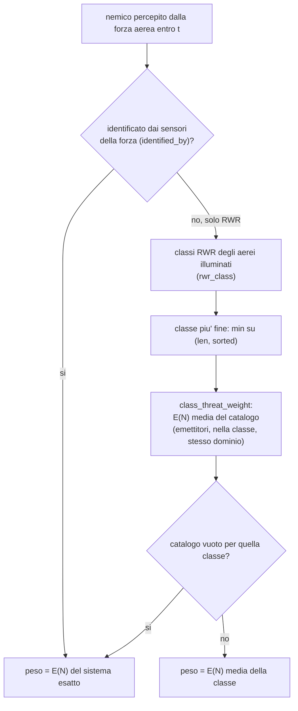
```mermaid
flowchart TD
    A["nemico percepito dalla forza aerea entro t"] --> B{"identificato dai sensori<br/>della forza (identified_by)?"}
    B -->|si| X["peso = E(N) del sistema esatto"]
    B -->|no, solo RWR| C["classi RWR degli aerei illuminati<br/>(rwr_class)"]
    C --> D["classe piu' fine: min su (len, sorted)"]
    D --> E["class_threat_weight:<br/>E(N) media del catalogo<br/>(emettitori, nella classe, stesso dominio)"]
    E --> F{"catalogo vuoto per quella classe?"}
    F -->|si| X
    F -->|no| Y["peso = E(N) media della classe"]
```

## 4.24 Difesa dai missili (A6): regole D, F, L1, L2, L3 (2026-09-28, commit `37ca477e`, `aedd7fa5`, `24a43d10`, `6f31333e`)

Documenti: `Analysis/Document/Proposta_Regole_Allocazione_SAM.md` (§7, approvata il 2026-09-28; le
decisioni Q1-Q6 sono al §7.7) e `Proposta_Dati_Anti_Missile.md`. Il difetto d'origine: un Strela-10
con 8 missili ne spendeva 8 sui Maverick in arrivo invece di tenerli per gli aerei, perché ogni asset
con un volume di difesa aerea intercettava ogni colpo intercettabile della forza, senza guardare né
da dove fosse partito né chi l'avesse lanciato (proposta §1, §7.2). Le regole dottrinali date
dall'utente (§7.1): (1) la difesa aerea dà la **massima priorità, di tempo e di numero di armi**,
all'aereo che ha lanciato un'arma aria-superficie, se è entro il suo raggio d'intercettazione; (2) sono
bersagli legittimi **solo** le armi autonome lanciate a distanza considerevole dalla zona, e solo se il
sistema che intercetta è in grado di colpirle.

### Regola D — capacità dichiarata, per arma (`Anti_Missile`)

Un asset intercetta munizioni solo con un'arma che dichiara il task `Anti_Missile` (Q6: un solo task
per missili, bombe plananti e droni). Un Strela-10 o uno Shilka restano armi antiaeree
(`air_defense_volume`, fuoco contro aerei) ma **non** sono intercettori.

- Dati: `Context.GROUND_WEAPON_TASK['Anti_Missile']` (`Context/Context.py:367-375`); task assegnato a
  6 armi terrestri (9M331 del Tor, 9M38 del Buk, 5V55R dell'S-300PS, 9M311 e 2A38M del Tunguska,
  Oerlikon-KDA-35mm del Gepard) e già presente su 12 armi navali (9 SAM e i 3 CIWS: Phalanx, AK-630,
  Type-730); Osa e Stinger restano esclusi (D-AM1, proposta §4).
- Codice: `Mobile.INTERCEPTOR_TASK = 'Anti_Missile'` (`Asset/Mobile.py:196`),
  `interceptor_weapons_from_registry` (`:1047-1117`, filtro: dati di quota, task `Anti_Air` **e**
  `Anti_Missile`) e `interceptor_capability()` (`:1119-1131`: `True`/`False`, o `None` se il registro
  non descrive armi del modello); `Military.salvo_interceptors` (`Block/Military.py:652-715`) include
  gli asset con capacità `True` e, per quelli con capacità `None` (stub, modelli ignoti), ricade sulla
  regola precedente (esiste una `ThreatAA`). I CIWS entrano come cannoni AD con scorta
  `impianti × rounds_per_mount` (D-AM2, §4.19).
- Esiti dei test cambiati dalla regola, dichiarati nella proposta dati §6: S13, il FARP con Shilka +
  Strela-10 non ha più intercettori; S11, difesa sostituita con Gepard + Tor per avere casi di scorta
  d'intercettazione; S1 con CAS, i Maverick non vengono più intercettati.

### Regola F — ordine di consumo

Dentro l'asset: prima i cannoni, poi i missili, a parità il nome del modello
(`Weapon_Stores.interceptor_order`, `:237-239`, già esistente, §4.19). **Fra** asset (nuova,
2026-09-28): prima gli intercettori a soli cannoni (scorta dedicata, si consuma per prima), poi gli
altri, a parità l'id (`Weapon_Stores.interceptor_rank`, `:242-249`). L'ordine è lo stesso in
`Military.salvo_interceptors` e in `_EngagementRun._interceptors_of` (`:1412-1431`), ed è parte del
contratto di riproducibilità.

### Regola L1 — idoneità del colpo (`_may_intercept`, `:2137-2160`)

Un colpo è intercettabile da un intercettore `i` solo se (a) la salva è intercettabile
(`ShotSpec.interceptable`), (b) `i` ha un'arma capace (regola D), (c) il **punto di lancio** della
salva è **fuori** dal volume d'intercettazione V_I di `i`. V_I è quello dichiarato da
`Mobile.air_defense_volume` (cilindro: raggio orizzontale e fascia di quota relativa), la stessa
definizione di "zona d'intercettazione" usata dal pianificatore di rotta (capitolo 7 §7.8);
`_interception_zone` (`:2117-2135`) lo legge in forma `(raggio, quota base, quota tetto)` relativa
all'intercettore. Le posizioni (lanciatore a `t_launch`, intercettore a `t_launch`) vengono dai tratti di
rotta o, in mancanza, dalla posizione ferma (`_position_at`, `:2102-2115`). Il **bordo conta come
dentro** (`horizontal <= radius and bottom <= height <= top`, `:2156`). Senza zona, o senza una delle
due posizioni, nessun vincolo (dato mancante = non modellato, come per scorte e carburante).
Decisioni Q1 (zona valutata sul V_I del **singolo** intercettore: un Tor lontano dal lanciatore
intercetta anche se il Buk della stessa forza ha il lanciatore a tiro) e Q2 (i colpi lanciati
dentro la zona **non si intercettano mai**: il lanciatore è un bersaglio, non si inseguono i suoi
colpi). L'allocazione per salva e il ruolo di tetto di `capacity` sono in §4.5.

### Regola L2 — priorità di bersaglio (`_schedule_next`, `:1716-1727`)

Nella scelta del bersaglio, i candidati che hanno **lanciato un'arma aria-superficie contro la forza
del tiratore** (`launchers_against`, `_is_launcher_against`, `:1855-1856`) e sono ingaggiabili a
portata al loro istante di tiro (`_in_range_at`, `:1858-1876`) formano il pool **prioritario**:
la scelta si fa solo fra loro, anche se non sono al primo istante utile (`:1740`), con la copertura di
sempre (`_engaged_shooters`: più lanciatori → il lavoro si ripartisce fra le difese; uno solo → tutti
su di lui). Non c'è un numero di colpi maggiorato: la salva è quella della `fire_control` (Q3).
Come per le altre regole, il lanciatore deve essere già un **candidato** del tiratore, cioè già
rilevato: il lancio non lo rivela da solo (Q5). I lanciatori prioritari sono esenti dalla saturazione
della dottrina di tiro (§4.25), non dal tetto.

### Regola L3 — prelazione e tempo di assegnazione (`_register_launcher`, `:1878-1923`; `_on_decide`, `:1925-1931`)

Quando un **aereo** lancia per la prima volta un'arma contro un bersaglio **non aereo** (`_on_launch`,
`:2074-2075`), `_register_launcher` lo inserisce in `launchers_against` della forza colpita. I
tiratori di quella forza che lo hanno fra i candidati e a portata, che non sono già impegnati su un
lanciatore né già in ridecisione, **rinunciano** al lancio programmato su un bersaglio non
prioritario (incrementando `launch_generation`, il contatore di annullamento già usato da
`_on_launch`, `:2012-2015`: R4 resta rispettata, un evento si annulla, non si riscrive) e
**ridecidono dopo il proprio `refire_interval`** (VAL + COM + ATT del profilo di reazione,
`t_decide = time + refire_interval`, `:1907`): è il "tempo di valutazione e assegnazione" richiesto
dall'utente alla decisione Q3, senza costanti nuove. La ridecisione è un evento `_DECIDE`, ultimo a
parità d'istante (§4.11), preso **alla fine** di quel tempo con i lanciatori noti allora: nella prima
stesura si ridecideva subito e due lanciatori simultanei finivano entrambi sotto il fuoco delle
stesse difese invece di essere ripartiti (proposta §7.10).

### Verifica: lo scenario S19AD

`Test/Test_Session_Scenarios_S19_Air_Defence.py` (commit `aedd7fa5`, capitolo 8 §8.6): 3 BMP-2 con una
difesa a corto raggio, 1-4 A-10C con i soli AGM-65D, dottrina ad oltranza. Esiti qualitativi
(proposta §7.8): Strela-10 in sorvolo, 0 intercettazioni, lo Strela spara i propri missili sugli
A-10C; Strela-10 in standoff, 0 intercettazioni e 0 lanci (conserva gli 8 missili); Tor arretrato
(lanci a 15-19 km, fuori dai 12 km della zona) intercetta; Tor avanzato (lanci a ~9,5 km, dentro)
spara ai lanciatori senza intercettare. La proposta registra una **scoperta**: nell'ultimo caso il
motore rispetta la regola per tempistica, non per costruzione (il lanciatore entra nei 12 km prima
che i suoi Maverick arrivino); il caso che solo L1 distingue (intercettore con scorta in avanzo e
lancio da dentro) è coperto da test unitari a geometria controllata
(`Test_Engagement_Resolver.TestLauncherInsideInterceptionZone`).

**Limite**: il legame C2 fra le unità non è modellato: una batteria integrata assegna più in
fretta di unità indipendenti, qui ogni tiratore usa il proprio profilo di reazione (da riprendere
con la Fase 0 della gerarchia C2).

*Diagramma D24 — allocazione delle intercettazioni per salva: ordine F, regola L1 e regola R-INT (§4.5, §4.24).*

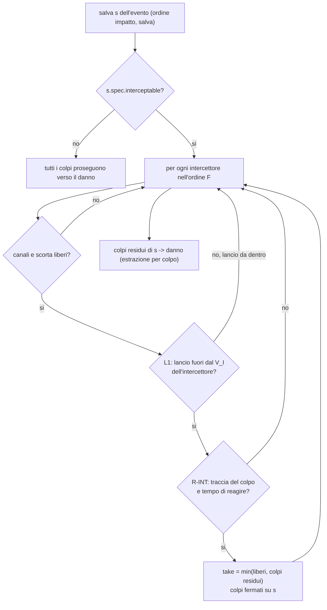
```mermaid
flowchart TD
    S["salva s dell'evento (ordine impatto, salva)"] --> I{"s.spec.interceptable?"}
    I -->|no| W["tutti i colpi proseguono verso il danno"]
    I -->|si| L["per ogni intercettore nell'ordine F"]
    L --> F{"canali e scorta liberi?"}
    F -->|no| L
    F -->|si| G{"L1: lancio fuori dal V_I<br/>dell'intercettore?"}
    G -->|no, lancio da dentro| L
    G -->|si| T{"R-INT: traccia del colpo<br/>e tempo di reagire?"}
    T -->|no| L
    T -->|si| K["take = min(liberi, colpi residui)<br/>colpi fermati su s"]
    K --> L
    L --> R["colpi residui di s -> danno (estrazione per colpo)"]
```

*Diagramma D25 — priorità ai lanciatori: prelazione L3 e ridecisione `_DECIDE` (§4.24).*

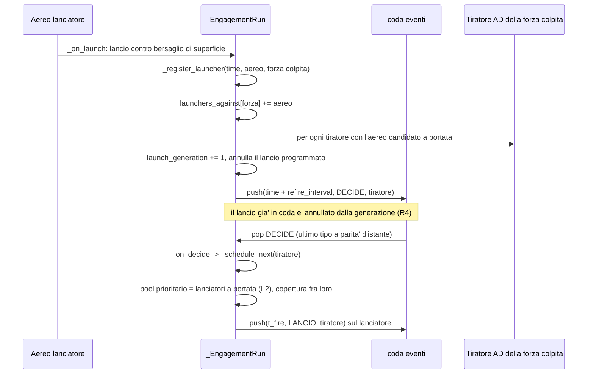
```mermaid
sequenceDiagram
    participant A as Aereo lanciatore
    participant R as _EngagementRun
    participant Q as coda eventi
    participant D as Tiratore AD della forza colpita

    A->>R: _on_launch: lancio contro bersaglio di superficie
    R->>R: _register_launcher(time, aereo, forza colpita)
    R->>R: launchers_against[forza] += aereo
    R->>D: per ogni tiratore con l'aereo candidato a portata
    R->>R: launch_generation += 1, annulla il lancio programmato
    R->>Q: push(time + refire_interval, DECIDE, tiratore)
    Note over R,Q: il lancio gia' in coda e' annullato dalla generazione (R4)
    Q->>R: pop DECIDE (ultimo tipo a parita' d'istante)
    R->>R: _on_decide -> _schedule_next(tiratore)
    R->>R: pool prioritario = lanciatori a portata (L2), copertura fra loro
    R->>Q: push(t_fire, LANCIO, tiratore) sul lanciatore
```

## 4.25 Dottrina di tiro contro l'overkill (O1-O6, 2026-09-29, commit `22cbe91e`)

Documento: `Analysis/Document/Proposta_Overkill_Tiro.md` (approvata il 2026-09-29). Il problema,
misurato dalla proposta (§1): un tiratore continuava a lanciare sullo stesso bersaglio a ogni
`refire_interval` anche con salve già in volo verso di esso, e tiratori diversi della stessa forza
si sommavano sullo stesso bersaglio: nelle varianti di S19 il 23-44% delle salve arrivava su un
bersaglio **già distrutto** (Tor avanzato: 24 salve su 54).

Due regole, **di lato**, in `Context/Doctrine.py:315-397` (`DEFAULT_FIRE_DOCTRINE`, `:341-345`;
validazione `validate_fire_doctrine`, `:348-383`; lettura `get_fire_doctrine`, `:386-397`):

| Chiave | Default | Significato |
|---|---|---|
| `kill_probability_threshold` | 0.9 (O3, decisione dell'utente) | un bersaglio è **saturo** per una forza quando la probabilità che le salve già dirette contro di esso dalla forza lo distruggano raggiunge la soglia: nessun tiratore della forza gli aggiunge salve |
| `max_rounds_in_flight` | 2 ("due missili, poi guarda": la dottrina reale `shoot-shoot-look` dei SAM, decisione dell'utente) | un tiratore non lancia su un bersaglio finché ha già in volo verso di esso almeno questo numero di colpi |

Un lato assente dalla tabella, o una chiave `None`, non ha la regola (comportamento precedente al
2026-09-29); `fire_doctrine={}` la disattiva per tutti.

### Come agisce (`_schedule_next`, `:1723-1733`)

1. **Bersagli bloccati** (`_blocked`, `:1818-1831`): il tiratore esclude dal pool i bersagli su cui
   ha già `max_rounds_in_flight` colpi in volo (`_rounds_in_flight`, `:1814-1816`: solo salve **già
   partite** dello stesso tiratore sullo stesso bersaglio, non quelle schedulate) e quelli saturi per
   la sua forza.
2. **Saturazione** (`_coverage`, `:1801-1812`): `P_cov = 1 − Π_s (1 − accuracy_s × destroy_capacity_s)^{colpi_s}`
   sulle salve della forza dirette al bersaglio, **in volo o schedulate e non ancora lanciate**
   (`_force_shots_on`, `:1783-1799`; un lancio schedulato il cui istante è già passato senza
   esecuzione non conta). `accuracy × destroy_capacity` è la probabilità di esito KILL del modello di
   danno per colpo, colpi indipendenti; le **intercettazioni possibili sono ignorate** (O5: stima
   ottimistica, il bersaglio torna scoperto al primo impatto fallito). I lanciatori prioritari (L2) sono
   **esenti dalla saturazione** (O4), non dal tetto.
3. **Attesa** (`_wait`, `:1833-1853`): se tutti i bersagli del pool sono bloccati, il tiratore aspetta il
   primo impatto previsto su uno di essi (più `salvo_window`) e ridecide con un evento `_DECIDE`;
   l'attesa non accorcia mai il ciclo di tiro (`max(primo impatto, t_earliest, now)`). Se non c'è
   nessun impatto da aspettare (caso non atteso) il tiratore procede senza il filtro, per non fermarsi
   per sempre.
4. Poi la regola di sempre (§4.4): primo istante utile, copertura, ordine di rilevamento.

Una salva non si spezza: con 0 colpi in volo parte intera anche se ne ha più del tetto (2 Maverick in
una salva, poi si guarda). La scelta resta deterministica (dipende solo dallo stato della coda) e non
introduce estrazioni.

### Esiti misurati (proposta §8, salve sprecate su bersagli già distrutti)

| Scenario | Prima: salve / sprecate | Dopo: salve / sprecate |
|---|---|---|
| S19 Tor avanzato | 54 / 24 | 32 / 0 |
| S19 Strela sorvolo | 72 / 32 | 25 / 0 |
| S19 Tor arretrato | 48 / 11 | 48 / 0 |
| S1 con CAS | 27 / 0 | 27 / 0 |

Effetti sui test dichiarati dalla proposta: in `TestDisengagementErosion` le uccisioni passano da
`t = 2, 4, 6` a `t = 2, 3, 4` (prima il lancio a `t = 3` era deciso contro un bersaglio già
condannato, poi annullato, e si perdeva un ciclo di tiro); in S19 variante Strela gli aerei attaccano
solo i BMP-2 perché il test verifichi ancora il caso d'origine (lo Strela conserva i missili).

*Diagramma D26 — dottrina di tiro in `_schedule_next`: bersagli bloccati, attesa, round-robin (§4.25).*

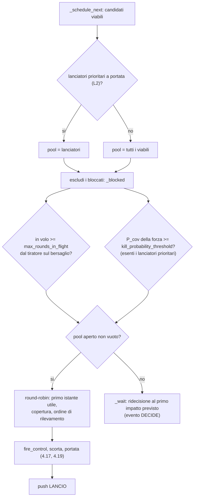
```mermaid
flowchart TD
    A["_schedule_next: candidati viabili"] --> P{"lanciatori prioritari a portata (L2)?"}
    P -->|si| PP["pool = lanciatori"]
    P -->|no| VV["pool = tutti i viabili"]
    PP --> B["escludi i bloccati: _blocked"]
    VV --> B
    B --> B1{"in volo >= max_rounds_in_flight<br/>dal tiratore sul bersaglio?"}
    B --> B2{"P_cov della forza >= kill_probability_threshold?<br/>(esenti i lanciatori prioritari)"}
    B1 --> O{"pool aperto non vuoto?"}
    B2 --> O
    O -->|si| RR["round-robin: primo istante utile,<br/>copertura, ordine di rilevamento"]
    O -->|no| WT["_wait: ridecisione al primo impatto previsto<br/>(evento DECIDE)"]
    RR --> FC["fire_control, scorta, portata (4.17, 4.19)"]
    FC --> PU["push LANCIO"]
```

## 4.26 Intercettazione con traccia del colpo e tempo di reazione: regola R-INT (2026-09-30, commit `a500fdf3`)

Documento: `Analysis/Document/Proposta_Intercettazione_Reazione.md` (decisioni Q1-Q3 dell'utente,
2026-09-30). Il difetto (§5.4 della proposta SAM): con la sola regola L1 un intercettore fermava un
colpo purché operativo, con canali e scorta e con il lancio fuori dalla sua zona, **senza** che avesse
rilevato né il colpo né il lanciatore e senza il tempo di reagire. Un Tor che non aveva ancora
finito il proprio ciclo RIV+VAL+COM+ATT sul lanciatore (5-8 s) fermava comunque un Maverick in
arrivo; con `time_of_flight = 0` si intercettava un colpo che non aveva mai volato.

### La regola (`_in_time`, `:2225-2249`)

Un intercettore `I` può fermare i colpi della salva `S` (lanciata a `t_L`, impatto a `t_I`) solo se,
**oltre a L1**: `t_traccia(I, S) + tau(I, S) <= t_I`.

| Caso | `t_traccia` | `tau` |
|---|---|---|
| **Lancio osservato**: `I` aveva già rilevato il lanciatore a `t_L` (una `Detection` di `I` sul lanciatore con `time <= t_L`, `_detection_time_of`, `:2162-2168`) | `t_L` | `refire_interval` (VAL+COM+ATT) del profilo di reazione di `I` |
| **Colpo scoperto dalla geometria** (lancio non osservato) | primo istante in cui il colpo entra nel raggio di rilevamento aereo di `I` (`_round_track_time`, `:2187-2223`) | `total` (RIV+VAL+COM+ATT) |

Il rilevamento geometrico è **deterministico** (decisione Q2): nessuna estrazione, il flusso RNG non
cambia. Il colpo vola in linea retta a velocità costante dal punto di lancio (posizione del
lanciatore a `t_L`) alla posizione del bersaglio a `t_I`; l'intercettore è fermo nella posizione di
`t_L`; la soluzione è analitica (equazione di secondo grado dell'ingresso del segmento nella sfera
di raggio `detection_range('air')`, `_air_detection_range`, `:2170-2185`). Se il colpo non entra mai
nel raggio, `I` non lo vede e non può fermarlo (`None`). Dato mancante (raggio o posizioni non noti) e
lancio non osservato: `t_traccia = t_L`, `tau = total`. Il vincolo di tempo è **sempre** attivo: un
colpo con tempo di volo nullo non si intercetta mai. Il risultato è memoizzato per
`(intercettore, salva)` (`in_time_cache`, `:1252`). Un intercettore che non soddisfa R-INT è saltato
come uno escluso da L1: il colpo passa al successivo nell'ordine F (§4.24).

### Semplificazioni dichiarate (proposta §4)

1. **Tempo di volo dell'intercettore trascurato**: il vincolo è sull'istante di lancio
   dell'intercettore, non sul punto d'incontro (richiederebbe la `fire_control` dell'intercettore
   contro un colpo, che non esiste). Ottimistico per la difesa.
2. **RCS del colpo non modellata**: il colpo è visto alla portata aerea dell'intercettore come un
   aereo. Ottimistico per la difesa.
3. **Traiettoria rettilinea a velocità costante**: nessun profilo di volo né pop-up.
4. **Rilevamento per asset, non per forza**: la traccia del lanciatore ottenuta da un altro asset
   della stessa forza non basta (nessun collegamento dati, Fase 0 C2 non fatta).

Misura della proposta (§8, S19 su 16 seed, con e senza la regola): esiti **identici**; il Tor ha in
traccia gli A-10C molto prima dei lanci (radar di 25 km) e reagisce in pochi secondi contro circa 20 s di
volo del Maverick. La regola incide sui lanci non osservati, sui colpi fuori dalla copertura radar e
sui tempi di volo brevi. I 19 test del risolutore che intercettavano con tempo di volo nullo
usano ora `REACTION_TOF = 20 s` (proposta §8).

*Diagramma D27 — regola R-INT: traccia del colpo e tempo di reazione (§4.26).*

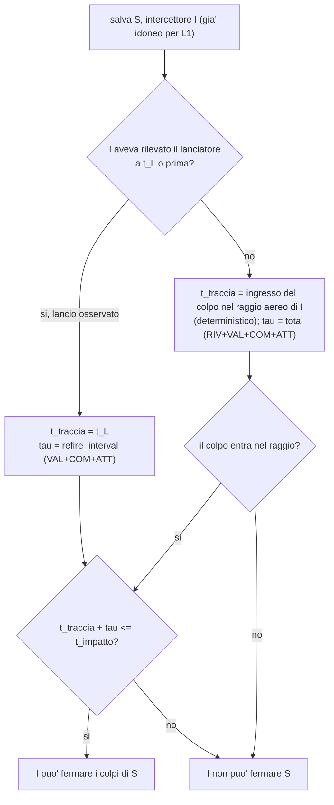
```mermaid
flowchart TD
    A["salva S, intercettore I (gia' idoneo per L1)"] --> B{"I aveva rilevato il lanciatore<br/>a t_L o prima?"}
    B -->|si, lancio osservato| C["t_traccia = t_L<br/>tau = refire_interval (VAL+COM+ATT)"]
    B -->|no| D["t_traccia = ingresso del colpo nel raggio aereo di I<br/>(deterministico); tau = total (RIV+VAL+COM+ATT)"]
    D --> E{"il colpo entra nel raggio?"}
    E -->|no| N["I non puo' fermare S"]
    E -->|si| F
    C --> F{"t_traccia + tau <= t_impatto?"}
    F -->|si| Y["I puo' fermare i colpi di S"]
    F -->|no| N
```
