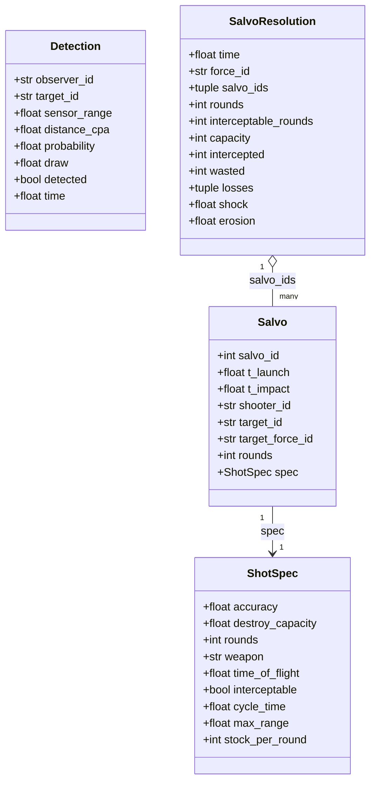
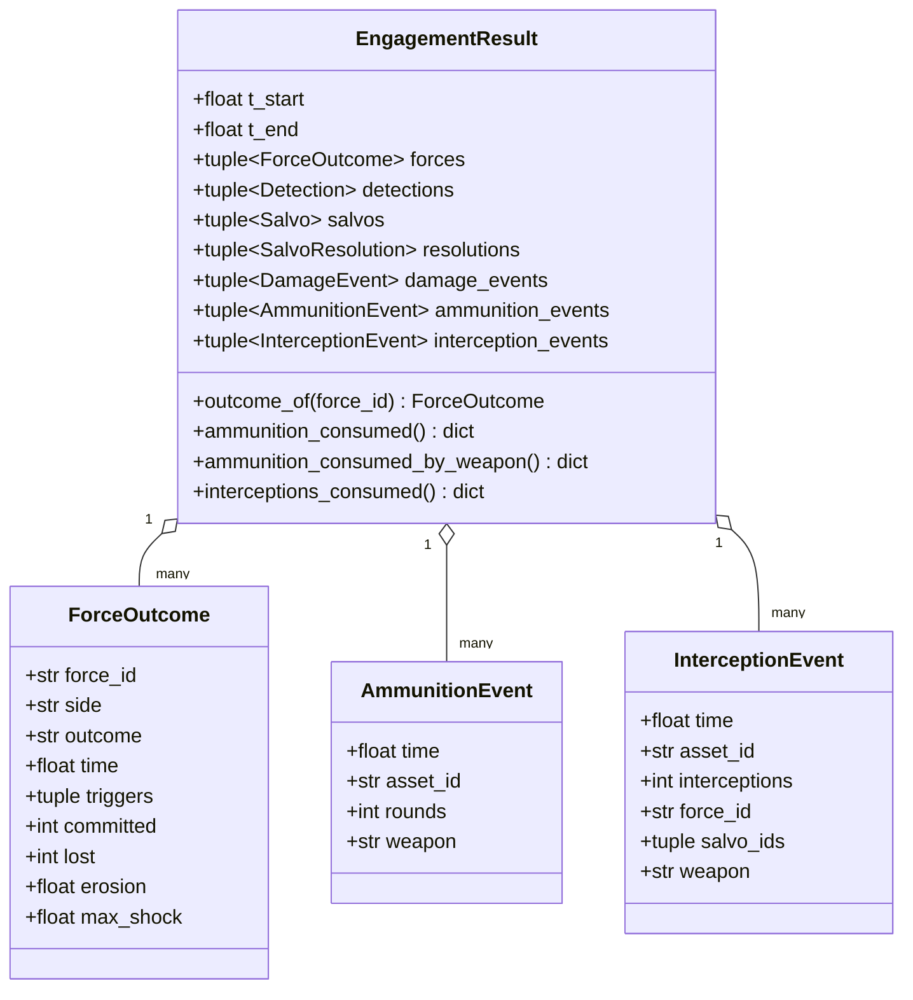
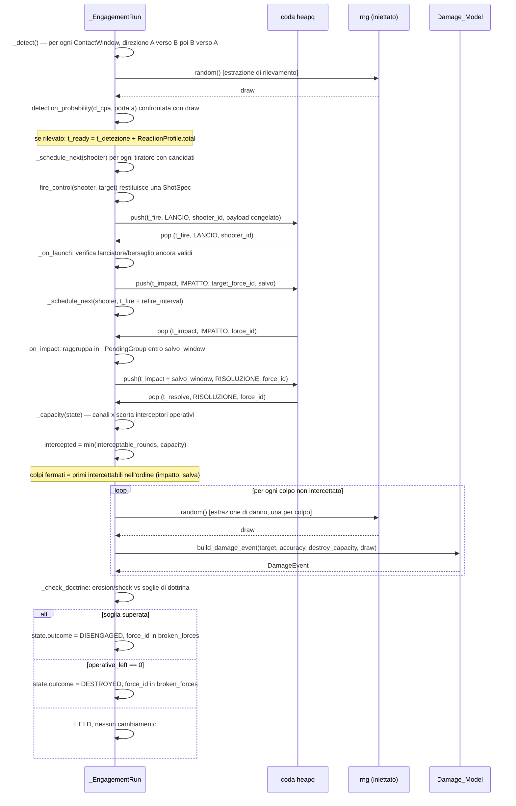
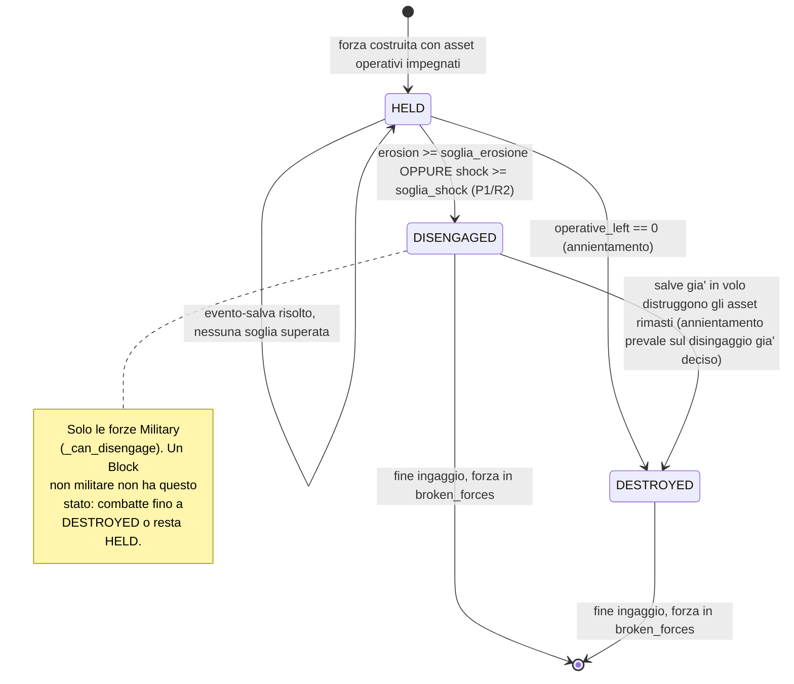
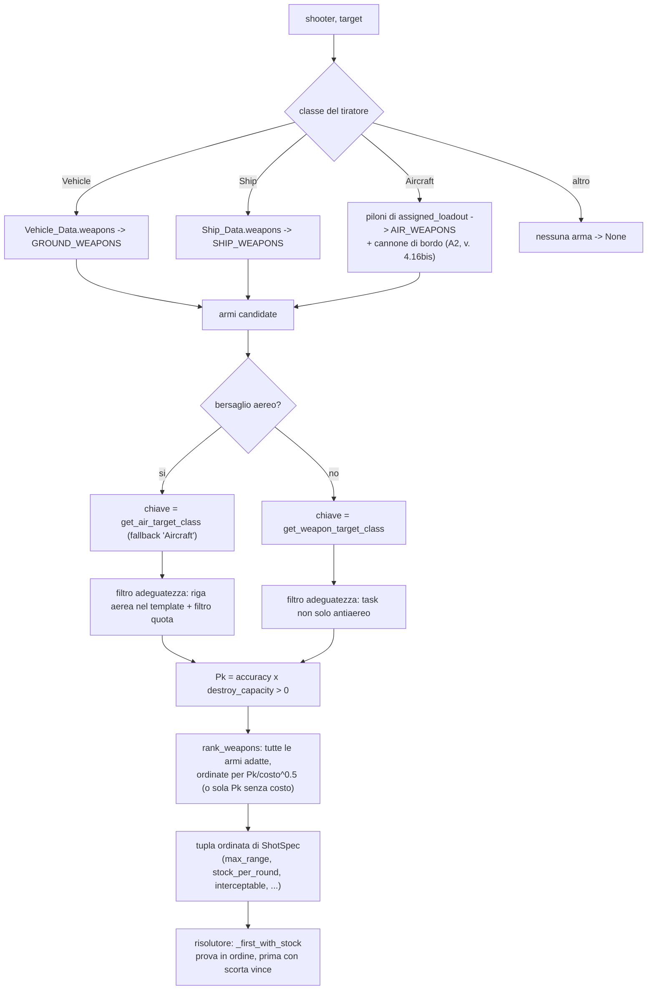
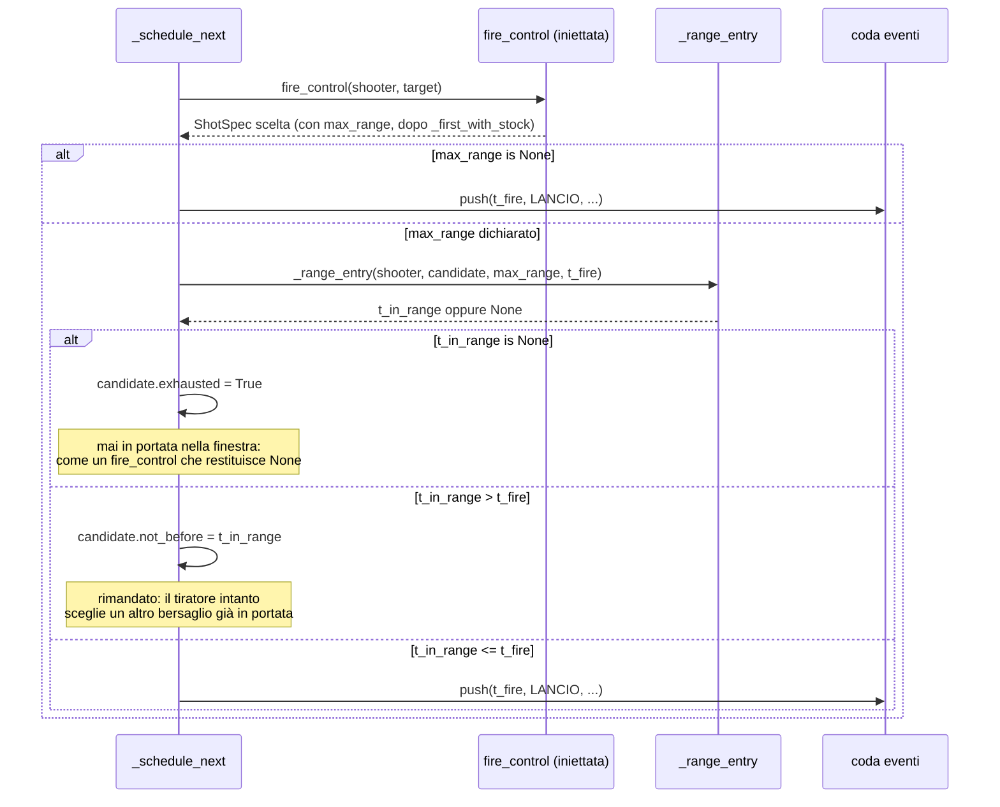
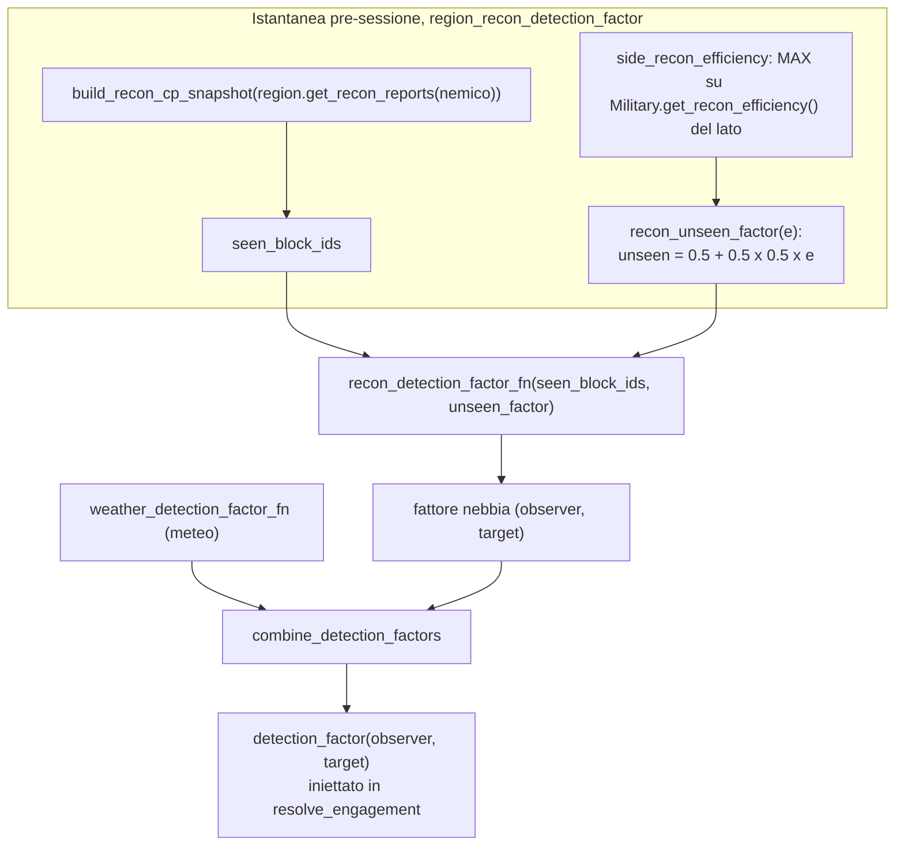
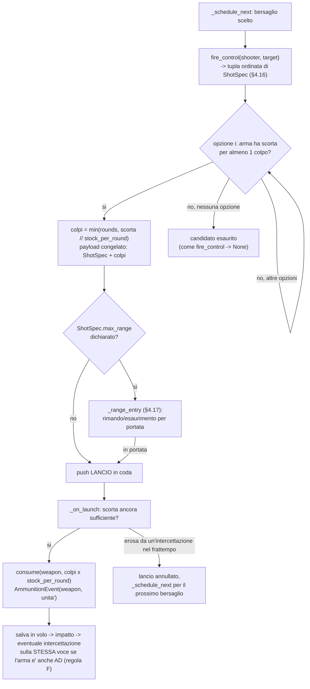

# Capitolo 4 — Lo strato 2: il risolutore d'ingaggio

Modulo: `Logic/Engagement_Resolver.py`. È il modulo più esteso del motore (2063 righe) e il primo
punto in cui entra la casualità, sempre e solo attraverso l'RNG di sessione passato dal
chiamante (`Logic/Engagement_Resolver.py:9-10`). Il capitolo copre anche `Logic/Fire_Control.py`
(§4.16-4.17, §4.16bis, §4.20), un modulo satellite che **non modifica** il contratto del
risolutore: fornisce una `fire_control` reale, dai registri d'arma, da iniettare al posto di una
tabella di test, con il cannone di bordo come arma candidata (§4.16bis, decisione A2, 2026-09-26,
commit `8bd69727`) e, per le bombe, gittata e tempo di caduta da una balistica reale invece di
valori di ripiego (§4.20, decisione B6, 2026-09-27, commit `6754bf1c`) — la nebbia di guerra
(§4.18), due costruttori del fattore `detection_factor` già previsto dal contratto del capitolo
4.2 — e la **scorta per modello d'arma** (§4.19, `Asset/Weapon_Stores.py`, decisione utente
2026-09-26, commit `1d0c1127`), che ha sostituito il contatore aggregato per asset come stato
primario delle munizioni: §4.4, §4.5 e §4.10 sono stati aggiornati di conseguenza rispetto alla
stesura iniziale di questo manuale.

## 4.1 La catena, per ogni ingaggio

Per due o più forze in contatto, la catena è (`:12-58`):

1. **Pd — chi rileva davvero** (§4.2). Un'estrazione contro `detection_probability(d_cpa,
   portata)` decide sia *se* sia *a che distanza* avviene il rilevamento, e quindi *quando*.
2. **Latenza di reazione — chi spara per primo** (§4.3). Dal rilevamento al primo lancio passa
   `ReactionProfile.total`; le salve successive sono separate da `refire_interval`.
3. **Dottrina di fuoco / ROE — se e con cosa si spara** (§4.4). `fire_control(shooter, target)`,
   iniettata, restituisce una `ShotSpec` o `None` (non ingaggia).
4. **Salva e saturazione — modello di Hughes** (§4.5). I colpi che arrivano su una forza nello
   stesso evento-salva sono prima confrontati con `Military.salvo_interceptors`: i primi N
   intercettabili sono fermati, il surplus raggiunge integralmente il modello di danno.
5. **Danno per singolo colpo** (§4.6). Ogni colpo superstite passa da
   `Damage_Model.build_damage_event`, con un `draw` estratto qui dall'RNG iniettato.
6. **Disingaggio — P1 + R2** (§4.7). Dopo ogni evento-salva la forza colpita confronta le proprie
   perdite con la dottrina di lato: erosione cumulata *oppure* shock della singola salva.

## 4.2 Percezione: la legge di Pd

`detection_probability(distance, sensor_range, factor=1.0)` (`:460-487`):

```
Pd(d) = factor * (1 - (1 - PD_AT_ACQUISITION_RANGE) * (d / R)^4)    per d <= R
Pd(d) = 0                                                            per d > R
```

**STIMA DICHIARATA di forma** (`:466-469`): 1 a distanza nulla, `PD_AT_ACQUISITION_RANGE = 0.5`
sul bordo della portata dichiarata dal registro (la più prudente delle due convenzioni con cui si
dichiara la portata di un radar — Pd 0.5 o 0.9 a quella distanza —, da ricalibrare,
`:162-165`), decrescente con la quarta potenza della distanza (`PD_RANGE_EXPONENT = 4`, la
dipendenza R⁴ dell'equazione radar, SNR ∝ 1/R⁴; la curva Pd(SNR) reale di Swerling è sigmoide,
questa legge ne è una semplificazione monotona, `:167-170`). `factor` in [0, 1] è la degradazione
(meteo, notte, disturbo) applicata dal chiamante, v. capitolo 7, §7.4.

`detection_radius(draw, sensor_range, factor=1.0)` (`:490-519`) è l'**inversa**: il rilevamento
avviene quando `draw < Pd(d)`, cioè quando il bersaglio entra nel raggio restituito. Così **una
sola** estrazione decide sia se il sensore rileva sia quando, senza campionare la finestra nel
tempo (`:490-497`).

L'istante esatto del rilevamento (`_detection_time`, `:925-951`) usa i `Leg` di entrambe le
rotte se disponibili (primo istante in cui la distanza scende sotto il raggio estratto, via
`Contact_Scheduler.range_intervals`, esatto); senza, ricade sull'istante geometrico della
finestra (`t_start` se la propria portata è la maggiore, `t_mutual_start` altrimenti, ultimo
ripiego `t_cpa`).

## 4.3 Latenze di reazione

Il risolutore consuma `ReactionProfile.total` (rilevamento → primo lancio) e
`ReactionProfile.refire_interval` (fra una salva e la successiva contro un bersaglio già in
traccia) da `Context/Reaction_Profile.py`, v. capitolo 7, §7.3, per il dettaglio dei valori e
della loro provenienza.

## 4.4 Dottrina di fuoco: `fire_control` e `ShotSpec`

`fire_control(shooter, target) -> ShotSpec | Sequence[ShotSpec] | None` è **iniettata dal
chiamante**, non implementata dal risolutore (`Logic/Engagement_Resolver.py:24-28`). Dal
2026-09-26 (decisione A1, v. §4.19) il contratto accetta anche una **sequenza** di `ShotSpec`, in
ordine di preferenza: il risolutore prova le opzioni nell'ordine dato e sceglie la prima la cui
arma ha ancora scorta (`_first_with_stock`, `:1578-1595`, v. §4.19); una `ShotSpec` singola resta
un valore valido (sequenza di un elemento), quindi una `fire_control` scritta prima di questa
data non cambia comportamento. `ShotSpec` (`:294-355`) trasporta:

| Campo | Significato |
|---|---|
| `accuracy` | Ph — probabilità di colpo a segno, [0,1], dal registro d'arma. |
| `destroy_capacity` | Pk\|h — probabilità di distruzione dato il colpo, [0,1]. |
| `rounds` | Colpi lanciati per salva (≥1). |
| `weapon` | Modello d'arma di dominio, per tracciabilità e per la scorta per arma (v. §4.19). |
| `time_of_flight` | Secondi fra lancio e impatto (≥0). |
| `interceptable` | `True` se i colpi possono essere intercettati (missili, bombe guidate); `False` per proiettili d'artiglieria/carro. |
| `cycle_time` | Intervallo fra due salve del tiratore; `None` = `refire_interval` del profilo di reazione. |
| `max_range` | Portata massima dell'arma [m] (distanza 3D tiratore-bersaglio); `None` = nessun vincolo di portata (comportamento precedente al 2026-09-24, v. §4.17). |
| `stock_per_round` | Unità di scorta consumate da UN colpo della salva (decisione A3, 2026-09-26, v. §4.19): 1 per missili/bombe/proietti singoli, i colpi di una raffica per le armi a tiro rapido (il cui "colpo" è una raffica, v. §4.16). |

**Cosa il risolutore non fa da sé (ancora)** (`:181-204`): non seleziona l'arma dai registri —
`fire_control` resta sempre **iniettata**, il contratto non è cambiato; una fire control che la
seleziona dai registri esiste come modulo satellite (`Logic/Fire_Control.py`, §4.16) e la
modulazione della Pk con la posizione nell'inviluppo resta da fare; non conta le munizioni da sé —
la scorta per arma la legge dallo stato ombra (`_Shadow`, §4.10/§4.19), non dalla `fire_control`,
il cui ordine di preferenza non dipende dalla scorta residua né dal tipo di missione (filtro ROE
per missione/bersaglio rimandato, v. capitolo 9 §9.1: manca l'entità `Mission`); non applica il
meteo né la nebbia di guerra da sé (`detection_factor` è iniettato, entrambi disponibili come
fabbriche di quello stesso fattore, §4.18); ripartisce il fuoco fra i tiratori di una forza solo
con una regola greedy locale (round-robin, `_schedule_next`, `:1434-1557`), non con
un'assegnazione ottima.

## 4.5 Salva e saturazione — modello di Hughes

Ogni evento-salva (`SalvoResolution`, prodotto da `_on_resolve`, `:1715-1806`) confronta i colpi
**intercettabili** in arrivo con la capacità di intercettazione disponibile in quell'istante
(`_capacity`, `:1702-1714`, stessa formula di `Military.salvo_interception_capacity`, v. capitolo
7, §7.5):

```
capacity = Σ_i min(canali_i, scorta_i)     sugli interceptori operativi della forza
intercepted = min(interceptable_rounds, capacity)
```

Ogni intercettazione consuma la scorta di **intercettori** dell'asset che intercetta
(`Mobile.interceptor_stock`), un contatore **distinto per scopo** dalle munizioni offensive
(`Mobile.ammunition`) — due tipi di evento diversi, `InterceptionEvent` mai un `AmmunitionEvent`
(`:426-479`) — ma dal 2026-09-26 (decisione A1, v. §4.19) **la stessa voce di scorta per arma**
quando l'asset ha armi AD modellate per arma (`Mobile.stores`/`Asset/Weapon_Stores.py`): un
missile antiaereo che intercetta e uno sparato offensivamente sono lo stesso oggetto fisico, e
scalano la stessa voce del dizionario `{modello_arma: quantità}`. La vecchia regola del "SAM
puro" (`Mobile.interceptor_shares_ammunition`, che condivideva un intero pool solo per gli asset a
missile-solo) è stata **eliminata**: non serve più un caso speciale, la condivisione è per
costruzione su qualunque asset con scorta per arma (v. §4.19 per il dettaglio e per l'ordine di
consumo, regola F: prima i cannoni, poi i missili).

I colpi fermati sono i **primi intercettabili nell'ordine (impatto, salva)**, indipendentemente
da chi li ferma (`:1762`): il modello non assegna intercettori a salve specifiche, confronta la
capacità totale con i colpi intercettabili dell'intero evento.

Il **raggruppamento in evento-salva** avviene in `_on_impact` (`:1692-1701`): impatti entro
`salvo_window` secondi da un impatto già in coda per la stessa forza finiscono nello stesso
`_PendingGroup`; default `salvo_window=0.0` (solo impatti simultanei — la scelta più
conservativa, un punto aperto di modello da decidere con la taratura, `:1899, 1932-1934`).

## 4.6 Danno per singolo colpo

Ogni colpo non intercettato passa da `Damage_Model.build_damage_event` con un `draw` estratto qui
(`:1785-1786`). Nessuna reimplementazione del contratto del danno — dettaglio in capitolo 5, §5.1.
Un colpo che arriva su un bersaglio già distrutto (payload congelato, salva già partita) non
genera un'estrazione: viene contato come `wasted` (`:1774-1782`).

## 4.7 Disingaggio: soglie P1 + R2

`_check_doctrine(time, state, shock, erosion, operative_left)` (`:1807-1847`) confronta le
perdite della forza intera con `Context/Doctrine.get_disengagement_thresholds(side, thresholds)`
(dettaglio dei valori in capitolo 7, §7.2), dopo **ogni** evento-salva:

- `erosion` = frazione **cumulata** dell'organico impegnato non più operativo;
- `shock` = frazione persa nella **singola salva** appena risolta;
- qualunque delle due superi la propria soglia, l'esito è `DISENGAGED`; se invece
  `operative_left == 0` l'esito è `DESTROYED` (annientamento, che prevale su un disingaggio già
  deciso nello stesso istante — la forza è stata distrutta mentre rompeva il contatto, da salve
  già in volo).

**Solo le forze militari possono disingaggiarsi** (`_can_disengage`, `:1069-1080`, decisione di
progetto 2026-09-23): un `Block` non-`Military` (Transport, Storage, Urban, Production, o un
`Block` generico con `category` 'Logistic'/'Civilian') non può fisicamente rompere il contatto e
ripiegare — riceve `thresholds=None` incondizionatamente, senza il warning di dottrina mancante
(non manca nulla: è una scelta di modello, non un dato assente). Un oggetto che non è affatto un
`Block` (stub duck-typed nei test, adapter futuri) resta trattato come forza combattente. Il
controllo è sulla gerarchia di classe (`validate_class`), non su un campo testuale come
`category` (`:49-59`).

## 4.8 Ingaggi a N forze (2+) e forze rotte

`resolve_engagement(force_a, force_b, ..., extra_forces=(...))` risolve, in **una** run con
**una** coda eventi condivisa, tutte le forze `(force_a, force_b, *extra_forces)`, trattate in
modo uniforme (`:112-119`). Chi combatte contro chi lo dicono solo le finestre di contatto
passate; il lato serve solo a leggere la dottrina, e più forze possono condividerlo.

Perché serve (`:120-127`): se la forza X è in contatto con A e con B in finestre sovrapposte,
risolvendo (X,A) e (X,B) con due chiamate separate l'ordine delle chiamate deciderebbe chi
"arriva prima" a salute e scorte di X. In una sola run la salute e le scorte ombra di X evolvono
in un'unica timeline, consumata da entrambi i fronti nell'ordine esatto degli eventi. Con
`extra_forces=()` il comportamento è identico all'ingaggio a due.

Una forza che raggiunge `DESTROYED` o `DISENGAGED` entra in `broken_forces: set`
(**per-forza, non un flag globale** della run, `:134-149`, campo a `:1161`): da quel momento
nessun suo tiratore riceve un nuovo lancio (i lanci schedulati e non ancora eseguiti sono
annullati); nessun tiratore di altre forze può più sceglierla come bersaglio (un bersaglio
disingaggiato è vivo ma "andato via" — un lancio già schedulato contro di essa è annullato e il
tiratore decide di nuovo); le salve **già partite**, da o verso di essa, arrivano comunque
(payload congelato, R4).

## 4.9 Congelamento del payload (R4, prima parte)

Il bersaglio, la `ShotSpec` e il numero di colpi sono fissati quando il lancio viene schedulato
e, una volta che la salva è partita, nessun evento successivo li modifica — nemmeno la
distruzione del lanciatore dopo il lancio: una salva in volo arriva comunque
(`:153-159`). Prima del lancio un evento programmato può solo essere **annullato** (lanciatore
fuori combattimento, bersaglio già fuori combattimento o uscito dalla finestra, scorte
insufficienti, contatto rotto), mai *riscritto*: la decisione successiva è un nuovo evento con un
nuovo payload.

**Re-scheduling delle finestre NON implementato (R4, seconda parte, rimandato)**: una forza che
si disingaggia è solo *segnalata* nell'esito; il nuovo instradamento e il ricalcolo delle
finestre di contatto spettano a un livello superiore (C2/campagna), non ancora costruito
(`:160-162`). V. la nota di divergenza col testo originale della decisione wiki nel capitolo 10.

## 4.10 Stato ombra: `_Shadow`

Il risolutore **non muta gli asset**: lavora su una copia di lavoro (`_Shadow`, `:946-1021`) —
salute e scorte evolvono lì, non sull'asset — e restituisce gli eventi in un `EngagementResult`
immutabile. Applicarli è un passo separato ed esplicito, `apply_engagement_result`
(capitolo 5, §5.3): è la stessa separazione calcolo/applicazione già scelta da `Damage_Model`.
`_Shadow` espone `id` e `health` perché `Damage_Model.build_damage_event` la tratti come un asset
per duck typing (`:949-950`).

Dal 2026-09-26 (decisione A1, v. §4.19) `_Shadow` porta anche una **copia** della scorta per
modello d'arma dell'asset reale (`stores: Optional[Dict[str, int]]`, `:964-977`), con lo stesso
schema di `Mobile`: il pool anonimo `anonymous` (usato solo quando `stores` è `None`, per gli
stub duck-typed senza scorta per arma), le armi non modellate `unmodelled` (mitragliatrici/CIWS
contate a unità nei registri, senza vincolo), le armi AD `interceptor_weapons` su cui
`interceptor_stock` è una **vista** (`:996-997`), e il pool anonimo di intercettori
`anonymous_interceptors`, usato solo quando la vista non è attiva. La contabilità è quella
**condivisa** con l'asset reale, `Asset/Weapon_Stores.py` (v. §4.19): così `apply_engagement_result`
ritrova sull'asset esattamente i consumi che l'ombra ha concesso, per costruzione, senza una
seconda implementazione che potrebbe divergere. Prima di questa data la condivisione fra scorta
offensiva e scorta di intercettori esisteva solo per il caso speciale del "SAM puro"
(`interceptor_stock` come *vista* diretta di `ammunition`, un solo pool per l'intero asset); ora è
per arma, per ogni asset che ha armi AD modellate.

## 4.11 Ordine delle estrazioni RNG (parte del contratto)

(`:170-175`) Prima **tutte** le estrazioni di rilevamento, nell'ordine canonico delle finestre
`(t_start, id_a, id_b, t_end)` e per ognuna la direzione a→b poi b→a; poi un'estrazione per colpo
non intercettato, nell'ordine degli eventi. La coda eventi ha tie-break deterministico
`(t, tipo, id, sequenza)`, con i tipi nell'ordine `LANCIO(0) < IMPATTO(1) < RISOLUZIONE(2)`: a
parità di istante tutti i lanci leggono lo stato *prima* dei danni (risoluzione simultanea,
`_LAUNCH`/`_IMPACT`/`_RESOLVE` a `:286-288`).

## 4.12 `apply_engagement_result` e `resolve_engagement`: le due funzioni pubbliche

`resolve_engagement(force_a, force_b, contacts, fire_control, rng, *, extra_forces=(), legs=None,
committed=None, thresholds=None, reaction_profile_for=None, detection_factor=None,
salvo_window=0.0, provenance=DM.DERIVED)` (`:1892-1970`) costruisce una `_EngagementRun` e ne
esegue `run()`. Restituisce `None` (con un log) se meno di due forze hanno asset impegnabili
(`:1246-1249`).

`apply_engagement_result(result, *forces)` (`:1985-2063`) applica un `EngagementResult` agli
asset reali: `DamageEvent` con `Damage_Model.apply_damage_event` (nell'ordine di produzione, i
cui delta sono coerenti con quell'ordine), `AmmunitionEvent` con `Mobile.consume_ammunition(rounds,
weapon=...)`, `InterceptionEvent` con `Mobile.consume_interceptor_stock(interceptions,
weapon=...)`. Dal 2026-09-26 i due tipi di evento portano il campo `weapon` (v. §4.19): i consumi
si riapplicano nell'ordine temporale con cui lo stato ombra li ha prodotti — a parità di istante
prima i lanci poi le intercettazioni (`:2027-2036`) — perché con la scorta per arma un consumo
sull'aggregato e un'intercettazione sulla stessa voce non commutano quando la voce si esaurisce.
Un asset non trovato è registrato e saltato, non un errore.

## 4.13 Diagramma D4 — tipi di dominio dell'ingaggio

Per leggibilità, il diagramma è diviso in due parti: i tipi "di lavoro" (ciò che accade durante
la risoluzione) e i tipi "di esito" (ciò che esce da `resolve_engagement`). `ShotSpec.max_range`/
`stock_per_round` e il campo `weapon` di `AmmunitionEvent`/`InterceptionEvent` sono le aggiunte
del 2026-09-24/2026-09-26 (controllo di portata, §4.17; scorta per arma, §4.19).


```mermaid
classDiagram
    class ShotSpec {
        +float accuracy
        +float destroy_capacity
        +int rounds
        +str weapon
        +float time_of_flight
        +bool interceptable
        +float cycle_time
        +float max_range
        +int stock_per_round
    }

    class Detection {
        +str observer_id
        +str target_id
        +float sensor_range
        +float distance_cpa
        +float probability
        +float draw
        +bool detected
        +float time
    }

    class Salvo {
        +int salvo_id
        +float t_launch
        +float t_impact
        +str shooter_id
        +str target_id
        +str target_force_id
        +int rounds
        +ShotSpec spec
    }

    class SalvoResolution {
        +float time
        +str force_id
        +tuple salvo_ids
        +int rounds
        +int interceptable_rounds
        +int capacity
        +int intercepted
        +int wasted
        +tuple losses
        +float shock
        +float erosion
    }

    Salvo "1" --> "1" ShotSpec : spec
    SalvoResolution "1" o-- "many" Salvo : salvo_ids
```


```mermaid
classDiagram
    class ForceOutcome {
        +str force_id
        +str side
        +str outcome
        +float time
        +tuple triggers
        +int committed
        +int lost
        +float erosion
        +float max_shock
    }

    class AmmunitionEvent {
        +float time
        +str asset_id
        +int rounds
        +str weapon
    }

    class InterceptionEvent {
        +float time
        +str asset_id
        +int interceptions
        +str force_id
        +tuple salvo_ids
        +str weapon
    }

    class EngagementResult {
        +float t_start
        +float t_end
        +tuple~ForceOutcome~ forces
        +tuple~Detection~ detections
        +tuple~Salvo~ salvos
        +tuple~SalvoResolution~ resolutions
        +tuple~DamageEvent~ damage_events
        +tuple~AmmunitionEvent~ ammunition_events
        +tuple~InterceptionEvent~ interception_events
        +outcome_of(force_id) ForceOutcome
        +ammunition_consumed() dict
        +ammunition_consumed_by_weapon() dict
        +interceptions_consumed() dict
    }

    EngagementResult "1" o-- "many" ForceOutcome
    EngagementResult "1" o-- "many" AmmunitionEvent
    EngagementResult "1" o-- "many" InterceptionEvent
```

## 4.14 Diagramma D5 — sequenza della coda eventi dentro un ingaggio

Esempio minimo: un tiratore, un bersaglio, una salva intercettabile, saturazione parziale.
`heapq` con chiave `(t, tipo, id, sequenza)`; tipi nell'ordine `LANCIO(0) < IMPATTO(1) <
RISOLUZIONE(2)` (§4.11). Le estrazioni RNG sono annotate dove avvengono. Per semplicità il passo
`fire_control(shooter, target)` è mostrato come se restituisse una sola `ShotSpec`: dal
2026-09-26 può restituire una sequenza, con la scelta della prima arma con scorta intercalata fra
la fire control e l'accodamento del lancio — il dettaglio è nel diagramma di §4.19, per non
sovraccaricare questo.


```mermaid
sequenceDiagram
    participant Run as _EngagementRun
    participant Q as coda heapq
    participant RNG as rng (iniettato)
    participant DM as Damage_Model

    Run->>Run: _detect() — per ogni ContactWindow, direzione A verso B poi B verso A
    Run->>RNG: random() [estrazione di rilevamento]
    RNG-->>Run: draw
    Run->>Run: detection_probability(d_cpa, portata) confrontata con draw
    Note over Run: se rilevato: t_ready = t_detezione + ReactionProfile.total

    Run->>Run: _schedule_next(shooter) per ogni tiratore con candidati
    Run->>Run: fire_control(shooter, target) restituisce una ShotSpec
    Run->>Q: push(t_fire, LANCIO, shooter_id, payload congelato)

    Q->>Run: pop (t_fire, LANCIO, shooter_id)
    Run->>Run: _on_launch: verifica lanciatore/bersaglio ancora validi
    Run->>Q: push(t_impact, IMPATTO, target_force_id, salvo)
    Run->>Run: _schedule_next(shooter, t_fire + refire_interval)

    Q->>Run: pop (t_impact, IMPATTO, force_id)
    Run->>Run: _on_impact: raggruppa in _PendingGroup entro salvo_window
    Run->>Q: push(t_impact + salvo_window, RISOLUZIONE, force_id)

    Q->>Run: pop (t_resolve, RISOLUZIONE, force_id)
    Run->>Run: _capacity(state) — canali x scorta interceptori operativi
    Run->>Run: intercepted = min(interceptable_rounds, capacity)
    Note over Run: colpi fermati = primi intercettabili nell'ordine (impatto, salva)

    loop per ogni colpo non intercettato
        Run->>RNG: random() [estrazione di danno, una per colpo]
        RNG-->>Run: draw
        Run->>DM: build_damage_event(target, accuracy, destroy_capacity, draw)
        DM-->>Run: DamageEvent
    end

    Run->>Run: _check_doctrine: erosion/shock vs soglie di dottrina
    alt soglia superata
        Run->>Run: state.outcome = DISENGAGED, force_id in broken_forces
    else operative_left == 0
        Run->>Run: state.outcome = DESTROYED, force_id in broken_forces
    else
        Run->>Run: HELD, nessun cambiamento
    end
```

## 4.15 Diagramma D6 — stati di una forza durante un ingaggio


```mermaid
stateDiagram-v2
    [*] --> HELD: forza costruita con asset operativi impegnati
    HELD --> HELD: evento-salva risolto, nessuna soglia superata
    HELD --> DISENGAGED: erosion >= soglia_erosione OPPURE shock >= soglia_shock (P1/R2)
    HELD --> DESTROYED: operative_left == 0 (annientamento)
    DISENGAGED --> DESTROYED: salve gia' in volo distruggono gli asset rimasti (annientamento prevale sul disingaggio gia' deciso)
    DISENGAGED --> [*]: fine ingaggio, forza in broken_forces
    DESTROYED --> [*]: fine ingaggio, forza in broken_forces

    note right of DISENGAGED
        Solo le forze Military
        (_can_disengage). Un Block
        non militare non ha questo
        stato: combatte fino a
        DESTROYED o resta HELD.
    end note
```

## 4.16 `Logic/Fire_Control.py`: selezione dell'arma dai registri (D10)

Modulo satellite (2026-09-24, decisione utente, v. proposta B1
`Analysis/Document/Proposta_Efficacia_Antiaerea.md`; aggiornato 2026-09-26, decisione A5 della
proposta A, `Analysis/Document/Proposta_Munizioni_Compatibili_e_Rotte_Attacco.md`; aggiornato di
nuovo il 2026-09-26 per il cannone di bordo, decisione A2, commit `8bd69727`, e il 2026-09-27 per
la gittata delle bombe, decisione B6, commit `6754bf1c`, v. §4.20), che **non tocca** il contratto
di `Engagement_Resolver`: fornisce una `fire_control` che consulta i registri d'arma reali
(`Aircraft_Weapon_Data`, `Ground_Weapon_Data`, `Ship_Weapon_Data`) invece della tabella a ruoli di
test (`Test/Scenario_Fixtures.py`), da iniettare al posto di quest'ultima senza toccare il
chiamante:

```python
fire_control = make_registry_fire_control()
run_session(order, forces, routes, fire_control, ...)
```

Dal 2026-09-26 la fire control restituisce **tutte** le armi adatte del tiratore, come tupla di
`ShotSpec` **in ordine di preferenza** (`Fire_Control.py:14-17`), non solo la migliore: il
risolutore spara con la prima che ha ancora scorta per quel modello d'arma (`_first_with_stock`,
v. §4.4 e §4.19). Per ogni coppia (tiratore, bersaglio), la catena (`Fire_Control.py:19-64`, righe
di questo paragrafo sempre relative a questo file, non a `Engagement_Resolver.py`):

1. **Armi candidate del tiratore**, dal registro giusto per la sua classe (`_candidate_weapons`,
   `:350-413`): `Vehicle` → `Vehicle_Data._registry[model].weapons` → `GROUND_WEAPONS`; `Ship` →
   `Ship_Data._registry[model].weapons` → `SHIP_WEAPONS`; `Aircraft` → i piloni del loadout
   **assegnato** (`Aircraft.assigned_loadout`) → `AIR_WEAPONS`, **più il cannone di bordo**
   (decisione A2, 2026-09-26, `:375-385`, v. §4.16bis) se il loadout gli assegna colpi; senza
   loadout assegnato, nessuna arma candidata (cannone compreso). Qualunque altro asset
   (`Structure`, ...): nessuna arma.
2. **Chiave del bersaglio** (`:32-40`): per un aereo in volo, la sottoclasse di
   `Context.get_air_target_class` (dal registro del modello, con fallback `'Aircraft'` se l'arma
   non ha quella riga); per ogni altro bersaglio,
   `get_weapon_target_class(get_target_classification(asset_type))` — nessuna classificazione
   trovata, nessun tiro (`None`).
3. **Filtro di adeguatezza** (`:41-53`): un bersaglio aereo richiede una riga aerea nel template
   dell'arma (sono state aggiunte solo alle armi antiaeree: un cannone da carro o un ATGM non è
   mai candidato contro un aereo); un bersaglio di superficie richiede almeno un task che non sia
   puramente antiaereo (`AIR_ONLY_TASKS`, `:169`) — un SAM o un AAM non spara mai a superficie,
   anche se il template ha righe terrestri "inutili"; in ogni caso Pk = accuracy ×
   destroy_capacity deve essere > 0.
4. **Filtro di quota** (solo bersagli aerei, v. sotto).
5. **Ordine di preferenza — decisione A5, "compromesso Pk/costo"** (`:55-64`, `rank_weapons`,
   `:551-589`): **tutte** le armi adatte, ordinate per punteggio decrescente
   (`preference_score`, `:539-548`):

   ```
   punteggio = Pk / costo ** WEAPON_COST_EXPONENT     (Pk = accuracy x destroy_capacity)
   ```

   applicata **solo se tutte** le armi adatte della coppia hanno un `cost` positivo nel registro
   (`WEAPON_COST_EXPONENT = 0.5`, **STIMA DICHIARATA** non tarata, `:202-223`); altrimenti si
   ripiega sulla sola Pk (criterio precedente al 2026-09-26). Oggi hanno il costo tutte le armi
   di `Aircraft_Weapon_Data`, un solo modello su ~110 di `Ground_Weapon_Data` (2A46M) e nessuno
   di `Ship_Weapon_Data`: per veicoli e navi la mancanza di un costo dichiarato fa quindi
   ricadere sulla sola Pk, senza inventare costi. A parità di punteggio: Pk maggiore, poi nome
   del modello, poi tipo d'arma (tie-break deterministico). I valori sono letti **grezzi** da
   `efficiency[classe][dimensione]`, mai dagli scorer di pianificazione (`calc_weapon_efficiency`
   usa il `random` di modulo e romperebbe il determinismo di sessione).

Il **perché** del compromesso (`:202-216`, dichiarato, non tarato): con scorte finite per arma
(v. §4.19) la massima Pk da sola spende sempre i missili migliori anche su bersagli leggeri; la
pura efficienza economica (`WEAPON_COST_EXPONENT = 1`) preferirebbe sempre la bomba da costo 3
al missile da costo 100 anche con Pk molto minore. `0.5` sta nel mezzo: un'arma che costa 4 volte
tanto deve avere Pk doppia per essere preferita. Il punteggio è invariante per l'unità del costo
(un fattore di scala comune non cambia l'ordine): i `cost` dei registri, che non dichiarano
l'unità (plausibilmente migliaia di USD), non vanno quindi normalizzati.

### Quota (`:66-88`)

La quota corrente è `asset.position.z` [m]: il motore non aggiorna `position` durante la sessione
(le rotte sono consumate dal `Contact_Scheduler`, non scritte sull'asset), quindi per un aereo in
rotta a quota costante coincide con la quota di volo di partenza. Unità verificate per registro:
`Ground_Weapon_Data`/`Ship_Weapon_Data` — `min_altitude`/`max_altitude` in **metri**, relativi al
tiratore; `Aircraft_Weapon_Data` — `max_height` in **km**, quota assoluta. Armi senza dato di
quota (CIWS, cannoni navali, autocannoni, HMG): il vincolo diventa geometrico — una traiettoria
non sale oltre la propria portata — non una costante stimata. Se la posizione di tiratore o
bersaglio non è disponibile, il filtro **non si applica** (stessa politica "None = non modellato"
di munizioni e carburante, v. capitolo 7 §7.6).

### `air_range_m` vs `range_m` (`_air_range_m`, `:304-316`)

Per un'arma terra-aria il cui registro dichiara `range` come `{direct, indirect}`, contro un
bersaglio **aereo** si usa la portata di tiro **diretto** (a vista), non quella indiretta contro
superficie: un cannone AA S-68 con `indirect` 12 km ingaggia un aereo solo entro `direct` 4 km.
Per `Ship`/`Air` esiste solo l'unica portata del registro.

### Velocità stimata e tempo di volo (`_speed_ms`, `:319-335`; `shot_spec_for`, `:598-643`)

`_speed_ms` legge `speed`/`muzzle_speed` dal registro; per gli AAM di `Aircraft_Weapon_Data`
converte `max_speed` (in Mach) tramite `SPEED_OF_SOUND_MS = 340.3` m/s (atmosfera ISA a 15 °C:
una definizione, non una stima); per i siluri converte i nodi in m/s tramite `KNOT_MS`.
`time_of_flight = ENGAGEMENT_RANGE_FRACTION × max_range / velocità` quando il registro dà
entrambi — **STIMA DICHIARATA**: si assume l'ingaggio a metà portata
(`ENGAGEMENT_RANGE_FRACTION = 0.5`, `:178`), non nota alla fire control (la distanza vera la
calcola il risolutore, dopo); altrimenti `DEFAULT_TIME_OF_FLIGHT_S` per categoria (`:184`, ordini
di grandezza non tarati).

### Campi derivati della `ShotSpec` (`:90-124`, `shot_spec_for`, `:598-643`)

- `weapon`: nome del modello d'arma — dal 2026-09-26 anche la chiave della scorta consumata (v.
  §4.19).
- `max_range` [m] (**controllo di portata del risolutore**, v. §4.17): la portata del registro
  convertita in metri; contro un bersaglio aereo, per le armi terrestri, la portata di tiro
  diretto; `None` quando il registro non dichiara una portata. **Dal 2026-09-27 (decisione B6,
  commit `6754bf1c`, v. §4.20)** questo vale ancora per un aereo bersaglio, ma non più per le
  bombe contro un bersaglio di **superficie**: per quelle, `max_range` (gittata obliqua) e
  `time_of_flight` (tempo di caduta) vengono dalla balistica di rilascio di
  `Logic/Weapon_Delivery.bomb_engagement_estimate`, non dal registro. Restano senza vincolo di
  portata solo le tre bombe senza dati di rilascio (KGBU-2AO/2PTAB/96r, D4 — chiusa il 2026-09-28: oggi nessuna) e i
  casi senza posizione nota di tiratore o bersaglio.
- `interceptable`: `True` per missili e bombe guidate (`type == 'Guided bombs'`); `False` per
  proiettili, razzi non guidati, bombe a caduta libera e siluri.
- `rounds`/`cycle_time`: per le armi a tiro rapido (`fire_rate >= AUTOMATIC_FIRE_RATE_RPM = 200`
  colpi/min) un colpo della `ShotSpec` è una **raffica** di `GUN_BURST_ROUNDS = 50` colpi; per le
  armi a tiro singolo un colpo è un proietto; per missili/bombe/razzi/siluri `rounds =
  SALVO_ROUNDS` per categoria e `cycle_time = None` (intervallo del profilo di reazione).
- `stock_per_round` (decisione A3, 2026-09-26, `:121-124`): unità di scorta consumate da UN
  colpo della salva — `GUN_BURST_ROUNDS` per le armi a tiro rapido (un colpo è una raffica: uno
  Shilka con 2000 colpi spara 40 raffiche, non 2000 colpi), `1` per tutte le altre. Un cannone
  senza `fire_rate` nel registro resta a `1` (non si sa se sparerebbe a raffiche).

### Memoizzazione (`:126-133`)

La scelta è una funzione **pura** di (tiratore: classe, modello, loadout; bersaglio: chiave,
dimensione; quote): ogni fire control creata da `make_registry_fire_control` ha una propria cache
per quella chiave, senza stato che dipenda dall'ordine delle chiamate — il determinismo di
sessione non cambia (due run con lo stesso seed restano identiche, cache calda o fredda). Le armi
candidate sono memoizzate per (classe, modello, loadout); le scelte per (tiratore, chiave del
bersaglio, dimensione, quote).

### Cosa non fa (`:135-144`)

Non modula la Pk con la posizione nell'inviluppo (distanza, aspetto): valori di template. Non
conta le munizioni: è pura, e la scorta per arma la legge il risolutore dallo stato ombra (v.
§4.19) — l'ordine di preferenza non dipende dalla scorta residua né dalla missione (filtro ROE
per tipo di missione rimandato, manca l'entità `Mission`, decisione A4). Non distingue stealth,
contromisure o ECM. Nessun componente LLM, nessun uso del modulo `random`.


```mermaid
flowchart TD
    A["shooter, target"] --> B{"classe del tiratore"}
    B -->|Vehicle| C1["Vehicle_Data.weapons -> GROUND_WEAPONS"]
    B -->|Ship| C2["Ship_Data.weapons -> SHIP_WEAPONS"]
    B -->|Aircraft| C3["piloni di assigned_loadout -> AIR_WEAPONS<br/>+ cannone di bordo (A2, v. 4.16bis)"]
    B -->|altro| C4["nessuna arma -> None"]
    C1 --> D["armi candidate"]
    C2 --> D
    C3 --> D
    D --> E{"bersaglio aereo?"}
    E -->|si| F1["chiave = get_air_target_class (fallback 'Aircraft')"]
    E -->|no| F2["chiave = get_weapon_target_class"]
    F1 --> G["filtro adeguatezza: riga aerea nel template + filtro quota"]
    F2 --> G2["filtro adeguatezza: task non solo antiaereo"]
    G --> H["Pk = accuracy x destroy_capacity > 0"]
    G2 --> H
    H --> I["rank_weapons: tutte le armi adatte,<br/>ordinate per Pk/costo^0.5 (o sola Pk senza costo)"]
    I --> J["tupla ordinata di ShotSpec<br/>(max_range, stock_per_round, interceptable, ...)"]
    J --> K["risolutore: _first_with_stock<br/>prova in ordine, prima con scorta vince"]
```

## 4.16bis Il cannone di bordo come arma candidata (decisione A2, 2026-09-26, commit `8bd69727`)

I 13 cannoni interni reali erano già completamente modellati nei registri (Pk, portata, cadenza,
v. `AIR_WEAPONS['CANNONS']`/`['MACHINE_GUNS']`), ma **esclusi** da `_candidate_weapons` e i loro
colpi scartati dalla scorta per arma della Proposta A (§4.19): mancava solo l'associazione
aereo → cannone. Colmata con un nuovo campo opzionale `gun` di `Aircraft_Data`
(`Asset/Aircraft_Data.py`, validato da `_validate_gun`): il nome **esatto** di una voce di
`AIR_WEAPONS` (`str`, un solo cannone), oppure un `dict {modello: colpi del carico completo
reale}` per un armamento **misto** (il solo caso reale: il MiG-15bis porta un N-37 da 40 colpi più
due NR-23 da 80). Assente/`None`: nessun cannone d'ingaggio modellato — bombardieri strategici,
trasporti, AWACS/ISR, droni e tanker, e le torrette difensive di coda dei bombardieri (Tu-22M,
Tu-95MS, Tu-142, Il-76MD), non sono armi d'ingaggio nel senso di questo modulo. **Anomalia dati
segnalata, non risolta**: l'AJ/ASJ 37 Viggen ha `gun_rounds` nel loadout ma nessun cannone interno
proprio nel registro (l'Oerlikon-KCA appartiene alla variante JA 37; l'AJ 37 portava storicamente
un pod ADEN esterno, non modellato) — lasciato senza `gun` piuttosto che assegnargli un'arma
sbagliata.

`get_aircraft_gun_rounds(model, gun_rounds)` (`Asset/Aircraft_Data.py:3737-3765`) converte i colpi
del loadout (`stores['gun_rounds']`) nella scorta per arma del cannone: `{gun: gun_rounds}` per un
cannone singolo; per un armamento misto, ripartizione **proporzionale** ai colpi del carico
completo reale dichiarato in `gun`, con parte intera per difetto e i colpi residui assegnati uno
alla volta ai resti maggiori (a parità, nome del cannone) — deterministico, somma sempre
`gun_rounds`, voci a 0 colpi omesse. Restituisce `{}` (nessun vincolo) se il modello non ha `gun`,
non è nel registro, o `gun_rounds` non è un intero positivo.

Tre punti consumano la stessa funzione, con lo stesso risultato per costruzione:

- `Aircraft.stores_from_registry()` (`Asset/Aircraft.py:270-277`, v. §7.6): il cannone ottiene la
  **propria** voce di scorta, mai sommata a quella di un'arma dei piloni — fino a questa data i
  colpi del cannone finivano nello scalare aggregato e pagavano i missili (il difetto del
  contatore aggregato di §4.19, "un A-10 con 4 Maverick ne lanciava 642");
- `Fire_Control._candidate_weapons` (`Logic/Fire_Control.py:375-385`): il cannone è candidato
  **solo** se il loadout gli assegna colpi (`get_aircraft_gun_rounds(...)` non vuoto), con la
  stessa voce di `AIR_WEAPONS` delle altre armi del loadout — da qui in poi segue esattamente la
  stessa catena di adeguatezza/quota/ranking del resto del capitolo;
- la fire control stessa (`make_registry_fire_control`, righe citate sopra), che quindi
  restituisce anche il cannone fra le opzioni ordinate.

**Comportamento cambiato**: un aereo in missione CAP (o comunque senza altre armi adatte contro un
bersaglio di superficie) può ora ingaggiarlo col cannone di bordo — prima non sparava affatto.
Nessun filtro per tipo di missione (decisione A4 rimandata, come per il resto della fire control):
il cannone è un'arma candidata generica.

## 4.17 Controllo di portata: `ShotSpec.max_range` e il rimando `not_before` (D11)

Decisione utente 2026-09-24 (`Logic/Engagement_Resolver.py:61-86`). Prima di questa data il tiro
partiva al primo istante utile dopo rilevamento + latenza, **qualunque fosse la distanza**: una
fire control che restituiva un'arma da 20 km faceva sparare un aereo rilevato a 60 km. Ora, se
`ShotSpec.max_range` è dichiarato, il **lancio** parte solo quando la distanza 3D
tiratore-bersaglio è ≤ `max_range`.

La geometria "bersaglio entro la portata" è isolata (primo caso dei futuri "volumi d'ingaggio",
v. il commento a `:1083-1096`) in due funzioni sostituibili, senza toccare la schedulazione:

- **`engagement_intervals(legs_shooter, legs_target, max_range)`** (`:1097-1106`): con i tratti
  di rotta di entrambi, è esattamente `Contact_Scheduler.range_intervals` — la stessa geometria
  esatta già usata per il rilevamento (sfera di raggio `max_range` centrata sul tiratore,
  soluzione esatta di `|dr + dv·s| <= R` su ogni sottointervallo a velocità relativa costante).
- **`engagement_intervals_without_legs(t_cpa, distance_cpa, t_end, max_range)`** (`:1107-1125`):
  ripiego quando `resolve_engagement` è chiamato senza `legs` — la sola `ContactWindow` non
  ricostruisce la distanza nel tempo, il solo dato certo è il massimo avvicinamento: `distance_cpa`
  ignota → nessun vincolo (`[(-inf, +inf)]`); `distance_cpa > max_range` → mai in portata (`[]`);
  altrimenti `[(t_cpa, t_end)]` (prima del CPA il tiro aspetta il CPA, dopo il CPA la distanza non
  è verificabile e il tiro è ammesso fino a fine finestra).

`_EngagementRun._range_entry(shooter_id, candidate, max_range, t_from)` (`:1597-1630`) usa una
delle due per trovare il primo istante ≥ `t_from` con il bersaglio in portata, memoizzato per
`(tiratore, bersaglio, max_range)` in `self.range_cache` (`:1154`).

`_schedule_next` (`:1434-1557`, il controllo di portata a `:1539-1553`) applica il controllo al
momento della scelta del tiro, **dopo** aver scelto l'arma con scorta (v. §4.19: la fire control
è consultata e la prima opzione con scorta è già fissata prima del controllo di portata, non il
contrario — v. il limite dichiarato più sotto):

- `t_in_range is None` → il candidato è **esaurito** (`candidate.exhausted = True`), come un
  `fire_control` che restituisce `None`, ma solo per quella coppia/finestra;
- `t_in_range > t_fire` → il candidato è **rimandato** (`candidate.not_before = t_in_range`, campo
  di `_Candidate`, `:1036`) e la scelta si ripete: il tiratore, nel frattempo, può ingaggiare un
  altro bersaglio già in portata;
- `t_in_range <= t_fire` → il lancio parte a `t_fire`.

**R4 rispettato**: la portata è valutata allo **scheduling** (prima del lancio), il payload resta
congelato al lancio, che avviene poi all'istante già calcolato. Il controllo non estrae numeri
casuali: l'ordine delle estrazioni RNG resta invariato, e con `max_range=None` il percorso di
codice è identico a quello precedente al 2026-09-24 — nessuna regressione per chi non passa una
fire control con controllo di portata.

**Limite dichiarato (2026-09-26, v. §4.19 e capitolo 9 §9.1): la scelta per scorta precede il
controllo di portata.** `_schedule_next` chiama prima `_first_with_stock` (scelta dell'arma fra
le opzioni della fire control con scorta disponibile) e solo sul risultato applica
`_range_entry`. Se l'opzione preferita (Pk/costo più alta) ha ancora scorta ma è fuori portata,
il candidato è rimandato o esaurito **anche se** un'opzione successiva della stessa `fire_control`
— meno preferita, magari già esaurita per stock più basso o con `max_range` maggiore — sarebbe
già in portata: il tiratore non "scende" alla seconda opzione per motivi di portata, solo per
motivi di scorta. Non è stato corretto: richiederebbe che `_first_with_stock` conoscesse anche la
geometria della finestra, oggi calcolata solo dopo la scelta dell'arma.

Per isolare il solo controllo di portata, il diagramma mostra la fire control come se
restituisse direttamente la `ShotSpec` scelta: il passo intermedio "prima opzione con scorta"
(`_first_with_stock`, appena descritto) è nel diagramma di §4.19.


```mermaid
sequenceDiagram
    participant Sched as _schedule_next
    participant FC as fire_control (iniettata)
    participant RE as _range_entry
    participant Q as coda eventi

    Sched->>FC: fire_control(shooter, target)
    FC-->>Sched: ShotSpec scelta (con max_range, dopo _first_with_stock)

    alt max_range is None
        Sched->>Q: push(t_fire, LANCIO, ...)
    else max_range dichiarato
        Sched->>RE: _range_entry(shooter, candidate, max_range, t_fire)
        RE-->>Sched: t_in_range oppure None

        alt t_in_range is None
            Sched->>Sched: candidate.exhausted = True
            Note over Sched: mai in portata nella finestra:<br/>come un fire_control che restituisce None
        else t_in_range > t_fire
            Sched->>Sched: candidate.not_before = t_in_range
            Note over Sched: rimandato: il tiratore intanto<br/>sceglie un altro bersaglio già in portata
        else t_in_range <= t_fire
            Sched->>Q: push(t_fire, LANCIO, ...)
        end
    end
```

## 4.18 Nebbia di guerra: fattore di rilevamento da ricognizione (D12)

Vive anch'essa in `Engagement_Resolver.py` (attività C, 2026-09-25), come costruttori del fattore
già iniettato `detection_factor`, lo stesso punto usato dal meteo (§4.2,
`weather_detection_factor_fn`): **il motore non cambia**, chi non passa questi fattori ottiene
esattamente il comportamento precedente (`:721-729`). La nebbia è **per lato** (ognuno vede
secondo la propria ricognizione) e **statica**: l'istantanea è presa **prima** della sessione
(decisione utente, niente nebbia dinamica né RNG nel motore); il fattore non consuma l'RNG di
sessione — sposta solo la soglia di `detection_probability`, l'estrazione di rilevamento avviene
comunque, una per direzione, nell'ordine del contratto (`:721-729`).

### `recon_detection_factor_fn(seen_block_ids, observer_side, unseen_factor, seen_factor=1.0)` (`:746-783`)

La callable `(observer, target) -> float` di un lato: `seen_factor` se il blocco del bersaglio è
nell'istantanea `seen_block_ids` oppure è dello stesso lato dell'osservatore (le proprie forze
sono note); `unseen_factor` altrimenti (blocco non confermato dalla ricognizione, o bersaglio
senza blocco). Per un osservatore di lato diverso da `observer_side` (o senza blocco/lato) il
fattore è `1.0`: la nebbia di un lato non tocca l'altro — per applicarla a entrambi si combinano
due fattori.

### `combine_detection_factors(*fns)` (`:786-820`)

Un solo `detection_factor` dal **prodotto** di più componenti (meteo, nebbia Blue, nebbia Red),
ognuno riportato in [0, 1] prima del prodotto: serve a passare a `resolve_engagement` un'unica
callable quando più degradazioni si applicano insieme.

### `region_recon_detection_factor(region, observer_side, ...)` (`:896-941`)

Costruisce il fattore per un lato dall'istantanea di ricognizione di una `Region`, con la
**stessa ricetta** di `Region.update_military_priorities(use_recon=True)`:

```
seen = Tactical_Analysis.build_recon_cp_snapshot(
    region.get_recon_reports(enemySide(observer_side))
).keys()
```

L'istantanea è scattata **qui**, una sola volta, prima di lanciare la sessione (`:931`).
`unseen_factor` è poi modulato dall'efficienza di ricognizione dell'osservatore
(`recon_unseen_factor`, `:823-852`):

```
e      = side_recon_efficiency(region, observer_side)     # in [0,1], 0.0 se assente
unseen = UNSEEN_DETECTION_FACTOR + (seen_factor - UNSEEN_DETECTION_FACTOR) × RECON_EFFICIENCY_FOG_RELIEF × e
```

con `UNSEEN_DETECTION_FACTOR = 0.5` e `RECON_EFFICIENCY_FOG_RELIEF = 0.5` (`:263-264`, **STIME
DICHIARATE**, nessuna fonte del progetto le fornisce, da ricalibrare). Con ricognizione nulla
(`e=0`) il fattore resta `0.5`; con ricognizione massima (`e=1.0`) sale a `0.75` — **mai** fino a
`1.0`: anche la ricognizione migliore non rende un blocco NON confermato equivalente a uno
confermato, ne dimezza solo lo svantaggio (razionale dichiarato: cueing su settori coperti/tracce
parziali, non conferma).

`side_recon_efficiency(region, side)` (`:855-893`) è l'efficienza di ricognizione di un **lato**,
aggregata come il **massimo** fra le sue `Military` nella regione
(`Military.get_recon_efficiency()`, mediana per blocco degli asset con ruolo `RECONNAISSANCE`).
Scelta deliberata: basta un buon sensore per "illuminare" l'area — una regione con cinque
battaglioni corazzati e un solo ottimo squadrone da ricognizione non deve risultare poco
ricognita. **Diversa** da `Region.get_region_recon_efficiency`, che fa la **media** su tutti i
blocchi `Military` del lato (inclusi quelli senza asset di ricognizione, che valgono 0.0): quella
misura quanto la ricognizione è diffusa nel lato, resta intatta con un caso d'uso diverso — non va
confusa con l'aggregazione usata qui, che misura invece se l'area è "illuminata" da almeno un
buon sensore. Limite dichiarato: il massimo ignora la copertura geografica (un buon sensore
illumina tutta la regione, ovunque sia).

`observer_side == 'Neutral'` non è un lato belligerante (stesso guard di
`update_military_priorities`): warning e fattore neutro, `1.0` ovunque (`:926-929`).

Blocchi osservatori/osservati selezionati come in `Region.get_recon_reports`
(`get_blocks_by_criteria(side, category='Military')`, `:878`): osservatori e osservati seguono
quindi la stessa regola — **ma** v. il bug noto su questo filtro in capitolo 9, §9.1, che impatta
sia questa funzione sia `get_recon_reports`.

Verificato su scenario S9 con una `Region` vera (memoria di sessione 2026-09-25): tasso di
rilevamento Blue 0.948 (bersaglio visto) → 0.726 (ricognizione buona) → 0.496 (bersaglio non
visto, ricognizione nulla).


```mermaid
flowchart TD
    subgraph Istantanea["Istantanea pre-sessione, region_recon_detection_factor"]
        A["build_recon_cp_snapshot(region.get_recon_reports(nemico))"] --> B["seen_block_ids"]
        C["side_recon_efficiency: MAX su Military.get_recon_efficiency() del lato"] --> Dd["recon_unseen_factor(e):<br/>unseen = 0.5 + 0.5 x 0.5 x e"]
    end
    B --> E["recon_detection_factor_fn(seen_block_ids, unseen_factor)"]
    Dd --> E
    E --> F["fattore nebbia (observer, target)"]
    G["weather_detection_factor_fn (meteo)"] --> H["combine_detection_factors"]
    F --> H
    H --> I["detection_factor(observer, target)<br/>iniettato in resolve_engagement"]
```

## 4.19 Scorta per modello d'arma: `Asset/Weapon_Stores.py` (decisione A1/A3, 2026-09-26)

### Il difetto che ha motivato la riscrittura

Fino al 2026-09-26 la scorta di un asset era **un contatore scalare aggregato**
(`Mobile.ammunition`, introdotto dalla decisione R3 del 2026-09-23): la fire control sceglieva
un'arma per nome (`ShotSpec.weapon`), ma il risolutore scalava sempre lo stesso scalare,
**indipendentemente** da quale arma fosse stata scelta. Difetto verificato con un caso reale
(`Analysis/Document/Proposta_Munizioni_Compatibili_e_Rotte_Attacco.md §1`): un A-10 con 4
AGM-65D Maverick a bordo ne lanciava **642**, pagati dai colpi del cannone di bordo nello stesso
contatore; un BMP-2 con 4 missili Konkurs poteva lanciarne 252.

### Stato primario e viste

`Mobile._stores: Optional[Dict[str, int]]` = `{modello_arma: quantità}` (`Asset/Mobile.py:320`)
è ora lo stato primario; `ammunition`/`interceptor_stock` sono **viste calcolate** su di esso,
tramite funzioni **pure** condivise fra l'asset reale e lo stato ombra del risolutore
(`Asset/Weapon_Stores.py`, 288 righe, senza stato né import di dominio né uso di `random`):
questo garantisce che le due implementazioni non possano divergere (l'ombra non può concedere
una salva che l'asset reale non potrebbe poi pagare).

Per un'arma richiesta `weapon`, la contabilità distingue **quattro forme della scorta**
(`Weapon_Stores.py:21-37`):

1. `stores is None` → **pool anonimo** (`anonymous`): il comportamento precedente al 2026-09-26,
   usabile da qualunque arma — la forma degli stub di test e di chi imposta `Mobile.ammunition =
   n` a mano (`Mobile.py:733-757`).
2. `weapon` presente in `stores` → **la sua voce**, e solo quella.
3. `weapon` in `unmodelled` → **arma reale senza dato di scorta** (`Mobile.UNIT_COUNTED_WEAPON_TYPES`:
   mitragliatrici, CIWS — il registro dà il numero di armi installate, non i colpi): nessun
   vincolo, non paga né è pagata da altre armi.
4. `weapon` `None` o nome estraneo all'asset (tabelle di fuoco di test, fire control che non
   dichiara l'arma) → **l'aggregato**: la richiesta è pagata dall'insieme delle voci, nell'ordine
   `drain_order` (`Weapon_Stores.py:155-172`: prima le armi non-AD, poi i cannoni AD, poi i
   missili AD, a parità il nome del modello) — la scelta conservativa per chi non ha
   informazione per arma, con lo stesso totale e stesso esaurimento di prima del 2026-09-26. La
   fire control dai registri (`Logic/Fire_Control.py`, §4.16) sceglie solo armi del registro
   dell'asset, quindi non passa mai da questo caso.

Le funzioni principali (`Weapon_Stores.py`): `total_stock` (`:119-124`, la vista `ammunition`),
`available_stock` (`:127-139`, unità spendibili da un'arma), `has_stock` (`:142-152`, almeno
un'arma può ancora sparare), `consume_stock` (`:175-212`, muta `stores` sul posto e ritorna le
unità consumate — mai sotto zero: con scorta insufficiente consuma il residuo e lo dichiara nel
valore di ritorno).

### Intercettori: stessa voce dell'arma offensiva, regola F

`interceptor_weapons = {modello: è_cannone}` elenca le armi AD dell'asset (stessa selezione di
`Mobile.air_defense_volume`, v. capitolo 7 §7.5). Con `stores` presente e `interceptor_weapons`
non vuoto, la scorta di intercettori è (`interceptor_stock`, `Weapon_Stores.py:228-234`):

```
sum(stores[missile] per ogni missile AD) + sum(stores[cannone] // ROUNDS_PER_GUN_INTERCEPT per ogni cannone AD)
```

e un'intercettazione consuma 1 missile o `ROUNDS_PER_GUN_INTERCEPT = 100` colpi **dalla stessa
voce** usata dal fuoco offensivo: un lanciatore che intercetta e tira diretto con lo stesso
missile scala naturalmente lo stesso numero. **La vecchia regola del "SAM puro"
(`Mobile.interceptor_shares_ammunition`, tre condizioni sul registro, introdotta il 2026-09-23
perché un contatore aggregato non poteva condividere per arma) è stata eliminata**: non serve più
un caso speciale — un M6-Linebacker (Stinger condivisi con l'intercettazione, M242 separato) o un
Arleigh Burke (SM-2/ESSM condivisi, Harpoon/Mk-45 separati) sono corretti per costruzione, senza
bisogno di rilevare il caso "solo missili". Ordine di consumo — **regola F** della proposta SAM
(`interceptor_order`, `Weapon_Stores.py:237-239`): prima i cannoni, poi i missili, a parità il
nome del modello. Senza vista attiva (pool anonimo, o scorta impostata a mano col setter) la
scorta di intercettori resta il pool anonimo `anonymous_interceptors`, distinto dalle munizioni
come prima del 2026-09-26.

`plan_interceptions`/`apply_interception_plan` (`Weapon_Stores.py:242-283`) calcolano e applicano
la ripartizione per arma di un numero di intercettazioni **senza mutare** `stores` nel primo
passo (per lo stato ombra, v. sotto) e mutandolo nel secondo (per l'asset reale, v. `Mobile.
consume_interceptor_stock`, `Mobile.py:976-1006`).

### Come lo consuma il risolutore: `_first_with_stock` e `_on_launch`

Allo **scheduling** (`_schedule_next`, `:1434-1557`), il risolutore chiede alla `fire_control`
tutte le opzioni adatte (v. §4.16) e prende la **prima** la cui arma ha scorta per almeno un
colpo (`_first_with_stock`, `:1578-1595`):

```
colpi = min(spec.rounds, scorta_disponibile // spec.stock_per_round)     con scorta vincolante
colpi = spec.rounds                                                      con scorta non vincolante (None)
```

Se nessuna opzione ha scorta, il candidato è trattato come se la fire control avesse restituito
`None`: quel bersaglio non verrà più ingaggiato da questo tiratore (v. §4.16). Il numero di colpi
così calcolato viaggia **congelato** nel payload del lancio, insieme alla `ShotSpec` (R4, §4.9).

Al **lancio** (`_on_launch`, `:1635-1688`), il consumo effettivo è `rounds * spec.stock_per_round`
unità dalla voce dell'arma scelta (`:1665-1678`); se la scorta si è erosa fra scheduling e lancio
— può succedere quando un'intercettazione nel frattempo ha consumato la stessa voce, v. sopra — il
lancio è annullato come un bersaglio già fuori combattimento, difendendo l'invariante "la scorta
non va mai sotto zero" (`:1668-1674`). L'`AmmunitionEvent` prodotto porta l'arma e le **unità di
scorta** consumate (colpi × `stock_per_round`, non i soli colpi), e viene poi riapplicato
all'asset reale da `apply_engagement_result` (§4.12) nello stesso ordine temporale in cui lo
stato ombra li ha prodotti.

### Diagramma D13 — dalla fire control al consumo di scorta


```mermaid
flowchart TD
    A["_schedule_next: bersaglio scelto"] --> B["fire_control(shooter, target)<br/>-> tupla ordinata di ShotSpec (§4.16)"]
    B --> C{"opzione i: arma ha scorta<br/>per almeno 1 colpo?"}
    C -->|si| D["colpi = min(rounds, scorta // stock_per_round)<br/>payload congelato: ShotSpec + colpi"]
    C -->|no, altre opzioni| C
    C -->|no, nessuna opzione| E["candidato esaurito<br/>(come fire_control -> None)"]
    D --> F{"ShotSpec.max_range<br/>dichiarato?"}
    F -->|si| G["_range_entry (§4.17):<br/>rimando/esaurimento per portata"]
    F -->|no| H["push LANCIO in coda"]
    G -->|in portata| H
    H --> I["_on_launch: scorta ancora sufficiente?"]
    I -->|si| J["consume(weapon, colpi x stock_per_round)<br/>AmmunitionEvent(weapon, unita')"]
    I -->|erosa da un'intercettazione nel frattempo| K["lancio annullato,<br/>_schedule_next per il prossimo bersaglio"]
    J --> L["salva in volo -> impatto -> eventuale intercettazione<br/>sulla STESSA voce se l'arma e' anche AD (regola F)"]
```

## 4.20 Bombe: gittata e tempo di caduta dalla balistica di `Weapon_Delivery` (decisione B6, 2026-09-27, commit `6754bf1c`)

Fino al 2026-09-27 le bombe a caduta libera (`AIR_WEAPONS['BOMBS']`) non hanno `range` né dato di
velocità nel registro: `shot_spec_for` produceva quindi `max_range = None` (nessun controllo di
portata, v. §4.17) e `time_of_flight = DEFAULT_TIME_OF_FLIGHT_S['bomb']` — un F-16 armato di bombe
libere poteva sganciarle da qualunque distanza entro il rilevamento. Con B6 il risolutore riusa,
per le sole bombe contro un bersaglio di **superficie** (`kind == 'bomb' and not is_air`,
`Logic/Fire_Control.py:613-614`), la **stessa** balistica del pianificatore d'attacco
(`Logic/Weapon_Delivery.bomb_engagement_estimate`, v. §7.9): "una fisica, un pianificatore, due
esecutori" — il DES e un futuro adapter DCS condividono la stessa legge di caduta, non due
implementazioni che potrebbero divergere.

**Quota di rilascio** (`make_registry_fire_control`, `Logic/Fire_Control.py:706-720`): la
differenza di quota fra tiratore e bersaglio (`shooter_z - target_z`, entrambe da `asset.position.z`,
la stessa fonte del filtro di quota di §4.16), letta anche per un tiratore aereo contro un
bersaglio di superficie — prima di B6 le quote si leggevano solo per bersagli **aerei** (filtro
d'inviluppo); ora anche per questo caso (`bomber = not is_air and shooter_key[0] == 'Aircraft'`).
La **velocità** è `attack.speed` del loadout assegnato (`_attack_speed_kmh`, `:646-654`), `None`
se il loadout non dichiara un profilo `attack` (nessuna bomba, o loadout senza dati) — in quel
caso `bomb_engagement_estimate` usa il centro della finestra di velocità dell'arma.

`bomb_engagement_estimate` (v. §7.9) sceglie un rilascio **livellato** (picchiata a metà fascia se
il livellato non è ammesso dalla finestra), e porta quota/velocità fuori finestra al valore
ammesso più vicino — lo stesso comportamento dichiarato dell'IA di DCS ("will choose closest
altitude"): il risolutore non rifiuta un aereo troppo alto o troppo veloce per l'arma, gli assegna
la soluzione balistica al bordo della finestra. Il risultato (`ReleaseSolution`) alimenta
`ShotSpec.max_range = slant_range_m` (gittata **obliqua**, coerente con la sfera di portata che il
risolutore confronta in §4.17: con un rilascio livellato l'ingresso nella sfera coincide col punto
di sgancio) e `ShotSpec.time_of_flight = fall_time_s` (`Logic/Fire_Control.py:623-625`).

Senza dati di rilascio (erano le tre KGBU-2AO/2PTAB/96r; D4 chiusa il 2026-09-28, oggi nessuna bomba) o senza le due posizioni,
`release` resta `None` e il comportamento è quello precedente a B6 (nessun vincolo di portata,
tempo di volo di ripiego): **non una regressione silenziosa**, lo stesso ramo di codice che girava
prima del 2026-09-27 per ogni bomba.

**Memoizzazione** (v. "Memoizzazione" sopra): la chiave della cache delle scelte include ora le
quote anche per un tiratore aereo contro un bersaglio di superficie (non solo contro un bersaglio
aereo), perché la gittata di una bomba dipende dalla quota di sgancio — la purezza della funzione
non cambia, cambia solo la granularità della chiave.

**Limiti dichiarati** (v. anche capitolo 9, §9.1, e il docstring di `Weapon_Delivery.py`): la
geometria della picchiata/cabrata non entra nel tratto valutato qui, solo nella balistica (gittata
e caduta); la sfera di portata del DES non ha una distanza minima, quindi un aereo già sopra il
bersaglio "sgancia" comunque; quota e velocità fuori finestra sono portate (clampate) al bordo
ammesso invece di far fallire il tiro.
