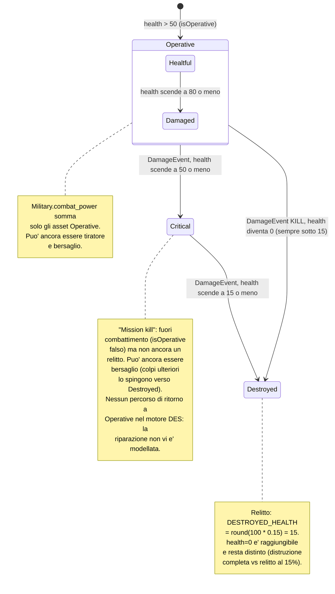

# Capitolo 5 — Lo strato 3: applicazione dello stato

Moduli: `Logic/Damage_Model.py`, `Asset/Asset.py` (`apply_damage`), `Logic/Fuel_Model.py`, più
`Logic/Engagement_Resolver.apply_engagement_result` (già descritta in capitolo 4, §4.12, ripresa
qui per completezza dello strato).

## 5.1 `Logic/Damage_Model.py` — il contratto del danno per singolo asset

Fissa la trasformazione da "arma che spara" a "salute che cala": prima della sua introduzione
`Asset.health` era un intero 0-100 con setter diretto e nessuna logica
(`Logic/Damage_Model.py:1-8`). La parte stocastica (chi spara, quando, quante volte) resta al
risolutore d'ingaggio (capitolo 4); questo modulo fissa **solo** il contratto colpo-per-colpo.

### Il contratto, punto per punto (`:10-53`)

1. **Unità di scambio: `DamageEvent`** — un evento per ogni colpo risolto, non un aggregato. Solo
   id di dominio, secondi assoluti, e un campo `provenance` che dichiara se il dato è
   `MEASURED` (adapter DCS), `DERIVED` (risolutore sintetico) o `ESTIMATED` (ricognizione)
   (`:94-99`).
2. **`accuracy` = P(colpo a segno)**, **`destroy_capacity` = P(distruzione | colpo a segno)**.
   Non è un'invenzione: è la lettura naturale dei due campi già presenti nei registri d'arma
   (`Ground_Weapon_Data`, `Ship_Weapon_Data`, `Aircraft_Weapon_Data`), entrambi in [0,1]. Il loro
   prodotto è la Pk già usata come principio di punteggio in tutto il progetto, qui scomposta in
   Ph e Pk|h. **Nessuna costante nuova**.
3. **Tre esiti per colpo**, mutuamente esclusivi: `KILL` (p = accuracy·destroy_capacity, l'asset
   è distrutto), `DAMAGE` (p = accuracy·(1-destroy_capacity), la salute cala di
   `round(100·destroy_capacity)` punti, minimo `MIN_EFFECTIVE_HIT_DAMAGE=1`), `MISS`
   (p = 1-accuracy). La stessa `destroy_capacity` misura sia la probabilità di uccidere sia
   l'entità del danno non letale: servono circa `1/destroy_capacity` colpi a segno non letali per
   mettere fuori uso il bersaglio — l'**accumulo è una proprietà emergente**, non un parametro.
4. **Un colpo può uccidere direttamente**: nessun pavimento artificiale che obblighi a degradare
   per gradi.
5. **La soglia `Destroyed` resta a `health <= 15`** (`DataType/State.py`, `HEALTH_LEVEL`), **non**
   0. Il residuo del 15% è il relitto: l'asset non combatte più ma esiste ancora come oggetto
   recuperabile (`repair_time`). `health = 0` resta raggiungibile e significa distruzione
   completa. La messa fuori combattimento avviene **prima**: `State.isOperative()` è già falso
   sotto il 50% (stato `Critical`), e `Military.combat_power` somma solo gli asset operativi — il
   modello distingue da sé "mission kill" (≤50) da "distruzione" (≤15).
6. **Nessuna estrazione casuale qui dentro**: `resolve_hit` riceve `draw` dal chiamante (l'RNG di
   sessione). L'ordine delle soglie (KILL, poi DAMAGE, poi MISS) **fa parte del contratto**:
   cambiarlo cambierebbe l'esito a parità di seed.

### Cosa non è deciso qui (`:55-61`)

La penetrazione contro corazza: i record d'arma non hanno un campo `penetration`; finché non c'è,
`destroy_capacity` per taglia/tipo di bersaglio è il solo discriminante disponibile. La
riparazione: `repair_time` esiste ma nessuno lo consuma — il contratto è volutamente a senso
unico (solo danno).

### API

`resolve_hit(accuracy, destroy_capacity, draw) -> str` (`:155-176`) applica le soglie di §5.1
punto 3 e restituisce uno di `HIT_OUTCOMES = (MISS, DAMAGE, KILL)`.

`health_delta_for_outcome(outcome, destroy_capacity, current_health) -> int` (`:179-200`)
calcola il delta (≤0): `KILL` porta a 0 la salute, `DAMAGE` toglie `max(1,
round(100·destroy_capacity))` punti (mai più della salute residua), `MISS` non toglie nulla.

`build_damage_event(asset, accuracy, destroy_capacity, draw, time=0.0, source_id=None,
weapon=None, provenance=DERIVED) -> Optional[DamageEvent]` (`:203-246`) risolve un colpo e ne
descrive l'esito **senza applicarlo**: separare calcolo e applicazione serve al risolutore
d'ingaggio, che deve poter calcolare tutti gli esiti di una salva, ordinarli deterministicamente
e solo poi applicarli — è proprio il modello a salva di Hughes: chi spara per primo non deve
dipendere dall'ordine di iterazione di un dizionario (`:211-216`). Restituisce `None` (con un
log) se l'asset non espone una salute leggibile.

`apply_damage_event(asset, event) -> Optional[int]` (`:249-268`) applica il delta con
`asset.apply_damage(event.health_delta)`. **Non idempotente per design**: applicare due volte lo
stesso evento toglie due volte la salute, "perché un colpo ripetuto è un altro colpo" — la
responsabilità di non applicare due volte lo stesso evento è di chi tiene la coda
(`:253-254`).

### `Asset.apply_damage` (`Asset/Asset.py:212-252`)

È l'**unico punto** in cui la salute cala per effetto del combattimento: il setter `health`
resta per inizializzazione e persistenza, `apply_damage` per l'attrito. Non contiene alcuna
estrazione casuale né alcuna nozione di arma — quanto danno faccia un colpo lo decide
`Damage_Model`, che è anche l'unico posto in cui il contratto è documentato. Solleva `TypeError`
se `health_delta` non è un intero e `ValueError` se è positivo (`:236-240`): la riparazione non
passa di qui. La salute è saturata a 0 con `max(0, current + health_delta)` (mai negativa,
`:242-248`); se lo stato dell'asset non è leggibile (`self._state` assente), restituisce `None`
con un log invece di sollevare un'eccezione (`:244-246`).

## 5.2 `Logic/Fuel_Model.py` — consumo di carburante per movimento

Stessa separazione calcolo/applicazione di `Damage_Model` (`Logic/Fuel_Model.py:1-16`). Il
contatore vive sull'asset (`Mobile.fuel`, frazione del carico pieno — v. capitolo 7, §7.6);
questo modulo produce solo l'atomo che entra nel `SessionOutcome`.

### Contratto (`:17-33`)

- Consumo **deterministico**, proporzionale alla distanza (`Mobile.fuel_for_distance`): **nessuna
  estrazione casuale**, nessun RNG richiesto.
- L'evento è **già limitato** al carburante disponibile: se la tratta richiede più di quanto c'è,
  `amount` è il residuo, `distance_covered < distance` e `exhausted` è `True`.
- Nessun concetto del simulatore: id di dominio, metri, secondi assoluti, `provenance`
  dichiarata (stesse costanti di `Damage_Model`).
- Non integra il consumo nel risolutore d'ingaggio (che non modella il movimento fra un contatto
  e l'altro): è un'API a sé che l'orchestratore chiama quando fa avanzare le rotte. Non
  rifornisce: il rifornimento è materia del ciclo di campagna.

### `FuelEvent` (`:50-76`)

| Campo | Significato |
|---|---|
| `time` | Secondi assoluti (istante di fine tratta, o quello scelto dall'orchestratore). |
| `distance`/`distance_covered` | Metri richiesti / metri effettivamente percorribili. |
| `amount` | Carburante consumato [frazione del carico pieno], già limitato al disponibile. |
| `fuel_before`/`fuel_after` | Prima e dopo. |
| `exhausted` | `True` se dopo l'evento il carburante è finito. |
| `regime` | Regime di `Mobile.FUEL_REGIMES` usato (`'nominal'`/`'max'`). |

### API

`build_fuel_event(asset, distance, time=0.0, regime='nominal', provenance=DERIVED)` (`:90-143`):
calcola `amount = min(required, fuel_before)`; se `required <= 0` o `amount >= required`, l'intera
`distance` è coperta, altrimenti `covered = distance * amount / required` (percorrenza parziale).
Restituisce `None` se l'asset non ha id di dominio o se il carburante non è modellato (`fuel`
`None` o autonomia non ricavabile, `:94-97`) — mai un'eccezione per dato mancante.

`apply_fuel_event(asset, event)` (`:146-165`) applica con `Mobile.consume_fuel(event.amount)`.
Stessa non-idempotenza dichiarata di `apply_damage_event`.

## 5.3 Applicazione unificata: `apply_engagement_result`

Già descritta in dettaglio nel capitolo 4, §4.12 (`Logic/Engagement_Resolver.py:1438-1509`): è il
passo che collega lo strato 2 allo strato 3 per un singolo ingaggio, applicando in sequenza
`DamageEvent` (via `Damage_Model.apply_damage_event`), `AmmunitionEvent` (via
`Mobile.consume_ammunition`) e `InterceptionEvent` (via `Mobile.consume_interceptor_stock`).
L'orchestratore (capitolo 6) la chiama **subito** dopo ogni componente connessa risolta.

## 5.4 Diagramma D7 — stati operativi di un asset (salute)

Le soglie sono in `DataType/State.py:32-37` (`HEALTH_LEVEL`) e applicate da `State.update`
(`DataType/State.py:178-199`), come frazioni della salute massima (100): `Damaged` 0.8,
`Critical` 0.5, `Destroyed` 0.15. Gli stati reali sono quattro — `Healtful` (> 80),
`Damaged` (50 < h ≤ 80), `Critical` (15 < h ≤ 50), `Destroyed` (≤ 15) — e `isOperative`
(`DataType/State.py:162`) è vero per `Healtful` **o** `Damaged`. Nel diagramma i primi due sono
raggruppati nello stato composto `Operative`, l'unico che conta per il motore DES.

