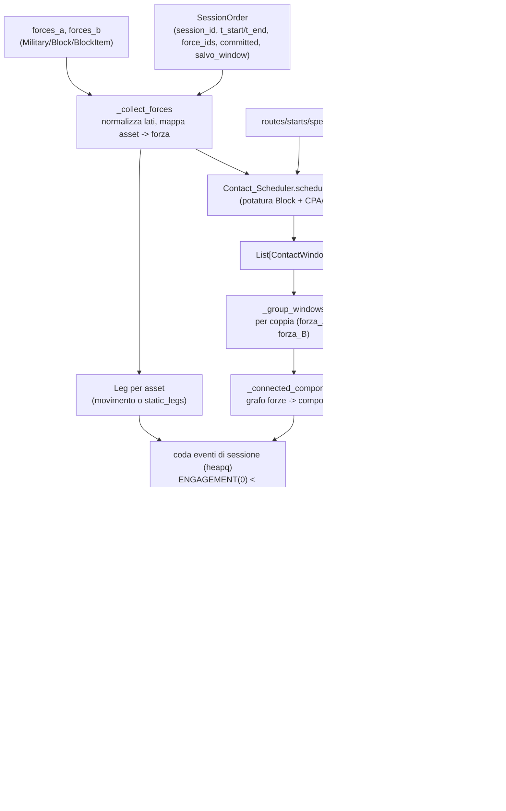
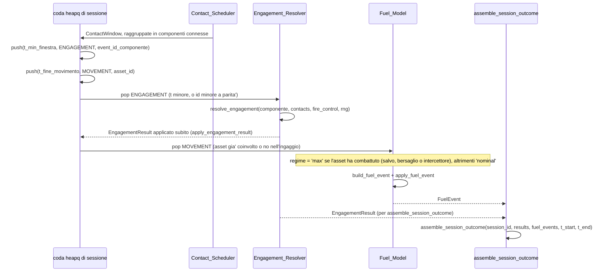

# Capitolo 6 — L'orchestratore: `Session_Simulator.run_session`

Modulo: `Logic/Session_Simulator.py`. Mette in fila, per la prima volta, i pezzi prodotti dalle
fasi precedenti (`Logic/Session_Simulator.py:1-18`):

```
SessionOrder ──> Contact_Scheduler.schedule_contacts      (strato 1: QUANDO)
             ──> raggruppamento in componenti connesse di forze
             ──> Engagement_Resolver.resolve_engagement    (strato 2: COME FINISCE)
             ──> apply_engagement_result                   (strato 3: danno, munizioni)
             ──> Fuel_Model.build/apply_fuel_event         (strato 3: carburante)
             ──> Session_Types.assemble_session_outcome    (porta di uscita)
```

Questo modulo è **solo** quella fila: non reimplementa geometria, Pd, latenze, salve, danno o
consumi. Ogni numero che produce viene da uno dei moduli chiamati.

## 6.1 La funzione pubblica

```python
run_session(order, forces_a, forces_b, fire_control, *, horizon=None, routes=None, starts=None,
            speeds=None, margin=0.0, range_type=DEFAULT_DETECTION_RANGE_TYPE, thresholds=None,
            reaction_profile_for=None, detection_factor=None, provenance=DM.DERIVED)
            -> SessionOutcome
```

(`Logic/Session_Simulator.py:454-620`). **Muta gli asset**: danno, munizioni e carburante sono
applicati man mano che gli eventi sono risolti. Il `SessionOutcome` restituito è il resoconto di
ciò che è stato applicato. Si combatte solo fra `forces_a` e `forces_b`, mai dentro lo stesso
lato (`:476-477`).

## 6.2 La coda eventi di sessione

Due tipi di evento, in un `heapq` con chiave `(t, tipo, id, sequenza)` (`:20-35`):

- **ENGAGEMENT** — uno per componente connessa di forze (§6.3); istante = inizio della prima
  finestra fra qualunque coppia della componente. Risolve l'intera componente con **una**
  chiamata a `resolve_engagement` e ne applica subito l'esito a tutte le sue forze.
- **MOVEMENT** — uno per asset con rotta schedulabile nella sessione; istante = fine del suo
  movimento dentro la sessione. Produce e applica il suo `FuelEvent`.

A parità d'istante `ENGAGEMENT_EVENT(0) < MOVEMENT_EVENT(1)` (`:179-181`), poi l'id (stringa
canonica, mai l'ordine di un dizionario Python). Le finestre di un asset mobile cadono tutte
dentro lo span dei suoi tratti, quindi quando il suo MOVEMENT viene estratto ogni ingaggio che lo
coinvolge è già stato risolto: il regime di consumo (§6.5) è noto.

## 6.3 Forze impegnate su più fronti: componenti connesse

**Prima del 2026-09-23**: un ingaggio per coppia (lato A, lato B), applicato subito. Restava un
difetto: se X era in contatto con A e con B in finestre **sovrapposte**, l'ingaggio (X,A)
estratto per primo veniva svolto fino in fondo e applicato, e (X,B) leggeva uno stato di X già
consumato anche per le salve che, in tempo di sessione, precedevano la fine di (X,A). L'ordine
della coda decideva chi "arrivava prima" alla salute e alle scorte di X — un artefatto
d'implementazione, non la fisica del combattimento (`:39-49`).

**Ora**: un ingaggio per **componente connessa**. Si costruisce il grafo non orientato con un
nodo per forza e un arco per ogni coppia (lato A, lato B) con almeno una finestra
(`_group_windows`, `:343-365`), e se ne cercano le componenti connesse (`_connected_components`,
`:368-419`, visita in ampiezza deterministica per id — mai l'ordine di un dizionario). Ogni
componente è risolta con **una** chiamata a `resolve_engagement`: `force_a`/`force_b` = le prime
due forze per id, `extra_forces` = le altre, per id. Dentro la run lo stato ombra di X evolve in
un'unica timeline consumata da tutti i fronti; un disingaggio è per-forza (capitolo 4, §4.8), non
ferma un eventuale altro fronte della componente.

Le componenti sono **disgiunte**: nessuna forza compare in due ingaggi della stessa sessione,
quindi il limite di `assemble_session_outcome` (capitolo 2, §2.4) non si presenta mai nella
pratica di `run_session`.

**Deliberatamente conservativa rispetto al tempo** (`:65-69`): non si distingue se le finestre di
una componente si sovrappongono davvero o sono in sequenza (X contro A al mattino, contro B la
sera): anche in quel caso {X, A, B} è risolta con una sola run. È sempre corretto, perché la coda
eventi **interna** del risolutore ordina comunque gli eventi nel tempo esatto.

## 6.4 RNG: uno stream per ingaggio

`order.rng(mission_id=None, event_id=engagement_event_id(*forze), counter=0)` (`:71-99`):

- `mission_id=None`: `SessionOrder` non porta ancora missioni; `None` è il livello "di sessione".
- `event_id`: `engagement_event_id(*force_ids)` (`:212-233`) è la codifica JSON di
  `['engagement', id_1, id_2, ...]` con gli id della componente **ordinati** — funzione pura
  dell'**insieme** delle forze, mai dell'ordine di iterazione o di passaggio a `run_session`.
- `counter=0`: ogni componente è risolta una sola volta per sessione; il contatore resta libero
  per un futuro re-ingaggio (re-scheduling dopo un disingaggio, non implementato, v. capitolo 4
  §4.9).

**Precondizione di riproducibilità**: gli id di forza devono essere **stabili** fra le
esecuzioni. `Block.__init__` genera l'id con `Utility.setId`, che aggiunge un suffisso casuale —
due `Military` costruite da zero con lo stesso nome avrebbero id diversi, quindi seed diversi e
un diverso ordine della coda. Corretto 2026-09-23: `Block.__init__`/`Military.__init__`
accettano ora un parametro `id` esplicito (`:86-94`); chi costruisce forze da zero per un
replay/test deve passarlo. In campagna l'id è comunque quello dell'istanza già in memoria
(persistito), quindi il caso comune non è mai stato a rischio.

## 6.5 Carburante

Per ogni asset con rotta in `routes` si prendono i tratti ritagliati alla sessione (stessa
costruzione di `Contact_Scheduler.schedule_contacts`: `route_legs` + `clamp_legs`) e la distanza
è la somma delle lunghezze dei tratti; un solo `FuelEvent` per asset, all'istante di fine
movimento (`:109-114`).

**Regime** (`:116-124`): `'max'` se l'asset ha **combattuto** nella sessione — ha lanciato una
salva, è stato bersaglio di una salva, o ha intercettato (`_engaged_assets`, `:422-436`) —
altrimenti `'nominal'`. Per gli aerei `'max'` legge il profilo `attack` del loadout, per veicoli e
navi il registro non distingue (v. capitolo 7, §7.6). Tutto il tragitto è consumato al regime
scelto: per chi ha combattuto è una sovrastima **pessimistica** del consumo (il tratto di
crociera è contato a regime di combattimento), preferita a una ripartizione per intervalli che
richiederebbe di inventare quando comincia e finisce la manovra di combattimento. Se `'max'` non
è ricavabile si ricade su `'nominal'` (`_build_fuel`, `:439-449`).

**Limiti dichiarati** (`:126-133`): nessun movimento fisico — se il carburante finisce a metà
(`FuelEvent.exhausted`, `distance_covered < distance`) l'asset non viene fermato sulla rotta e i
contatti già calcolati non vengono ricalcolati; un asset distrutto a metà rotta consuma comunque
il tragitto intero; un asset senza rotta (fermo) non produce `FuelEvent`.

## 6.6 Sessione aperta e attività oltre la fine

`SessionOrder.t_end is None` (sessione aperta): la durata **non si deduce**, il chiamante deve
passare `horizon` esplicito; con `t_end` valorizzato, `horizon` è ricavato (se passato comunque
deve coincidere) — `_session_horizon`, `:238-257`. Nessuna durata di default inventata
(`:135-139`).

Una salva lanciata poco prima della fine arriva comunque (payload congelato): impatti e
risoluzioni possono cadere dopo `t_start + horizon`. L'esito non viene troncato (sarebbe
cancellare danni già decisi): il `t_end` del `SessionOutcome` è esteso fino all'ultima attività,
con un log. I contatti invece sono cercati **solo** dentro la sessione (`:141-146`,
`run_session:601-617`).

## 6.7 Cosa non fa (`:148-153`)

Non costruisce `Theater_Session_Manager`, non legge/scrive `Campaign_State`. Non seleziona
l'arma, non rifornisce (munizioni o carburante), non ri-instrada le forze che si disingaggiano
(restano solo segnalate nell'esito). Nessun componente LLM.

## 6.8 Diagramma D8 — flusso dati di `run_session`



## 6.9 Diagramma D9 — coda eventi di sessione (schema)

Esempio minimo: una componente connessa (due forze in contatto) e un asset in movimento la cui
rotta termina dopo la fine dell'ingaggio.


