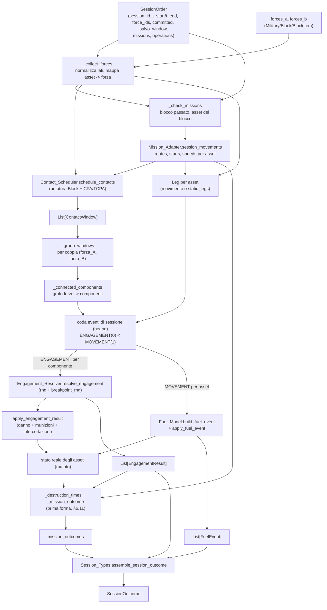
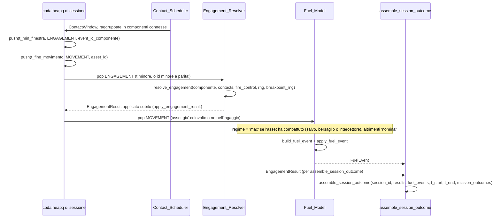
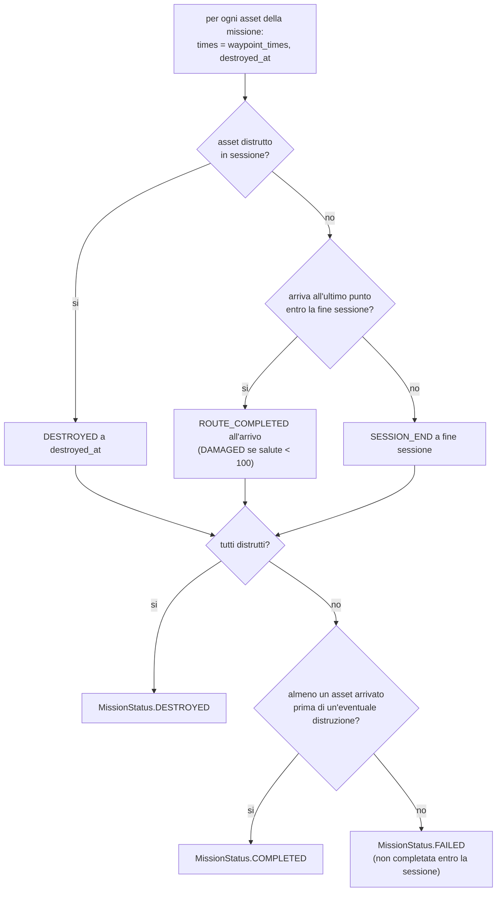
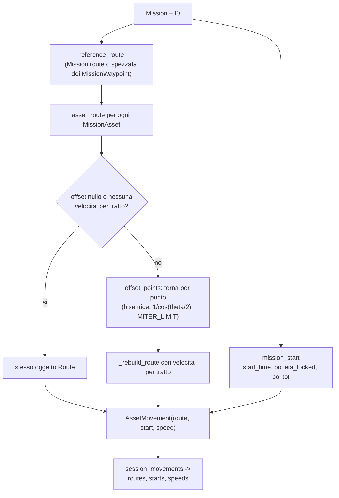
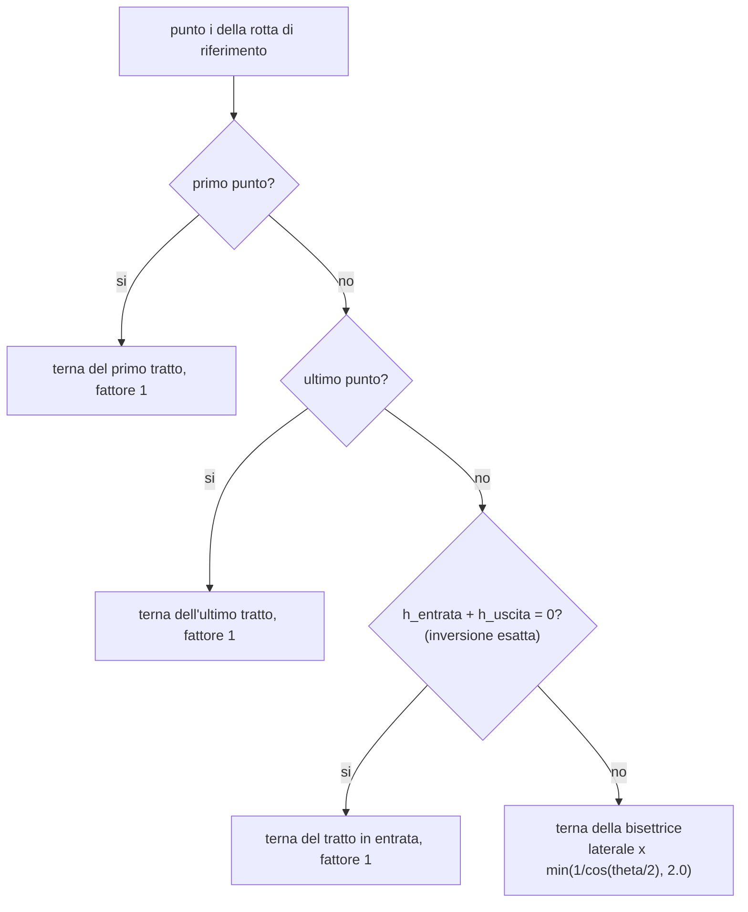

# Capitolo 6 — L'orchestratore: `Session_Simulator.run_session`

Modulo: `Logic/Session_Simulator.py` (774 righe a `533cd1f5`). Mette in fila, per la prima volta, i pezzi
prodotti dalle fasi precedenti (`Logic/Session_Simulator.py:1-18`); dalla fase F3 della Missione
(2026-10-05) la fila comincia dalle **missioni** dell'ordine:

```
SessionOrder.missions ──> Mission_Adapter.session_movements   (rotta, partenza, velocità per asset)
SessionOrder ──> Contact_Scheduler.schedule_contacts          (strato 1: QUANDO)
             ──> raggruppamento in componenti connesse di forze
             ──> Engagement_Resolver.resolve_engagement        (strato 2: COME FINISCE)
             ──> apply_engagement_result                       (strato 3: danno, munizioni)
             ──> Fuel_Model.build/apply_fuel_event             (strato 3: carburante)
             ──> esito di missione per ogni Mission            (prima forma, §6.11)
             ──> Session_Types.assemble_session_outcome        (porta di uscita)
```

Questo modulo è **solo** quella fila: non reimplementa geometria, Pd, latenze, salve, danno o consumi.
Ogni numero che produce viene da uno dei moduli chiamati; la geometria di formazione e la derivazione
di partenza e velocità sono in `Logic/Mission_Adapter` (§6.10), non qui.

## 6.1 La funzione pubblica

```python
run_session(order, forces_a, forces_b, fire_control, *, horizon=None, margin=0.0,
            range_type=DEFAULT_DETECTION_RANGE_TYPE, thresholds=None,
            reaction_profile_for=None, detection_factor=None, provenance=DM.DERIVED,
            morale_for=None, enemy_estimate_for=None, fire_doctrine=None)
            -> SessionOutcome
```

(`Logic/Session_Simulator.py:592-774`, firma a `:592-603`). **Muta gli asset**: danno, munizioni e
carburante sono applicati man mano che gli eventi sono risolti. Il `SessionOutcome` restituito è il
resoconto di ciò che è stato applicato. Si combatte solo fra `forces_a` e `forces_b`, mai dentro lo
stesso lato.

**Cambiamenti rispetto a `6754bf1c`:**

- **Rimossi `routes`, `starts`, `speeds`** (decisione Q2 dell'utente: una sola strada, `:34-41`): rotta,
  partenza e velocità di ogni asset vengono **solo** dalle missioni dell'ordine (`order.missions`);
  `Mission_Adapter.session_movements(order.missions, t0)` ne ricava le tre mappe che il resto della fila
  consuma esattamente come prima (`:652-653`). Gli asset senza missione restano fermi, come gli asset senza
  rotta di prima. Il comportamento è identico a parità di rotte: la fotografia di non regressione degli
  scenari (capitolo 8 §8.7) è rimasta uguale in tutte le 292 esecuzioni.
- **Ogni missione deve riferirsi a un blocco passato** fra le forze e ogni suo asset deve appartenere a
  quel blocco (`_check_missions`, `:505-514`, che chiama `Mission_Types.check_mission_assets`);
  altrimenti `ValueError` (`:631-635`).
- **Aggiunti `morale_for`, `enemy_estimate_for`, `fire_doctrine`** (2026-09-29): inoltrati a
  `resolve_engagement`; a questi si aggiunge il flusso `breakpoint_rng` della tempra, costruito
  dall'orchestratore (§6.4). `rwr_catalogue` di `resolve_engagement` **non** è inoltrato da `run_session`
  (disponibile solo chiamando il risolutore direttamente).
- Il valore restituito porta un `MissionOutcome` per ogni missione dell'ordine (§6.11).

## 6.2 La coda eventi di sessione

Due tipi di evento, in un `heapq` con chiave `(t, tipo, id, sequenza)` (`:20-30`, `:683-695`):

- **ENGAGEMENT** — uno per componente connessa di forze (§6.3); istante = inizio della prima
  finestra fra qualunque coppia della componente. Risolve l'intera componente con **una**
  chiamata a `resolve_engagement` e ne applica subito l'esito a tutte le sue forze (`:705-729`).
- **MOVEMENT** — uno per asset con rotta schedulabile nella sessione; istante = fine del suo
  movimento dentro la sessione. Produce e applica il suo `FuelEvent` (`:730-747`).

A parità d'istante `ENGAGEMENT_EVENT(0) < MOVEMENT_EVENT(1)` (`:216-217`, docstring `:60-63`), poi
l'id (stringa canonica, mai l'ordine di un dizionario Python). Le finestre di un asset mobile cadono
tutte dentro lo span dei suoi tratti, quindi quando il suo MOVEMENT viene estratto ogni ingaggio che lo
coinvolge è già stato risolto: il regime di consumo (§6.5) è noto.

## 6.3 Forze impegnate su più fronti: componenti connesse

**Prima del 2026-09-23**: un ingaggio per coppia (lato A, lato B), applicato subito. Restava un
difetto: se X era in contatto con A e con B in finestre **sovrapposte**, l'ingaggio (X,A)
estratto per primo veniva svolto fino in fondo e applicato, e (X,B) leggeva uno stato di X già
consumato anche per le salve che, in tempo di sessione, precedevano la fine di (X,A). L'ordine
della coda decideva chi "arrivava prima" alla salute e alle scorte di X — un artefatto
d'implementazione, non la fisica del combattimento (`:67-77`).

**Ora**: un ingaggio per **componente connessa**. Si costruisce il grafo non orientato con un
nodo per forza e un arco per ogni coppia (lato A, lato B) con almeno una finestra
(`_group_windows`, `:396-418`), e se ne cercano le componenti connesse (`_connected_components`,
`:421-472`, visita in ampiezza deterministica per id — mai l'ordine di un dizionario). Ogni
componente è risolta con **una** chiamata a `resolve_engagement`: `force_a`/`force_b` = le prime
due forze per id, `extra_forces` = le altre, per id (`:707-710`). Dentro la run lo stato ombra di X evolve
in un'unica timeline consumata da tutti i fronti; un disingaggio è per-forza (capitolo 4, §4.8), non
ferma un eventuale altro fronte della componente.

Le componenti sono **disgiunte**: nessuna forza compare in due ingaggi della stessa sessione,
quindi il limite di `assemble_session_outcome` (capitolo 2, §2.4) non si presenta mai nella
pratica di `run_session`.

**Deliberatamente conservativa rispetto al tempo** (`:93-97`): non si distingue se le finestre di
una componente si sovrappongono davvero o sono in sequenza (X contro A al mattino, contro B la
sera): anche in quel caso {X, A, B} è risolta con una sola run. È sempre corretto, perché la coda
eventi **interna** del risolutore ordina comunque gli eventi nel tempo esatto.

**Nota di prospettiva (F4).** A `533cd1f5` l'unità d'ingaggio è ancora la **forza** (il blocco),
non la missione: ingaggi, RNG e disingaggio sono per forza, quindi due missioni dello stesso blocco
condividono lo stesso destino di disingaggio (`:43-44`). La fase F4 del piano della Missione (in
corso a questo commit, non descritta qui) renderà la missione l'unità d'ingaggio (capitolo 9 §9.5).

## 6.4 RNG: uno stream per ingaggio, uno stream per la tempra

`order.rng(mission_id=None, event_id=engagement_event_id(*forze), counter=0)` (`:709`):

- `mission_id=None`: è il livello "di sessione" di `Session_Rng`. Le missioni sono nell'ordine dalla F3,
  ma l'ingaggio è ancora fra **forze** (blocchi) e può coinvolgere più missioni: l'id di missione
  entrerà nell'RNG con la F4, con la missione come unità d'ingaggio (`:99-105`). **Nota**: il piano
  della Missione prevedeva il `mission_id` reale già in F3; il codice lo rimanda a F4 (messaggio del
  commit `533cd1f5`: "RNG invariato"), quindi a `533cd1f5` gli stream sono identici a quelli prima della
  F3 (capitolo 9 §9.6).
- `event_id`: `engagement_event_id(*force_ids)` (`:252-273`) è la codifica JSON di
  `['engagement', id_1, id_2, ...]` con gli id della componente **ordinati** — funzione pura
  dell'**insieme** delle forze, mai dell'ordine di iterazione o di passaggio a `run_session`.
- `counter=0`: ogni componente è risolta una sola volta per sessione; il contatore resta libero
  per un futuro re-ingaggio (re-scheduling dopo un disingaggio, non implementato, v. capitolo 4
  §4.9).

**Secondo stream: la tempra delle forze** (2026-09-29). `temper_event_id(*force_ids)` (`:276-286`) ha
la stessa forma e gli stessi vincoli ma il tag `'temper'` (`TEMPER_EVENT_TAG`, `:223`) invece di
`'engagement'`; `run_session` lo passa a `resolve_engagement` come `breakpoint_rng`
(`order.rng(mission_id=None, event_id=temper_event_id(*force_ids), counter=0)`, `:717-719`). Così estrarre
la tempra non sposta le estrazioni di rilevamento e danno dell'ingaggio (capitolo 4 §4.11, §4.21).

**Precondizione di riproducibilità**: gli id di forza devono essere **stabili** fra le
esecuzioni. `Block.__init__` genera l'id con `Utility.setId`, che aggiunge un suffisso casuale —
due `Military` costruite da zero con lo stesso nome avrebbero id diversi, quindi seed diversi e
un diverso ordine della coda. Corretto 2026-09-23: `Block.__init__`/`Military.__init__`
accettano ora un parametro `id` esplicito (`:114-122`); chi costruisce forze da zero per un
replay/test deve passarlo. In campagna l'id è comunque quello dell'istanza già in memoria
(persistito), quindi il caso comune non è mai stato a rischio.

## 6.5 Carburante

Per ogni asset con rotta (dalle missioni) si prendono i tratti ritagliati alla sessione (stessa
costruzione di `Contact_Scheduler.schedule_contacts`: `route_legs` + `clamp_legs`, partenza e velocità
dalla missione, `_movement_legs`, `:366-383`) e la distanza è la somma delle lunghezze dei tratti
(`_legs_distance`, `:386-393`); un solo `FuelEvent` per asset, all'istante di fine movimento
(`:137-142`).

**Regime** (`:144-152`): `'max'` se l'asset ha **combattuto** nella sessione — ha lanciato una
salva, è stato bersaglio di una salva, o ha intercettato (`_engaged_assets`, `:475-489`) —
altrimenti `'nominal'`. Per gli aerei `'max'` legge il profilo `attack` del loadout, per veicoli e
navi il registro non distingue (v. capitolo 7, §7.6). Tutto il tragitto è consumato al regime
scelto: per chi ha combattuto è una sovrastima **pessimistica** del consumo (il tratto di
crociera è contato a regime di combattimento), preferita a una ripartizione per intervalli che
richiederebbe di inventare quando comincia e finisce la manovra di combattimento. Se `'max'` non
è ricavabile si ricade su `'nominal'` (`_build_fuel`, `:492-502`).

**Limiti dichiarati** (`:154-161`): nessun movimento fisico — se il carburante finisce a metà
(`FuelEvent.exhausted`, `distance_covered < distance`) l'asset non viene fermato sulla rotta e i
contatti già calcolati non vengono ricalcolati; un asset distrutto a metà rotta consuma comunque
il tragitto intero; un asset senza rotta (fermo) non produce `FuelEvent`. Il consumo **nel tempo**
(attese, orbite) e il bingo a priori non esistono ancora: sono la fase F6 del piano della Missione.

## 6.6 Sessione aperta e attività oltre la fine

`SessionOrder.t_end is None` (sessione aperta): la durata **non si deduce**, il chiamante deve
passare `horizon` esplicito; con `t_end` valorizzato, `horizon` è ricavato (se passato comunque
deve coincidere) — `_session_horizon`, `:291-310`. Nessuna durata di default inventata
(`:163-167`).

Una salva lanciata poco prima della fine arriva comunque (payload congelato): impatti e
risoluzioni possono cadere dopo `t_start + horizon`. L'esito non viene troncato (sarebbe
cancellare danni già decisi): il `t_end` del `SessionOutcome` è esteso fino all'ultima
attività, con un log (`:750-766`). I contatti invece sono cercati **solo** dentro la sessione
(`:169-174`).

## 6.7 Cosa non fa (`:176-180`)

Non costruisce `Theater_Session_Manager`, non legge/scrive `Campaign_State`. Non rifornisce (munizioni o
carburante), non ri-instrada le forze che si disingaggiano (restano solo segnalate nell'esito). La
selezione dell'arma dai registri non è dell'orchestratore: la `fire_control` è **una sola callable
iniettata**, passata tale e quale a ogni ingaggio (può essere `Fire_Control.make_registry_fire_control`,
capitolo 4 §4.16; il docstring del modulo, `:129-135`, non è stato aggiornato in proposito). Non applica
ancora alcun criterio di stato di missione (bingo, winchester, soglia di danno, minaccia: fase F6), non
modella attese (`WAIT`), né la presenza di un asset prima della partenza o dopo la fine della missione
(fase F5), né il filtro delle armi per tipo di missione (fase F7). Nessun componente LLM.

## 6.8 Diagramma D8 — flusso dati di `run_session`


```mermaid
flowchart TD
    ORD["SessionOrder<br/>(session_id, t_start/t_end, force_ids, committed, salvo_window,<br/>missions, operations)"]
    FORCES["forces_a, forces_b<br/>(Military/Block/BlockItem)"]

    ORD --> COLLECT["_collect_forces<br/>normalizza lati, mappa asset -> forza"]
    FORCES --> COLLECT
    COLLECT --> CHECK["_check_missions<br/>blocco passato, asset del blocco"]
    ORD --> CHECK
    CHECK --> MA["Mission_Adapter.session_movements<br/>routes, starts, speeds per asset"]

    MA --> SCHED["Contact_Scheduler.schedule_contacts<br/>(potatura Block + CPA/TCPA)"]
    COLLECT --> SCHED

    SCHED --> WINDOWS["List[ContactWindow]"]
    WINDOWS --> GROUP["_group_windows<br/>per coppia (forza_A, forza_B)"]
    GROUP --> COMP["_connected_components<br/>grafo forze -> componenti"]

    COMP --> QUEUE["coda eventi di sessione (heapq)<br/>ENGAGEMENT(0) < MOVEMENT(1)"]
    COLLECT --> LEGS["Leg per asset<br/>(movimento o static_legs)"]
    MA --> LEGS
    LEGS --> QUEUE

    QUEUE -->|ENGAGEMENT per componente| ER["Engagement_Resolver.resolve_engagement<br/>(rng + breakpoint_rng)"]
    ER --> APPLY["apply_engagement_result<br/>(danno + munizioni + intercettazioni)"]
    APPLY --> STATE["stato reale degli asset (mutato)"]

    QUEUE -->|MOVEMENT per asset| FUEL["Fuel_Model.build_fuel_event<br/>+ apply_fuel_event"]
    FUEL --> STATE

    ER --> RESULTS["List[EngagementResult]"]
    FUEL --> FEVENTS["List[FuelEvent]"]

    RESULTS --> MOUT["_destruction_times + _mission_outcome<br/>(prima forma, §6.11)"]
    MA --> MOUT
    STATE --> MOUT
    MOUT --> MOS["mission_outcomes"]

    RESULTS --> ASSEMBLE["Session_Types.assemble_session_outcome"]
    FEVENTS --> ASSEMBLE
    MOS --> ASSEMBLE
    ASSEMBLE --> OUT["SessionOutcome"]
```

## 6.9 Diagramma D9 — coda eventi di sessione (schema)

Esempio minimo: una componente connessa (due forze in contatto) e un asset in movimento la cui
rotta termina dopo la fine dell'ingaggio.


```mermaid
sequenceDiagram
    participant Q as coda heapq di sessione
    participant CS as Contact_Scheduler
    participant ER as Engagement_Resolver
    participant FM as Fuel_Model
    participant OUT as assemble_session_outcome

    CS->>Q: ContactWindow, raggruppate in componenti connesse
    Q->>Q: push(t_min_finestra, ENGAGEMENT, event_id_componente)
    Q->>Q: push(t_fine_movimento, MOVEMENT, asset_id)

    Q->>ER: pop ENGAGEMENT (t minore, o id minore a parita')
    ER->>ER: resolve_engagement(componente, contacts, fire_control, rng, breakpoint_rng)
    ER-->>Q: EngagementResult applicato subito (apply_engagement_result)

    Q->>FM: pop MOVEMENT (asset gia' coinvolto o no nell'ingaggio)
    Note over FM: regime = 'max' se l'asset ha combattuto (salvo, bersaglio o intercettore), altrimenti 'nominal'
    FM->>FM: build_fuel_event + apply_fuel_event
    FM-->>OUT: FuelEvent

    ER-->>OUT: EngagementResult (per assemble_session_outcome)
    OUT->>OUT: assemble_session_outcome(session_id, results, fuel_events, t_start, t_end, mission_outcomes)
```

## 6.10 La Missione nell'orchestratore: `Logic/Mission_Adapter.py` (fase F3, commit `533cd1f5`)

Modulo nuovo (483 righe): la **logica** che ricava, per ogni asset di una `Mission`, la forma che
`run_session` consuma — le tre mappe `routes`/`starts`/`speeds` di `Contact_Scheduler.schedule_contacts`.
`Command/Mission_Types` (capitolo 2 §2.6) è solo struttura. Funzioni pure: nessun RNG, nessuna mutazione
(`Logic/Mission_Adapter.py:1-78`, docstring del modulo).

### Rotta per asset: rotta di riferimento + offset di formazione (D3.b)

La missione ha **una** rotta di riferimento (`Mission.route`, o in mancanza la spezzata dei
`MissionWaypoint`, `reference_route`, `:174-189`; `_route_from_waypoints`, `:151-171`, richiede la velocità
dichiarata su ogni punto d'arrivo, altrimenti `ValueError`); ogni `MissionAsset` dichiara un offset
(`forward_m`, `right_m`, `up_m`) nella terna della direzione di marcia, con la convenzione del progetto
(nord = +y, est = +x, azimut orario):

- **avanti**: versore **orizzontale** della direzione di marcia (la quota non inclina la formazione);
- **destra**: avanti ruotato di 90° in senso orario visto dall'alto, `(hy, −hx)` (`:295`);
- **alto**: `+z`.

`asset_route(mission, mission_asset)` (`:329-357`) restituisce `(rotta, velocità uniforme)`. **Offset nullo e
nessuna velocità per tratto = la STESSA rotta** (lo stesso oggetto `Route`): i tratti sono identici a quelli
della rotta di riferimento, senza alcuna aritmetica in mezzo.

**Regola ai cambi di direzione, decisa in F3: la formazione ruota con la rotta, sulla bisettrice**
(`offset_points`, `:264-302`; `_point_frame`, `:244-261`). L'offset si applica **punto per punto**, non tratto
per tratto (applicarlo per tratto staccherebbe i tratti consecutivi):

- primo punto: terna del primo tratto; ultimo punto: terna dell'ultimo tratto;
- punto intermedio: terna della **bisettrice** `b = normalizzato(h_entrata + h_uscita)`, la direzione media
  fra il tratto in arrivo e quello in partenza;
- la componente **laterale** è scalata di `1/cos(θ/2)` (θ = angolo di virata; giunzione "a spigolo", la
  stessa delle spezzate parallele): i tratti dell'asset restano **paralleli** a quelli di riferimento, a
  distanza `right_m`, prima e dopo la virata. Il fattore è limitato a `MITER_LIMIT = 2.0` (`:107`, **stima di
  progetto**, esatto fino a virate di 120°, tagliato oltre); la componente **avanti** è presa lungo la
  bisettrice, senza scala;
- **inversione esatta** (`h_uscita = −h_entrata`, bisettrice indefinita): si usa la terna del tratto in
  **entrata**; il tratto successivo porta l'asset nella terna d'uscita al punto dopo (in una virata di 180° il
  gregario di destra finisce dall'altra parte del riferimento, come in una formazione vera);
- i tratti senza componente orizzontale (salita o discesa sulla verticale, punti ripetuti) ereditano la
  direzione dal tratto orizzontale più vicino (prima il precedente, `_leg_headings`, `:224-241`); una rotta
  senza alcun tratto orizzontale ammette solo `up_m` (altrimenti `ValueError`);
- le coordinate sono arrotondate al micrometro (`OFFSET_DECIMALS = 6`, `:110`): il rumore della rotazione
  (ordine 1e-12 m) non ha significato fisico e non deve comparire come differenza di posizione (sympy
  `Point3D` conserva i float come razionali).

**Conseguenza da sapere**: una formazione che trasla *rigidamente* (stesso spostamento per ogni punto)
coincide con "rotta di riferimento + offset" **solo** se la rotta non cambia direzione; con virate la traslata
è un'altra geometria. Per questo `Scenario_Fixtures.missions_for` (capitolo 8 §8.1) accetta un offset solo se
`asset_route` riproduce **esattamente** la rotta traslata dell'asset, altrimenti l'asset ha una missione
propria.

### Velocità

`MissionWaypoint.speed_kmh` è la velocità del tratto **in arrivo** al punto (`None` = quella dell'arco della
rotta, in m/s); quella del primo punto non ha tratto in arrivo ed è ignorata (`_leg_speeds`, `:192-209`).
Nessuna velocità dichiarata: valgono quelle degli archi, nessuna voce in `speeds`. Tutti i tratti dichiarano la
**stessa** velocità: una voce in `speeds` [m/s] (sostituisce quella degli archi, semantica di `route_legs`),
rotta invariata. Dichiarazioni diverse o parziali: la rotta per asset è ricostruita (`_rebuild_route`,
`:305-324`) con la velocità dichiarata sui tratti che la dichiarano e quella dell'arco sugli altri.
Conversione `kmh_to_ms` (`:125-127`): `km/h / 3.6`.

### Partenza (`mission_start`, `:373-416`)

Gli istanti di una missione sono in secondi dall'inizio della sessione; la partenza assoluta è `t0 + ...` con
`t0 = SessionOrder.t_start`. In ordine di precedenza: (1) `start_time`; (2) il primo waypoint con
`eta_locked`: partenza = ETA − tempo di percorrenza fino a quel punto sulla rotta di riferimento (con le
velocità di missione, `_travel_time_to`, `:360-370`); (3) `tot`, ancorato al primo waypoint `ATTACK` (o, in
mancanza, `OBJECTIVE`, `_TOT_ANCHOR_ROLES`, `:122`): stessa derivazione; senza punto d'ancoraggio
`ValueError`. Tutti gli asset di una missione partono **insieme** (la formazione è una). Una partenza
derivata **anteriore all'inizio della sessione** è un errore (le missioni fuori finestra saranno rifiutate dal
validatore della fase F8; qui non si tagliano in silenzio). `Activation.ON_EVENT` è solo dichiarabile:
`ValueError`.

### API

`AssetMovement(mission_id, asset_id, route, start, speed)` (`:132-146`); `mission_movements(mission, t0)`
(`:419-428`, uno per asset nell'ordine degli asset); `session_movements(missions, t0)` (`:431-464`):
`(routes, starts, speeds)` per `schedule_contacts`, **solo** per gli asset con rotta (gli altri restano
fermi) e `speeds` solo per quelli con velocità uniforme dichiarata; solleva `ValueError` se un asset è in due
missioni (già vietato da `SessionOrder`, qui per chi chiama direttamente); `waypoint_times(movement)`
(`:467-478`): gli istanti assoluti di passaggio ai punti della rotta dell'asset, senza taglio alla sessione
(base delle ETA effettive, §6.11); `mission_routes` (`:481-483`).

**Cosa non fa** (`:74-78`): nessuna attesa (`WAIT`), nessuna presenza prima della partenza o dopo la fine
(F5); non usa ruoli, regole, bersaglio, criteri di fine (F4-F7).

## 6.11 Esito di missione, prima forma (`_mission_outcome`, `:537-587`)

Dopo che tutti gli eventi sono stati applicati, `run_session` calcola un `MissionOutcome` per ogni missione
dell'ordine (`:768-771`), con gli asset nello stato **finale** (salute dopo l'applicazione). La regola
(docstring `:46-58`):

**Per asset** (`AssetMissionOutcome`):

- `DESTROYED` (stato e motivo) all'istante del primo `DamageEvent` che lo distrugge, o a `t0` se era già
  distrutto all'inizio (`_destruction_times`, `:517-534`);
- altrimenti `ROUTE_COMPLETED` all'istante d'arrivo all'ultimo punto, se lo raggiunge dentro la sessione
  (stato `DAMAGED` se la salute finale è < 100, altrimenti `OPERATIONAL`);
- altrimenti `SESSION_END` alla fine della sessione: rotta tagliata dalla fine della sessione, o missione
  senza rotta (sul posto), ancora in corso.

**Per missione**: `DESTROYED` se tutti gli asset sono distrutti; `COMPLETED` se almeno un asset ha raggiunto
l'ultimo punto **prima** di un'eventuale distruzione; altrimenti `FAILED`, che in questa prima forma significa
"non completata entro la sessione" (manca uno stato "in corso", decisione D4.e, che lo distinguerebbe da un
fallimento vero). **ETA effettive** per punto (`actual_etas`): il primo passaggio, fra gli asset non ancora
distrutti a quell'istante, dentro la sessione; `None` se nessuno ci arriva. Nessun criterio di stato (bingo,
winchester, danno, minaccia) e nessun `ABORTED`: sono la fase F6.

Conseguenza dichiarata dal codice, non dal piano: una missione **senza rotta** (sul posto) e con almeno un
asset sopravvissuto risulta `FAILED` (nessun asset raggiunge "l'ultimo punto"); il piano della Missione la
descrive come "ancora in corso", stato che il `MissionStatus` non ha (capitolo 9 §9.5).

*Diagramma D19 — esito di missione, prima forma (`_mission_outcome`).*


```mermaid
flowchart TD
    M["per ogni asset della missione:<br/>times = waypoint_times, destroyed_at"] --> D{"asset distrutto<br/>in sessione?"}
    D -->|si| AD["DESTROYED a destroyed_at"]
    D -->|no| A{"arriva all'ultimo punto<br/>entro la fine sessione?"}
    A -->|si| RC["ROUTE_COMPLETED all'arrivo<br/>(DAMAGED se salute < 100)"]
    A -->|no| SE["SESSION_END a fine sessione"]
    AD --> S{"tutti distrutti?"}
    RC --> S
    SE --> S
    S -->|si| ST1["MissionStatus.DESTROYED"]
    S -->|no| R{"almeno un asset arrivato<br/>prima di un'eventuale distruzione?"}
    R -->|si| ST2["MissionStatus.COMPLETED"]
    R -->|no| ST3["MissionStatus.FAILED<br/>(non completata entro la sessione)"]
```

*Diagramma D20 — pipeline di `Mission_Adapter`: dalla `Mission` a rotta, partenza e velocità per asset.*


```mermaid
flowchart TD
    MI["Mission + t0"] --> RR["reference_route<br/>(Mission.route o spezzata dei MissionWaypoint)"]
    MI --> MS["mission_start<br/>start_time, poi eta_locked, poi tot"]
    RR --> AR["asset_route per ogni MissionAsset"]
    AR --> Z{"offset nullo e nessuna<br/>velocita' per tratto?"}
    Z -->|si| SAME["stesso oggetto Route"]
    Z -->|no| OFF["offset_points: terna per punto<br/>(bisettrice, 1/cos(theta/2), MITER_LIMIT)"]
    OFF --> REB["_rebuild_route con velocita' per tratto"]
    SAME --> MOV["AssetMovement(route, start, speed)"]
    REB --> MOV
    MS --> MOV
    MOV --> SM["session_movements -><br/>routes, starts, speeds"]
```

*Diagramma D21 — regola dell'offset di formazione ai cambi di direzione (`_point_frame`).*


```mermaid
flowchart TD
    P["punto i della rotta di riferimento"] --> F{"primo punto?"}
    F -->|si| T1["terna del primo tratto, fattore 1"]
    F -->|no| L{"ultimo punto?"}
    L -->|si| T2["terna dell'ultimo tratto, fattore 1"]
    L -->|no| B{"h_entrata + h_uscita = 0?<br/>(inversione esatta)"}
    B -->|si| T3["terna del tratto in entrata, fattore 1"]
    B -->|no| T4["terna della bisettrice<br/>laterale x min(1/cos(theta/2), 2.0)"]
```
