# Capitolo 6 — L'orchestratore: `Session_Simulator.run_session`

Modulo: `Logic/Session_Simulator.py` (**3163 righe a `fa5fbf1e`**, 3102 a `dcedc541`, 2851 a `a784a9e7`, 937 a `84a47670`, 774 a `533cd1f5`; il
grosso della crescita è il docstring del modulo, che è il documento di progetto di F5, F6, G1-G5, F7 e F8, e la nuova logica di
sessione). Tutti i riferimenti `:riga` di questo capitolo valgono per `fa5fbf1e`. **Dalla F8** il capitolo descrive anche i moduli
che stanno *intorno* all'orchestratore e lo conducono da fuori: il validatore di sessione, la prontezza degli asset e il conduttore
di campagna (§6.25-6.27, con i dati che `run_session` aggiunge all'esito, §6.24). `Session_Simulator.py` è cambiato poco (65 righe aggiunte e 4 tolte, di cui 23 nel
docstring del modulo; `git diff -U0 dcedc541..HEAD`): la F8 è fatta di funzioni *nuove fuori da `run_session`*.
Mette in fila, per la prima volta, i pezzi prodotti dalle fasi precedenti (`Logic/Session_Simulator.py:1-19`); dalla
fase F3 della Missione (2026-10-05) la fila comincia dalle **missioni** dell'ordine, dalla F4 (2026-10-05/11) la
missione è anche la **forza d'ingaggio** e dai passi G4a-G4b (2026-10-17) l'ingaggio è un **episodio nel tempo**, dopo
il quale gli aerei sono **ri-pianificati**:

```
SessionOrder.missions ──> Mission_Adapter.mission_movements   (rotta, partenza, velocità, attese, presenza per asset)
                      ──> Mission_Adapter.weapon_policies      (F7a, strato W: involucro della fire control, §6.22)
                      ──> Mission_Adapter.target_rules         (F7a, strato T: regole di bersaglio per il risolutore, §6.22)
                      ──> _engagement_forces                   (una forza per missione, §6.12)
                      ──> Mission_Adapter.coordination_domains (dominio di coordinamento, §6.13)
                      ──> Mission_Adapter.grounded_schedule    (aerei a terra nel tempo, §6.14-6.15)
                      ──> tratti: bingo alla partenza (G2) e esaurimento del carburante (F6-A), §6.17/6.19
SessionOrder ──> Contact_Scheduler.schedule_contacts          (strato 1: QUANDO)
             ──> raggruppamento in EPISODI d'ingaggio          (G4a; spento: componenti connesse di forze)
             ──> Engagement_Resolver.resolve_engagement        (strato 2: COME FINISCE), uno per episodio
             ──> Area_Fire.resolve_area_fire                   (F7b: fuoco su posizione, un evento per azione, §6.23)
             ──> apply_engagement_result                       (strato 3: danno, munizioni), subito
             ──> ri-pianificazione degli aerei + nuovi contatti (G4b), poi l'episodio successivo
             ──> Fuel_Model.build/apply_fuel_event             (strato 3: carburante, PASSO FINALE dal G4a)
             ──> esito di missione per ogni Mission            (regola unica dalla F6-B1 + IN_PROGRESS F8b, §6.11/6.18)
             ──> final_positions, movement_ends, operation_outcomes  (F8b, per la campagna, §6.24)
             ──> Session_Types.assemble_session_outcome        (porta di uscita)

fuori da run_session (F8, il ciclo di campagna che la contiene, §6.25-6.27):
   Readiness.apply_campaign_processes ──> Session_Validator.check_session ──> SS.run_session
        ──> Session_Campaign.apply_final_positions ──> Readiness.record_session
```

Questo modulo è **solo** quella fila: non reimplementa geometria, Pd, latenze, salve, danno o consumi. Ogni numero che
produce viene da uno dei moduli chiamati; la geometria di formazione, la derivazione di partenza, velocità, attese e
presenza e i validatori di pianificazione sono in `Logic/Mission_Adapter` (§6.10, §6.15-6.16, §6.19), la vista di
missione, il dominio di coordinamento e la postura continua anch'essi (§6.12-6.14); i calcoli sul carburante e sul
bingo sono in `Logic/Fuel_Model` (capitolo 5 §5.2), non qui. Quel che resta qui è **quando** e **con quali dati**
usarli.

## 6.1 La funzione pubblica

```python
run_session(order, forces_a, forces_b, fire_control, *, horizon=None, margin=0.0,
            range_type=DEFAULT_DETECTION_RANGE_TYPE, thresholds=None,
            reaction_profile_for=None, detection_factor=None, provenance=DM.DERIVED,
            morale_for=None, enemy_estimate_for=None, fire_doctrine=None)
            -> SessionOutcome
```

(`Logic/Session_Simulator.py:2163-3163`, firma a `:2163-2174`; **la firma non è cambiata dalla F3** e non cambia
con F5, F6, G1-G5, F7 e F8: tutte le novità sono interruttori del modulo, §6.21, e nuovi dati nell'esito). **Muta gli asset**:
danno e munizioni sono applicati man mano che gli episodi d'ingaggio sono risolti, il carburante in un passo finale. Il
`SessionOutcome` restituito è il resoconto di ciò che è stato applicato. Si combatte solo fra `forces_a` e `forces_b`,
mai dentro lo stesso lato.

**Cambiamenti da `dcedc541` a `fa5fbf1e` (fase F8: F8a `c1182d8a`, F8b `33698fb4`, F8c `87aa7dea`/`6d3497bc`/`398ae3ef`, più i dati F8-R
`dc53af99`):** nessuna modifica alla firma né al comportamento delle sessioni già esistenti (**982 esecuzioni identiche** a ogni passo F8a-F8c; le
4 esecuzioni nuove, S30, vengono dal conduttore di campagna, non da un cambio di `run_session`). In ordine:

- **Warning per le missioni oltre la fine** (F8a): per ogni missione dell'ordine, se la fine pianificata
  (`Mission_Adapter.mission_planned_end`, §6.25) supera la fine della sessione, `run_session` emette un `logger.warning` e **nient'altro**
  (`:2247-2254`): il taglio silenzioso della rotta (E4) non è più silenzioso, ma nessuna rotta e nessun esito cambiano. Il rifiuto è del
  validatore di sessione (§6.25), non dell'esecutore.
- **`session_blocks`** (F8a, `:1108-1110`): wrapper pubblico di `_collect_forces(...)[2]` (i blocchi per id di dominio con le stesse verifiche
  di `run_session`), usato dal validatore.
- **Stato di missione `IN_PROGRESS`** (F8b, interruttore `F8_IN_PROGRESS`, `:904-908`; ramo in `_mission_outcome`, `:2141-2142`): una
  missione non distrutta, non completata e non abortita, con almeno un asset superstite ancora sulla rotta o sul posto alla fine della
  sessione, non è più `FAILED` (§6.11).
- **Esito per la campagna** (F8b): la porta di uscita aggiunge `final_positions`, `movement_ends` e `operation_outcomes` (`:3141-3154`,
  passati ad `assemble_session_outcome` a `:3158-3163`, §6.24).
- **Interruttori**: da quattordici a **quindici** costanti (`F8_IN_PROGRESS`, §6.21).
- **Il ciclo di campagna è fuori**: validatore (`Logic/Session_Validator`, §6.25), prontezza (`Logic/Readiness`, §6.26) e conduttore
  (`Logic/Session_Campaign`, §6.27) sono moduli nuovi che **chiamano** `run_session` (come attributo del modulo, `SS.run_session`) e non
  sono da lei chiamati. `run_session` **non** valida l'ordine, **non** applica le posizioni, **non** rifornisce.

**Cambiamenti da `a784a9e7` a `dcedc541` (fase F7: F7a `9f87a3ad`, F7b `dcedc541`):** nessuna modifica alla firma. In ordine:

- **Politica d'armi per tipo di missione** (F7a, strato W, `F7_WEAPON_POLICY`): prima di ogni uso la `fire_control` iniettata è
  avvolta da `Fire_Control.restrict_by_policy` con le politiche degli asset delle missioni aeree (§6.22).
- **Regole di bersaglio di missione** (F7a, strato T, `F7_TARGET_RULES`): per ogni asset con ROE diversa da `weapon_free` o
  armi designate la sessione costruisce una `TargetRules` e la passa al risolutore con la memoria di `return_fire` e dei
  designati distrutti degli episodi già risolti (§6.22).
- **Validazione del loadout** (F7a): in `_check_missions` il loadout dichiarato dalla missione deve essere quello assegnato
  all'aereo, altrimenti `ValueError` (non dipende dagli interruttori).
- **`target_destroyed` ristretto** (F7a): `Target.asset_ids` restringe il gruppo bersaglio del criterio (§6.18).
- **Fuoco su posizione** (F7b, `F7_AREA_FIRE`): un **terzo tipo di evento di sessione**, `AREA_FIRE_EVENT`, con `MOVEMENT_EVENT`
  spostato da 1 a 2 (§6.2, §6.23).
- **Interruttori**: da undici a **quattordici** costanti (§6.21).
- Nessun cambiamento ai moduli delle fasi precedenti: i commit intermedi `3cbb4226` (dati A-10C) e `d1686b28` (pulizia
  documentale) toccano solo dati di registro e commenti.

**Cambiamenti da `84a47670` a `a784a9e7` (fasi F5, F6 e G1-G5):** nessuna modifica alla firma. In ordine:

- **Presenza e attese** (F5): i tratti degli asset di missione comprendono la presenza ferma prima della partenza e
  dopo la fine e le attese WAIT; gli aerei di missione sono a terra a intervalli (`grounded_schedule`); l'esito porta la
  postura di ogni asset (§6.15-6.16).
- **Carburante** (F6-A): consumo per tratto e nel tempo, vincolo sul movimento e sui contatti, planata e perdita
  dell'aereo a secco (§6.17).
- **Fine di attività e stato di missione** (F6-B1): i criteri `EndCriteria` sono letti; regola unica
  `DESTROYED > COMPLETED > ABORTED(motivo) > FAILED`; postura `destroyed` (§6.18).
- **Bingo** (F6-B2, F6-B2bis e G1-G2): soglia con riserva di disimpegno e albero di decisione, valutati alla partenza
  (§6.19); validatori di pianificazione **non** chiamati da `run_session`.
- **Consumo in ingaggio, episodi, ri-pianificazione, uscita di scena** (G3, G4a, G4b): l'ingaggio diventa un
  episodio, dopo ogni episodio gli aerei interessati sono ri-pianificati e i loro contatti ricalcolati (§6.20).
- **Interruttori**: undici costanti del modulo, tutte attive (§6.21).

**Cambiamenti da `533cd1f5` a `84a47670` (fase F4):**

- **Validazione delle missioni** (`_check_missions`, `:1931-1957`): oltre a "la missione si riferisce a un blocco
  passato fra le forze" (`ValueError`, `:1938-1940`) e "ogni suo asset appartiene a quel blocco"
  (`Mission_Types.check_mission_assets`, `:1942`), dalla F4a vale la **regola A** — una missione si muove insieme,
  alla velocità del mezzo più lento: `Mission_Adapter.check_mission_speed(mission, assets, order.t_start)`
  (`:1944`, §6.10) solleva `ValueError` se un tratto pianificato supera la velocità massima del mezzo più
  lento; dalla F4b un `mission_id` non può coincidere con l'id di un blocco passato (`:1955-1957`: sarebbero due
  forze con lo stesso id); e **dalla F7a** il `loadout` dichiarato da un `MissionAsset` deve coincidere con
  `assigned_loadout` dell'aereo (`:1946-1953`, `ValueError`, decisione 13 della F7: il motore usa `Aircraft.assigned_loadout`,
  la politica d'armi deve leggere lo stesso loadout della missione; **non** dipende dagli interruttori).
- **Le forze d'ingaggio sono missioni**, non blocchi (F4b): `_engagement_forces` (`:1960-2003`, §6.12). Lo
  scheduler riceve ancora i **blocchi** (`items_a`/`items_b`, `:2385`): le finestre sono per coppia di asset e la
  potatura per blocco non dipende da come gli asset sono raggruppati in forze.
- **Dominio di coordinamento** (F4b+): `coordination_domains` (`:2237`) è passato a `_connected_components` (`:2916`)
  e a `_episodes` (`:2874`) e a ogni `resolve_engagement` come `coordination_of` (`:2780`), §6.13.
- **Aerei a terra** (F4c, F5): il programma `grounded` (`:2258`) è passato a `schedule_contacts` (`grounded=`, `:2387`)
  e a ogni `resolve_engagement` (`grounded=`, `:2781`), §6.14-6.15.
- **`SessionOrder.committed`** resta chiavato per blocco; `_engagement_committed` (`:2006-2026`) lo traduce per forza
  d'ingaggio (§6.12).

**Cambiamenti da `6754bf1c` a `533cd1f5` (fase F3):**

- **Rimossi `routes`, `starts`, `speeds`** (decisione Q2 dell'utente: una sola strada): rotta, partenza e velocità di
  ogni asset vengono **solo** dalle missioni dell'ordine (`order.missions`); `Mission_Adapter.session_movements(
  order.missions, t0)` ne ricava le tre mappe che il resto della fila consuma (`:2255`). Gli asset senza missione
  restano fermi, come gli asset senza rotta di prima (dalla F4c con una postura, §6.14).
- **Aggiunti `morale_for`, `enemy_estimate_for`, `fire_doctrine`** (2026-09-29): inoltrati a
  `resolve_engagement`; a questi si aggiunge il flusso `breakpoint_rng` della tempra, costruito
  dall'orchestratore (§6.4). `rwr_catalogue` di `resolve_engagement` **non** è inoltrato da `run_session`
  (disponibile solo chiamando il risolutore direttamente; capitolo 9 §9.6).
- Il valore restituito porta un `MissionOutcome` per ogni missione dell'ordine (§6.11).

## 6.2 La coda eventi di sessione

**Tre tipi di evento** (il terzo dalla F7b): `ENGAGEMENT_EVENT = 0`, `AREA_FIRE_EVENT = 1`, `MOVEMENT_EVENT = 2`
(`:785-787`; il valore di `MOVEMENT_EVENT` è passato da 1 a 2 per far stare l'evento nuovo in mezzo, e nessun codice o test
lo usa per valore), con chiave `(t, tipo, id, sequenza)` (docstring `:21-47`). A parità d'istante
**`ENGAGEMENT < AREA_FIRE < MOVEMENT`**, poi l'id (stringa canonica, mai l'ordine di un dizionario Python).

| Evento | Quanti | Istante | Che cosa fa |
|---|---|---|---|
| **ENGAGEMENT** (0) | uno per **episodio d'ingaggio** (G4a, §6.20); con `G4_EPISODES` spento, uno per componente connessa di forze (§6.3) | inizio della prima finestra dell'episodio | **una** chiamata a `resolve_engagement` sulle sole sue finestre e forze, ed esito applicato subito (`engage`, `:2702-2821`) |
| **AREA_FIRE** (1, F7b) | uno per azione `Fire_At_Point` di un asset di missione di terra o di mare | istante d'**impatto** (`t_fire + time_of_flight`) | `Area_Fire.resolve_area_fire` ed esito applicato subito (`fire_area`, `:2467-2486`); **non** è un ingaggio (§6.23) |
| **MOVEMENT** (2) | uno per asset con rotta schedulabile nella sessione | fine del suo movimento dentro la sessione (dalla F6-A troncato all'esaurimento del carburante) | produce e applica i `FuelEvent` del tragitto, **uno per tratto** (§6.17) |

**Dal G4a la coda è percorsa in due passi**, non in uno (`:2863-2936`, `:2938-3072`):

1. **tutti gli ENGAGEMENT**, in ordine di tempo (poi `event_id`), ciascuno seguito dalla ri-pianificazione degli aerei
   interessati (G4b, §6.20). **Dalla F7b** gli eventi AREA_FIRE sono intercalati: prima di ogni episodio la sessione
   risolve quelli con impatto *strettamente anteriore* all'inizio dell'episodio (`fire_due(min(w.t_start for w in group))`,
   `:2881`), e alla fine quelli rimasti (`fire_due()`, `:2910`); con `G4_EPISODES` spento stanno nello stesso `heapq`
   degli ingaggi (`:2912-2936`). Il diagramma D50 (§6.23) mostra l'intercalazione;
2. **poi la contabilità del carburante**: un `heapq` con gli ingaggi già risolti, alla loro chiave
   `(istante, ENGAGEMENT, event_id)`, e un MOVEMENT per asset alla fine dei suoi tratti **definitivi**
   (`:2954-2963`) — cioè la stessa coda di prima ripercorsa nello stesso ordine, che produce gli stessi `FuelEvent`. Un
   evento di fuoco su posizione, già in `resolved` come `(result.t_end, event_id, result)`, entra qui **con il tipo
   ENGAGEMENT** (`:2958-2959`): non ha salve né intercettazioni, quindi non produce consumi d'ingaggio (G3), ma il tiratore
   compare in `_engaged_assets` per il suo `AmmunitionEvent` (per terra e mare i due regimi di consumo coincidono, §6.5).

È lecito spostare il carburante in coda perché **il risolutore non legge il carburante** (nessun accesso a `fuel` in
`Engagement_Resolver`: capitolo 4 §4.31) e il carburante **non legge danno né scorte** (`Fuel_Model` legge solo il
contatore, il loadout e i registri). E serve, perché il G4b conosce i tratti definitivi di ogni aereo solo dopo l'ultimo
episodio.

**Il fuoco su posizione (F7b)** — interruttore `F7_AREA_FIRE`, decisione 15 dell'utente del 2026-10-20 — fa sparare una
missione di terra o di mare con bersaglio `POINT`/`AREA` sulla **posizione stimata** del bersaglio anche se nessuno vi è
stato rilevato (l'artiglieria che spara dove i blu erano). Non è un ingaggio: nessuna finestra di contatto, nessuna forza
d'ingaggio (`EngagementResult.forces` vuoto, quindi niente tempra, disingaggio o shock sul colpito), nessuna
intercettazione; usa un proprio stream dell'RNG di sessione, `order.rng(mission_id=<missione>, event_id=
'area_fire|<missione>|<asset>|<wp>|<azione>', counter=0)` (primo uso dello slot `mission_id`), quindi gli stream degli
ingaggi e della tempra non cambiano e **una sessione senza l'azione è identica a prima**. La regola, le costanti STIMATE
e i limiti sono in §6.23 e nel capitolo 9 §9.1, «Fuoco su posizione (F7b)».

## 6.3 Forze impegnate su più fronti: componenti connesse (e, dal G4a, episodi)

**Prima del 2026-09-23**: un ingaggio per coppia (lato A, lato B), applicato subito. Restava un
difetto: se X era in contatto con A e con B in finestre **sovrapposte**, l'ingaggio (X,A)
estratto per primo veniva svolto fino in fondo e applicato, e (X,B) leggeva uno stato di X già
consumato anche per le salve che, in tempo di sessione, precedevano la fine di (X,A). L'ordine
della coda decideva chi "arrivava prima" alla salute e alle scorte di X — un artefatto
d'implementazione, non la fisica del combattimento (docstring `:235-247`).

**Dal 2026-09-23 al G4a**: un ingaggio per **componente connessa** di forze d'ingaggio. Si costruisce il grafo non
orientato con un nodo per forza e un arco per ogni coppia (lato A, lato B) con almeno una finestra (`_group_windows`,
`:1124-1146`: raggruppa le finestre per coppia di *forze* d'ingaggio, dalla mappa `{asset_id: (lato, id di
forza)}`), e se ne cercano le componenti connesse (`_connected_components`, `:1149-1214`, visita in ampiezza
deterministica per id — mai l'ordine di un dizionario). **Dalla F4b+ il grafo ha anche archi fra forze dello
stesso dominio di coordinamento** (`domain_of`, `:1172-1181`): le forze di uno stesso dominio sono messe nella
stessa run **anche se non hanno nemici in comune**, perché la condivisione di fuoco, percezione e difesa di salva
(capitolo 4 §4.28-4.29) vale solo dentro una run. Senza questi archi due missioni di un blocco su fronti
disgiunti sarebbero risolte in run separate, mentre il blocco prima della F4b era una forza sola. I nodi restano
le sole forze che compaiono in almeno una coppia con finestre (`:1166-1170`): una forza di un dominio senza
nessuna finestra non entra in nessuna run. La componente unita ha l'`event_id` delle forze riunite (§6.4).

Ogni ingaggio è risolto con **una** chiamata a `resolve_engagement`: `force_a`/`force_b` = le prime due forze
per id, `extra_forces` = le altre, per id (`:2765-2767`). Dentro la run lo stato ombra di X evolve in un'unica
timeline consumata da tutti i fronti; un disingaggio è per-forza (capitolo 4, §4.8), non ferma un eventuale altro
fronte della componente — nemmeno un'altra missione dello stesso blocco.

Le componenti sono **disgiunte**: nessuna forza compare in due componenti della stessa sessione, quindi senza episodi
il limite di `assemble_session_outcome` (capitolo 2, §2.4) non si presenta mai.

**Era deliberatamente conservativa rispetto al tempo**: la componente non distingueva se le sue finestre si
sovrappongono davvero o sono in sequenza (X contro A al mattino, contro B la sera): anche in quel caso {X, A, B} era
risolta con una sola run, e questo significava **un solo consumo d'ingaggio, un disingaggio del mattino che vale anche la
sera e nessuna decisione possibile "dopo l'ingaggio"** (docstring `:263-269`). **Il G4a la spezza** nei suoi episodi
(§6.20); la componente connessa è oggi il comportamento a `G4_EPISODES` spento, mantenuto per la controprova degli
scenari (S5 `episodes_off`, S27 `episodes_off`).

**Che cosa è cambiato con la F4.** A `533cd1f5` l'unità d'ingaggio era la forza = il blocco: ingaggi, RNG e
disingaggio erano per blocco, e due missioni dello stesso blocco condividevano lo stesso destino. Dalla F4b
(`a4d8acf0`) l'unità è la **missione**: ogni missione ha il proprio ingaggio, la propria tempra e il proprio
disingaggio (capitolo 4 §4.27); dalla F4b+ (`098671d7`) fuoco e percezione sono condivisi nel dominio, e le
componenti ne tengono conto (sopra).

## 6.4 RNG: uno stream per ingaggio, uno stream per la tempra

`order.rng(mission_id=None, event_id=engagement_event_id(*forze), counter=ordinale)` (`:2766`):

- `mission_id=None`: è il livello "di sessione" di `Session_Rng`. **Dalla F4b il `mission_id` entra nell'RNG
  attraverso l'`event_id`**, non attraverso lo slot `mission_id`: un ingaggio è fra DUE O PIÙ forze, tipicamente
  missioni di entrambi i lati, e nessuna ne possiede lo stream. Lo slot resta `None` (livello "di sessione") per gli ingaggi; è riservato alle
  estrazioni che appartengono a una sola missione (docstring `:405-423`): **nessuna fino alla F7a, e dalla F7b il fuoco su
  posizione** (`order.rng(mission_id=<missione>, event_id='area_fire|...', counter=0)`, `:2475`, §6.23), il cui tiro appartiene
  a UNA missione. È un altro stream, quindi gli ingaggi e la tempra non cambiano. **Nota**: il piano della
  Missione prevedeva il `mission_id` reale già in F3; il codice l'ha rimandato a F4b (deviazione 1 del piano, con
  l'`event_id` al posto dello slot, deviazione 4: capitolo 9 §9.6).
- `event_id`: `engagement_event_id(*force_ids)` (`:993-1014`) è la codifica JSON di
  `['engagement', id_1, id_2, ...]` con gli id dell'ingaggio **ordinati** — funzione pura
  dell'**insieme** delle forze, mai dell'ordine di iterazione o di passaggio a `run_session`. Dalla F4b gli id sono
  quelli delle **forze d'ingaggio**: i `mission_id` (o l'id del blocco per un blocco senza missioni e per la vista
  residua). Rinominare una missione cambia solo lo stream degli ingaggi che la coinvolgono
  (`test_renaming_a_mission_changes_its_stream_only`), e l'unione di una componente per dominio cambia l'`event_id`
  (è un ingaggio diverso, con forze diverse).
- **`counter` (G4a)**: l'**ordinale degli episodi con lo stesso insieme di forze** nella sessione (`ordinals`,
  `:2421`, `:2706-2707`): 0 per il primo, 1 per il secondo che coinvolge esattamente le stesse forze, e così via.
  Vale sia per lo stream dell'ingaggio sia per quello della tempra. Una componente che è un solo episodio ha quindi
  esattamente lo stream, le finestre, l'ordine e l'esito di prima; con `G4_EPISODES` spento è sempre 0 (ogni componente
  è risolta una sola volta per sessione). Il vecchio "contatore libero per un futuro re-ingaggio" è dunque stato
  consumato dal G4a.

**Secondo stream: la tempra delle forze** (2026-09-29). `temper_event_id(*force_ids)` (`:1017-1027`) ha
la stessa forma e gli stessi vincoli ma il tag `'temper'` (`TEMPER_EVENT_TAG`, `:793`) invece di
`'engagement'`; `run_session` lo passa a `resolve_engagement` come `breakpoint_rng`
(`order.rng(mission_id=None, event_id=temper_event_id(*force_ids), counter=counter)`, `:2774-2776`). Così estrarre
la tempra non sposta le estrazioni di rilevamento e danno dell'ingaggio (capitolo 4 §4.11, §4.21), e **la tempra è
nuova per ogni episodio** (stesso `counter`).

**Precondizione di riproducibilità**: gli id di forza devono essere **stabili** fra le
esecuzioni. `Block.__init__` genera l'id con `Utility.setId`, che aggiunge un suffisso casuale —
due `Military` costruite da zero con lo stesso nome avrebbero id diversi, quindi seed diversi e
un diverso ordine della coda. Corretto 2026-09-23: `Block.__init__`/`Military.__init__`
accettano ora un parametro `id` esplicito (docstring `:424-433`); chi costruisce forze da zero per un
replay/test deve passarlo. In campagna l'id è comunque quello dell'istanza già in memoria
(persistito), quindi il caso comune non è mai stato a rischio.

## 6.5 Carburante: la panoramica

Il carburante è oggi una **funzione a sé** dell'orchestratore, descritta in dettaglio nelle sezioni seguenti. In sintesi
(dal G4a, nell'ordine in cui avviene):

1. **prima dello scheduler** (F6-A, G2): per ogni asset di missione, dai tratti di movimento si calcolano a monte
   l'eventuale **bingo** alla partenza (§6.19) e l'**esaurimento** del carburante (§6.17); i tratti sono troncati o
   sostituiti dal rientro, e passati a scheduler e risolutore;
2. **durante gli episodi** (G3, G4b): ogni aereo di missione in volo che partecipa a un ingaggio ha un consumo
   istantaneo; alla fine dell'episodio è ri-pianificato dal **residuo analitico** (§6.20);
3. **dopo l'ultimo episodio** (passo finale, §6.2): la contabilità produce i `FuelEvent` — uno per tratto che
   consuma, più uno istantaneo per ogni consumo d'ingaggio — e li applica agli asset.

**Regime** (F6-A, `COMBAT_REGIME = 'max'`, `CRUISE_REGIME = 'nominal'`, `:796-797`). Per **terra e mare** vale ancora la
regola della F6-A: `'max'` se l'asset ha **combattuto** nella sessione (ha lanciato una salva, è stato bersaglio di una
salva o ha intercettato: `_engaged_assets`, `:1327-1341`), altrimenti `'nominal'`; per veicoli e navi il registro ha
un'unica autonomia e i due regimi coincidono. Per gli **aerei di missione**, dal G3, il movimento è **sempre alla
crociera** e il combattimento è nei consumi d'ingaggio (`regime = COMBAT_REGIME if key in engaged and not g3 else
CRUISE_REGIME`, `:3013`). Se il regime `'max'` non è ricavabile si ricade su `'nominal'` (`_build_fuel`,
`_build_leg_fuel`, `:1367-1390`).

**Limiti dichiarati** (in parte superati): un asset distrutto a metà rotta consuma comunque il tragitto (troncato)
intero (il carburante di un relitto non ha conseguenze di campagna); un asset senza rotta (fermo) non produce
`FuelEvent`; il carburante di partenza e il rifornimento non sono toccati da `run_session` (il rifornimento fra una sessione e l'altra, a fine turnaround, lo fa dalla F8c `Logic/Readiness`, §6.26). Il limite storico "nessun
movimento fisico: un asset a secco continua" è superato dalla F6-A (§6.17); il limite "un aereo che combatte consuma di
più nella contabilità senza che il movimento sia ricalcolato" è superato dal G4b per gli aerei con consumo d'ingaggio
(§6.20).

## 6.6 Sessione aperta e attività oltre la fine

`SessionOrder.t_end is None` (sessione aperta): la durata **non si deduce**, il chiamante deve
passare `horizon` esplicito; con `t_end` valorizzato, `horizon` è ricavato (se passato comunque
deve coincidere) — `_session_horizon`, `:1032-1051`. Nessuna durata di default inventata
(docstring `:701-705`). **Dalla F8** la durata di default (2 h) e il massimo (4 h) esistono, ma **non qui**: sono di
`Command/Campaign_Types.SessionRules` (capitolo 2 §2.10) e il validatore di sessione rifiuta una sessione aperta
(`SESSION_OPEN`) e una sessione più lunga del massimo (`SESSION_TOO_LONG`, §6.25); `run_session` chiamata direttamente continua ad
accettare entrambe.

Una salva lanciata poco prima della fine arriva comunque (payload congelato): impatti e
risoluzioni possono cadere dopo `t_start + horizon`. L'esito non viene troncato (sarebbe
cancellare danni già decisi): il `t_end` del `SessionOutcome` è esteso fino all'ultima
attività, con un log (`:3074-3091`). I contatti invece sono cercati **solo** dentro la sessione
(docstring `:707-712`); allo stesso modo la ri-pianificazione dopo un episodio non agisce oltre la fine della sessione
(`:2576-2578`).

## 6.7 Cosa non fa (docstring `:730-739`, aggiornato alla F7 e alla F8)

Non costruisce `Theater_Session_Manager`, non legge/scrive `Campaign_State`. Non rifornisce (munizioni o carburante: lo fa, fra le
sessioni, `Logic/Readiness`, §6.26). **Non valida l'ordine di sessione** (lo fa `Logic/Session_Validator`, §6.25: durata, sovrapposizione,
prontezza, fine delle missioni, carburante) e **non applica le `final_positions` agli asset** (lo fa `Session_Campaign.apply_final_positions`,
§6.27): `run_session` non muta la posizione di nessun asset (le righe sono nel docstring, `:730-739`). Non
ri-instrada le forze **terrestri e navali** che si disingaggiano (restano segnalate nell'esito e, dal G4a, passive negli
episodi successivi); **gli aerei** di una missione disingaggiata, invece, rientrano alla base dal G4b (§6.20). La
selezione dell'arma dai registri non è dell'orchestratore: la `fire_control` è **una sola callable iniettata**,
passata a ogni ingaggio (può essere `Fire_Control.make_registry_fire_control`, capitolo 4 §4.16; **dalla F7a, per gli asset
di missioni aeree, avvolta dalla politica d'armi `restrict_by_policy`**, §6.22; per il fuoco su posizione della F7b l'arma
la sceglie `Fire_Control.area_fire_weapon`, §6.23; le frasi del docstring del modulo sulla selezione dell'arma sono state
corrette e rimandano alla fabbrica, v. capitolo 9 §9.6). **Non chiama i validatori di pianificazione** del carburante (`Mission_Adapter.check_mission_fuel`,
`check_mission_bingo`), che dalla F8a chiama il validatore di sessione (§6.19, §6.25, capitolo 9 §9.1). Il filtro delle armi per tipo di
missione e le regole di bersaglio (fase F7a) **non** sono dell'orchestratore, che li cabla soltanto (§6.22). Non legge
`abort_on_threat` né `last_waypoint` di `EndCriteria`, né di `MissionRules` allerta, reazione alla minaccia, EMCON e
formazione. Nessun componente LLM.

## 6.8 Diagramma D8 — flusso dati di `run_session`

Aggiornato a `fa5fbf1e`: in fondo alla fila si aggiunge l'**esito per la campagna** (F8b: `final_positions`, `movement_ends`,
`operation_outcomes`, §6.24) e, subito dopo il calcolo dei movimenti, un **warning** per le missioni pianificate oltre la fine
della sessione (F8a, E4); il resto è come a `dcedc541`. Dopo la validazione delle missioni (con la regola A e, dalla F7a, il controllo del loadout)
l'orchestratore costruisce le **forze d'ingaggio**, il **dominio di coordinamento** e il **programma degli aerei a
terra**; prepara i **tratti** degli asset di missione (presenza, attese, bingo alla partenza, troncamento per
esaurimento); **dalla F7** avvolge la fire control con la politica d'armi, costruisce le regole di bersaglio per il
risolutore e pianifica gli ordini di fuoco su posizione; lo scheduler riceve i blocchi, `grounded` e `legs`; gli ingaggi
sono **episodi** seguiti dalla ri-pianificazione, con i fuochi su posizione intercalati; il carburante è un passo finale.

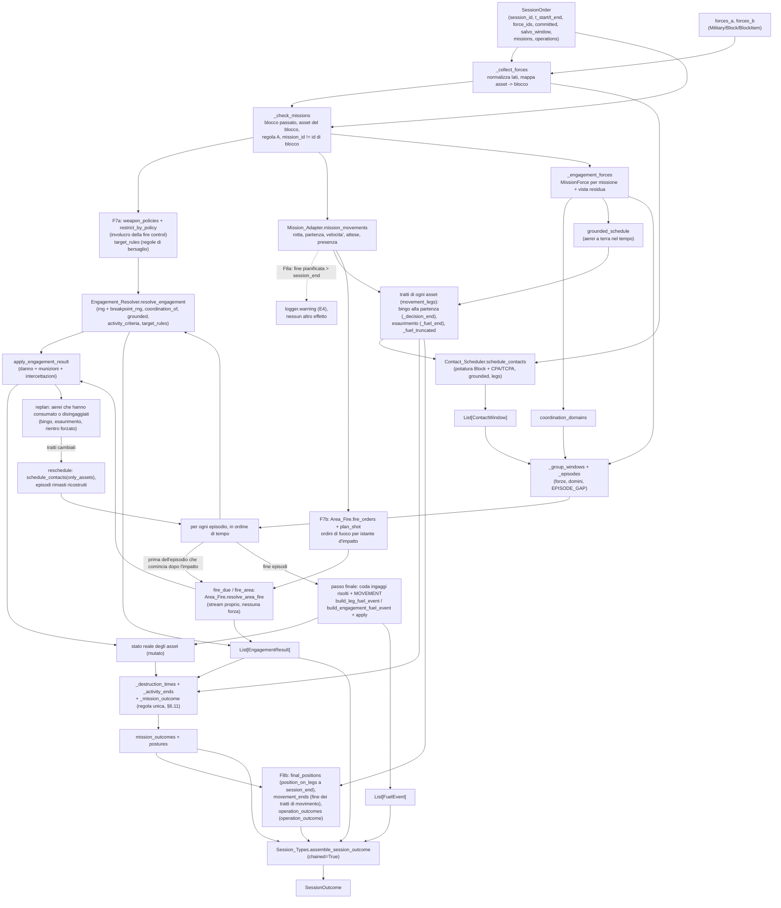
```mermaid
flowchart TD
    ORD["SessionOrder<br/>(session_id, t_start/t_end, force_ids, committed, salvo_window,<br/>missions, operations)"]
    FORCES["forces_a, forces_b<br/>(Military/Block/BlockItem)"]

    ORD --> COLLECT["_collect_forces<br/>normalizza lati, mappa asset -> blocco"]
    FORCES --> COLLECT
    COLLECT --> CHECK["_check_missions<br/>blocco passato, asset del blocco,<br/>regola A, mission_id != id di blocco"]
    ORD --> CHECK
    CHECK --> POL["F7a: weapon_policies + restrict_by_policy<br/>(involucro della fire control)<br/>target_rules (regole di bersaglio)"]
    CHECK --> MA["Mission_Adapter.mission_movements<br/>rotta, partenza, velocita', attese, presenza"]
    MA -.->|"F8a: fine pianificata > session_end"| WARN["logger.warning (E4),<br/>nessun altro effetto"]
    CHECK --> EF["_engagement_forces<br/>MissionForce per missione + vista residua"]
    EF --> DOM["coordination_domains"]
    EF --> GRD["grounded_schedule<br/>(aerei a terra nel tempo)"]

    MA --> LEGS["tratti di ogni asset (movement_legs):<br/>bingo alla partenza (_decision_end),<br/>esaurimento (_fuel_end), _fuel_truncated"]
    GRD --> LEGS
    LEGS --> SCHED["Contact_Scheduler.schedule_contacts<br/>(potatura Block + CPA/TCPA, grounded, legs)"]
    COLLECT --> SCHED
    SCHED --> WINDOWS["List[ContactWindow]"]
    WINDOWS --> GROUP["_group_windows + _episodes<br/>(forze, domini, EPISODE_GAP)"]
    EF --> GROUP
    DOM --> GROUP

    GROUP --> LOOP["per ogni episodio, in ordine di tempo"]
    MA --> AFO["F7b: Area_Fire.fire_orders + plan_shot<br/>ordini di fuoco per istante d'impatto"]
    AFO --> AFE["fire_due / fire_area:<br/>Area_Fire.resolve_area_fire<br/>(stream proprio, nessuna forza)"]
    LOOP -->|"prima dell'episodio che comincia dopo l'impatto"| AFE
    AFE --> APPLY
    LOOP --> ER["Engagement_Resolver.resolve_engagement<br/>(rng + breakpoint_rng, coordination_of, grounded,<br/>activity_criteria, target_rules)"]
    ER --> APPLY["apply_engagement_result<br/>(danno + munizioni + intercettazioni)"]
    APPLY --> STATE["stato reale degli asset (mutato)"]
    APPLY --> REPLAN["replan: aerei che hanno consumato o disingaggiati<br/>(bingo, esaurimento, rientro forzato)"]
    REPLAN -->|tratti cambiati| RESCHED["reschedule: schedule_contacts(only_assets),<br/>episodi rimasti ricostruiti"]
    RESCHED --> LOOP

    LOOP -->|fine episodi| FUEL["passo finale: coda ingaggi risolti + MOVEMENT<br/>build_leg_fuel_event / build_engagement_fuel_event + apply"]
    FUEL --> STATE
    POL --> ER
    ER --> RESULTS["List[EngagementResult]"]
    AFE --> RESULTS
    FUEL --> FEVENTS["List[FuelEvent]"]

    RESULTS --> MOUT["_destruction_times + _activity_ends<br/>+ _mission_outcome (regola unica, §6.11)"]
    LEGS --> MOUT
    STATE --> MOUT
    MOUT --> MOS["mission_outcomes + postures"]
    LEGS --> CAMP["F8b: final_positions (position_on_legs a session_end),<br/>movement_ends (fine dei tratti di movimento),<br/>operation_outcomes (operation_outcome)"]
    MOS --> CAMP

    RESULTS --> ASSEMBLE["Session_Types.assemble_session_outcome<br/>(chained=True)"]
    FEVENTS --> ASSEMBLE
    MOS --> ASSEMBLE
    CAMP --> ASSEMBLE
    ASSEMBLE --> OUT["SessionOutcome"]
```

## 6.9 Diagramma D9 — coda eventi di sessione (schema)

Esempio minimo: due episodi d'ingaggio dello stesso aereo, ciascuno con la ri-pianificazione, e la contabilità finale
del carburante. Aggiornato a `dcedc541` (a `fa5fbf1e` cambia solo l'ultima riga: i tre dati della F8b): due passi, un `resolve_engagement` per episodio, e — dalla F7b — un fuoco su
posizione risolto fra i due episodi (se il suo impatto precede l'inizio del secondo); il dettaglio del ciclo
episodio → ri-pianificazione → ri-scheduling è nel D40 (§6.20), quello del fuoco su posizione nel D50 (§6.23).

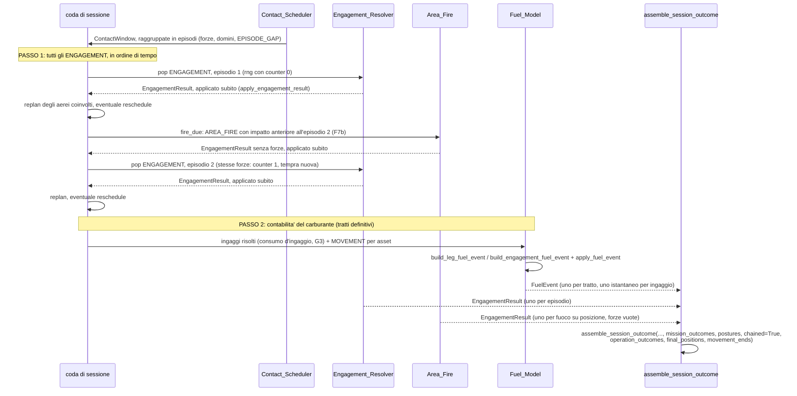
```mermaid
sequenceDiagram
    participant Q as coda di sessione
    participant CS as Contact_Scheduler
    participant ER as Engagement_Resolver
    participant AF as Area_Fire
    participant FM as Fuel_Model
    participant OUT as assemble_session_outcome

    CS->>Q: ContactWindow, raggruppate in episodi (forze, domini, EPISODE_GAP)
    Note over Q: PASSO 1: tutti gli ENGAGEMENT, in ordine di tempo
    Q->>ER: pop ENGAGEMENT, episodio 1 (rng con counter 0)
    ER-->>Q: EngagementResult, applicato subito (apply_engagement_result)
    Q->>Q: replan degli aerei coinvolti, eventuale reschedule
    Q->>AF: fire_due: AREA_FIRE con impatto anteriore all'episodio 2 (F7b)
    AF-->>Q: EngagementResult senza forze, applicato subito
    Q->>ER: pop ENGAGEMENT, episodio 2 (stesse forze: counter 1, tempra nuova)
    ER-->>Q: EngagementResult, applicato subito
    Q->>Q: replan, eventuale reschedule
    Note over Q,FM: PASSO 2: contabilita' del carburante (tratti definitivi)
    Q->>FM: ingaggi risolti (consumo d'ingaggio, G3) + MOVEMENT per asset
    FM->>FM: build_leg_fuel_event / build_engagement_fuel_event + apply_fuel_event
    FM-->>OUT: FuelEvent (uno per tratto, uno istantaneo per ingaggio)
    ER-->>OUT: EngagementResult (uno per episodio)
    AF-->>OUT: EngagementResult (uno per fuoco su posizione, forze vuote)
    OUT->>OUT: assemble_session_outcome(..., mission_outcomes, postures, chained=True,<br/>operation_outcomes, final_positions, movement_ends)
```

## 6.10 La Missione nell'orchestratore: `Logic/Mission_Adapter.py` (fase F3, commit `533cd1f5`; esteso da F4 a G4b e dalla F7a)

Modulo nato in F3 (483 righe), arrivato a 926 righe a `84a47670`, a 1776 a `a784a9e7` e a **1973 righe a `dcedc541`**: la **logica** che ricava,
per ogni asset di una `Mission`, la forma che `run_session` consuma — le tre mappe `routes`/`starts`/`speeds` di
`Contact_Scheduler.schedule_contacts` e, dalla F5, le **attese**, la **presenza** prima e dopo la rotta e il **programma a
terra** (§6.15-6.16). Dalla F4 contiene anche la **regola A** (velocità del mezzo più lento, sotto), la **vista
d'ingaggio** `MissionForce` (§6.12), il **dominio di coordinamento** (§6.13) e la **postura continua** con gli aerei a
terra (§6.14); dalla F6 i **validatori di pianificazione** del carburante e le funzioni che alimentano il bingo (§6.19);
**dalla F7a** le quattro funzioni che traducono bersaglio, ROE e armi designate della missione nelle forme che il motore
consuma (`designated_targets`, `weapon_policies`, `attack_point`, `target_rules`: §6.22).
`Command/Mission_Types` (capitolo 2 §2.6) è solo struttura. Funzioni pure: nessun RNG, nessuna mutazione
(`Logic/Mission_Adapter.py:1-296`, docstring del modulo).

### Rotta per asset: rotta di riferimento + offset di formazione (D3.b)

La missione ha **una** rotta di riferimento (`Mission.route`, o in mancanza la spezzata dei
`MissionWaypoint`, `reference_route`, `:473-488`; `_route_from_waypoints`, `:450-470`, richiede la velocità
dichiarata su ogni punto d'arrivo, altrimenti `ValueError`); ogni `MissionAsset` dichiara un offset
(`forward_m`, `right_m`, `up_m`) nella terna della direzione di marcia, con la convenzione del progetto
(nord = +y, est = +x, azimut orario):

- **avanti**: versore **orizzontale** della direzione di marcia (la quota non inclina la formazione);
- **destra**: avanti ruotato di 90° in senso orario visto dall'alto, `(hy, −hx)` (`:594`);
- **alto**: `+z`.

`asset_route(mission, mission_asset)` (`:628-656`) restituisce `(rotta, velocità uniforme)`. **Offset nullo e
nessuna velocità per tratto = la STESSA rotta** (lo stesso oggetto `Route`): i tratti sono identici a quelli
della rotta di riferimento, senza alcuna aritmetica in mezzo.

**Regola ai cambi di direzione, decisa in F3: la formazione ruota con la rotta, sulla bisettrice**
(`offset_points`, `:563-601`; `_point_frame`, `:543-560`). L'offset si applica **punto per punto**, non tratto
per tratto (applicarlo per tratto staccherebbe i tratti consecutivi):

- primo punto: terna del primo tratto; ultimo punto: terna dell'ultimo tratto;
- punto intermedio: terna della **bisettrice** `b = normalizzato(h_entrata + h_uscita)`, la direzione media
  fra il tratto in arrivo e quello in partenza;
- la componente **laterale** è scalata di `1/cos(θ/2)` (θ = angolo di virata; giunzione "a spigolo", la
  stessa delle spezzate parallele): i tratti dell'asset restano **paralleli** a quelli di riferimento, a
  distanza `right_m`, prima e dopo la virata. Il fattore è limitato a `MITER_LIMIT = 2.0` (`:346`, **stima di
  progetto**, esatto fino a virate di 120°, tagliato oltre); la componente **avanti** è presa lungo la
  bisettrice, senza scala;
- **inversione esatta** (`h_uscita = −h_entrata`, bisettrice indefinita): si usa la terna del tratto in
  **entrata**; il tratto successivo porta l'asset nella terna d'uscita al punto dopo (in una virata di 180° il
  gregario di destra finisce dall'altra parte del riferimento, come in una formazione vera);
- i tratti senza componente orizzontale (salita o discesa sulla verticale, punti ripetuti) ereditano la
  direzione dal tratto orizzontale più vicino (prima il precedente, `_leg_headings`, `:523-540`); una rotta
  senza alcun tratto orizzontale ammette solo `up_m` (altrimenti `ValueError`);
- le coordinate sono arrotondate al micrometro (`OFFSET_DECIMALS = 6`, `:349`): il rumore della rotazione
  (ordine 1e-12 m) non ha significato fisico e non deve comparire come differenza di posizione (sympy
  `Point3D` conserva i float come razionali).

**Conseguenza da sapere**: una formazione che trasla *rigidamente* (stesso spostamento per ogni punto)
coincide con "rotta di riferimento + offset" **solo** se la rotta non cambia direzione; con virate la traslata
è un'altra geometria. Per questo `Scenario_Fixtures.missions_for` (capitolo 8 §8.1) accetta un offset solo se
`asset_route` riproduce **esattamente** la rotta traslata dell'asset, altrimenti l'asset ha una missione
propria.

### Velocità

`MissionWaypoint.speed_kmh` è la velocità del tratto **in arrivo** al punto (`None` = quella dell'arco della
rotta, in m/s); quella del primo punto non ha tratto in arrivo ed è ignorata (`_leg_speeds`, `:491-508`).
Nessuna velocità dichiarata: valgono quelle degli archi, nessuna voce in `speeds`. Tutti i tratti dichiarano la
**stessa** velocità: una voce in `speeds` [m/s] (sostituisce quella degli archi, semantica di `route_legs`),
rotta invariata. Dichiarazioni diverse o parziali: la rotta per asset è ricostruita (`_rebuild_route`,
`:604-623`) con la velocità dichiarata sui tratti che la dichiarano e quella dell'arco sugli altri.
Conversione `kmh_to_ms` (`:410-412`): `km/h / 3.6`.

**Regola A: la missione si muove insieme, alla velocità del mezzo più lento** (F4a, `951b0ee2`, decisione
dell'utente: una missione è un gruppo, come un gruppo DCS; chi vuole velocità diverse fa missioni separate,
eventualmente coordinate da un'Operazione). `check_mission_speed(mission, assets, t0)` (`:1163-1211`, chiamata da
`Session_Simulator._check_missions`, `:1942-1944`) verifica che la velocità pianificata di ogni tratto
(`planned_speeds`, `:1152-1160`: quella di missione, o in mancanza quella dell'arco) non superi la velocità
**massima** (`asset.speed['max']`, m/s, `_max_speed`, `:1141-1149`) del mezzo più lento della missione; altrimenti
`ValueError`. Ritorna il limite applicato, o `None` se nessun asset ha il dato o la missione non si muove.
Dettagli (docstring `:76-91`):

- un asset senza velocità massima nota (modello senza dato, asset non `Mobile`) è **escluso dal confronto con un
  warning**, non blocca la missione (`:1191-1194`);
- il limite è il regime `'max'` **generico**, non quello per terreno (`speed['off_road']['max']`): gli scenari
  pianificano oggi i mezzi terrestri al regime nominale su archi 'offroad', e il vincolo per tipo d'arco va
  deciso con il modulo mappe (limite noto);
- tolleranza `SPEED_TOLERANCE = 1e-6` m/s (`:362`): rumore di conversione delle unità, non un margine fisico.

Negli scenari il controllo non scatta mai: le velocità pianificate sono le nominali del registro, sotto le
massime. Esempio verificato sul registro (`Asset/Vehicle_Data.py`): M1A2 con velocità sostenuta 55 km/h e massima
67 km/h (18,611 m/s), M2-Bradley 56 e 66 km/h (18,333 m/s); la missione Blue-Armor procede a 55 km/h
(15,278 m/s), la nominale del più lento (capitolo 8 §8.1).

### Partenza (`mission_start`, `:672-727`)

Gli istanti di una missione sono in secondi dall'inizio della sessione; la partenza assoluta è `t0 + ...` con
`t0 = SessionOrder.t_start`. In ordine di precedenza: (1) `start_time` (dalla F5-C **ritardata** da un'ETA bloccata più
tarda sul punto di partenza, `:686-689`); (2) il primo waypoint con `eta_locked`: partenza = ETA − tempo di percorrenza
fino a quel punto sulla rotta di riferimento (con le velocità di missione, `_travel_time_to`, `:659-669`, e le attese di
durata nota prima del punto, `:717-719`); (3) `tot`, ancorato al primo waypoint `ATTACK` (o, in mancanza, `OBJECTIVE`,
`_TOT_ANCHOR_ROLES`, `:365`): stessa derivazione; senza punto d'ancoraggio `ValueError`. **Il TOT è della missione**, non
dell'Operazione (§6.16). Tutti gli asset di una missione partono **insieme** (la formazione è una). Una partenza derivata
**anteriore all'inizio della sessione** è un errore (le missioni fuori finestra sono rifiutate dal validatore di sessione,
`Logic/Session_Validator`, F8a, §6.25; qui non si tagliano in silenzio: `mission_start` solleva `ValueError`, che il validatore traduce in
`MISSION_START_INVALID`). `Activation.ON_EVENT` è solo dichiarabile: `ValueError`.

### API

`AssetMovement(mission_id, asset_id, route, start, speed, holds, present_before, present_after, grounded_before,
grounded_after)` (`:415-443`; gli ultimi cinque campi sono della F5 e hanno default «nessuna attesa, nessuna presenza»);
`mission_movements(mission, t0, air_bases)` (`:939-956`, uno per asset nell'ordine degli asset; `air_bases` serve al
criterio d'atterraggio, §6.15); `session_movements(missions, t0)` (`:1071-1106`): `(routes, starts, speeds)` per
`schedule_contacts`, **solo** per gli asset con rotta (gli altri restano fermi) e `speeds` solo per quelli con velocità
uniforme dichiarata; **non portano le attese né la presenza** (in sessione i tratti completi vanno allo scheduler come
`legs`, §6.15); solleva `ValueError` se un asset è in due missioni (già vietato da `SessionOrder`, qui per chi chiama
direttamente); `waypoint_times(movement)` (`:1109-1113`): gli istanti assoluti d'**arrivo** ai punti della rotta
dell'asset, **attese comprese** (F5-C), senza taglio alla sessione (base delle ETA effettive, §6.11); `mission_routes`
(`:1512-1514`); `check_mission_speed` (regola A, sopra).

Le funzioni delle fasi successive, tutte descritte nelle sezioni indicate:

| Funzione | Fase | Sezione |
|---|---|---|
| `mission_holds`, `_wait_end`, `_locked_targets`, `_timeline` | F5-C | §6.16 |
| `movement_legs`, `grounded_intervals`, `grounded_schedule`, `lands_on_air_base`, `air_base_points`, `final_posture`, `session_postures` | F5-A/B | §6.15 |
| `airborne_legs`, `is_loop_mission`, `bingo_return_rule`, `is_transfer_mission`, `mission_bingo_decision`, `check_mission_bingo`, `check_mission_fuel`, `route_fuel_demand` | F6-B2 → G4b | §6.19 |
| `designated_targets`, `weapon_policies`, `attack_point`, `target_rules`, `_asset_sides`, `TARGET_POINT_RADIUS_M` | F7a | §6.22 |

**Cosa non fa** (docstring `:287-293`): nessun circuito d'orbita (le orbite sono presenza ferma, §6.16); il carburante non è
calcolato qui (`Fuel_Model`); non usa i **ruoli** degli asset né i criteri di fine (letti dalla sessione, §6.18), e di
**regole e bersaglio** della missione legge **solo** ciò che serve alle regole d'ingaggio della F7a (la `roe`, il bersaglio e
le armi designate, §6.22): allerta, EMCON, reazione alla minaccia e formazione restano validati e portati dalla porta ma non
letti da `Logic`; nessun rientro (RTB) nella rotta: lo costruisce la sessione, dalla decisione di `mission_bingo_decision`
(§6.19). Nessun RNG, nessuna mutazione: funzioni pure (la vista non copia né muta gli asset). (Il docstring ha dalla F7a il
punto sulle regole d'ingaggio, e dalla pulizia `d1686b28` le due righe sulla postura `off_scene`, §6.15.)

## 6.11 Esito di missione (`_mission_outcome`, `:2049-2158`; prima forma alla F3, regola unica dalla F6-B1, `IN_PROGRESS` dalla F8b)

Dopo che tutti gli eventi sono stati applicati, `run_session` calcola un `MissionOutcome` per ogni missione
dell'ordine (`:3098-3104`), con gli asset nello stato **finale** (salute dopo l'applicazione, rientri ed esaurimenti
come risultano dopo tutte le ri-pianificazioni). Alla F3 la regola era una «prima forma» a tre casi (completata,
distrutta, non completata); dalla F6-A/F6-B in poi è la **regola unica** qui sotto, che legge fino a quattro fonti:
le distruzioni in combattimento (`_destruction_times`, `:2029-2046`), le fini di attività dei criteri di missione
(`_activity_ends`, `:1885-1928`, §6.18), l'esaurimento del carburante (`fuel_ends`, §6.17) e i rientri
(`bingo_ends`, §6.19-6.20).

**Per asset** (`AssetMissionOutcome`), nell'ordine in cui i casi sono provati:

1. `DESTROYED`/`DESTROYED` all'istante del primo `DamageEvent` che lo distrugge, o a `t0` se era già distrutto
   all'inizio, **a meno che** non sia stato perso per carburante prima;
2. `DESTROYED`/`FUEL_EXHAUSTED` all'istante dell'esaurimento, con **`crew_recovered=True`**, per un aereo a secco in
   volo senza base raggiungibile in planata (`FUEL_CRASH`, §6.17; l'equipaggio recuperato è decisione dell'utente del
   2026-10-15, vale per il solo aereo perso per carburante: le perdite in combattimento hanno `crew_recovered=None`);
3. altrimenti (stato `DAMAGED` se la salute finale è < 100, altrimenti `OPERATIONAL`):
   - `ROUTE_COMPLETED` all'istante d'arrivo all'ultimo punto, se lo raggiunge dentro la sessione **e** non dopo una
     fine di attività (l'asset a fine attività prosegue passivo sulla rotta: un arrivo successivo non completa);
   - altrimenti la **fine di attività** (`WINCHESTER`, `DAMAGE`, `TARGET_DESTROYED`, `MAX_DURATION`) al suo istante, se
     cade dentro la sessione e prima dell'esaurimento o del rientro;
   - altrimenti `FUEL_EXHAUSTED` all'istante dell'esaurimento (asset di terra/mare fermo nel punto, aereo atterrato in
     planata), anche se a secco sul rientro: conta l'ultimo fatto;
   - altrimenti il **rientro**: `BINGO` o, dal G4b, `DISENGAGED` (`BingoEnd.reason`), all'istante della decisione;
   - altrimenti `SESSION_END` alla fine della sessione: rotta tagliata, o missione senza rotta (sul posto), ancora
     in corso. È il motivo che, **dalla F8b**, può dare alla missione lo stato `IN_PROGRESS` (sotto).

**Per missione** (regola unica, F6-B1/D2.d, confermata dall'utente il 2026-10-12; `:2090-2109`):

`DESTROYED` (tutti gli asset persi, anche per carburante) **>** `COMPLETED` **>** `ABORTED(motivo)` **>** `IN_PROGRESS` **>**
`FAILED` (`IN_PROGRESS` dalla F8b, con `F8_IN_PROGRESS` acceso; spento la catena è quella di prima).

- `COMPLETED` = **obiettivo raggiunto**: con `target_destroyed` dichiarato **e rappresentabile** (bersaglio `ASSET` o
  `GROUP`) i bersagli tutti distrutti nella sessione; altrimenti un asset all'ultimo punto **prima** di una distruzione
  e di una fine di attività, oppure la fine per `MAX_DURATION` (durata o tempo sulla stazione esaurito: una fine
  *regolare*). Con `target_destroyed` dichiarato la sola rotta completata **non** è l'obiettivo: `FAILED`.
- `ABORTED` = **ogni asset superstite** ha chiuso per carburante, bingo, disingaggio, munizioni o danno
  (`_ABORT_REASON_OF`, `:1685-1689`); il motivo è quello dell'asset che ha chiuso per **ultimo** e, a parità d'istante,
  la precedenza è `FUEL > BINGO > DISENGAGED > AMMUNITION > DAMAGE` (prima i fatti fisici sul carburante, poi la
  decisione tattica, poi munizioni e danno). Un gregario in winchester con il capo ancora in missione **non** fa
  abortire la missione (prima della F6-B1, con la precedenza provvisoria della F6-A, bastava un asset a secco).
- **`IN_PROGRESS` (F8b, `:2141-2142`)** = la missione non è finita alla fine della sessione: non è distrutta, non è completata, non è
  abortita (esiste almeno un asset superstite che **non** ha chiuso per un motivo di aborto) **e** almeno un asset superstite ha come
  motivo di fine `SESSION_END`, cioè è ancora sulla rotta tagliata dalla fine della sessione o, per una missione senza rotta, è ancora sul
  posto. È la risposta al punto aperto D4.e del piano («manca uno stato "in corso"»): una missione sul posto non è più `FAILED`. Con
  `F8_IN_PROGRESS` spento il ramo non esiste e quella missione è `FAILED`. Non ammette un `reason` (come ogni stato diverso da `ABORTED`).
- `FAILED` = fine senza obiettivo e senza motivo: **non più** «ancora in corso» a fine sessione (che dalla F8b è `IN_PROGRESS`), ma
  l'obiettivo mancato con la rotta completata (per esempio con `target_destroyed` dichiarato e bersaglio non distrutto) o il caso con
  `F8_IN_PROGRESS` spento.

Con `F6_END_CRITERIA` spento resta la precedenza provvisoria della F6-A (`ABORTED(FUEL)` se *almeno* un asset
superstite è fermo o atterrato per carburante, `:2132`).

**ETA effettive** per punto (`actual_etas`): il primo passaggio, fra gli asset non ancora distrutti a quell'istante,
dentro la sessione, calcolato dai tratti con le attese (`Mission_Adapter.waypoint_times`, F5-C), **non** dalle ETA
pianificate; `None` se nessuno ci arriva (oltre un esaurimento o un bingo i punti successivi non sono raggiunti,
`:2037-2039`). È l'istante d'**arrivo** al punto, prima di un'eventuale attesa (`:2111-2123`).

**Missione senza rotta (sul posto).** Nessun asset raggiunge «l'ultimo punto»: fino alla F7 con almeno un superstite la missione
risultava `FAILED`, perché il `MissionStatus` non aveva lo stato «in corso» che il piano le attribuiva. **Dalla F8b** risulta
`IN_PROGRESS` (con `F8_IN_PROGRESS` acceso, il default). Se invece la missione dichiara `EndCriteria.max_duration_s`, al suo scadere dentro la
sessione l'asset chiude con `MAX_DURATION` e la missione è `COMPLETED` (fine regolare). Nella fotografia l'unico effetto dell'interruttore
è, secondo la sonda in sola lettura della Proposta F8 §1.8 (non rieseguita per questo aggiornamento), su due esiti non registrati (`S22-E3`,
seed 3 e 4, variante `not_departed`: il carro non ancora partito alla fine della sessione), e su un
test (`Test_Session_Simulator.test_route_cut_by_the_session_end_is_in_progress`, con la controprova a interruttore spento
`test_route_cut_by_the_session_end_off_is_failed`); la fotografia non registra lo stato di missione (capitolo 8 §8.7).

*Diagramma D19 — esito di missione, regola unica (`_mission_outcome`). Aggiornato a `a784a9e7`; **a `fa5fbf1e`** l'ultimo rombo prima di
`FAILED` è il ramo `IN_PROGRESS` della F8b.*

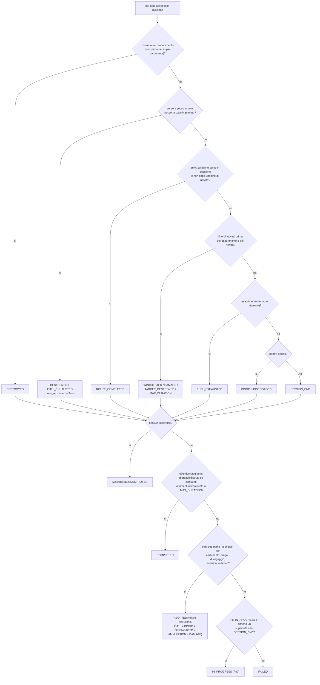
```mermaid
flowchart TD
    A0["per ogni asset della missione"] --> D{"distrutto in combattimento<br/>(non prima perso per carburante)?"}
    D -->|si| AD["DESTROYED"]
    D -->|no| CR{"aereo a secco in volo,<br/>nessuna base in planata?"}
    CR -->|si| AF["DESTROYED / FUEL_EXHAUSTED<br/>crew_recovered = True"]
    CR -->|no| RC{"arriva all'ultimo punto in sessione<br/>e non dopo una fine di attivita'?"}
    RC -->|si| AR["ROUTE_COMPLETED"]
    RC -->|no| AC{"fine di attivita' prima<br/>dell'esaurimento o del rientro?"}
    AC -->|si| AE["WINCHESTER / DAMAGE /<br/>TARGET_DESTROYED / MAX_DURATION"]
    AC -->|no| FX{"esaurimento (fermo o atterrato)?"}
    FX -->|si| AX["FUEL_EXHAUSTED"]
    FX -->|no| BG{"rientro deciso?"}
    BG -->|si| AB["BINGO o DISENGAGED"]
    BG -->|no| SE["SESSION_END"]
    AD --> M{"nessun superstite?"}
    AF --> M
    AR --> M
    AE --> M
    AX --> M
    AB --> M
    SE --> M
    M -->|si| ST1["MissionStatus.DESTROYED"]
    M -->|no| O{"obiettivo raggiunto?<br/>(bersagli distrutti se dichiarati,<br/>altrimenti ultimo punto o MAX_DURATION)"}
    O -->|si| ST2["COMPLETED"]
    O -->|no| AB2{"ogni superstite ha chiuso per<br/>carburante, bingo, disingaggio,<br/>munizioni o danno?"}
    AB2 -->|si| ST3["ABORTED(motivo dell'ultimo,<br/>FUEL > BINGO > DISENGAGED ><br/>AMMUNITION > DAMAGE)"]
    AB2 -->|no| IP{"F8_IN_PROGRESS e almeno un<br/>superstite con SESSION_END?"}
    IP -->|si| ST5["IN_PROGRESS (F8b)"]
    IP -->|no| ST4["FAILED"]
```

*Diagramma D20 — pipeline di `Mission_Adapter`: dalla `Mission` a rotta, partenza e velocità per asset.*

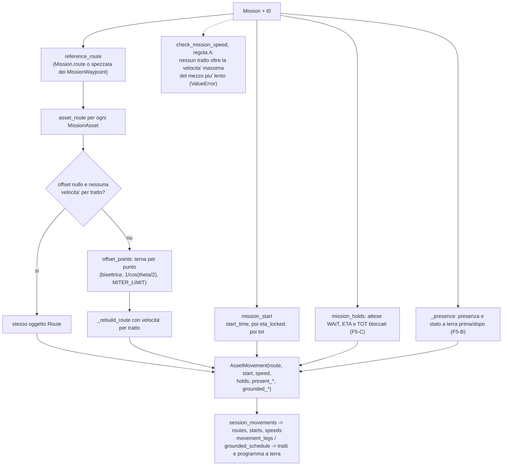
```mermaid
flowchart TD
    MI["Mission + t0"] --> RR["reference_route<br/>(Mission.route o spezzata dei MissionWaypoint)"]
    MI -.-> RA["check_mission_speed, regola A:<br/>nessun tratto oltre la velocita' massima<br/>del mezzo piu' lento (ValueError)"]
    MI --> MS["mission_start<br/>start_time, poi eta_locked, poi tot"]
    MI --> HL["mission_holds: attese WAIT, ETA e TOT bloccati (F5-C)"]
    MI --> PR["_presence: presenza e stato a terra prima/dopo (F5-B)"]
    RR --> AR["asset_route per ogni MissionAsset"]
    AR --> Z{"offset nullo e nessuna<br/>velocita' per tratto?"}
    Z -->|si| SAME["stesso oggetto Route"]
    Z -->|no| OFF["offset_points: terna per punto<br/>(bisettrice, 1/cos(theta/2), MITER_LIMIT)"]
    OFF --> REB["_rebuild_route con velocita' per tratto"]
    SAME --> MOV["AssetMovement(route, start, speed,<br/>holds, present_*, grounded_*)"]
    REB --> MOV
    MS --> MOV
    HL --> MOV
    PR --> MOV
    MOV --> SM["session_movements -> routes, starts, speeds<br/>movement_legs / grounded_schedule -> tratti e programma a terra"]
```

*Diagramma D21 — regola dell'offset di formazione ai cambi di direzione (`_point_frame`).*

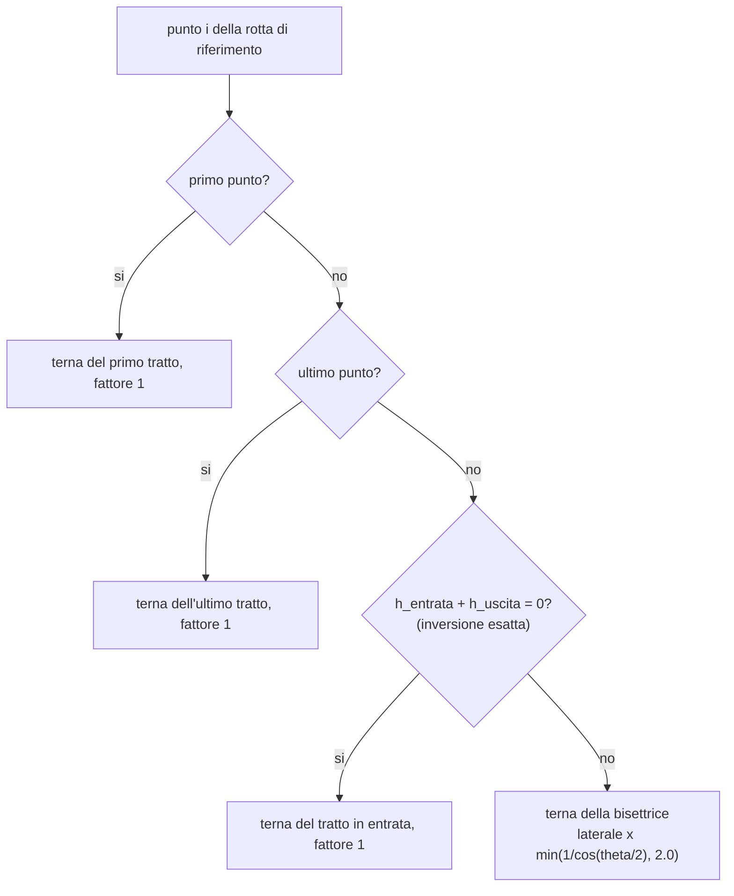
```mermaid
flowchart TD
    P["punto i della rotta di riferimento"] --> F{"primo punto?"}
    F -->|si| T1["terna del primo tratto, fattore 1"]
    F -->|no| L{"ultimo punto?"}
    L -->|si| T2["terna dell'ultimo tratto, fattore 1"]
    L -->|no| B{"h_entrata + h_uscita = 0?<br/>(inversione esatta)"}
    B -->|si| T3["terna del tratto in entrata, fattore 1"]
    B -->|no| T4["terna della bisettrice<br/>laterale x min(1/cos(theta/2), 2.0)"]
```

## 6.12 La missione come forza d'ingaggio: `_engagement_forces` e `MissionForce` (F4b, `a4d8acf0`)

**Che cosa fa.** Dalla F4b `run_session` non passa al risolutore i blocchi ma una *forza d'ingaggio* per
missione. Lo scheduler continua a ricevere i blocchi (`items_a`/`items_b`): le finestre di contatto sono per
coppia di asset e la potatura per blocco non dipende da come gli asset sono raggruppati in forze, quindi le
finestre sono **le stesse di prima**. Il raggruppamento in forze avviene dopo lo scheduler.

**`_engagement_forces(order, blocks, block_owner)`** (`:1960-2003`) costruisce, per ogni blocco in ordine di id:

- **blocco senza missioni**: la forza è il blocco stesso (stesso id e stessa classe di prima della F4b);
- **blocco con missioni**: una `MissionForce.of_mission(mission, block)` per missione, nell'ordine dell'ordine di
  sessione (`id` = `mission_id`); e, se restano asset del blocco in nessuna missione, la **vista residua**
  `MissionForce.unassigned(block, missions)` con l'id del blocco.

Restituisce `forces` (`{id di forza: forza}`) e `owner` (`{asset_id: (lato, id di forza)}`), che
`_group_windows` usa per raggruppare le finestre per coppia di forze (§6.3). Un `mission_id` uguale all'id di un
blocco passato è rifiutato in `_check_missions` (`:1922-1924`).

**`MissionForce`** (`Logic/Mission_Adapter.py:1649-1746`) è una *vista*, non una copia: i suoi `assets` sono gli
oggetti **reali** del blocco ristretti a quelli della vista (con le chiavi e nell'ordine del blocco), quindi danno,
munizioni e carburante applicati dal motore arrivano al blocco; il blocco resta l'unità di appartenenza,
rifornimento e comando (`asset.block` non cambia). Espone solo ciò che il risolutore legge (capitolo 4 §4.27):

| Attributo | Significato |
|---|---|
| `id`, `name` | `mission_id` (vista residua: id e nome del blocco) |
| `mission_id`, `mission` | l'id e la `Mission` (entrambi `None` per la vista residua); il risolutore non li legge |
| `owner_block`, `block_id` | il blocco d'appartenenza e il suo id di dominio. Il riferimento si chiama `owner_block`, **non** `block`: `Contact_Scheduler._as_block` e `Session_Simulator._as_block` scartano un `.block` (forma del `BlockItem`) e scambierebbero la vista per il suo blocco |
| `side` | lato del blocco |
| `assets` | `{chiave: asset}` del blocco ristretto alla vista |
| `can_disengage` | calcolato sul **blocco** con la regola di `_can_disengage` (`validate_class(block, 'Military') or not validate_class(block, 'Block')`, `:1691`): adattatore, perché la vista non è né `Military` né `Block` (capitolo 4 §4.7) |
| `postures`, `grounded` | postura continua e insieme degli aerei a terra della vista: valorizzati **solo** per la vista residua, vuoti per una vista di missione (`:1698-1700`, §6.14) |
| `salvo_interceptors()` | quella del blocco ristretta agli asset della vista, stesso ordine (`:1733-1742`) |

Non c'è nessuna delega generica degli attributi al blocco (niente `__getattr__`): le grandezze aggregate del
blocco (potenza di combattimento, volumi, ...) riguardano **tutti** i suoi asset e, lette sulla vista, sarebbero
sbagliate in silenzio. Un asset che non appartiene al blocco, o un blocco senza id di dominio, solleva
`ValueError`; `of_mission` solleva `TypeError` se non riceve una `Mission` e `ValueError` se il blocco non è
quello della missione.

**`SessionOrder.committed` per forza.** La porta lo chiavava per blocco e continua a farlo.
`_engagement_committed` (`:2006-2026`) lo traduce: per ogni forza d'ingaggio, se il blocco della forza è in
`committed`, la restrizione vale **intersecata con gli asset della forza**; una forza di un blocco non elencato
non ha restrizione. `None` se l'ordine non restringe nulla.

**Esito.** Un `ForceOutcome` per forza d'ingaggio **e per episodio** (G4a, §6.20), con `force_id` = `mission_id` e `block_id` = blocco; per la
vista residua e per un blocco senza missioni `force_id` è l'id del blocco (capitolo 2 §2.3). L'esito di un blocco
è `SessionOutcome.outcomes_of_block`, un insieme. **Il `MissionOutcome` non dipende dalla F4b**: è calcolato per missione
come in §6.11, a prescindere dall'ingaggio.

*Diagramma D30 — la vista di missione `MissionForce` e ciò che il risolutore ne legge (§6.12).*

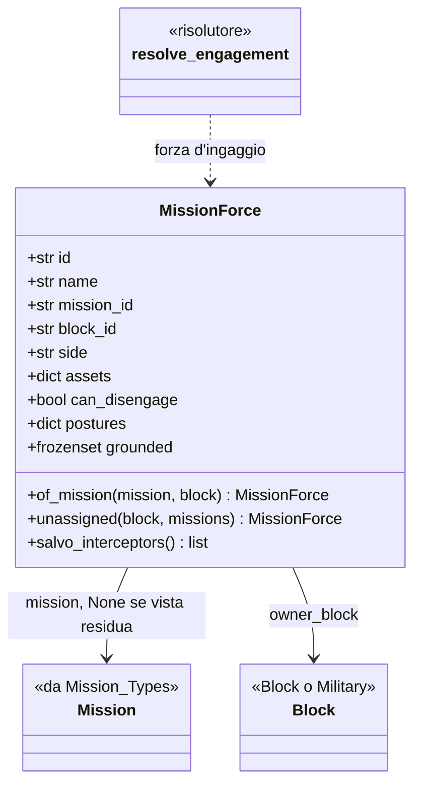
```mermaid
classDiagram
    class MissionForce {
        +str id
        +str name
        +str mission_id
        +str block_id
        +str side
        +dict assets
        +bool can_disengage
        +dict postures
        +frozenset grounded
        +of_mission(mission, block) MissionForce
        +unassigned(block, missions) MissionForce
        +salvo_interceptors() list
    }
    class Mission {
        <<da Mission_Types>>
    }
    class Block {
        <<Block o Military>>
    }
    class resolve_engagement {
        <<risolutore>>
    }

    MissionForce --> Mission : mission, None se vista residua
    MissionForce --> Block : owner_block
    resolve_engagement ..> MissionForce : forza d'ingaggio
```

*Diagramma D31 — come `_engagement_forces` costruisce le forze di un blocco (§6.12).*

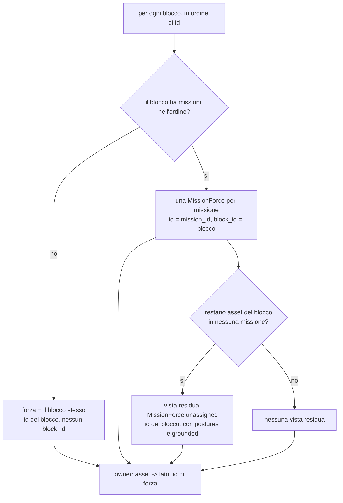
```mermaid
flowchart TD
    B["per ogni blocco, in ordine di id"] --> Q{"il blocco ha missioni nell'ordine?"}
    Q -->|no| W["forza = il blocco stesso<br/>id del blocco, nessun block_id"]
    Q -->|si| M["una MissionForce per missione<br/>id = mission_id, block_id = blocco"]
    M --> R{"restano asset del blocco<br/>in nessuna missione?"}
    R -->|si| V["vista residua MissionForce.unassigned<br/>id del blocco, con postures e grounded"]
    R -->|no| E["nessuna vista residua"]
    W --> O["owner: asset -> lato, id di forza"]
    M --> O
    V --> O
    E --> O
```

## 6.13 Il dominio di coordinamento: `coordination_domains` (F4b+, `098671d7`)

`Mission_Adapter.coordination_domains(forces, operations)` (`Logic/Mission_Adapter.py:1751-1831`) assegna a ogni
forza d'ingaggio la **chiave del suo dominio di coordinamento** che il risolutore riceve come `coordination_of`
(capitolo 4 §4.28). La regola è dell'utente (decisioni 6 e 7 del 2026-10-11): due forze **dello stesso lato**
sono nello stesso dominio se hanno lo stesso **blocco** *oppure* appartengono alla stessa **Operazione**, con
**unione transitiva**. Realizzata con un union-find (`find`/`union`, `:1780-1793`) su nodi `('force', id)`,
`('block', lato, id del blocco)` e `('operation', lato, id dell'Operazione)`:

- ogni forza è unita al proprio nodo-blocco (`:1811`): per una `MissionForce` è `block_id`, per un blocco senza
  missioni è l'id del blocco; **la vista residua e il blocco senza missioni hanno l'id del blocco, quindi stanno
  nel dominio delle missioni del blocco**;
- se la forza è una missione in un'Operazione, è unita anche al nodo-Operazione (`:1813-1818`). L'appartenenza si
  legge da `Operation.mission_ids` e da `Mission.operation_id` (`SessionOrder` ne garantisce la coerenza);
- **mai a cavallo di due lati**: i nodi-blocco e -Operazione portano il lato nella chiave, quindi un'Operazione
  che elenca missioni di lati diversi (`SessionOrder` non conosce i blocchi e non può vietarlo) lega solo le
  missioni dello stesso lato — **un dominio per lato**, con un `warning` (`:1820-1824`). È una scelta dichiarata:
  l'Operazione è un raggruppamento di scopo, non di comando, quindi l'ordine non è rifiutato. Il risolutore
  verifica comunque l'invariante (`ValueError`, capitolo 4 §4.28);
- **chiave** = l'id di forza minore (ordine delle stringhe) fra i membri del dominio (`:1826-1831`): è l'id di una
  delle sue forze, quindi non può coincidere con la chiave di un altro dominio, e senza legami la chiave di una
  forza è il suo id (comportamento precedente). La funzione è pura, deterministica, indipendente dall'ordine dei
  dizionari.

Solleva `TypeError` se `forces` non è una mappa o se `operations` contiene altro che `Operation`
(`:1839-1846`). Chi la usa: `run_session` (`:2237`) la passa a `_connected_components` (le forze di un dominio vanno
nella stessa run, §6.3) e a ogni `resolve_engagement`.

*Diagramma D35 — regole di unione di `coordination_domains` (§6.13).*

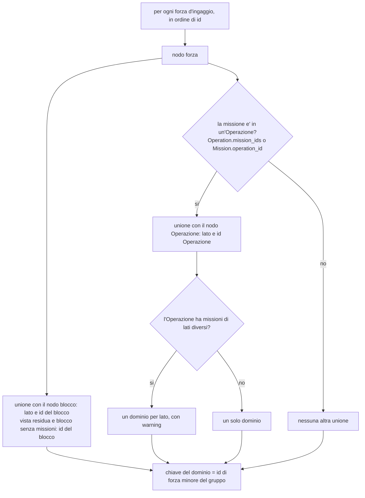
```mermaid
flowchart TD
    F["per ogni forza d'ingaggio, in ordine di id"] --> N["nodo forza"]
    N --> B["unione con il nodo blocco: lato e id del blocco<br/>vista residua e blocco senza missioni: id del blocco"]
    N --> O{"la missione e' in un'Operazione?<br/>Operation.mission_ids o Mission.operation_id"}
    O -->|si| U["unione con il nodo Operazione: lato e id Operazione"]
    O -->|no| X["nessuna altra unione"]
    U --> L{"l'Operazione ha missioni di lati diversi?"}
    L -->|si| W["un dominio per lato, con warning"]
    L -->|no| K["un solo dominio"]
    B --> C["chiave del dominio = id di forza minore del gruppo"]
    W --> C
    K --> C
    X --> C
```

## 6.14 Postura continua e aerei a terra: `continuous_posture`, `grounded_assets` (F4c, `af2efbe6`; esteso dalla F5)

**La decisione** (utente, 2026-10-11, D1.c): gli asset di un blocco **senza missione** non sono più semplicemente
"fermi": hanno una *postura continua*. Un **aereo** è a terra; un'**unità terrestre o navale** è in postura
`Defense` dichiarata, con il tiro invariato (capitolo 4 §4.30).

**`continuous_posture(asset)`** (`Logic/Mission_Adapter.py:1532-1545`) è una funzione pura che legge solo la classe
dell'asset (`validate_class`), senza leggere né mutare il suo stato: `Aircraft` → `PARKED_POSTURE`
(`StartMode.PARKING_COLD.value`, cioè `'parking_cold'`, "l'aereo sul parcheggio a motori spenti"); `Ship` →
`SEA_DEFENSE_POSTURE` (`Sea_Task.DEFENSE.value`, `'Defense'`); ogni altro asset (veicolo, struttura, stub) →
`GROUND_DEFENSE_POSTURE` (`Ground_Action.DEFENSE.value`, `'Defense'`); le costanti sono a `:370-372`. Le etichette
sono **valori già esistenti** di `Context`/`Mission_Types`, non costanti nuove. `unassigned_postures(assets)`
(`:1548-1558`) dà `{asset_id: postura}` saltando gli asset senza id.

**`grounded_assets(forces)`** (`:1561-1584`) raccoglie gli id degli aerei a terra fra le forze d'ingaggio della
sessione: per una `MissionForce` residua è `force.grounded` (`:1699-1700`, aerei con postura `PARKED_POSTURE`);
per un **blocco senza missioni** (passato tale e quale) si applica la stessa regola agli asset del blocco
(`:1581-1582`); gli aerei di una vista di **missione** non sono a terra (`grounded` vuoto, `postures` vuota,
`:1698`). Restituisce un `frozenset`; vuoto se non ci sono aerei fuori missione, e allora la sessione è identica a
quella precedente alla F4c. Alla F4c `run_session` lo passava tale e quale a scheduler e risolutore; **dalla F5** lo
include come intervalli `ALWAYS` nel programma `Mission_Adapter.grounded_schedule` (`:1054-1068`), calcolato una volta
(`Session_Simulator.py:2258`) e passato allo scheduler e a ogni ingaggio (§6.1, §6.15).

**La postura è un dato della vista, non un effetto.** `MissionForce.postures` non cambia estrazioni né esiti
(`Defense` non entra nel fattore di postura della soglia di rottura, che si legge dai tratti di rotta: capitolo 4
§4.21) e **non è nell'esito di forza**: `ForceOutcome` non ha un campo postura. L'utente ha deciso che la postura
sarebbe entrata nell'esito con la F5, e così è stato: dalla F5-B ogni asset ha la sua postura finale in
`SessionOutcome.postures` (§6.15), non in `ForceOutcome`.

**La F5 (realizzata).** Il criterio è un *programma passato al motore*, non una proprietà della forza: la F5 lo ha reso
dipendente dal tempo (presenza prima della partenza, dove anche un aereo con missione non ancora partita è a terra,
§6.15) senza toccare la vista né il protocollo di fire control; per gli aerei senza missione resta «sempre a terra»
(`ALWAYS`, capitolo 3 §3.7).

*Diagramma D36 — postura continua di un asset senza missione (§6.14).*

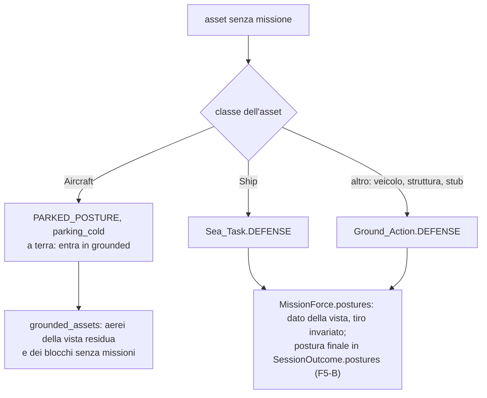
```mermaid
flowchart TD
    A["asset senza missione"] --> C{"classe dell'asset"}
    C -->|Aircraft| P["PARKED_POSTURE, parking_cold<br/>a terra: entra in grounded"]
    C -->|Ship| S["Sea_Task.DEFENSE"]
    C -->|altro: veicolo, struttura, stub| G["Ground_Action.DEFENSE"]
    P --> GR["grounded_assets: aerei della vista residua<br/>e dei blocchi senza missioni"]
    S --> PO["MissionForce.postures: dato della vista, tiro invariato;<br/>postura finale in SessionOutcome.postures (F5-B)"]
    G --> PO
```

## 6.15 Presenza e postura nell'esito (F5-A, F5-B)

**La decisione** (utente, 2026-10-11/12, D1.a/b, deviazioni 12-13 del piano): un asset di missione **non sparisce
fuori dalla sua rotta**. Prima della F5 un asset con missione esisteva per lo scheduler solo fra la partenza e l'arrivo;
ora (`F5_PRESENCE`, attivo dalla F5-B, `Mission_Adapter:406`):

- **unità terrestri e navali**: presenti **ferme** nella posizione di partenza prima di partire e in quella finale dopo
  la fine, in postura `Defense`, quindi rilevabili e ingaggiabili in quei tratti (il carro fermo a 4 km dal nemico
  resta un bersaglio: esperimenti E1/E3 dell'analisi, scenario S22);
- **aerei che non partono in volo** (`start_mode` parcheggio o pista, cioè diverso da `AIR`): presenti e **a terra**
  dall'inizio della sessione al decollo — bersagli di superficie passivi come gli aerei senza missione della F4c
  (capitolo 4 §4.30);
- **aerei dopo la fine della rotta**: a terra **solo se** l'ultimo punto è un `LAND` su una **base vera**
  (`lands_on_air_base`, `Mission_Adapter:906-926`: il riferimento del waypoint è un asset di un blocco `is_Air_Base()`,
  oppure il punto cade entro `AIR_BASE_AREA_RADIUS_M = 3000 m` — **STIMA di progetto**, `:387` — da un asset non aereo
  di una base del **lato della missione**, `air_base_points`, `:874-903`); altrimenti **escono di scena all'arrivo**
  (postura `off_scene`). Atterrare su una base nemica non è un atterraggio.

**Come lo realizza `Mission_Adapter`.** `AssetMovement` (`:417-445`) ha quattro campi nuovi (`present_before`,
`present_after`, `grounded_before`, `grounded_after`) che `_presence` (`:929-936`) riempie per missione: terra e mare
presenti prima e dopo e mai a terra; aria presente e a terra prima se non parte in volo, presente e a terra dopo se
atterra su una base vera. Poi:

| Funzione | Cosa dà | Riga |
|---|---|---|
| `movement_legs(movement, t0, t_end, presence=True)` | i tratti di un asset nella sessione: movimento con attese (`_timeline`) più, con `presence`, il tratto fermo da `t0` alla partenza e dalla fine a `t_end`; ritagliati a `[t0, t_end]`. `presence=False` = solo movimento (carburante) | `:1002-1027` |
| `grounded_intervals(movement)` | gli intervalli `[lo, hi)` a terra: prima `(-inf, fine delle attese al punto di partenza)`, dopo `[arrivo all'ultimo punto, +inf)` | `:1030-1051` |
| `grounded_schedule(forces, movements)` | un `GroundedSchedule` (capitolo 3 §3.7): `ALWAYS` per gli aerei senza missione (`grounded_assets`, §6.14), gli intervalli sopra per gli aerei di missione | `:1054-1068` |
| `final_posture(mission, movement, grounded, session_end)` | la postura di un asset di missione a fine sessione | `:1589-1616` |
| `session_postures(forces, movements, grounded, session_end)` | `{asset_id: postura}` di **tutti** gli asset delle forze (di missione: `final_posture`; senza missione: la postura continua della F4c) | `:1619-1646` |

**Le posture** (`final_posture`): a terra a fine sessione → `PARKED_POSTURE` (`parking_cold`); aereo in volo → il tipo di
missione; aereo uscito di scena alla fine della rotta → `OFF_SCENE_POSTURE = 'off_scene'` (`:376`, etichetta, non un
valore di `Context`); terra e mare → `Defense` a movimento finito o non ancora iniziato (D1.a/b), altrimenti la postura
di riferimento del tipo di missione (`Context.postures_for`). `Session_Simulator` la corregge poi per i casi che
`Mission_Adapter` non vede — il rientro (`_postures_after_bingo`, `:1658-1672`) e l'esaurimento
(`_postures_after_fuel`, `:1534-1554`) — e per i distrutti (`destroyed`, §6.18) in tre passi successivi
(`:3123-3139`). `SessionOutcome.postures` è un'**uscita**: non cambia la storia (contatti, colpi, danni), è riportata
in ogni caso anche con `F5_PRESENCE` spento.

**Il cablaggio in `run_session`.** `mission_movements(mission, t0, air_bases)` riceve le basi del lato della missione
(`:2240-2245`); `grounded = MA.grounded_schedule(forces, movement_of.values())` (`:2258`) è passato a scheduler e
risolutore; i **tratti di movimento** senza presenza (`presence=False`, `:2292-2293`) vanno al carburante (la presenza
ferma non consuma), quelli con presenza (`movement_legs(movement, t0, session_end)`, `:2366`) allo scheduler come `legs`
e al risolutore come tratti degli asset (`all_legs`, `:2392-2404`).

*Diagramma D41 — ciclo di vita di un aereo di missione in sessione (stati e transizioni che la sessione modella).*

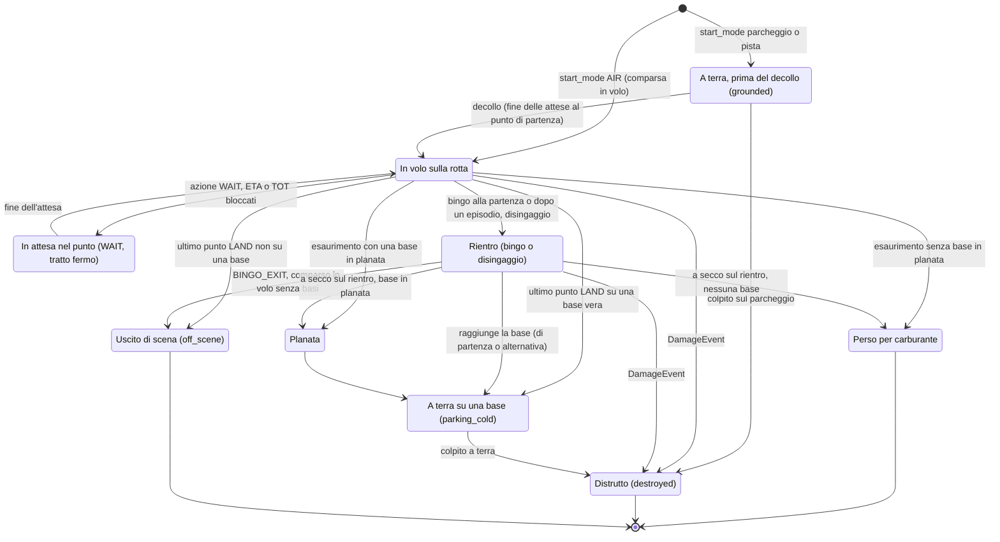
```mermaid
stateDiagram-v2
    state "A terra, prima del decollo (grounded)" as Parked
    state "In volo sulla rotta" as Airborne
    state "In attesa nel punto (WAIT, tratto fermo)" as Waiting
    state "Rientro (bingo o disingaggio)" as Returning
    state "Planata" as Gliding
    state "A terra su una base (parking_cold)" as Landed
    state "Uscito di scena (off_scene)" as OffScene
    state "Perso per carburante" as Lost
    state "Distrutto (destroyed)" as Destroyed

    [*] --> Parked: start_mode parcheggio o pista
    [*] --> Airborne: start_mode AIR (comparsa in volo)
    Parked --> Airborne: decollo (fine delle attese al punto di partenza)
    Parked --> Destroyed: colpito sul parcheggio
    Airborne --> Waiting: azione WAIT, ETA o TOT bloccati
    Waiting --> Airborne: fine dell'attesa
    Airborne --> Landed: ultimo punto LAND su una base vera
    Airborne --> OffScene: ultimo punto LAND non su una base
    Airborne --> Returning: bingo alla partenza o dopo un episodio, disingaggio
    Returning --> Landed: raggiunge la base (di partenza o alternativa)
    Returning --> OffScene: BINGO_EXIT, comparso in volo senza basi
    Airborne --> Gliding: esaurimento con una base in planata
    Returning --> Gliding: a secco sul rientro, base in planata
    Gliding --> Landed
    Airborne --> Lost: esaurimento senza base in planata
    Returning --> Lost: a secco sul rientro, nessuna base
    Airborne --> Destroyed: DamageEvent
    Returning --> Destroyed: DamageEvent
    Landed --> Destroyed: colpito a terra
    Lost --> [*]
    Destroyed --> [*]
    OffScene --> [*]
```

**Limiti dichiarati** (`F4_Differenze_Scenari.md`, sezione F5-B): un aereo che parte dal parcheggio è a terra nel
**primo punto** della rotta, alla sua quota (la rotta deve cominciare sulla base: il motore non la porta a terra);
nessuna fase di rullaggio; l'area di una base è un cerchio di `AIR_BASE_AREA_RADIUS_M` (stima) intorno a ciascun
asset non aereo, non il perimetro reale (modulo mappe), e una base senza asset non aerei ha area vuota (resta il
criterio del riferimento); la presenza dopo la fine è nella posizione finale della rotta; due esecuzioni esistenti
cambiarono nella storia (S6-0, S6-2: il gruppo navale, che prima spariva all'arrivo, resta nel punto finale e continua
a lanciare), accettate dall'utente il 2026-10-12.

## 6.16 Attese, ETA bloccate e TOT per missione (F5-C)

Interruttore `Mission_Adapter.F5_WAITS` (attivo dalla F5-C, `:407`). Le azioni **WAIT** di una missione
(`MissionAction` con `ActionKind.WAIT`, modo `'hold'` o `'orbit'`, durata `wait_duration_s` **oppure** fino a un
istante `wait_until`), le **ETA bloccate** dei punti (`MissionWaypoint.eta_locked`) e il **TOT** della missione
entrano nel movimento come **tratti fermi** nel punto della rotta (`AssetMovement.holds`, `((indice del punto, durata
[s]), ...)`): `_timeline` (`:959-999`) li inserisce e sposta i successivi della durata. Le attese sono **le stesse per
tutti gli asset della missione** (la formazione attende insieme: regola A).

- **`hold` e `orbit` sono la stessa cosa per il motore**: presenza ferma nel punto per la durata. Per l'orbita è
  un'**approssimazione dichiarata**: nessun circuito geometrico (`MissionAction` non dichiara raggio né velocità
  d'orbita, e non se ne inventano); le finestre di contatto coprono quindi tutta l'attesa intorno al punto, con
  un errore di posizione pari al raggio del circuito reale (qualche km per un caccia).
- **`mission_holds(mission, start, t0)`** (`:798-853`) le calcola una volta sulla rotta di riferimento con le
  velocità di missione (la stessa temporizzazione di `mission_start`). Per ogni punto: le azioni WAIT del punto
  (`_wait_end`, `:753-776`, con la condizione d'avvio `ON_ARRIVAL`/`AT_TIME`/`AFTER_DURATION`) e la **sincronizzazione**:
  se il punto *successivo* ha un'ETA bloccata (o è l'ancoraggio del TOT) e sarebbe raggiunto in anticipo, l'attesa si
  allunga fino a raggiungerlo esattamente all'istante bloccato (attesa *prima* del punto). In **ritardo**: un warning;
  la velocità non cambia, e le ETA effettive lo riportano. Restituisce `()` senza rotta, senza attese o se la rotta non
  ha un tratto per ogni coppia di waypoint.
- **La partenza** (`mission_start`, `:672-727`): precedenza `start_time` (ritardata, dalla F5-C, da un'ETA bloccata sul
  punto di partenza più tarda, `:686-689`), poi la prima ETA bloccata, poi il `tot`. Senza `start_time` la partenza è
  derivata **all'indietro** dall'istante bloccato meno la percorrenza **e** le attese di durata nota dei punti prima
  dell'ancoraggio (`_relative_wait`, `:736-750`, anticipo `:719-721`); le attese fino a un istante assoluto non anticipano
  (dipendono dalla partenza stessa). Con `start_time` la missione attende prima del punto d'ancoraggio.
- **Il TOT è di ogni missione, non dell'Operazione** (decisione dell'utente, 2026-10-12, commit `03d77640`). La F5-C
  (`4da618b1`) aveva introdotto un TOT comune d'Operazione (`Operation.tot`, `operation_tots`) usato per le missioni
  che non ne dichiaravano uno; l'utente l'ha **rimosso** lo stesso 2026-10-12: missioni coordinate dichiarano ciascuna il
  proprio TOT, uguali o sfalsati. L'esempio dell'utente: una *Fighter Sweep* su una zona che anticipa di qualche minuto
  l'arrivo dei bombardieri di un'altra missione sulla stessa zona ha un TOT diverso da quello dei bombardieri,
  anche se le due missioni partono insieme nella stessa Operazione. `_locked_targets` (`:779-795`) usa solo il
  `Mission.tot`, ancorato al primo waypoint `ATTACK` (o, in mancanza, `OBJECTIVE`, `_TOT_ANCHOR_ROLES`, `:365`); un TOT
  senza punto d'ancoraggio e con `start_time` è ignorato con un warning (`:811-812`), senza `start_time` è un `ValueError`
  (`:701-703`). Nell'Operazione resta solo la regola d'esito (`OutcomeRule`), che nessuno calcola ancora.
- **ETA effettive** (`waypoint_times`, `:1109-1113`): gli istanti d'**arrivo** ai punti dai tratti, attese comprese; vanno
  in `MissionOutcome.actual_etas`, mentre le ETA pianificate restano nei `MissionWaypoint`.
- **Carburante**: dalla F6-A le attese consumano **nel tempo alla crociera** dell'asset, con un `FuelEvent` per tratto
  (§6.17); nella F5-C non consumavano.
- **`Activation.ON_EVENT`** resta solo dichiarabile (`ValueError`).

Con `F5_WAITS` spento: nessuna attesa, partenza e ETA come prima della F5 (il TOT della missione deriva comunque la
partenza, come dalla F3). Scenari: S23 (CAP in orbita, sosta di un carro, TOT per missione; capitolo 8 §8.10).

## 6.17 Carburante per tratto e vincolo del movimento (F6-A)

**La decisione** (utente, 2026-10-12): fino alla F5 il carburante era un vincolo *a posteriori* — un solo `FuelEvent` a
fine movimento — e un asset a secco continuava a muoversi e a combattere (esperimento E5 dell'analisi: un carro a secco
dopo 852 m di 7 km ingaggiato 3 km più avanti). Dalla F6-A il carburante **vincola il movimento e i contatti**, dietro
due interruttori separati (`F6_FUEL_PER_LEG`, `F6_FUEL_CONSTRAINT`, `:807-808`) per attribuire le differenze a una sola
causa.

**Quali tratti consumano** (`_consuming_legs`, `:1395-1412`): per ogni asset di missione i tratti di **movimento**
ritagliati alla sessione (`movement_legs(..., presence=False)`), attese comprese; esclusi i tratti degeneri (durata
nulla) e i tratti **fermi di un aereo a terra** (parcheggio prima del decollo, sosta dopo l'atterraggio: motori
spenti). Con `F6_FUEL_PER_LEG` spento i tratti fermi non consumano mai (come prima della F6-A).

**Esaurimento a monte (`F6_FUEL_CONSTRAINT`).** Il carburante dipende solo dai tratti e dal carburante di partenza, quindi
istante e punto dell'esaurimento si calcolano **prima** dello scheduler (`Fuel_Model.fuel_exhaustion`, alla crociera,
capitolo 5 §5.2.3) e i tratti oltre quel punto **non esistono**: i tratti troncati vanno allo scheduler (`legs`) e al
risolutore, quindi i contatti sono calcolati sui tratti reali. L'esito (`_fuel_end` → `_exhaustion_end`, `:1428-1472`,
`FuelEnd`, `:923-940`) dipende dall'asset:

| Esito (`FuelEnd.kind`) | Chi | Che cosa succede |
|---|---|---|
| `FUEL_HALT` | terra/mare, o aereo ancora a terra o a quota ≤ 0 (serbatoio vuoto al decollo, `on_ground`) | **fermo** nel punto di esaurimento fino a fine sessione, presente e bersaglio (come la presenza fuori rotta, §6.15), postura `Defense`; **non** distrutto |
| `FUEL_GLIDE` | aereo in volo con una base aerea **del suo lato** entro quota × `GLIDE_RATIO` | **planata** in linea retta sulla base più vicina alla velocità di crociera (semplificazione dichiarata), poi **a terra** sulla base (programma `grounded` dall'atterraggio, bersaglio di superficie passivo, postura `parking_cold`); durante la planata è un aereo in volo come gli altri |
| `FUEL_CRASH` | aereo in volo senza base raggiungibile in planata | **perso** all'esaurimento: i tratti finiscono lì e, dopo gli ingaggi, la salute è portata a 0 con `Asset.apply_damage` (`:3110-3120`) — lo stesso canale del danno da combattimento, stato `Destroyed` — **senza un `DamageEvent`** nell'esito (non è un colpo: nessun tiratore, nessuna arma); esito per asset `DESTROYED`/`FUEL_EXHAUSTED` con `crew_recovered=True` |

Il punto di atterraggio è la posizione dell'asset di base più vicino, a quota 0 (terreno non modellato); la quota è
quella del punto di esaurimento, interpolata fra i waypoint, trattata come altezza sulla base. L'idoneità della base per
tipo d'aereo (lunghezza della pista, elicotteri, portaerei) **non è modellata**: qualunque base aerea amica va bene
(`air_base_points`).

Le funzioni di supporto: `_truncate_at_fuel_end` (`:1475-1488`) tronca i tratti di presenza e li chiude con l'esito
(fermo nel punto, planata e sosta sulla base, nulla se perso; lista **vuota** = l'asset non esiste nella sessione, aereo
perso alla partenza); `_grounded_after_fuel` (`:1491-1519`) corregge il programma a terra (gli intervalli che
cominciano dopo l'esaurimento cadono; un aereo a terra all'esaurimento ci resta; uno in planata è a terra
dall'atterraggio); `_fuel_truncated` (`:1522-1531`) applica il troncamento a presenza e movimento insieme;
`_postures_after_fuel` (`:1534-1554`) la postura finale.

**Contabilità (`F6_FUEL_PER_LEG`).** Nel passo finale (§6.2), all'evento MOVEMENT dell'asset, **un `FuelEvent` per tratto
che consuma**, in ordine, applicato subito (`Fuel_Model.apply_fuel_event`); dopo un evento esaurito nessun altro
(`:3016-3043`). Spento: un solo `FuelEvent` per asset sulla distanza dei tratti di movimento, le attese non consumano
(`:3045-3072`).

*Diagramma D42 — come si compongono i tratti di un asset di missione prima dello scheduler.*

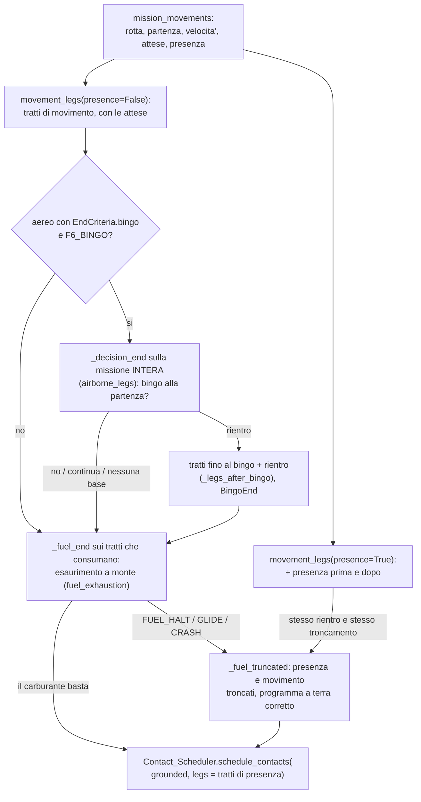
```mermaid
flowchart TD
    MV["mission_movements:<br/>rotta, partenza, velocita', attese, presenza"] --> ML["movement_legs(presence=False):<br/>tratti di movimento, con le attese"]
    MV --> PL["movement_legs(presence=True):<br/>+ presenza prima e dopo"]
    ML --> BD{"aereo con EndCriteria.bingo<br/>e F6_BINGO?"}
    BD -->|si| DE["_decision_end sulla missione INTERA<br/>(airborne_legs): bingo alla partenza?"]
    BD -->|no| FE
    DE -->|rientro| RB["tratti fino al bingo + rientro<br/>(_legs_after_bingo), BingoEnd"]
    DE -->|"no / continua / nessuna base"| FE
    RB --> FE["_fuel_end sui tratti che consumano:<br/>esaurimento a monte (fuel_exhaustion)"]
    FE -->|"FUEL_HALT / GLIDE / CRASH"| TR["_fuel_truncated: presenza e movimento<br/>troncati, programma a terra corretto"]
    FE -->|"il carburante basta"| SC
    PL -->|"stesso rientro e stesso troncamento"| TR
    TR --> SC["Contact_Scheduler.schedule_contacts(<br/>grounded, legs = tratti di presenza)"]
```

**Limiti dichiarati**: il vincolo è calcolato a monte alla **crociera**; per i veicoli e le navi i due regimi coincidono,
per gli aerei il consumo d'ingaggio (G3) e il ri-calcolo del G4b chiudono il limite (§6.20); consumo delle soste =
crociera anche per il loiter e per terra/mare (sovrastima); un asset distrutto a metà rotta consuma comunque i tratti
(troncati) interi; durante la planata l'aereo può essere ingaggiato e sparare (l'esaurimento non è fra i criteri di
fine attività); terreno non modellato; idoneità della base non modellata.

## 6.18 Fine di attività e stato di missione (F6-B1)

**La decisione** (utente, 2026-10-12, D2.a/D2.d): i criteri di stato *dichiarati* in `EndCriteria` chiudono l'**attività**
dell'asset senza cambiargli la rotta (per il risolutore, capitolo 4 §4.31): dall'istante della fine l'asset non lancia
più salve offensive, prosegue **passivo** sulla rotta pianificata, resta presente, bersaglio e intercettore. Interruttori
`F6_END_CRITERIA` e `F6_DESTROYED_POSTURE` (`:819-820`), entrambi attivi; nei default di `EndCriteria` nessun criterio è
attivo, quindi nessuno scenario preesistente cambia.

**Costruzione dei criteri** (`_activity_plans`, `:1796-1839`, un `ActivityPlan` per asset, `:1693-1711`):

| Criterio | Come la sessione lo legge |
|---|---|
| `winchester` | le **voci della scorta per arma** dell'asset nelle categorie elencate (`_winchester_weapons`, `:1767-1793`; categoria = chiave di primo livello del registro d'arma del dominio, `Fire_Control.weapon_category`, capitolo 4 §4.31). Scatta quando sono **tutte** a zero nello stato ombra. **Inattivo con un warning** per un asset senza scorta per arma, senza armi di quelle categorie, o con un'arma di quelle categorie **non modellata** (contata a unità: non si esaurisce mai). Già a zero alla partenza: fine alla partenza della missione |
| `damage_threshold` | salute persa / salute **a inizio sessione** ≥ soglia (*mission kill*, asset non distrutto) |
| `target_destroyed` | bersaglio `ASSET` (l'asset) o `GROUP` (gli asset del blocco, o della missione, con quell'id: `_mission_target_ids`, `:1730-1764`; **dalla F7a** ristretti a `Target.asset_ids` se dichiarato, `_restrict_to_asset_ids`, `:1714-1727`: gli id fuori dal gruppo sono ignorati con un warning; il criterio **non** filtra per lato); tutti distrutti (in combattimento, già all'inizio, o persi per carburante) → fine all'istante dell'ultima distruzione, non prima della partenza. Bersagli `POINT`/`AREA`/`ZONE`: **non rappresentabili** (decisione 12 della F7a: nessun asset da distruggere, nemmeno per una missione di fuoco su posizione), criterio ignorato con un warning; id sconosciuto: ignorato con un warning |
| `max_duration_s` | fine all'istante di **partenza della missione** + durata (la semantica più semplice: «durata o tempo sulla stazione» contata dalla partenza), passata al risolutore come fine nota a monte (`until`) |

`_activity_criteria` (`:1856-1873`) li traduce in `ER.ActivityCriteria`, con le distruzioni già note
(`_known_destructions`, `:1842-1853`: ingaggi già risolti, asset distrutti all'inizio, persi per carburante) e, dal G4a,
la salute d'inizio sessione come `reference_health`; `engage` li passa al risolutore (`:2898-2903`). Il bingo
aggiunge `until=bingo.time` agli asset che rientrano (`:2717-2724`) e, dal G4a, la passività da episodi precedenti
(`passive_from`, `:2726-2740`).

**L'esito per asset** (`_activity_ends`, `:1885-1928`) è la **prima** fra: la fine nota a monte (`static_end`), le fini
scattate nel risolutore (`EngagementResult.activity_ends`, escluso il bersaglio distrutto) e il **bersaglio
distrutto valutato sull'intera sessione** — non sulle fini del risolutore, perché un ingaggio risolto prima può non
sapere di una distruzione avvenuta in un ingaggio risolto dopo (limite dichiarato del risolutore); la fine per bersaglio
non è anteriore alla partenza. A parità d'istante: danno, winchester, bersaglio, durata (`_ACTIVITY_ORDER`, `:1679`).
Un asset che completa la rotta *prima* della fine resta `ROUTE_COMPLETED` (per esempio un'unità terrestre in `Defense`
danneggiata dopo l'arrivo smette comunque di sparare); un arrivo *dopo* non completa la missione.

**Lo stato di missione** è la regola unica del §6.11. **Motivi di aborto** (`_ABORT_REASON_OF`, `:1685-1689`):

| Motivo di fine dell'asset (`AssetEndReason`) | Motivo di aborto (`AbortReason`) | Prodotto da |
|---|---|---|
| `FUEL_EXHAUSTED` | `FUEL` | F6-A (§6.17) |
| `BINGO` | `BINGO` | F6-B2, G2 (§6.19) |
| `DISENGAGED` | `DISENGAGED` | G4b (§6.20) |
| `WINCHESTER` | `AMMUNITION` | F6-B1 |
| `DAMAGE` | `DAMAGE` | F6-B1 |

`THREAT` e `MISSION_ABORTED` (i gregari che seguono la missione che abortisce, D3.d) **non sono prodotti**, e
`abort_on_threat` non è letto.

**Postura `destroyed`** (`F6_DESTROYED_POSTURE`, decisione dell'utente del 2026-10-12, rimandata dalla F5-B): un asset
**distrutto a fine sessione** — in combattimento o per carburante — ha postura `Mission_Adapter.DESTROYED_POSTURE =
'destroyed'` (`:361`) nell'esito (`:3132-3139`). `Mission_Adapter.session_postures` resta la postura di piano (non legge
lo stato dell'asset). Cambia solo `SessionOutcome.postures`: 429 esecuzioni della fotografia cambiarono nella sola voce
`postures` (capitolo 8 §8.10).

**Limiti dichiarati**: `target_destroyed` su bersagli `POINT`/`AREA`/`ZONE` non rappresentabile (decisione 12 della F7a, confermata dalla F7b); nel risolutore il
bersaglio distrutto vede solo le distruzioni della propria run e degli ingaggi già risolti; nessuna latenza di valutazione;
`abort_on_threat` e `last_waypoint` non letti; **nessun cambio di rotta** per i criteri di questa fase (il rientro è
dell'albero di bingo, §6.19-6.20); un aereo in planata per carburante non chiude l'attività.

## 6.19 Il bingo in sessione: dal rientro rettilineo al modello G1-G5

**Che cos'è e dove vive.** Il bingo è l'istante in cui un aereo deve interrompere la missione e tornare. Il calcolo (soglia,
albero, geometria) è di `Fuel_Model` (capitolo 5 §5.2.5-5.2.8, con il diagramma D38); qui c'è **quando** si valuta, **chi**
è interessato e **come** il rientro diventa tratti, contatti ed esito. Il modello è stato costruito in tre tempi:

| Tempo | Data | Regola | Stato |
|---|---|---|---|
| F6-B2 | 2026-10-13 | bingo a priori (validatore) e in volo; rientro **in linea retta** alla base idonea più vicina con la riserva fissa `BINGO_RESERVE` = 0,10 | dietro interruttori spenti |
| F6-B2bis | 2026-10-15 | rientro lungo la **rotta a ritroso**, fabbisogno 1,2 × il ritorno | dietro interruttore spento (`F6_BINGO_DISENGAGE_RESERVE` False) |
| **G1-G5** | 2026-10-15/18 | **riserva di disimpegno**, minimo di pianificazione, soglia = resto della rotta + riserva, albero trasferimento/combattimento con basi alternative entro 3 km, consumo in ingaggio, episodi, ri-pianificazione | **modello finale, tutto attivo** |

**Il modello finale in tre grandezze** (decisioni dell'utente, 2026-10-15): la **riserva** = 5 minuti (`DISENGAGE_TIME`
= 300 s, **stima** dell'utente: il tempo per disimpegnarsi da un'intercettazione e tornare in rotta) alla **massima spinta
militare** (`emergency.consume` del registro, kg/h **dedotti**, dato **non tarato**: capitolo 5 §5.2.6); il **minimo di
pianificazione** = carburante caricato > rotta intera + riserva; la **soglia di bingo** = residuo < resto della rotta +
riserva. Al bingo l'**albero** dipende dal tipo di missione (trasferimento `TRANSPORT`: continua / ritroso / base più
vicina / regole F6-A; combattimento: interrompe sempre, base di partenza o base alternativa entro 3 km dalla rotta
(`ALTERNATE_BASE_MAX_OFFSET`, stima), la più breve raggiungibile; poi base più vicina in linea retta; poi regole F6-A).

**La valutazione alla partenza (G2)** (`:2295-2337`). Per ogni asset di missione **aerea** con `EndCriteria.bingo`
(default `True`), con `F6_BINGO` acceso e almeno un tratto di movimento: con `F6_BINGO_DISENGAGE_RESERVE` acceso
`_decision_end` (`:1582-1599`) chiama `Mission_Adapter.mission_bingo_decision` **all'inizio dei tratti della missione
intera** (`airborne_legs`, anche oltre la fine della sessione, perché l'anello legge il resto della rotta fino al
`LAND`) con il carburante di partenza. Se la decisione è «non in bingo», «continua» (trasferimento: il residuo basta a
concludere) o «nessuna base» (`NO_BASE`: regole della F6-A), nessun rientro; altrimenti `_return_end` (`:1559-1567`)
costruisce il `BingoEnd` (`:944-968`: `time`, `point`, `landing_point`, `landing_time` a velocità di crociera, `route`,
`reason`, `exits`) e un bingo che cadrebbe **dopo la fine della sessione non c'è** (`:2319-2320`). Con **il solo consumo di
movimento** residuo e resto della rotta calano insieme, quindi la soglia scatta all'inizio dei tratti **o mai**:
l'istante del bingo è l'inizio del primo tratto che consuma (dopo un'eventuale sosta a terra). Dal G3 il consumo
d'ingaggio abbassa il residuo e la soglia può scattare *dopo*: lo rivaluta la ri-pianificazione (§6.20).

**Il rientro.** Dal bingo i tratti dell'asset sono quelli pianificati **fino al bingo**, poi la spezzata del rientro
(`_return_legs`, `:1602-1620`, a velocità costante da `time` a `landing_time`, istanti proporzionali alla lunghezza) e,
nei tratti di presenza, la sosta a terra sulla base fino a fine sessione (`_legs_after_bingo`, `:1623-1635`, con
`park`); `_grounded_after_bingo` (`:1638-1655`) fa cadere gli intervalli a terra che cominciano dopo il bingo e mette
l'aereo a terra dall'atterraggio; `_postures_after_bingo` (`:1658-1672`) dà `parking_cold` a terra, il tipo di missione se
ancora in volo, `off_scene` se uscito di scena. I tratti del rientro vanno a scheduler, risolutore e carburante come
tutti gli altri (il rientro consuma, alla crociera). Dal bingo l'aereo **non lancia più salve offensive** (fine di
attività nota a monte, `until=bingo.time`, `:2717-2724`) ma resta **bersaglio e intercettore**; a **secco anche sul
rientro** valgono le regole della F6-A sui tratti col rientro (planata: `ABORTED(FUEL)`; perso: `DESTROYED`/
`FUEL_EXHAUSTED`); l'esito per asset è `BINGO` all'istante del bingo, per la missione `ABORTED(BINGO)` (§6.11). Terra e mare
non hanno bingo. `EndCriteria.bingo = False` = nessun controllo e nessun rientro (l'aereo vola fino all'esaurimento, regole
F6-A); il rientro **forzato** dopo il disingaggio (§6.20) non dipende da questo criterio.

**I validatori di pianificazione — fuori da `run_session`.** Le due funzioni di `Mission_Adapter` sono del
**pianificatore**, non dell'esecutore; **dalla F8a le chiama il validatore di sessione** (`Logic/Session_Validator`, §6.25), che a sua
volta è chiamato dal conduttore di campagna (§6.27) prima di `run_session`:

- **`check_mission_fuel`** (G1, `:1449-1509`): ogni aereo della missione deve caricare **più** del carburante della rotta
  *intera* (`airborne_legs` alla crociera, attese comprese, `route_fuel_demand`, `:1433-1446`) più la riserva di
  disimpegno (`Fuel_Model.disengagement_reserve_with_source`); altrimenti `ValueError` con asset, carburante,
  fabbisogno, riserva con la provenienza e mancanza. Restituisce `{asset: margine}`.
- **`check_mission_bingo`** (F6-B2, rifatto dal G2, `:1307-1396`): con `disengage_reserve=True` (default,
  `_check_reserve_bingo`, `:1399-1430`) rifiuta **esattamente** le missioni che in sessione vanno in bingo alla partenza
  (anche un trasferimento che poi continua consumando la riserva: è sotto il minimo), con soglia, riserva, istante e
  decisione nel messaggio; le basi non sono richieste. Con `disengage_reserve=False` applica la regola F6-B2bis
  (`reverse_route=True`) o F6-B2 (`False`), dove serve una base idonea e `reserve` è la riserva fissa.

Le due sono **funzioni separate** perché sono regole diverse (il carico contro il criterio del rientro in volo
dell'esecutore) e si possono chiamare entrambe; la prima rifiuta con carburante ≤ minimo, la seconda con carburante <
soglia: differiscono solo all'uguaglianza esatta. Entrambe non si applicano alle missioni non aeree né a quelle con
`EndCriteria.bingo` False, e non controllano un asset senza carburante o riserva modellati. **Chi le chiama**: dalla F8a il validatore
di sessione (`Logic/Session_Validator.py:197-218`), insieme ai test (`Test_Mission_Adapter`, `Test_Session_Simulator`,
`Test_Session_Validator`) e allo scenario S26, che ne verifica l'accordo con la sessione. Il validatore è chiamato a sua volta solo dal
conduttore di campagna (§6.27), che ha come chiamanti i soli test e lo scenario S30: **il ciclo di campagna non ha ancora un chiamante
di produzione** (capitolo 9 §9.1). `run_session` **non rifiuta** un ordine per carburante: un rifiuto dentro `run_session` renderebbe irraggiungibile il
bingo in volo, e l'esecutore (come DCS con «RTB on bingo») fa tornare l'aereo.

Le funzioni di `Mission_Adapter` che servono al bingo: `airborne_legs` (`:1216-1238`, i tratti che consumano della
missione intera), `is_loop_mission` (`:1241-1265`, anello: `LAND` sulla stessa base del `DEPARTURE`, per blocco del
riferimento o entro `AIR_BASE_AREA_RADIUS_M`), `bingo_return_rule` (`:1268-1274`, `Fuel_Model.ReturnRule`),
`is_transfer_mission` (`:1277-1281`, categoria `TRANSPORT`), `mission_bingo_decision` (`:1284-1304`, il tramite verso
`Fuel_Model.bingo_decision`, con `forced` ed `exit_scene`). Le usano allo stesso modo il validatore e l'esecutore: **stesso
criterio**.

**Limiti dichiarati**: idoneità della base per tipo d'aereo non modellata (qualunque base aerea amica); terreno non
modellato (discesa rettilinea a quota 0); il ritroso ripassa sulle minacce dell'andata; nessuna salva offensiva dopo il
bingo (scelta della F6-B2: dal rientro l'aereo resta solo bersaglio e intercettore, anche se reincontra la minaccia);
nessun rientro per danno (un aereo oltre la soglia di danno della F6-B1 resta passivo sulla rotta); un trasferimento che
continua consumando la riserva ha un margine ridotto; i dati `emergency` del registro non sono tarati e la regola per gli
aerei WW2 non è implementata (capitolo 9 §9.1).

## 6.20 Consumo in ingaggio, episodi d'ingaggio e ri-pianificazione (G3, G4a, G4b)

### Il consumo in ingaggio (G3, `G3_ENGAGEMENT_FUEL`)

A ogni ingaggio a cui un aereo **partecipa**, nell'istante della sua prima partecipazione, l'aereo consuma
`Fuel_Model.engagement_fuel` (la quantità della riserva di disimpegno, capitolo 5 §5.2.8) con un `FuelEvent` istantaneo.
**Partecipa** (`_engagement_instants`, `:1344-1364`) chi ha **combattuto** secondo la definizione della F6-A
(`_engaged_assets`): ha lanciato una salva, è stato **bersaglio** di una salva (anche mancato o intercettato) o ha
**intercettato**; l'istante è il primo fra il lancio delle salve sue o dirette a lui (`Salvo.t_launch`) e le sue
intercettazioni. Il solo rilevamento reciproco senza salve **non** è partecipazione (nessuna manovra decisa dal
modello). Solo gli **aerei di missione** (`air_assets`, dominio `'air'`) **in volo** all'istante: un aereo a terra colpito
sul parcheggio non consuma (`grounded.at`). Terra e mare invariati. Il codice conta un consumo per esito d'ingaggio: dal
G4a **uno per episodio** a cui l'aereo partecipa.

Nella contabilità (`:2992-3006`, `:3014-3043`) i consumi d'ingaggio di un aereo sono messi in attesa (`pending_charges`)
e inseriti **in ordine di tempo fra gli eventi per tratto, prima del tratto in cui cadono** (nessun tratto è spezzato,
«un evento per tratto» resta), applicati con `charge` (`:2973-2981`); se l'asset non ha movimento o è già contabilizzato,
subito. Il movimento di un aereo è **sempre alla crociera**: il consumo d'ingaggio sostituisce, per gli aerei, la
sovrastima «tutto il movimento al regime `'max'`» (`g3`, `:3010-3013`). Esaurimento in ingaggio: il contatore va a zero,
nessun evento dopo; per il resto vedi la ri-pianificazione.

### Gli episodi d'ingaggio (G4a, `G4_EPISODES`)

**Il problema**: fino al G3 l'ingaggio era un blocco unico per la sessione (§6.3): X contro A al mattino e contro B la
sera era un solo ingaggio, un solo consumo, nessuna decisione possibile «dopo l'ingaggio». **La soluzione** (decisioni
dell'utente del 2026-10-17, `Proposta_G4_Ri_scheduling.md`): l'ingaggio diventa un evento *nel tempo*.

- **Episodio** (`_episodes`, `:1217-1288`): gruppo di finestre di contatto legate, direttamente o per tramite di altre,
  perché appartengono a coppie di forze che **condividono una forza** (o forze dello **stesso dominio di coordinamento**,
  §6.13) **e** i loro intervalli si sovrappongono o distano al più **`EPISODE_GAP` = 300 s** (`:914`, `= Fuel_Model.
  DISENGAGE_TIME`: ritrovare il contatto entro i 5 minuti del disimpegno è lo stesso combattimento; **legato per
  costruzione**: cambiare la durata del disimpegno cambia anche questo intervallo). Per ogni chiave (forza o dominio) le sue
  finestre, in ordine `(t_start, t_end, posizione)`, sono scandite una volta come una fusione di intervalli; le chiavi sono
  unite con un union-find. La componente connessa di prima è l'**unione dei suoi episodi**; con intervallo infinito
  coincidono. Ordine deterministico: inizio della prima finestra, poi `event_id`, poi la prima finestra.
- **Coda**: un ENGAGEMENT per episodio all'istante della sua prima finestra; `resolve_engagement` sulle sole finestre e
  forze dell'episodio; esito **applicato subito** (concatenazione di salute e scorte fra episodi,
  `assemble_session_outcome(chained=True)`, capitolo 2 §2.4).
- **Forza occupata** (`_trim_busy`, `:1291-1324`; `busy_until`, aggiornato in `engage`, `:2802-2804`): una forza è
  impegnata dal primo istante del suo episodio al `t_end` del suo esito (salve in volo comprese); le finestre non ancora
  risolte delle sue forze che cominciano prima sono **ritagliate** per partire da lì (`Contact_Scheduler.trim_contact_window`,
  capitolo 3 §3.8: CPA e reciproco ricalcolati), **scartate** se si svuotano, e gli episodi rimasti sono **ricostruiti**
  (un ritaglio può solo spostare in avanti un inizio, quindi l'ordine di estrazione resta non decrescente e la storia già
  risolta non cambia). Con l'intervallo di 300 s il caso si presenta solo con salve in volo per più di circa 300 s oltre
  l'ultima finestra (per esempio missili da crociera). Una forza che entra tardi in un episodio lungo è «occupata»
  dall'inizio dell'episodio.
- **RNG**: `counter` = ordinale degli episodi con lo stesso insieme di forze (§6.4).
- **Forza disingaggiata passiva** (`passive_from`, `:2419`, `:2800-2819`): negli episodi successivi tutti i suoi asset non
  lanciano salve offensive (`ActivityCriteria.until` = istante del disingaggio, combinato con i criteri esistenti come per il
  bingo, `:2726-2740`), restano bersaglio e intercettore; stessa regola per una fine di attività della F6-B1 scattata in un
  episodio precedente. Nel solo G4a il DES non la ri-instrada e l'esito di missione non cambia; dal G4b gli **aerei** di una
  missione disingaggiata rientrano (sotto).
- **Soglia di danno** (`ActivityCriteria.reference_health`): la salute d'inizio **sessione** (`start_health`, `:2416-2418`),
  così il danno di episodi diversi si somma. Erosione e shock della soglia di rottura sono contati sugli asset impegnati
  all'inizio dell'episodio: le perdite degli episodi precedenti non entrano nell'erosione di quello successivo (ingaggio
  diverso, tempra nuova).
- **Esiti di forza**: un `ForceOutcome` per forza **per episodio** (`SessionOutcome.outcomes_of` ne restituisce uno per
  episodio, nell'ordine di risoluzione).
- **Carburante**: la contabilità è un passo finale (§6.2).

### La ri-pianificazione dopo l'episodio (G4b, `G4_REPLAN`)

**Il problema**: col G3, un aereo che dopo un ingaggio è sotto la soglia di bingo prosegue la rotta, e uno che finisce il
carburante in ingaggio ha il contatore a zero ma vola e combatte (S26 `transfer_continue`); col G4a, una forza
disingaggiata prosegue **passiva** sulla rotta e incontra gli strati successivi (S5).

**Quando e chi** (`replan`, `:2516-2700`, chiamata dopo ogni episodio, `:2894`). Alla fine dell'episodio (istante `t_r` =
`t_end` dell'esito: l'ultimo evento, salve in volo comprese) sono candidati gli aerei di **missione** (dominio `'air'`)
che vi hanno **consumato** (G3, la stessa regola della contabilità, `:2529-2541`) **o** la cui **forza** d'ingaggio vi è
stata **disingaggiata** (con `F6_BINGO` e `F6_BINGO_DISENGAGE_RESERVE` accesi, `:2543-2552`); esclusi quelli distrutti, a
terra a `t_d`, già a secco (planata o persi), oltre la fine della sessione, o con il carburante non modellato
(`:2560-2583`). Per ciascuno, in ordine di id:

1. **Istante della decisione** `t_d = min(t_r, fine dei tratti di movimento dell'aereo)` (`:2573`): se la rotta finisce
   *dentro* l'episodio (S26 `transfer_continue`, dove l'episodio dura oltre la fine della rotta) conta solo
   l'esaurimento, non c'è più rotta da cui rientrare (`completed`, `:2574`, `:2609-2610`).
2. **Residuo analitico** a `t_d` (`Fuel_Model.fuel_at`, `:2587-2588`): carburante d'inizio sessione (`start_fuel`) meno i
   tratti che consumano fino a `t_d` alla crociera meno i consumi d'ingaggio fino a `t_d` (`charges_of`). Non è letto
   dall'asset perché la contabilità è un passo finale e durante gli episodi il contatore è ancora quello di partenza.
3. **Residuo zero** (esaurito in ingaggio): regole della F6-A **dal punto in cui l'aereo è a `t_d`** (`_exhaustion_end`,
   `:2598-2608`): planata su una base raggiungibile, o perso con l'equipaggio recuperato. Il punto è quello a fine
   episodio e non quello dell'esaurimento analitico (anteriore): la storia dell'episodio, risolto in blocco con l'aereo in
   volo fino a `t_d`, resta fissata (causalità).
4. **Altrimenti, se non è già in rientro** (`:2611-2646`):
   - **bingo** (ha consumato e `EndCriteria.bingo`): `mission_bingo_decision(..., time=t_d, fuel=residuo, legs=missione
     intera)`, albero del G2 per tipo di missione; **qui le basi alternative entro 3 km dalla rotta contano davvero**
     (all'inizio dei tratti non potevano vincere); se la decisione non fa rientrare (continua, nessuna base) è scartata;
   - **rientro forzato dopo il disingaggio** (decisione dell'utente del 2026-10-17), se il bingo non fa rientrare:
     `mission_bingo_decision(..., forced=True)`, regola di **combattimento** qualunque sia il tipo di missione, nessun
     controllo di soglia, **indipendentemente dal carburante**; motivo `AssetEndReason.DISENGAGED` / `AbortReason.DISENGAGED`
     (precedenza a parità d'istante subito dopo il bingo). Consumo d'ingaggio e disingaggio coesistono: prima il consumo
     (residuo), poi la decisione; se entrambe le regole fanno rientrare **vince il bingo**;
   - il rientro deciso è un `BingoEnd` da `t_d` con la meccanica del G2 (`_return_end`, `_legs_after_bingo`; reason
     BINGO o DISENGAGED, `dataclasses.replace`, `:2641-2646`).
5. **Esaurimento sui nuovi tratti** (`_fuel_end(..., fuel=residuo)`, `:2660-2664`): `fuel_exhaustion` da `t_d` con il
   residuo (planata o perdita della F6-A anche sul rientro). Un aereo già in rientro è ri-pianificato di nuovo **solo per
   esaurimento**, mai per un nuovo rientro.
6. **Aggiornamento** (`:2666-2695`): `bingo_ends`, `fuel_ends`, tratti di presenza (`presence_legs`, `all_legs`) e di
   movimento (`moving_legs`) sostituiti da `t_d` in poi (`_fuel_truncated` sui tratti pianificati, `route_presence`/
   `route_moving`); programma a terra ricalcolato dal programma **pianificato** (`planned_grounded`) con
   `_grounded_after_bingo` e `_grounded_after_fuel` (`:2697-2698`). `replan` restituisce `{asset: istante da cui i suoi
   tratti sono cambiati}`.

**Ri-scheduling** (`reschedule`, `:2823-2861`, se `replan` ha restituito qualcosa, `:2896-2901`): `schedule_contacts` è
rieseguito con i tratti aggiornati sulle sole coppie con un aereo ri-pianificato (`only_assets`, capitolo 3 §3.6); delle
finestre nuove si tengono quelle che finiscono dopo `t_r`, **ritagliate a `t_r`** (la storia prima è fissata) e poi alle
forze occupate (`_trim_busy`); le finestre non ancora risolte di quegli aerei sono **scartate** (`left[pair]`); gli
episodi rimasti sono **ricostruiti** (`_episodes`, stessa regola, stesso ordine). Scelta aggiunta: il tratto di una finestra
nuova già coperto da una finestra **risolta** della stessa coppia di asset con la geometria di prima (`covered`) è
**tolto** — niente seconda estrazione sullo stesso intervallo con gli stessi tratti (visto in S24-ORBIT `per_leg_off`).
Gli episodi già risolti non cambiano (causalità).

**Terminazione.** Gli episodi sono estratti in ordine di inizio non decrescente e ogni finestra nuova comincia non prima di
`t_r` (ritaglio) e della fine delle forze occupate; ogni ri-pianificazione di un aereo ne accorcia i tratti (rientro o
esaurimento) e un aereo in rientro non ne decide un altro: il ciclo termina.

### L'uscita di scena senza basi (G4b, `G4_OFF_SCENE_EXIT`, decisione dell'utente del 2026-10-17)

Un aereo **comparso in volo** (`start_mode` `AIR`, nessuna base di partenza) **senza alcuna base aerea del suo lato** che
nella ri-pianificazione deve rientrare (bingo dopo l'episodio o rientro forzato per disingaggio) non resta più passivo sulla
rotta (`BINGO_NO_BASE`): ripercorre la rotta **a ritroso fino al punto di comparsa** e lì **esce di scena**
(`Fuel_Model.BINGO_EXIT`, `BingoEnd.exits`): nessuna presenza dopo (come l'aereo che finisce la rotta senza atterrare su
una base vera, F5-B), **mai a terra**, postura `off_scene` a fine sessione se uscito entro la fine (altrimenti il tipo di
missione, in volo sul ritroso), non distrutto; nessuna salva offensiva dal rientro; esito per asset e missione = il motivo del
rientro (`DISENGAGED` o `BINGO`, `ABORTED(...)`) all'istante della decisione. Il ritroso consuma alla crociera; se il
residuo non basta per raggiungere il punto di comparsa valgono le regole della F6-A (senza basi: perso,
`DESTROYED`/`FUEL_EXHAUSTED`, equipaggio recuperato). **Ambito conservativo**: SOLO la ri-pianificazione dopo un episodio
(`exit_scene = G4_OFF_SCENE_EXIT` nelle due chiamate, `:2617`); la decisione del G2 alla partenza (`_decision_end`) e il
validatore restano senza uscita (`BINGO_NO_BASE`, regole della F6-A).

*Diagramma D40 — il ciclo episodio → contabilità del carburante → ri-pianificazione → ri-scheduling dei contatti.*

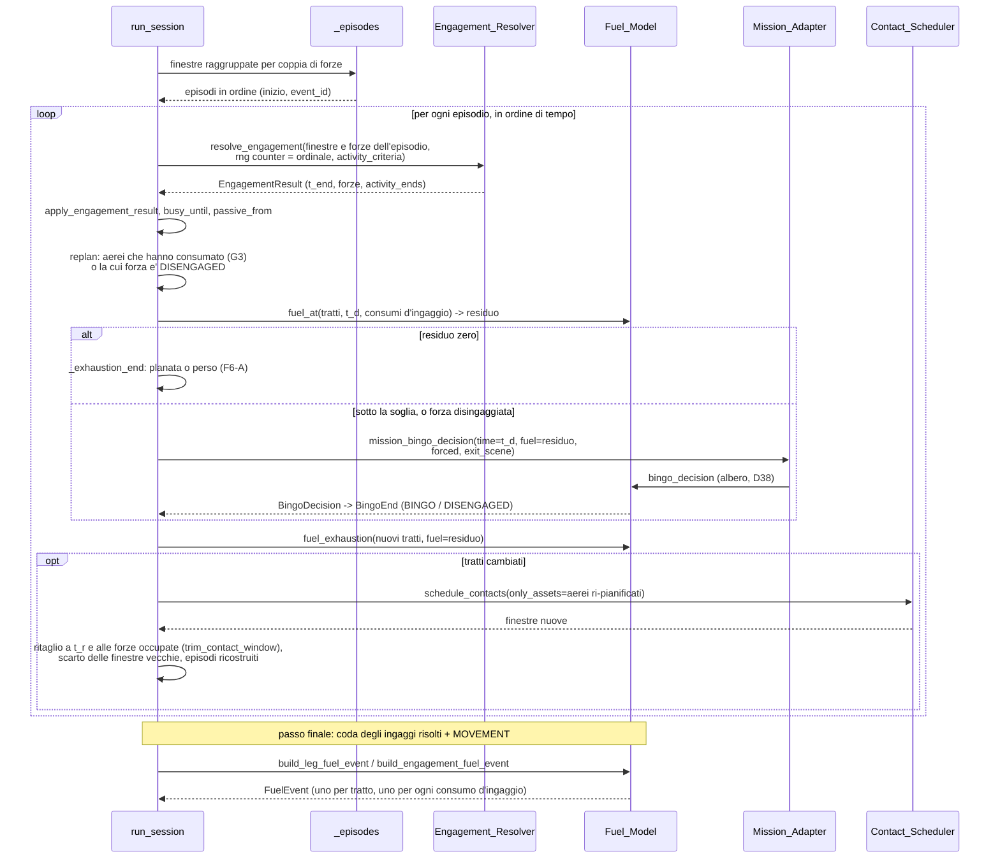
```mermaid
sequenceDiagram
    participant RS as run_session
    participant EP as _episodes
    participant ER as Engagement_Resolver
    participant FM as Fuel_Model
    participant MA as Mission_Adapter
    participant CS as Contact_Scheduler

    RS->>EP: finestre raggruppate per coppia di forze
    EP-->>RS: episodi in ordine (inizio, event_id)
    loop per ogni episodio, in ordine di tempo
        RS->>ER: resolve_engagement(finestre e forze dell'episodio,<br/>rng counter = ordinale, activity_criteria)
        ER-->>RS: EngagementResult (t_end, forze, activity_ends)
        RS->>RS: apply_engagement_result, busy_until, passive_from
        RS->>RS: replan: aerei che hanno consumato (G3)<br/>o la cui forza e' DISENGAGED
        RS->>FM: fuel_at(tratti, t_d, consumi d'ingaggio) -> residuo
        alt residuo zero
            RS->>RS: _exhaustion_end: planata o perso (F6-A)
        else sotto la soglia, o forza disingaggiata
            RS->>MA: mission_bingo_decision(time=t_d, fuel=residuo,<br/>forced, exit_scene)
            MA->>FM: bingo_decision (albero, D38)
            FM-->>RS: BingoDecision -> BingoEnd (BINGO / DISENGAGED)
        end
        RS->>FM: fuel_exhaustion(nuovi tratti, fuel=residuo)
        opt tratti cambiati
            RS->>CS: schedule_contacts(only_assets=aerei ri-pianificati)
            CS-->>RS: finestre nuove
            RS->>RS: ritaglio a t_r e alle forze occupate (trim_contact_window),<br/>scarto delle finestre vecchie, episodi ricostruiti
        end
    end
    Note over RS,FM: passo finale: coda degli ingaggi risolti + MOVEMENT
    RS->>FM: build_leg_fuel_event / build_engagement_fuel_event
    FM-->>RS: FuelEvent (uno per tratto, uno per ogni consumo d'ingaggio)
```

**Terra e mare**: nessun consumo d'ingaggio e nessun rientro; una forza terrestre o navale disingaggiata resta passiva sulla
rotta (G4a), dichiarato.

**Limiti dichiarati**: la decisione è presa alla **fine** dell'episodio, non a metà (l'episodio è risolto in blocco con i tratti
di prima; la riserva di disimpegno è il carburante di quella coda); un aereo ri-pianificato che incontrerebbe una forza ancora
occupata in un episodio già risolto la incontra solo dopo la fine di quell'episodio (forza occupata, per forza intera e non
per asset); l'uscita di scena è sempre al punto di comparsa, anche se il resto della rotta in avanti fosse più corto o
portasse fuori dalla zona delle minacce (decisione dell'utente: ritroso), e solo dopo un episodio; lo scheduler rieseguito
vede lo stato degli asset a `t_r` (un asset distrutto o non più operativo negli episodi già risolti non ha finestre nuove,
mentre le sue finestre del primo scheduling restano); la formazione si può dividere (le decisioni sul carburante sono per
aereo, il rientro forzato per forza); il rientro non evita le minacce dell'andata (il ritroso le ripercorre, in episodi nuovi);
un aereo danneggiato oltre la soglia della F6-B1 resta passivo sulla rotta (nessun rientro per danno); gli aerei di una forza
disingaggiata ancora a terra (non decollati) a `t_r` non sono ri-pianificati; episodi «vuoti» per finestre di aerei già
distrutti (lo scheduler non le tronca).

## 6.21 Interruttori e valori di default

Tutti i comportamenti introdotti dalle fasi F5, F6, G1-G5, F7 e F8b sono dietro **interruttori del modulo**, ciascuno pensato per
attribuire le differenze della fotografia a una sola causa e per fornire una **controprova** negli scenari. Sono
costanti a livello di modulo (nessun parametro di `run_session`): **tutti attivi** nel default, e spegnerli riporta
esattamente il comportamento della fase precedente.

| Interruttore | Modulo | Default | Fase | Effetto se spento |
|---|---|---|---|---|
| `F5_PRESENCE` | `Mission_Adapter` (`:406`) | `True` | F5-B | nessuna presenza prima/dopo: i tratti sono quelli della sola rotta (la storia è quella della F5-A); la postura è riportata comunque |
| `F5_WAITS` | `Mission_Adapter` (`:407`) | `True` | F5-C | nessuna attesa WAIT, ETA bloccate e TOT non sincronizzano; partenza come prima della F5 |
| `F6_FUEL_PER_LEG` | `Session_Simulator` (`:807`) | `True` | F6-A | un solo `FuelEvent` per asset sulla distanza dei tratti di movimento; le soste non consumano |
| `F6_FUEL_CONSTRAINT` | `Session_Simulator` (`:808`) | `True` | F6-A | nessun vincolo: l'asset a secco continua (come prima, esperimento E5) |
| `F6_END_CRITERIA` | `Session_Simulator` (`:819`) | `True` | F6-B1 | i criteri `EndCriteria` non sono letti; stato di missione con la precedenza provvisoria della F6-A |
| `F6_DESTROYED_POSTURE` | `Session_Simulator` (`:820`) | `True` | F6-B1 | un asset distrutto ha la postura di prima (`off_scene`, `Defense`, ...) |
| `F6_BINGO` | `Session_Simulator` (`:830`) | `True` | F6-B2 | nessun bingo: l'aereo vola fino all'esaurimento (F6-A/F6-B1); il validatore a priori non dipende dall'interruttore |
| `F6_BINGO_REVERSE_ROUTE` | `Session_Simulator` (`:840`) | `True` | F6-B2bis | rientro rettilineo con la riserva `BINGO_RESERVE` (F6-B2); **letto solo** con `F6_BINGO` acceso e `F6_BINGO_DISENGAGE_RESERVE` spento |
| `F6_BINGO_DISENGAGE_RESERVE` | `Session_Simulator` (`:851`) | `True` | G2 | la regola 1,2 della F6-B2bis (o la F6-B2); **sostituisce** `F6_BINGO_REVERSE_ROUTE` quando è acceso; letto solo con `F6_BINGO` |
| `G3_ENGAGEMENT_FUEL` | `Session_Simulator` (`:860`) | `True` | G3 | nessun consumo d'ingaggio: la regola della F6-A (tutto il movimento di chi ha combattuto al regime `'max'`); terra e mare non cambiano mai |
| `G4_EPISODES` | `Session_Simulator` (`:869`) | `True` | G4a | l'ingaggio è la componente connessa di forze (§6.3) |
| `G4_REPLAN` | `Session_Simulator` (`:879`) | `True` | G4b | il G4a esattamente: bingo valutato solo alla partenza, esaurimento in ingaggio nel solo contatore; **letto solo** con `G4_EPISODES` (`replanning`, `:2431`) |
| `G4_OFF_SCENE_EXIT` | `Session_Simulator` (`:885`) | `True` | G4b (uscita) | `BINGO_NO_BASE`: l'aereo senza basi resta passivo sulla rotta (il G4b prima dell'uscita di scena); **letto solo** con `G4_REPLAN` |
| `F7_WEAPON_POLICY` | `Session_Simulator` (`:894`) | `True` | F7a | strato W spento: la `fire_control` iniettata è usata com'è (nessun `restrict_by_policy`); con `F7_TARGET_RULES` spento pure, comportamento precedente alla F7a anche per missioni che dichiarano ROE e armi |
| `F7_TARGET_RULES` | `Session_Simulator` (`:895`) | `True` | F7a | strato T spento: nessuna `TargetRules` al risolutore (`target_rules` è `{}`); le validazioni nuove di `Mission_Types` e il controllo del loadout **non** dipendono dall'interruttore |
| `F7_AREA_FIRE` | `Session_Simulator` (`:902`) | `True` | F7b | le azioni `Fire_At_Point` sono ignorate con **un warning per sessione** se esiste almeno un'azione (come prima della F7b, quando non c'era nemmeno il warning); nessuno scenario precedente le dichiara |
| `F8_IN_PROGRESS` | `Session_Simulator` (`:908`) | `True` | F8b | lo stato `IN_PROGRESS` non esiste: la missione non finita alla fine della sessione è `FAILED`, come prima della F8b; di conseguenza `operation_outcome` non vede mai `IN_PROGRESS` |

Gli interruttori della F7 sono tre e **indipendenti** fra loro, ciascuno pensato (come i precedenti) per attribuire le
differenze della fotografia a una sola causa; sono costanti del modulo, non parametri di `run_session`. Con i primi due
spenti il comportamento è quello precedente alla F7a; con il terzo spento, quello precedente alla F7b. **Con tutti e tre
accesi nessuna sessione precedente alla F7 cambia** (la fotografia a 918 esecuzioni è rimasta identica: capitolo 8 §8.11).

Il modulo ha quindi **quindici** interruttori propri (undici a `a784a9e7`, più i tre della F7, più `F8_IN_PROGRESS`), oltre ai due di
`Mission_Adapter` (`F5_PRESENCE`, `F5_WAITS`).

**`F8_IN_PROGRESS` è l'unico interruttore della F8** e l'unico il cui default **non** riproduce esattamente il comportamento precedente: è
acceso per decisione dell'utente (decisione 23, 2026-10-21), come eccezione dichiarata alla regola dei default («ogni regola nuova sta
dietro un interruttore il cui default riproduce il comportamento precedente»), perché cambia solo l'esito di missione di chi prima era
`FAILED` per «ancora in corso», una grandezza che la fotografia non registra. Il validatore, la prontezza, le posizioni persistenti e
l'esito d'Operazione **non** sono regole del motore e non hanno interruttori: sono funzioni nuove fuori da `run_session`, quindi gli
scenari che chiamano `run_session` non cambiano. Controprova a interruttore spento: `test_route_cut_by_the_session_end_off_is_failed` e
`TestF8bCampaignOutcome.test_operation_outcomes` (capitolo 8 §8.12).

Costanti non-interruttore che il modulo definisce: `EPISODE_GAP = FM.DISENGAGE_TIME` (`:914`), le etichette
`FUEL_HALT`/`FUEL_GLIDE`/`FUEL_CRASH` (`:917-919`) e i regimi `CRUISE_REGIME`/`COMBAT_REGIME` (`:796-797`).

*Dipendenze fra gli interruttori*: `G4_OFF_SCENE_EXIT` ⊂ `G4_REPLAN` ⊂ `G4_EPISODES`; il bingo dopo l'episodio richiede
anche `F6_BINGO` e `F6_BINGO_DISENGAGE_RESERVE` (l'albero del G2); il consumo d'ingaggio (`G3_ENGAGEMENT_FUEL`) alimenta la
ri-pianificazione (gli aerei «che hanno consumato»). La **controprova** negli scenari: S26 espone una variante per ogni
interruttore del bingo (`switch_off`, `reverse_off`, `reserve_off`, `engagement_fuel_off`, `replan_off`), S27 per i
tre del G3/G4, S5 `episodes_off` e `exit_off` (capitolo 8 §8.10). I tre interruttori della F7 sono indipendenti fra loro
e dai precedenti, con un solo punto di contatto: `F7_AREA_FIRE` acceso e `G4_EPISODES` spento fanno risolvere il fuoco su
posizione nello stesso `heapq` degli ingaggi invece che fra gli episodi (§6.2). Controprova negli scenari: S28 espone una
variante a interruttore spento per ogni caso (`rules_off`, `cap_low_off`, `sead_off`, `self_defence_off`), S29 `switch_off`
(capitolo 8 §8.11).

## 6.22 Regole d'ingaggio di missione in sessione (F7a, `9f87a3ad`, decisioni dell'utente del 2026-10-18)

**Che cosa è.** La missione decide *contro chi* si spara e *con che arma*. Il piano è
`Analysis/Document/Proposta_F7_Bersagli_Filtro_Armi.md` (§2 e §5). Due strati, con interruttori indipendenti
(`F7_WEAPON_POLICY`, `F7_TARGET_RULES`, §6.21), ai quali l'orchestratore fa solo da **cablaggio**: la regola sta nel risolutore
(strato T, capitolo 4 §4.32) e nell'involucro della fire control (strato W, capitolo 4 §4.33), che **non leggono mai la
`Mission`**; la traduzione dalla missione alle loro forme è in `Logic/Mission_Adapter` (sotto). Il docstring del modulo ne è la
fonte (`Logic/Session_Simulator.py:452-478`).

**Le quattro funzioni di `Mission_Adapter`** (`Logic/Mission_Adapter.py:1834-2000`, sezione «REGOLE D'INGAGGIO DI MISSIONE (F7a)»;
pure, nessun RNG):

| Funzione | Righe | Che cosa fa |
|---|---|---|
| `_asset_sides(blocks)` | `:1836-1849` | `{asset_id: lato del blocco proprietario}` di tutti gli asset dei blocchi passati |
| `designated_targets(mission, blocks, mission_of, assets, side)` | `:1852-1915` | il bersaglio designato come `(id degli asset nemici, area)`. **ASSET**: l'asset `target_id`. **GROUP**: gli asset del blocco `target_id`, oppure della missione `target_id`, oppure l'asset stesso, ristretti a `Target.asset_ids` se dichiarato (id non presenti nel gruppo: ignorati con un warning), **sempre filtrati ai nemici** (lato diverso da `side`): un gruppo amico (la missione protetta da una scorta, un trasporto) non designa nessuno (log informativo). Id sconosciuto: insieme vuoto con un warning. **POINT/AREA/ZONE**: nessun id e un'area `(x, y, raggio efficace)` con raggio efficace = `radius_m` (un `POINT` senza raggio: `TARGET_POINT_RADIUS_M`) **più** `uncertainty_m` se la provenienza è `ESTIMATED`. **NONE**: niente |
| `weapon_policies(missions, assets)` | `:1918-1945` | `{asset_id: WeaponPolicy}` degli asset delle missioni la cui politica ha vincoli, cioè le **sole missioni aeree** (`Context.mission_weapon_policy`; terra e mare `None`). `self_escort` viene dal loadout *assegnato* (`AIRCRAFT_LOADOUTS[asset._model][asset.assigned_loadout]['self_escort_capability']`), `False` se manca. Gli asset non passati in `assets` sono saltati |
| `attack_point(mission, mission_asset)` | `:1948-1967` | la posizione `(x, y, z)` del punto `ATTACK` sulla rotta *dell'asset* (con l'offset di formazione, da `asset_route`); con più punti `ATTACK` vale l'**ultimo**; `None` se la missione non ha punto `ATTACK` o la rotta dell'asset non è ricavabile (allora l'aereo resta in avvicinamento: comportamento conservativo) |
| `target_rules(missions, blocks, mission_of, assets, side_of)` | `:1970-2000` | `{asset_id: TargetRules}`, **solo** per gli asset la cui missione ha una ROE diversa da `weapon_free` **oppure** armi designate non vuote (`MissionAsset.designated_weapons`): senza, nessuna voce e il risolutore è identico a quello di prima. `side_of` è `{block_id: lato}`. `air_self_defence` è `True` se la politica d'armi della missione dà all'aria la regola `self_defence` (le missioni aria-suolo; per un CAP, regola `any`, e per terra e mare, politica `None`, è `False`). `attack_point` è passato solo con la ROE `priority_designated` |

`TARGET_POINT_RADIUS_M = 500` m (`Logic/Mission_Adapter.py:392`) è una **STIMA DI PROGETTO**, non un dato (decisione 11 del
2026-10-18): l'ordine di grandezza dell'errore di un punto d'impatto o di posizione per un obiettivo puntiforme (un compound,
una batteria); da ricalibrare con i dati di precisione.

**Il cablaggio in `run_session`** (diagramma D48):

1. **Strato W** (`:2273-2277`): con `F7_WEAPON_POLICY`, `policies = MA.weapon_policies(order.missions, assets_by_id)` e, se non
   vuote, `fire_control = FC.restrict_by_policy(fire_control, policies)` — **prima di ogni uso** della fire control (tutti gli
   episodi e la ri-pianificazione). Spento, o senza missioni aeree: la fire control iniettata com'è.
2. **Strato T** (`:2279-2281`): con `F7_TARGET_RULES`, `target_rules = MA.target_rules(...)` una volta per sessione (altrimenti
   `{}`); `hostile_of` (`:2284`) è la memoria di `return_fire` **per sessione**, `{dominio di coordinamento: {asset ostili}}`.
3. **Per ogni episodio** (`engage`, `:2745-2763`): per ogni asset con regole *e presente nell'episodio* (`asset_id in owner`) la
   sessione sostituisce (`dataclasses.replace`) `known_hostile_ids` con gli asset che hanno già lanciato contro il dominio di
   coordinamento della sua forza e `known_destroyed_ids` con i suoi designati per id già distrutti **sullo stato reale**
   (`is_destroyed()`: gli episodi precedenti sono già applicati, come lo sono i fuochi su posizione, §6.23, e come lo è
   la distruzione precedente alla sessione); poi passa la mappa a `resolve_engagement(..., target_rules=...)`.
4. **Dopo ogni episodio** (`:2792-2795`): per ogni salva del risultato, l'autore del lancio entra in
   `hostile_of[dominio della forza colpita]` — vale per **qualunque** tiratore, con o senza regole.

*Diagramma D48 — il cablaggio delle regole d'ingaggio di missione in `run_session` (F7a).*

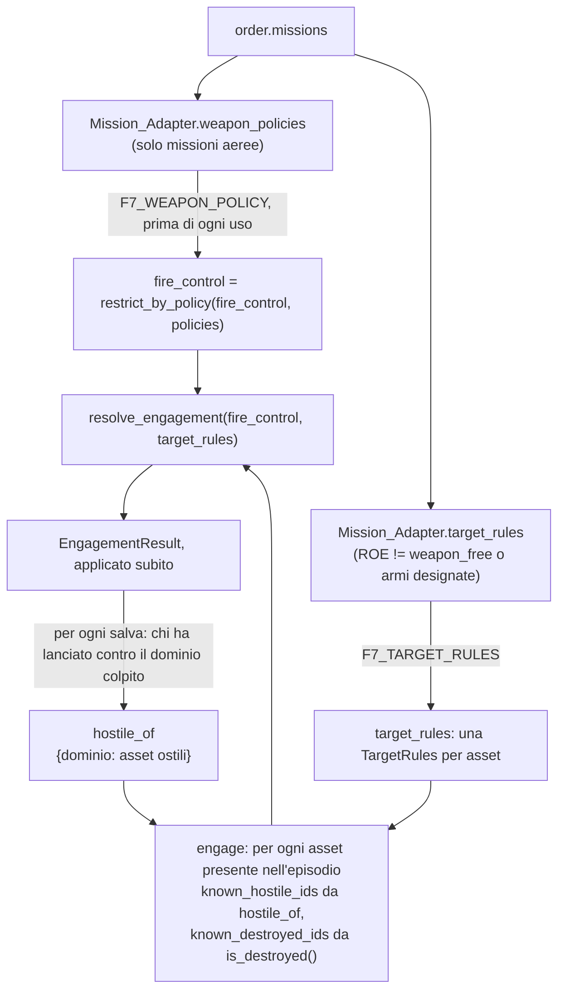
```mermaid
flowchart TD
    M["order.missions"] --> WP["Mission_Adapter.weapon_policies<br/>(solo missioni aeree)"]
    WP -->|"F7_WEAPON_POLICY, prima di ogni uso"| RB["fire_control = restrict_by_policy(fire_control, policies)"]
    M --> TR["Mission_Adapter.target_rules<br/>(ROE != weapon_free o armi designate)"]
    TR -->|F7_TARGET_RULES| RULES["target_rules: una TargetRules per asset"]
    HO["hostile_of<br/>{dominio: asset ostili}"] --> EP
    RULES --> EP["engage: per ogni asset presente nell'episodio<br/>known_hostile_ids da hostile_of,<br/>known_destroyed_ids da is_destroyed()"]
    RB --> RES["resolve_engagement(fire_control, target_rules)"]
    EP --> RES
    RES --> OUT["EngagementResult, applicato subito"]
    OUT -->|"per ogni salva: chi ha lanciato contro il dominio colpito"| HO
```

**Stato di una sessione senza regole.** Nessuna missione degli scenari preesistenti dichiara ROE o armi designate (nessuna `TargetRules`), salvo S19AD, migrato dai filtri di test alle regole di missione e rimasto identico (24 esecuzioni su 24, capitolo 8 §8.6), e la
politica d'armi non scarta nulla negli scenari preesistenti (sonda dichiarata da `F4_Differenze_Scenari.md`, «F7a»: 40 chiamate
della scorta F-16C di S19, mai a portata; non rieseguita): la fotografia a 918 esecuzioni è rimasta **identica** (capitolo 8 §8.11). La politica d'armi non toglie estrazioni: un filtro che cambia una
scelta sposta però le estrazioni di danno successive dello stesso ingaggio.

**Limiti dichiarati.** Terra e mare senza vincoli d'arma; la designazione geometrica è valutata alla prima decisione
(capitolo 4 §4.32); la memoria di `return_fire` è per dominio di coordinamento e per sessione, non per missione; un'arma
sempre esclusa non si esaurisce (non fa scattare `winchester`); la priorità è solo locale; nessun cueing (la designazione non
dà rilevamento). Il dettaglio dei limiti è nel capitolo 9 §9.1.

## 6.23 Fuoco su posizione: `Logic/Area_Fire.py` e l'evento `AREA_FIRE_EVENT` (F7b, `dcedc541`, decisione 15 dell'utente del 2026-10-20)

**Il problema.** Il risolutore spara solo a ciò che ha **rilevato**: un'artiglieria che spara su «il punto dove i blu erano»
(N3.e: la posizione *stimata* del bersaglio, nebbia di guerra) non era rappresentabile. La F7b lo rende un **evento di
sessione separato dal risolutore**: nessun rilevamento, nessuna finestra di contatto, solo geometria ed estrazioni. Piano:
`Proposta_F7_Bersagli_Filtro_Armi.md` §6; il modulo nuovo è `Logic/Area_Fire.py` (326 righe, il docstring ne è la fonte,
`:1-63`).

**La missione di fuoco.** Una missione di **terra o di mare** con bersaglio `POINT` o `AREA` e, su un suo waypoint, un'azione
`MissionAction(kind=TASK, name='Fire_At_Point', params={'rounds': int >= 1, 'weapon': str (facoltativo)}, start=...)`
(`Mission_Types.FIRE_AT_POINT_ACTION`, validata da `Mission._validate_fire_actions`, capitolo 2 §2.6). Un aereo non è un tiratore
(`fire_orders` restituisce `[]` per `mission.domain == 'air'`, decisione 15a).

**Gli ordini di fuoco.** `Area_Fire.fire_orders(mission, movement, t0)` (`:144-188`, funzione pura) ricava, nell'ordine del piano
dei punti (waypoint, poi azione), un `FireOrder` (`:106-128`: `mission_id`, `asset_id`, `waypoint_index`, `action_index`,
`t_fire`, `aim_x`, `aim_y`, `dispersion_m`, `rounds`, `weapon`) per ogni azione, per l'asset di `movement` (un
`Mission_Adapter.AssetMovement`):

- **istante di tiro** `t_fire`: l'arrivo dell'asset al waypoint (`Mission_Adapter.waypoint_times`, **attese comprese**, F5-C);
  poi la condizione d'avvio dell'azione: `ON_ARRIVAL` l'arrivo, `AT_TIME` `max(arrivo, t0 + time)`, `AFTER_DURATION`
  `arrivo + duration_s`;
- **punto mirato** = `target.position`, la posizione *stimata* (il bersaglio vero è altrove se si è mosso);
- **raggio di dispersione** `R = max(radius_m, uncertainty_m se ESTIMATED, AREA_FIRE_MIN_DISPERSION_M)` (`dispersion_radius`,
  `:136-141`);
- lista vuota se la missione è aerea, non ha azioni di fuoco, o l'asset non ha una rotta percorribile (un warning se le azioni ci
  sono ma gli istanti d'arrivo no).

`area_fire_event_id(ordine)` (`:131-133`) è `'area_fire|<mission_id>|<asset_id>|<wp>|<azione>'`: identifica l'ordine e costruisce
lo stream dell'RNG. `impact_time` (`:216-218`) è `t_fire + weapon.time_of_flight`; `plan_shot` (`:202-213`) sceglie l'arma
(`Fire_Control.area_fire_weapon`, capitolo 4 §4.34) dalla posizione del tiratore a `t_fire` (`positions_at(asset_id, t)`); senza
`stock_of` la scorta non è considerata.

**La risoluzione.** `resolve_area_fire(ordine, tiratore, nemici, positions_at, rng, provenance, *, inactive_from, grounded_at)`
(`:231-315`) **non muta gli asset** e restituisce un `EngagementResult` oppure `None` (nessun tiro, con un log):

1. *Il tiratore è attivo?* Nessun tiro se `inactive_from` (calcolato dalla sessione: distrutto, passivo o a secco) è ≤ `t_fire`.
2. *C'è un'arma?* `plan_shot` con la scorta (`Mobile.stock_of`): quella dichiarata in `params['weapon']`, altrimenti la prima con
   task Artillery / Naval_Gunfire_Support / Land_Attack che ha scorta e **portata** (la distanza è orizzontale, dalla posizione
   del tiratore a `t_fire` al punto mirato). Altrimenti nessun tiro.
3. **colpi** = `min(rounds, scorta // stock_per_round)` (se la scorta per quell'arma non è modellata: tutti i `rounds`); meno di
   uno: nessun tiro.
4. **candidati**: i nemici *non distrutti* (salute intera maggiore di `DESTROYED_HEALTH`), **in ordine di id**, la cui posizione a
   `t_impact` è nota e per i quali `Fire_Control.area_fire_pk` dà una `destroy_capacity` (nessuna per un aereo *in volo*, mai
   colpito; un aereo *a terra*, `grounded_at`, è un bersaglio di superficie).
5. **per ogni colpo, nell'ordine delle estrazioni** (parte del contratto): **2 estrazioni** per il punto d'impatto, uniforme nel
   disco di raggio `R` attorno al punto mirato (raggio `R·sqrt(u1)`, angolo `2π·u2`); poi, per ogni candidato **non ancora
   distrutto** (la salute evolve colpo dopo colpo, su una copia di lavoro `_Hit`), in ordine di id, la cui distanza orizzontale
   dal punto d'impatto è **non maggiore** del raggio letale `r_l`: **1 estrazione** e
   `Damage_Model.build_damage_event(hit, 1.0, destroy_capacity, draw, time=t_impact, ...)`. Con accuratezza 1,0 il colpo entro il
   raggio letale non manca mai: è `KILL` con probabilità `destroy_capacity`, altrimenti `DAMAGE` di
   `round(100·destroy_capacity)` punti (almeno 1). La «letalità» è quindi **solo la `destroy_capacity` della riga del template**
   dell'arma per la classe del bersaglio; l'`accuracy` della riga serve soltanto a scartare le righe con Pk nulla. Nessuna
   seconda probabilità, nessuna estrazione per un candidato già distrutto o fuori raggio;
6. **esito**: `EngagementResult(t_start=t_fire, t_end=t_impact, forces=(), damage_events=…, ammunition_events=(AmmunitionEvent(
   time=t_fire, rounds=colpi·stock_per_round, weapon=modello),))`. Le forze sono **vuote**: nessuna tempra, disingaggio o shock
   sul colpito (decisione 15g). `DamageEvent` a `t_impact`, `AmmunitionEvent` a `t_fire`.

`lethal_radius(arma)` (`:193-199`) = `AREA_FIRE_LETHAL_RADIUS_PER_MM x calibro`, con ripiego `AREA_FIRE_LETHAL_RADIUS_M` se il registro
non dichiara il calibro.

**Costanti STIMATE** (`Logic/Area_Fire.py:88-98`; **non tarate**, nessun dato d'arma le fonda: sono il minimo per avere un modello
di dispersione uniforme e letalità a soglia, decisione 15b/15c):

| Costante | Valore | Significato e statuto |
|---|---|---|
| `AREA_FIRE_MIN_DISPERSION_M` | **50 m** | raggio minimo di dispersione dei colpi attorno al punto mirato; l'ordine di grandezza della dispersione di una batteria su un punto noto con precisione (decine di metri). **STIMA**; il raggio effettivo è il massimo con raggio e incertezza del bersaglio |
| `AREA_FIRE_LETHAL_RADIUS_PER_MM` | **0,25 m/mm** | raggio letale per mm di calibro: un proietto da 152 mm fa danni letali a un mezzo entro ~40 m (ordine di grandezza dei raggi di frammentazione di una granata HE), scala lineare col calibro per semplicità. **STIMA** (152 mm: 38 m) |
| `AREA_FIRE_LETHAL_RADIUS_M` | **25 m** | raggio letale di ripiego quando il registro non dichiara il calibro. **STIMA** |

*Esempio numerico (S29-AREA, scenario di test)*: 1 2S19-Msta spara 40 colpi su un punto con incertezza 200 m: dispersione
`R` = max(0, 200, 50) = 200 m; raggio letale 0,25 x 152 = 38 m; un mezzo al centro è dentro il raggio letale di un colpo con
probabilità (38/200)² ≈ 0,036, quindi ≈ 1,4 colpi a segno in media su 40 (valore dello stesso ordine citato nel docstring di
S29); il tempo di volo è 0,5 x 24 700 / 810 ≈ 15,2 s.

**Il cablaggio in `run_session`** (`:2437-2514`, diagramma D50):

- **Pianificazione a monte** (`:2494-2510`, con `F7_AREA_FIRE`): per ogni asset di `movement_of` e per ogni ordine di
  `fire_orders`, `plan_shot` **senza** la scorta; senza arma/portata/posizione, o con `t_fire` oltre la fine della sessione, l'ordine
  **non è schedulato** (un warning). Altrimenti entra in `area_events` con l'istante d'impatto stimato come chiave, ordinato per
  `(istante, event_id)`. **L'istante che ordina l'evento è quindi stimato con l'arma preferita senza la scorta**: se
  all'impatto quell'arma è esaurita e ne subentra un'altra con tempo di volo diverso, l'esito porta il proprio istante e non
  quello d'ordinamento (limite dichiarato).
- **Interruttore spento** (`:2468-2471`): le azioni `Fire_At_Point` sono ignorate con **un warning per sessione** se esiste almeno
  un'azione.
- **Risoluzione** (`fire_area`, `:2467-2486`): `positions_at` = `position_of` (`:2439-2441`, la posizione sui tratti
  `all_legs`, saturata agli estremi); **nemici** = gli asset dell'**altro schieramento** (A/B) rispetto al tiratore
  (`block_owner[asset][0] != side`), non il `side` del blocco: niente fuoco amico (15d); `inactive_from(asset)`
  (`:2443-2465`) = il **più vecchio** fra distruzione (`_destruction_times` sui risultati già risolti), `passive_from`
  (disingaggio o fine di attività scattata in un episodio precedente), fine di attività nota a monte (`static_end`: durata
  massima, winchester) e fine del carburante (`fuel_ends`, FUEL_HALT: «a secco»); RNG
  `order.rng(mission_id=ordine.mission_id, event_id=area_fire_event_id(ordine), counter=0)` (`:2475`, **primo uso dello slot
  `mission_id`**, corretto perché il tiro appartiene a UNA missione); `grounded_at` = `grounded.at`. Il risultato è
  accodato a `results` e a `resolved` come `(t_end, event_id, result)` e **applicato subito** a tutti i blocchi
  (`ER.apply_engagement_result(result, *blocks.values())`): scorta del tiratore e salute dei colpiti; le distruzioni entrano in
  `_known_destructions` e quindi nelle conoscenze degli episodi successivi e nell'esito per missione.
- **Quando** (`fire_due`, `:2488-2492`): gli ordini con impatto *strettamente anteriore* (di `CS.TIME_EPS`) a un istante `before`
  (l'inizio dell'episodio che sta per essere risolto, `:2881`; a parità d'istante l'ingaggio precede) o, alla fine, tutti i
  rimasti (`:2867`). Con `G4_EPISODES` spento stanno nello stesso `heapq` degli ingaggi, con tipo `AREA_FIRE_EVENT`
  (`:2922-2936`). In entrambi i casi **non passa dal risolutore** e non tocca gli stream degli ingaggi né della tempra: **ogni
  sessione senza azioni `Fire_At_Point` è identica a prima**.
- **Nell'esito**: `SessionOutcome.engagement_outcomes` contiene l'evento come un ingaggio con **zero forze** (`assemble_session_outcome`
  riporta `r.forces`, `()`), e `counts.engagements` della fotografia lo conta; nella contabilità del carburante passa come un
  ingaggio senza salve (§6.2).

*Diagramma D49 — `resolve_area_fire`: dalla condizione di tiro alle estrazioni.*

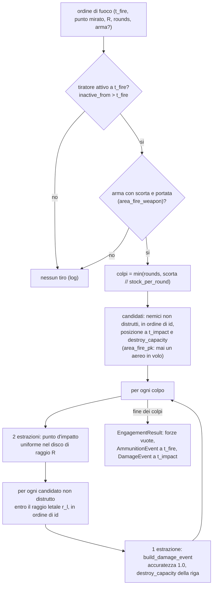
```mermaid
flowchart TD
    S["ordine di fuoco (t_fire, punto mirato, R, rounds, arma?)"] --> A{"tiratore attivo a t_fire?<br/>inactive_from > t_fire"}
    A -->|no| N["nessun tiro (log)"]
    A -->|si| W{"arma con scorta e portata<br/>(area_fire_weapon)?"}
    W -->|no| N
    W -->|si| K["colpi = min(rounds, scorta // stock_per_round)"]
    K --> C["candidati: nemici non distrutti, in ordine di id,<br/>posizione a t_impact e destroy_capacity<br/>(area_fire_pk: mai un aereo in volo)"]
    C --> L["per ogni colpo"]
    L --> P["2 estrazioni: punto d'impatto<br/>uniforme nel disco di raggio R"]
    P --> E["per ogni candidato non distrutto<br/>entro il raggio letale r_l, in ordine di id"]
    E --> D["1 estrazione: build_damage_event<br/>accuratezza 1.0, destroy_capacity della riga"]
    D --> L
    L -->|"fine dei colpi"| R["EngagementResult: forze vuote,<br/>AmmunitionEvent a t_fire, DamageEvent a t_impact"]
```

*Diagramma D50 — il fuoco su posizione nella coda di sessione.*

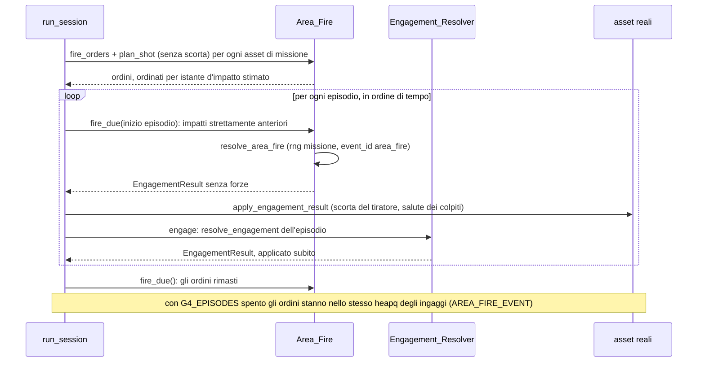
```mermaid
sequenceDiagram
    participant RS as run_session
    participant AF as Area_Fire
    participant ER as Engagement_Resolver
    participant AS as asset reali

    RS->>AF: fire_orders + plan_shot (senza scorta) per ogni asset di missione
    AF-->>RS: ordini, ordinati per istante d'impatto stimato
    loop per ogni episodio, in ordine di tempo
        RS->>AF: fire_due(inizio episodio): impatti strettamente anteriori
        AF->>AF: resolve_area_fire (rng missione, event_id area_fire)
        AF-->>RS: EngagementResult senza forze
        RS->>AS: apply_engagement_result (scorta del tiratore, salute dei colpiti)
        RS->>ER: engage: resolve_engagement dell'episodio
        ER-->>RS: EngagementResult, applicato subito
    end
    RS->>AF: fire_due(): gli ordini rimasti
    Note over RS,AS: con G4_EPISODES spento gli ordini stanno nello stesso heapq degli ingaggi (AREA_FIRE_EVENT)
```

**Limiti dichiarati** (capitolo 9 §9.1): dispersione uniforme e letalità a soglia con costanti STIMATE; **niente fuoco amico**, niente
intercettazione (le armi `missile` sono escluse), niente effetti dottrinali sul colpito; gli aerei sono esclusi come tiratori e, in
volo, come bersagli (un aereo a terra è un bersaglio di superficie); **un solo evento all'impatto**: un bersaglio distrutto da
un altro episodio fra `t_fire` e `t_impact` è già distrutto all'impatto (corretto), ma la scorta è consumata nell'ordine di
applicazione anche se l'`AmmunitionEvent` porta l'istante `t_fire`; un nemico distrutto da un episodio già risolto con un impatto
**posteriore** a quello dell'evento è visto come già distrutto; `target_destroyed` per `POINT`/`AREA` resta non rappresentabile
(decisione 12 della F7a).

## 6.24 Esito per la campagna: `final_positions`, `movement_ends`, `operation_outcomes` (F8b, `33698fb4`)

Alla fine di `run_session`, dopo le posture e prima di assemblare l'esito, la porta di uscita calcola tre dati nuovi per chi conduce
la campagna (`Logic/Session_Simulator.py:3141-3154`; docstring "Esito per la campagna (F8)", `:720-728`). Sono **solo dati**: nessun asset
è mosso, nessun registro è scritto (`:730-739`).

- **`final_positions`** (`:3144-3151`). Per ogni asset (ordine di id) si prendono i suoi tratti **definitivi** `all_legs[asset_id]` —
  quelli dopo bingo, esaurimento e ri-pianificazione G4b (`:2392-2404`, aggiornati in `replan` a `:2690-2693`): per un asset di missione la
  presenza ferma prima, la rotta e la presenza dopo; per un asset senza missione un tratto statico nella sua posizione iniziale
  (`Contact_Scheduler.static_legs`) — e si calcola `Contact_Scheduler.position_on_legs(legs, session_end)` (`Contact_Scheduler.py:508`), che **satura
  agli estremi** dei tratti. `session_end` è la fine **nominale** (`t0 + horizon`), non `latest`: una salva in volo oltre la fine non muove
  nessuno. Ne escono: l'ultimo punto per chi ha completato la rotta, il punto d'atterraggio per un aereo rientrato, la posizione di partenza per
  chi è rimasto fermo, la posizione sulla rotta tagliata per chi la sta ancora percorrendo, e (**per costruzione**, seguendo i tratti
  definitivi, e non provato da un test di sessione) il punto d'uscita per un aereo uscito di scena. Un asset **senza tratti** (un aereo perso alla
  partenza per carburante) non ha voce. Le componenti sono `float` di Python, mai `Point3D` di sympy.
- **`movement_ends`** (`:3153`): `{asset_id: float(legs[-1].t_end)}` per gli asset di **missione** con tratti di movimento non vuoti
  (`moving_legs`, i tratti senza la presenza, ritagliati a `[t0, session_end]` da `Mission_Adapter.movement_legs`, `:2293`, e poi accorciati
  dal bingo, dall'esaurimento e dalla ri-pianificazione). È l'istante di arrivo all'ultimo punto, o di esaurimento del carburante, o
  l'istante in cui l'aereo ha toccato terra dopo il rientro; per una rotta tagliata dalla fine della sessione vale `session_end`.
  Assente per gli asset senza missione. È l'istante da cui parte il turnaround (§6.26).
- **`operation_outcomes`** (`:3154`): `operation_outcome(op, mission_outcomes)` per ogni `Operation` dell'ordine (capitolo 2 §2.4). L'esito
  d'Operazione eredita `IN_PROGRESS` dagli esiti di missione, quindi dipende da `F8_IN_PROGRESS` (§6.11, §6.21).

I tre dati sono passati ad `assemble_session_outcome` (`:3158-3163`). **Non sono nella fotografia di non regressione** (decisione 27 della
F8): una voce nuova avrebbe cambiato la forma di tutte le esecuzioni; li verificano i test (`TestF8bCampaignOutcome`, capitolo 8 §8.12).

**Che cosa NON sono.** `final_positions` non è un movimento fisico persistente: `run_session` **non** assegna la posizione agli asset (le
sessioni successive chiamate direttamente ripartono dalle posizioni iniziali, come prima: è il limite storico di S11 e della mini-campagna
di validazione, ora dichiarato nei loro docstring come limite «per chi chiama `run_session` direttamente», capitolo 8 §8.3). La persistenza è
del conduttore di campagna (§6.27).

## 6.25 Il validatore di sessione: `Logic/Session_Validator.py` (F8a, `c1182d8a`)

**Dove sta e perché.** Modulo nuovo (269 righe) **fuori** da `run_session`: l'esecutore (sintetico o DCS) esegue, il pianificatore valida.
È la stessa scelta già fatta per il bingo a priori (deviazione 15 del Piano; decisione 17 dell'utente): un chiamante che salta il
validatore può ancora far girare un ordine non valido, ed è ciò che fanno, di proposito, i test dell'esecutore. Misura della Proposta F8
§1.7 (una sonda in sola lettura sulle esecuzioni della fotografia di allora, **non rieseguita** per questo aggiornamento): con il validatore
dentro `run_session`, **57 delle 982 esecuzioni** sarebbero diventate errori (48 per carburante — S24-ORBIT e S26-BINGO —, 8 per una fine
pianificata oltre la sessione — `S22-E3/*/not_departed` —, 1 per sessione aperta): sono scenari *voluti*, che provano proprio il taglio, il
bingo e l'esaurimento. Da qui la decisione 17.

**API.** `validate_session(order, forces_a, forces_b, *, ledger=None, rules=None, horizon=None) -> Tuple[SessionViolation, ...]`
(`Logic/Session_Validator.py:36-228`) e `check_session(...)` (`:231-244`), che chiama la prima e, se c'è almeno una violazione, solleva
`SessionValidationError(order.session_id, violazioni)` (capitolo 2 §2.10). `validate_session` è una **funzione pura**: nessuna
mutazione degli asset, nessuna estrazione casuale. Le violazioni sono **raccolte tutte** (non si ferma alla prima), nell'ordine dei
controlli: finestra, disgiunzione, poi missione per missione (nell'ordine dell'ordine) e, dentro la missione, nell'ordine a–f sotto. Le regole
di finestra sono `rules` se dato, altrimenti `ledger.rules`, altrimenti `SessionRules()` (`:62-65`).

*Diagramma D52 — i controlli di `validate_session` (F8a).*

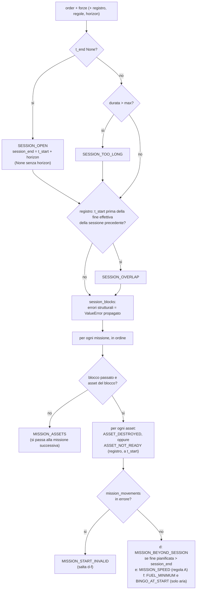
```mermaid
flowchart TD
    IN["order + forze (+ registro, regole, horizon)"] --> W{"t_end None?"}
    W -->|si| V1["SESSION_OPEN<br/>session_end = t_start + horizon<br/>(None senza horizon)"]
    W -->|no| L{"durata > max?"}
    L -->|si| V2["SESSION_TOO_LONG"]
    V1 --> OV
    V2 --> OV
    L -->|no| OV{"registro: t_start prima della fine effettiva<br/>della sessione precedente?"}
    OV -->|si| V3["SESSION_OVERLAP"]
    OV -->|no| BL["session_blocks:<br/>errori strutturali = ValueError propagato"]
    V3 --> BL
    BL --> M["per ogni missione, in ordine"]
    M --> A{"blocco passato e<br/>asset del blocco?"}
    A -->|no| V4["MISSION_ASSETS<br/>(si passa alla missione successiva)"]
    A -->|si| B["per ogni asset:<br/>ASSET_DESTROYED, oppure<br/>ASSET_NOT_READY (registro, a t_start)"]
    B --> C{"mission_movements<br/>in errore?"}
    C -->|si| V5["MISSION_START_INVALID<br/>(salta d-f)"]
    C -->|no| D["d: MISSION_BEYOND_SESSION<br/>se fine pianificata > session_end<br/>e: MISSION_SPEED (regola A)<br/>f: FUEL_MINIMUM e BINGO_AT_START (solo aria)"]
```

I **controlli per missione** (`:115-222`), con i codici di `ViolationCode`:

| Passo | Codice | Quando scatta |
|---|---|---|
| finestra (`:69-89`) | `SESSION_OPEN` | `order.t_end is None`: una campagna non ha sessioni aperte (D4.b); la finestra si costruisce con `SessionRules.window`. Con `horizon` il validatore ricava `session_end = t_start + horizon` e continua; senza, **salta** i controlli di fine missione |
| finestra | `SESSION_TOO_LONG` | durata > `rules.max_duration_s` + eps (default 4 h) |
| disgiunzione (`:91-98`) | `SESSION_OVERLAP` | con un registro con almeno una sessione, `t_start < ledger.last_end − eps`: la fine considerata è quella **effettiva** della precedente (`SessionOutcome.t_end`, che comprende le salve in volo), non la nominale (decisione 25) |
| a (`:120-138`) | `MISSION_ASSETS` | blocco della missione non passato fra le forze, o `Mission_Types.check_mission_assets` che solleva (un asset non è del blocco) |
| b (`:140-160`) | `ASSET_DESTROYED` | l'asset è distrutto (`is_destroyed()`) |
| b | `ASSET_NOT_READY` | col registro, `not ledger.is_ready(asset_id, order.t_start)`: la prontezza si controlla **all'inizio della sessione** (D6.a), non alla partenza della missione; il messaggio porta `ready_at` e il tipo di processo (`turnaround`, `repair` o `turnaround+repair`) |
| c (`:162-174`) | `MISSION_START_INVALID` | `MA.mission_movements(mission, t_start, basi)` solleva `ValueError` (per esempio una partenza derivata anteriore a `t_start`); le basi aeree si calcolano solo per le missioni aeree; si saltano i passi d–f |
| d (`:176-185`) | `MISSION_BEYOND_SESSION` | `MA.mission_planned_end(...)` > `session_end` + eps (solo se `session_end` è noto): la **fine pianificata** (arrivo all'ultimo punto, attese comprese; per una missione senza rotta la partenza più `max_duration_s` se dichiarata, altrimenti `None` e nessun rifiuto) supera la sessione |
| e (`:187-195`) | `MISSION_SPEED` | `MA.check_mission_speed` solleva (regola A, capitolo 6 §6.10) |
| f (`:197-206`) | `FUEL_MINIMUM` | solo missioni aeree: `MA.check_mission_fuel` solleva (G1: carburante ≤ rotta intera + riserva di disimpegno) |
| f (`:208-218`) | `BINGO_AT_START` | con `SS.F6_BINGO` acceso: `MA.check_mission_bingo(..., reverse_route=SS.F6_BINGO_REVERSE_ROUTE, disengage_reserve=SS.F6_BINGO_DISENGAGE_RESERVE)` solleva |

Gli interruttori del bingo sono letti **al momento della chiamata come attributi del modulo `SS`** (non importati per nome), così un test che li
spegne con `patch.object` li vede, e il bingo a priori del validatore segue sempre la regola dell'esecutore. Con il modello attuale (G2) i due
controlli di carburante coincidono (la sonda ne contava 48 e 48 sugli stessi casi): un ordine sotto il minimo di G1 è anche sotto la soglia del
bingo, quindi produce **due** violazioni. `MISSION_ASSETS`, `MISSION_START_INVALID` interrompono l'esame della missione; le altre si
sommano. Per ogni missione con violazioni c'è un `logger.debug`, e un `logger.info` col totale (`:220-226`).

**Che cosa NON ripete.** Il validatore non rifà i controlli della porta (`SessionOrder` rifiuta già un asset in due missioni, `mission_id` duplicati,
blocchi fuori da `force_ids`) né il controllo del loadout della F7a, che resta in `_check_missions` (§6.1). Gli errori strutturali delle
forze (forze duplicate, fuori da `force_ids`) restano `ValueError` e non diventano violazioni: sono errori di programma, non di pianificazione.
Una missione con `EndCriteria(bingo=False)` non è controllata sul carburante (le funzioni di `Mission_Adapter` la escludono); una missione
sul posto (terra, senza rotta) è ammessa.

**`Mission_Adapter.mission_planned_end`** (F8a, `Logic/Mission_Adapter.py:1116-1138`, funzione pura): il più tardo fra gli istanti di arrivo
all'ultimo punto dei movimenti degli asset (`waypoint_times(movement)[-1]`, attese comprese); se nessun asset ha rotta, `movements[0].start +
max_duration_s` quando `max_duration_s` è dichiarato e positivo, altrimenti `None`. È la stessa funzione che `run_session` usa per il warning
E4 (§6.1).

## 6.26 Prontezza degli asset e processi fra sessioni: `Logic/Readiness.py` (F8c, `87aa7dea`; dati F8-R `dc53af99`; difetto 26 corretto in `be8559d7`)

**Il problema.** Un aereo atterrato deve essere riarmato e rifornito, un mezzo danneggiato riparato, un reparto riorganizzato: a campagna
iniziata, un asset non è impiegabile in qualunque sessione. `Logic/Readiness.py` (356 righe) tiene il tempo in cui un asset torna pronto
come **registro immutabile** (`CampaignLedger.readiness`, capitolo 2 §2.10) invece che come attributo dell'asset (decisione 19: nessuno stato
nuovo negli asset, la stessa scelta della F4c per gli aerei a terra; nessuna modifica alle sei classi d'asset). Funzioni **pure**, salvo
`apply_campaign_processes` (muta gli asset, come `apply_engagement_result`); **nessun RNG**; iterazioni sempre in ordine di id. Il
motore (`run_session`) **non legge mai** il registro: la prontezza è un dato di campagna.

**Quanto dura (STIME).** I tempi sono nelle cinque tabelle di `Context/Context.py:1013-1038` (capitolo 7 §7.13): un turnaround per classe
aerea, uno per terra, uno per mare e una riparazione completa per dominio. **Non sono dati tarati**: sono ordini di grandezza, alcuni derivati dalla ricerca
F8-R (`Analysis/Document/Ricerca_Turnaround_Riparazione.md`, di cui **una sola fonte è stata verificata sulla pagina originale**, il turnaround
dell'F-35), altri rimasti stime di progetto; il turnaround navale (48 h) è una stima informata **senza fonte numerica**. Il dettaglio, valore per valore, è
nel capitolo 7 §7.13.

| Funzione | Righe | Cosa fa |
|---|---|---|
| `asset_domain(asset)` | `:53-62` | `'air'` (`validate_class(asset, 'Aircraft')`), `'sea'` (`'Ship'`), altrimenti `'ground'` (veicoli e strutture): la stessa partizione di `Mission_Adapter.continuous_posture` |
| `turnaround_class(asset)` | `:73-98` | classe aerea per il turnaround: `asset.asset_type` (valore dell'enum `Air_Asset_Type`, o il membro) se è una chiave di `AIR_TURNAROUND_S`; altrimenti la prima categoria di `Aircraft_Data` per `asset.model`; altrimenti `None` (e `None` per i non aerei). L'import di `Aircraft_Data` è locale (cicli) |
| `turnaround_s(asset)` | `:101-119` | `(secondi, provenienza)`: aereo = `AIR_TURNAROUND_S[classe]` (`'class:<classe>'`) o `AIR_TURNAROUND_DEFAULT_S` (`'default'`, con un warning); terra = `GROUND_TURNAROUND_S` (`'ground'`); mare = `SEA_TURNAROUND_S` (`'sea'`) |
| `repair_s(asset)` | `:122-139` | tempo di riparazione dal danno attuale: `None` se distrutto o salute non leggibile; `0.0` se salute ≥ 100; altrimenti `REPAIR_TIME_FULL_S[dominio] × (100 − salute) / 100` — **lineare** nel danno, **a gradino** (la salute torna a 100 solo alla fine) |
| `readiness_after_session(ledger, order, outcome, assets)` | `:172-259` | la nuova mappa di prontezza dopo la sessione (regola sotto): parte dai record degli asset **non** passati (`:182-184`, riportati tali e quali), poi aggiunge quelli calcolati per gli asset passati (`:195`) |
| `record_session(ledger, order, outcome, assets)` | `:262-270` | `ledger.with_session(SessionRecord(order.session_id, order.t_start, outcome.t_end))` più `.with_readiness(readiness_after_session(...))`; `outcome.t_end` `None` → `order.t_end` |
| `apply_campaign_processes(ledger, assets, t)` | `:295-335` | i processi di campagna conclusi entro `t`: per ogni record con `ready_at ≤ t + eps` (ordine di id): asset assente (`assets.get(asset_id)` è `None`) → record **conservato**, con un `logger.debug` (`:316-321`); distrutto → record tolto; `record.repair` → `asset.health = 100`; `record.rearm` → `_rearm_and_refuel`; record tolto. Restituisce il registro con i record non conclusi **e** quelli conclusi di asset assenti. **Idempotente** |
| `_rearm_and_refuel(asset)` | `:273-292` | aereo con `assigned_loadout`: lo riassegna a sé stesso (il setter ricarica scorta **e** carburante del loadout, `Asset/Aircraft.py:176-214`); aereo senza loadout: niente («non modellato»); veicolo/nave: `load_stores_from_registry()` e `load_fuel_from_registry()` se esistono. **Senza consumare le scorte del blocco** |
| `ready_assets(ledger, assets, t)` | `:338-348` | id (ordinati) degli asset non distrutti e pronti a `t` (`ledger.is_ready`): ciò che il pianificatore può impiegare (D6.a) |

**La regola di `readiness_after_session`** (decisioni 19-21). **Passo 0, asset non passati alla sessione** (difetto 26, corretto in `be8559d7`): la mappa parte
dai record del registro il cui `asset_id` **non** è in `assets` (`Logic/Readiness.py:182-184`), riportati tali e quali; il ciclo seguente scrive solo chiavi di `assets`, quindi non li tocca.
Prima della correzione la mappa partiva vuota e `record_session` la consegnava a `with_readiness`, che **sostituisce** l'intera mappa (`Command/Campaign_Types.py:341-345`): il record di un asset
assente dalle forze di quella sessione andava perso, l'asset risultava subito impiegabile (`is_ready` dà «pronto» se non c'è un record) e la sua riparazione ripartiva da capo alla sessione successiva
(regola 2). La correzione sta nell'origine e **`with_readiness` resta una sostituzione**, perché `apply_campaign_processes` ha bisogno proprio di questo (deve poter togliere i record conclusi).
**Nessun interruttore**: è la correzione di un contratto già scritto (docstring e Proposta F8 §4.4), non una regola nuova del motore; il test della correzione e lo scenario S30-ABSENT (capitolo 8 §8.12)
la provano. Per gli asset **passati** valgono le sei regole che seguono (per ogni `asset_id` in `sorted(assets)`). Definizioni: `end_nominal` = `order.t_end`
(o `outcome.t_end` per un ordine aperto); `previous` = il record già nel registro; `in_mission` = l'asset è in una missione dell'ordine;
`consumed` = compare con valore > 0 in `outcome.ammunition_consumed()`, `interceptions_consumed()` o `fuel_consumed()`; `last_damage` =
l'istante del suo ultimo `DamageEvent` come bersaglio (`None` se nessuno).

1. **Asset distrutto** (e passato alla sessione): nessun record, **anche se ne aveva uno** (mai pronto; il validatore lo rifiuta con `ASSET_DESTROYED`). Un asset distrutto *non passato* conserva invece il suo record (passo 0): il motore non lo vede.
2. **Nulla di nuovo nella sessione** (`not in_mission and not consumed and last_damage is None`): un `previous` resta **com'è** (un processo in
   corso non riparte); senza `previous`, se `repair_s > 0` (un danno **anteriore al registro**) nasce un record di sola riparazione con
   `since = end_nominal` e `ready_at = end_nominal + riparazione`; altrimenti nessun record.
3. **Altrimenti**: `turnaround = turnaround_s(asset)` se `in_mission or consumed`, altrimenti 0; `repair = repair_s(asset)` (0 se intatto). Se
   entrambi sono 0, `previous` resta (o nessun record).
4. **Inizio** `base`: per un asset di missione `outcome.movement_ends[asset_id]` (§6.24), altrimenti l'`end_time` del suo `AssetMissionOutcome`,
   altrimenti `end_nominal`; per un asset senza missione `end_nominal`.
5. `since = max(base, last_damage)` (sui valori non `None`); `ready_at = since + turnaround + repair`; se c'è `previous`,
   `ready_at = max(ready_at, previous.ready_at)` (un processo precedente più lungo prevale).
6. Record `ReadyRecord(asset_id, ready_at, since, turnaround, repair)`.

*Diagramma D53 — la regola di `readiness_after_session` per un asset passato alla sessione (F8c; i record degli asset non passati sono riportati prima, passo 0, difetto 26).*

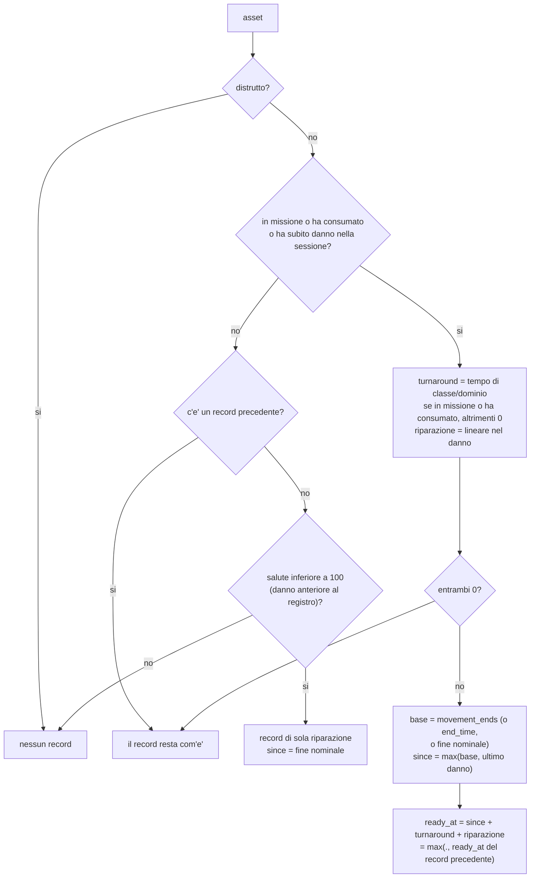
```mermaid
flowchart TD
    S["asset"] --> D{"distrutto?"}
    D -->|si| N0["nessun record"]
    D -->|no| Q{"in missione o ha consumato<br/>o ha subito danno nella sessione?"}
    Q -->|no| P0{"c'e' un record precedente?"}
    P0 -->|si| KEEP["il record resta com'e'"]
    P0 -->|no| R0{"salute inferiore a 100<br/>(danno anteriore al registro)?"}
    R0 -->|si| REC0["record di sola riparazione<br/>since = fine nominale"]
    R0 -->|no| N0
    Q -->|si| T["turnaround = tempo di classe/dominio<br/>se in missione o ha consumato, altrimenti 0<br/>riparazione = lineare nel danno"]
    T --> Z{"entrambi 0?"}
    Z -->|si| KEEP
    Z -->|no| BASE["base = movement_ends (o end_time,<br/>o fine nominale)<br/>since = max(base, ultimo danno)"]
    BASE --> RA["ready_at = since + turnaround + riparazione<br/>= max(., ready_at del record precedente)"]
```

**Quando si applicano i processi.** `apply_campaign_processes` non gira alla `ready_at` ma **all'inizio della sessione successiva** (il
conduttore la chiama con `t = order.t_start`, §6.27): fino ad allora, in memoria, l'asset conserva carburante, scorta e salute della sessione
precedente, e il registro dice solo *quando* sarebbe pronto. Il validatore, che confronta `ready_at` con `t_start`, vede la stessa cosa. Un
asset il cui turnaround finisce *durante* una sessione resta quindi non pronto per quella sessione, e viene rifornito all'inizio della
successiva. Il processo corre comunque dentro il tempo: un aereo atterrato è a terra (e bersaglio) nel resto della sessione (§6.15).

**Un asset assente dalla sessione** (scelta 3b del difetto 26). Se il processo di un asset *non passato* alla sessione si conclude mentre l'asset è assente, `apply_campaign_processes`
**non applica nulla e non toglie il record** (`:316-321`, `logger.debug` al posto del warning di prima): il record concluso resta nel registro e il processo (salute a 100, riarmo e
rifornimento) si applica alla **prima sessione in cui l'asset torna** in `assets`. Prima della correzione il record veniva tolto con un warning senza applicare niente: l'asset tornava danneggiato
e non rifornito, e alla fine di quella sessione la regola 2 apriva un record di riparazione *nuovo* (la riparazione ricominciava). Lo stato di un asset assente (salute, carburante) resta
**quello vecchio** finché l'asset non torna, anche se il registro lo dà già pronto: coerente con «i processi si applicano agli asset presenti». Il record concluso di un asset assente non
impedisce nulla al validatore, che controlla la prontezza solo degli asset delle missioni dell'ordine (`Session_Validator.py:140-160`, `ledger.is_ready(asset_id, order.t_start)`).

**Limiti dichiarati** (capitolo 9 §9.1): un solo tempo per classe e per dominio, uguale per chi ha volato 10 minuti e per chi ne ha volati
120, o per un reparto che si è solo spostato; il turnaround corre da `movement_ends`, ma un aereo atterrato e **poi colpito sul parcheggio** somma
riparazione e turnaround dall'ultimo danno; **nessuna logistica** (riarmo, rifornimento e riparazione non consumano le scorte del blocco né
dipendono dalle risorse della base: `Resource_Manager` non è collegato); la riparazione è a gradino e lineare nel danno; un aereo `off_scene`
torna «alla base» senza sapere quale (§6.27). Due limiti nuovi dopo la correzione del difetto 26 (voce 26 del capitolo 9 §9.6, ora **CHIUSA**): un id che non ricompare più lascia il suo record nel registro **per sempre** (innocuo per
il validatore e per `ready_assets`, che guardano solo gli asset passati; non esiste una funzione di «asset ritirato»); e **non ci sono chiamanti di produzione** di `run_campaign_session`,
quindi la correzione si vede solo negli scenari (S30-ABSENT) e nei test: passerà a servire quando un conduttore di campagna darà alle sessioni sottoinsiemi diversi di forze. La
correzione dipende inoltre dall'identità degli id di dominio fra sessioni: se un asset cambia id, il suo record resta orfano.

## 6.27 Il conduttore di campagna e la posizione persistente: `Logic/Session_Campaign.py` (F8c, `6d3497bc`)

**Il conduttore minimo, non il `Theater_Session_Manager`.** Modulo nuovo (154 righe), il minimo che serve per provare prontezza e posizione
persistente (scenario S30, capitolo 8 §8.12). Non decide *quali* missioni dare né quando: esegue **una sessione** nel ciclo di campagna. Il
modulo è del core e **non sa nulla del simulatore**: un adapter DCS sostituirebbe il solo passo (3) sotto.

`run_campaign_session(ledger, order, forces_a, forces_b, fire_control, *, apply_positions=True, **run_kwargs) -> (SessionOutcome, CampaignLedger)`
(`Logic/Session_Campaign.py:109-154`). I cinque passi, nell'ordine del codice:

1. `Readiness.apply_campaign_processes(ledger, assets, order.t_start)` (`:140`): i processi (riparazione, riarmo, rifornimento) conclusi entro
   l'inizio della sessione sono applicati agli asset e tolti dal registro (quelli di asset *assenti* dalle forze restano nel registro fino al loro ritorno, §6.26);
2. `Session_Validator.check_session(order, forces_a, forces_b, ledger=ledger, horizon=run_kwargs.get('horizon'))` (`:143-144`): solleva
   `SessionValidationError` **prima** di `run_session`, che non viene chiamata;
3. `SS.run_session(order, forces_a, forces_b, fire_control, **run_kwargs)` (`:147`), chiamata **come attributo del modulo** (`from ...Logic
   import Session_Simulator as SS`), mai importata per nome: `Scenario_Baseline` la intercetta così (`Scenario_Baseline.py:20-26`) e la
   fotografia registra le esecuzioni di S30;
4. con `apply_positions` (default `True`) `apply_final_positions(outcome, forces_a, forces_b)` (`:150-151`);
5. `Readiness.record_session(ledger, order, outcome, assets)` (`:154`): registra la sessione e la nuova prontezza.

Il passo 1 modifica gli asset anche se il passo 2 rifiuta poi l'ordine (i processi sono già applicati), ma riapplicarli è **idempotente**, e il
registro del chiamante, immutabile, non cambia. `**run_kwargs` va a `run_session` (`horizon`, `reaction_profile_for`, ...). Chiamanti di
produzione: **nessuno** (solo i test, `Test_Session_Campaign`, e S30).

*Diagramma D54 — un passo del ciclo di campagna (`run_campaign_session`, F8c).*

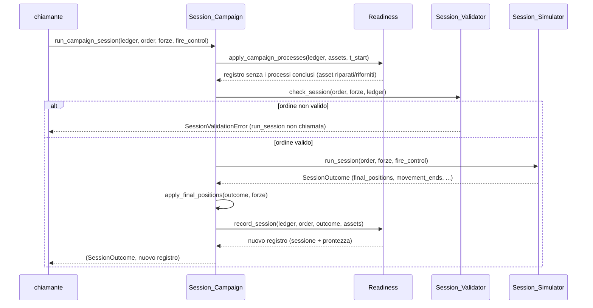
```mermaid
sequenceDiagram
    participant C as chiamante
    participant SC as Session_Campaign
    participant RD as Readiness
    participant SV as Session_Validator
    participant SS as Session_Simulator
    C->>SC: run_campaign_session(ledger, order, forze, fire_control)
    SC->>RD: apply_campaign_processes(ledger, assets, t_start)
    RD-->>SC: registro senza i processi conclusi (asset riparati/riforniti)
    SC->>SV: check_session(order, forze, ledger)
    alt ordine non valido
        SV-->>C: SessionValidationError (run_session non chiamata)
    else ordine valido
        SC->>SS: run_session(order, forze, fire_control)
        SS-->>SC: SessionOutcome (final_positions, movement_ends, ...)
        SC->>SC: apply_final_positions(outcome, forze)
        SC->>RD: record_session(ledger, order, outcome, assets)
        RD-->>SC: nuovo registro (sessione + prontezza)
        SC-->>C: (SessionOutcome, nuovo registro)
    end
```

**`apply_final_positions(outcome, forces_a, forces_b)`** (`:62-106`, decisione 22). Per ogni asset (ordine di id) che ha una voce in
`outcome.final_positions` e che si trova nelle forze (se non c'è è saltato in silenzio):

- postura `Mission_Adapter.OFF_SCENE_POSTURE` (`'off_scene'`): la posizione **non è applicata** — l'aereo uscito di scena senza atterrare su
  una base vera è «rientrato a una base fuori scena» e la sua posizione resta quella di partenza (scelta di progetto della decisione 22;
  la base vera, che il motore non conosce, è del modulo mappe/C2);
- un **aereo** con una postura diversa da `PARKED_POSTURE` e da `DESTROYED_POSTURE` (cioè ancora in volo a fine sessione: possibile solo se il
  validatore è stato saltato) → posizione applicata **con un warning** «aircraft ... is still airborne at the end of the session» (non c'è movimento
  fuori sessione, D4.d);
- altrimenti applicata: `asset.position = Point3D(x, y, z)` con le coordinate arrotondate a `Mission_Adapter.OFFSET_DECIMALS` (6; il rumore della
  rotazione di formazione), anche per un asset distrutto (il relitto dove è caduto).

Restituisce `{asset_id: (x, y, z)}` delle sole posizioni applicate. Una sessione successiva che costruisce le sue missioni **dopo** questa
chiamata (`F.missions_for` legge `asset.position`) parte dalla posizione persistita: è quanto prova S30 (capitolo 8 §8.12).

**Persistenza su disco.** Il registro e le posizioni attraversano un'istantanea di campagna con `Context/Campaign_State` (`add_ledger`, `restore(..., restore_position=True)`,
capitolo 7 §7.13); il conduttore **non** scrive `Campaign_State`: lo fa chi lo chiama.

**Limiti.** Il conduttore e `CampaignState` non hanno chiamanti di produzione (solo scenario e test); nessuna logistica; un aereo `off_scene`
non cambia posizione; le Operazioni valgono per sessione (nessun ordine «permanente» su più sessioni: è del C2). Capitolo 9 §9.1.
