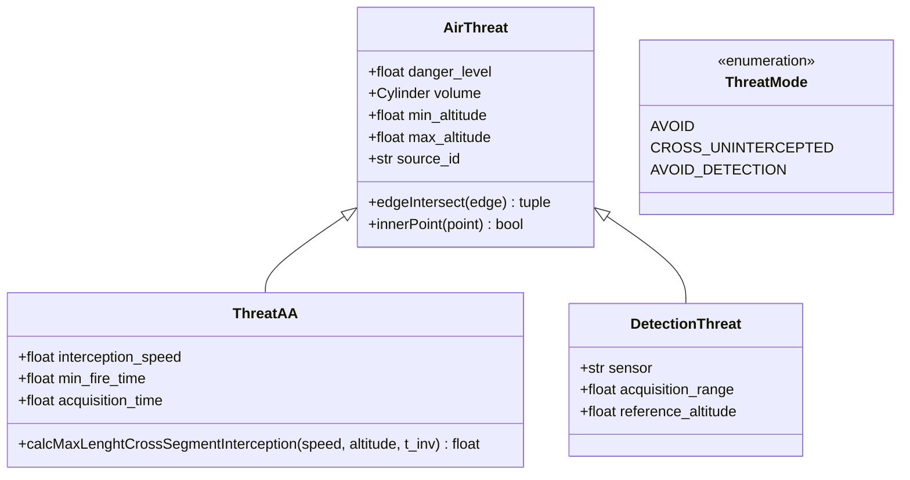
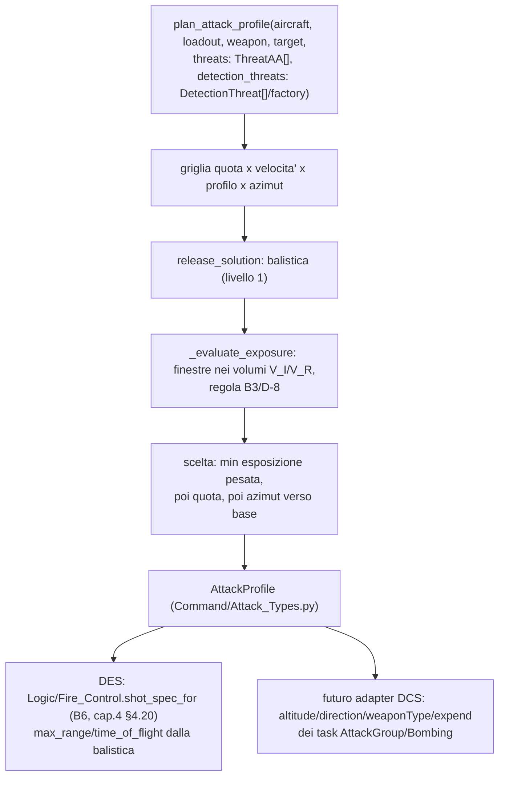

# Capitolo 7 — Moduli di supporto trasversali

## 7.1 `Utility/Session_Rng.py` — l'unica sorgente di casualità

Disciplina trasversale a tutto il motore (`Utility/Session_Rng.py:1-9`): "RNG di sessione
seedato da (session_id, mission_id, event_id, contatore). Ogni estrazione stocastica passa da
lì. L'ordine di risoluzione degli eventi fa parte del contratto — salvare solo il seed non
basta, perché un PRNG riproduce la stessa sequenza solo a parità di ordine delle chiamate."

### Contratto (`:14-30`)

1. **Seed = funzione pura della chiave** `(session_id, mission_id, event_id, counter)`, tutti
   valori di dominio (mai un id del simulatore).
2. **Stabile fra processi, macchine e versioni di Python**: niente `hash()` (randomizzato per
   processo via `PYTHONHASHSEED`, non garantito fra versioni). Si usa **SHA-256** su una codifica
   canonica JSON (con i tipi preservati: `"1"` e `1` sono chiavi diverse, `None` è distinto da
   `"None"`), troncato a `SEED_BITS = 64` bit (`session_seed`, `:70-102`). `random.Random(int)` è
   a sua volta stabile: il seeding da intero e il Mersenne Twister di `random()` non dipendono da
   hash di processo.
3. **Una chiave, uno stream**: ogni valore di `counter` apre uno stream diverso — un evento che
   deve fare più estrazioni indipendenti da un altro evento usa un `counter` diverso. Dentro uno
   stream, l'ordine delle estrazioni resta parte del contratto (es. quello di
   `Engagement_Resolver`, capitolo 4 §4.11).
4. **Mai `random` di modulo**: ogni funzione restituisce un'istanza esplicita.

`SEED_SCHEME = 'warfare-model/session-rng/v1'` (`:48-51`) entra nell'hash: un cambio futuro della
codifica canonica produce seed diversi **in modo dichiarato**, invece di riprodurre in silenzio
sequenze diverse sotto la stessa etichetta.

`session_rng(session_id, mission_id=None, event_id=None, counter=0) -> random.Random`
(`:105-113`) è la funzione consumata direttamente da `SessionOrder.rng(...)` (capitolo 2, §2.2) e
da `Session_Simulator.run_session` (capitolo 6, §6.4). Ogni chiamata restituisce un'istanza
**nuova** posizionata all'inizio dello stream.

## 7.2 `Context/Doctrine.py` — soglie di disingaggio (P1 + R2)

Le soglie sono **dottrina di lato**, non una costante del risolutore, non un parametro di
sessione, non una proprietà del singolo asset, valutata **per forza intera**
(`Context/Doctrine.py:60-68`). Le due soglie, stessa grandezza, stesso denominatore (`:70-85`):

- `'erosion'` — frazione **cumulata** dell'organico impegnato non più operativo: la forza si
  logora lentamente;
- `'shock'` — frazione persa in **un singolo impulso** (una sola salva risolta): la forza si
  rompe per un colpo improvviso anche se le perdite cumulate sono ancora sotto `erosion`.

Entrambe sono frazioni dell'**organico impegnato all'inizio dell'ingaggio** (non della forza
superstite): con lo stesso denominatore la perdita di una salva non può mai superare la perdita
cumulata, quindi `shock <= erosion` è un vincolo di coerenza verificato
(`validate_disengagement_thresholds`, `:112-155`) — altrimenti la soglia di shock non
scatterebbe mai per prima e sarebbe un parametro morto.

### Valori di default — **STIMA DI PARTENZA DICHIARATA, non dati validati** (`:87-100`)

```python
DEFAULT_DISENGAGEMENT_THRESHOLDS = {
    "Blue":    {"erosion": 0.30, "shock": 0.20},
    "Red":     {"erosion": 0.30, "shock": 0.20},
    "Neutral": {"erosion": 0.30, "shock": 0.20},
}
```

- `erosion = 0.30` — regola empirica diffusa nella letteratura militare per cui un'unità scesa
  sotto ~70% dell'organico non è più pienamente efficace in combattimento: un ordine di
  grandezza, non una misura.
- `shock = 0.20` — nessuna fonte: scelto solo per essere strettamente minore di `erosion` e
  abbastanza alto da non rompere una forza per la perdita di un singolo mezzo in un gruppo
  piccolo (1 su 6 = 0.17 non basta).
- I due lati hanno **di default** gli stessi valori: l'asimmetria dottrinale, se voluta, va
  dichiarata esplicitamente dal chiamante (v. wiki `decisions/c2-hierarchy-design`), mai
  introdotta di nascosto da un default.

Da ricalibrare con il processo **ATCAL interno** (risolutore fine fatto girare offline), mai con
numeri da fonti non validate — in particolare **nessun coefficiente dei documenti Lanchester
ingeriti** (`:87-89`, coerente con l'avvertimento metodologico permanente della wiki
`decisions/virtual-session-engine-des`).

`get_disengagement_thresholds(side, thresholds=None) -> Optional[Dict[str, float]]`
(`:158-178`) restituisce una **copia** delle soglie del lato, o `None` se il lato non ne
dichiara — è `Engagement_Resolver` a decidere la propria politica su `None` (combatte fino
all'annientamento, con un warning — tranne per i blocchi non-Military, v. capitolo 4, §4.7).

## 7.3 `Context/Reaction_Profile.py` — RIV/VAL/COM/ATT

Salva la decomposizione a quattro fasi della "Strategia 1" bocciata come motore a tick
(capitolo 1, §1.1), qui come **parametri per tipo di sistema** che il risolutore usa per
schedulare eventi futuri, non per contare iterazioni
(`Context/Reaction_Profile.py:1-16`).

### Statuto dei numeri (`:18-37`) — leggere prima di usarli

**Sono documentati solo i totali** rilevazione → lancio (tabella §4.2 del documento di
architettura, con fonti in bibliografia): 9K33 Osa ~26 s, S-300P ~28 s, Tor da fermo 5-8 s,
Tor-M2 "short stop" 2-3 s, pilota umano 1-2 s, equipaggio carro ~31 s per bersaglio, IADS:
valutazione minaccia ~1 s, assegnazione arma-bersaglio poche centinaia di ms. Dove la fonte dà un
intervallo si usa il punto medio.

**La scomposizione nelle quattro fasi è una STIMA DICHIARATA**: VAL, COM e ATT prendono gli
ordini di grandezza citati nel testo della Strategia 1 (100 ms di valutazione macchina, 10 s per
un umano; 1 ms di comando automatico, 1 s per un equipaggio manuale; 0,1 s di brandeggio, 0,5 s
di sgancio missile), e **RIV è il residuo** fino al totale documentato. Il totale resta quindi
esattamente quello della fonte; la ripartizione no. Serve comunque, perché le degradazioni future
colpiscono una fase sola (meteo/notte/disturbo sulla RIV, addestramento sulla VAL).

Il risolutore consuma solo due grandezze derivate (`ReactionProfile`, `:81-140`):

- `total` = `detection + evaluation + command + actuation` — latenza del primo ingaggio;
- `refire_interval` = `evaluation + command + actuation` — fra una salva e la successiva contro
  un bersaglio già in traccia (la RIV non si ripete: la traccia è già stabilita).

Un `evaluation + command + actuation` non positivo è rifiutato (`__post_init__`, `:108-112`): un
intervallo di tiro nullo farebbe sparare un asset infinite volte nello stesso istante, e il
risolutore a eventi non terminerebbe.

### Tabella dei profili documentati (`REACTION_PROFILES`, `:165-199`)

| Chiave | Totale documentato | VAL | COM | ATT |
|---|---|---|---|---|
| `9A33-Osa` | 26.0 s | macchina (0.1s) | automatico (0.001s) | sgancio missile (0.5s) |
| `9K331-Tor` | 6.5 s (punto medio di 5-8 s) | macchina | automatico | sgancio missile |
| `9K331-Tor/short_stop` | 2.5 s (punto medio di 2-3 s) | macchina | automatico | sgancio missile |
| `S-300PS` | 28.0 s | IADS (1.0+0.3s) | automatico | sgancio missile |
| `pilot` | — (reazione umana 1-2s, punto medio 1.5s; RIV esclusa) | residuo | automatico | sgancio missile |
| `tank_crew` | 31.0 s (M1 gunnery, DTIC ADA217416) | umana (10s) | manuale (1s) | brandeggio (0.1s) |
| `default` (ripiego) | 31.0 s (il **più lento** dei totali documentati) | umana | manuale | brandeggio |

Il ripiego `default` è deliberatamente il più lento: "la mancanza di un dato non deve regalare
l'iniziativa" (`:193-196`, stessa logica della memoria
`feedback_no_visibility_low_priority` applicata alla latenza).

### `profile_for_asset(asset, skill=None) -> ReactionProfile` (`:260-306`)

Precedenza: (1) modello con profilo documentato (`REACTION_PROFILES[asset._model]`); (2)
`Aircraft` → `pilot`; (3) `Vehicle` SAM/AAA → fabbrica `_air_defense_profile` (riusa
`Air_Route_Manager.threat_reaction_times`, la stessa stima usata dalla pianificazione di rotta
per la stessa minaccia — evita due verità diverse sulla reattività dello stesso sito, `:238-257`);
(4) `Vehicle` con equipaggio (carri, corazzati, motorizzati, artiglieria) → `tank_crew`; (5) tutto
il resto (navi, EWR, classi non riconosciute) → `default`, con un log: nessuna fonte del progetto
documenta latenze navali.

`SKILL` (i livelli DCS Average/Good/High/Excellent) è previsto dalla roadmap come modulatore, ma
`SKILL_LATENCY_FACTOR` è **tutto a 1.0**: nessuna fonte del progetto dà un fattore per livello
(`:39-44`, `:201-203`).

## 7.4 Degradazione ambientale della Pd (meteo/notte)

Vive in `Logic/Engagement_Resolver.py` (non in `Reaction_Profile`), perché è un parametro della
legge di Pd (`Logic/Engagement_Resolver.py:248-249`, `:642-689`):

```
factor = (NIGHT_DETECTION_FACTOR se notte) * (ADVERSE_WEATHER_DETECTION_FACTOR se avverso)
```

`NIGHT_DETECTION_FACTOR = 0.7`, `ADVERSE_WEATHER_DETECTION_FACTOR = 0.8` (notte + meteo avverso =
0.56). **STIMA DICHIARATA**, nessuna fonte del progetto la fornisce; da ricalibrare via ATCAL
interno.

`weather_detection_factor(conditions)` legge `conditions` nella forma di
`Meteo_Analysis.get_meteo_conditions` (`{'day', 'night', 'adverse_weather'}`).
`weather_detection_factor_fn(conditions)` produce la callable `(observer, target) -> float`
richiesta da `resolve_engagement(detection_factor=...)`. `meteo_detection_factor(region_name,
date, time)` collega le due funzioni a `Logic/Meteo_Analysis.get_meteo_conditions` (oggi un
placeholder deterministico: nessuna casualità entra da qui).

**Limite noto, dichiarato** (`:654-659`): il fattore è **unico per ogni sensore**. La finestra di
contatto porta solo la portata migliore fra radar e TVD (`Mobile.detection_range`, default =
massimo dei due), e il risolutore non sa quale dei due l'ha prodotta: non può quindi risparmiare
al radar la degradazione notturna che fisicamente non subisce. Il valore notturno è un
compromesso fra i due sensori.

## 7.5 Le dimensioni militari di `Block/Military.py`

### `air_defense_power() -> float` (`Block/Military.py:612-649`)

È la dimensione che manca alla combat power: SAM, AAA e EWR valgono 0 nelle tabelle di efficacia
(`Context.GROUND_COMBAT_EFFICACY`) **per definizione**, perché quella misura fuoco e manovra
terra-terra, che loro non hanno — decisione Q3 della wiki
`decisions/virtual-session-engine-des`, confermata intenzionale. La loro potenza esiste, è di
natura diversa: `1 - Π(1 - danger_level_i)` sui `ThreatAA` costruiti dai volumi di difesa aerea
degli asset operativi ("almeno una delle difese è efficace"), saturante in [0,1], monotona nel
numero di siti. **Non è una combat power** e non è confrontabile con quella.

### `salvo_interceptors() -> List[Tuple[asset, canali]]` (`:618-663`)

Elenco degli asset del blocco che possono intercettare colpi in arrivo (Vehicle/Ship operativi
per cui esiste una `ThreatAA`), ciascuno con i propri canali (`engagement_channels('air')`, o
`DEFAULT_INTERCEPTION_CHANNELS` se non dichiarato). Ordinato per id dell'asset — l'ordine di
consumo delle scorte fa parte del contratto di riproducibilità. È la base consumata dal
risolutore d'ingaggio (capitolo 4, §4.5) per popolare `_ForceState.interceptors`.

### `salvo_interception_capacity() -> int` (`:665-717`)

```
capacita = Σ_i min(canali_i, scorta_i)
```

sugli asset di `salvo_interceptors()`. **STIMA DI PARTENZA DICHIARATA**: ogni canale intercetta
**un** colpo per salva (Pk dell'intercettore = 1 per canale — ipotesi ottimistica per la difesa,
primo candidato alla ricalibrazione). La formula non è cambiata dal 2026-09-26: cambia solo
**cosa** legge `scorta_i` (`asset.interceptor_stock`), ora una vista sulla scorta per arma per
chi la ha modellata (v. §7.6 e capitolo 4 §4.19). Nota: il risolutore d'ingaggio **non chiama
direttamente**
questo metodo per calcolare la capacità durante la run (ricalcola con `_capacity`, capitolo 4,
§4.5, che replica la stessa formula sullo stato **ombra**, non sull'asset reale) — questo metodo
resta la funzione di lettura pubblica per chi consulta lo stato reale fuori da un ingaggio in
corso.

## 7.6 Munizioni e carburante su `Asset/Mobile.py` e `Asset/Aircraft.py`

### Munizioni offensive vs intercettori — scorta per modello d'arma (decisione A1/A3, 2026-09-26)

**Aggiornamento rispetto alla stesura iniziale**: fino al 2026-09-26 la scorta era **un
contatore scalare aggregato per asset** (`Mobile.ammunition`, decisione R3 del 2026-09-23), che
sommava armi eterogenee — la fire control sceglieva un'arma per nome, ma il risolutore scalava
sempre lo stesso scalare, indipendentemente da quale arma avesse davvero sparato (un A-10 con 4
Maverick a bordo ne lanciava 642, pagati dai colpi del cannone, v. capitolo 4 §4.19 per il
dettaglio del difetto e della correzione).

Lo stato primario è ora `Mobile._stores: Optional[Dict[str, int]]` = `{modello_arma: quantità}`
(`Asset/Mobile.py:320`, valore iniziale dal registro del modello, `stores_from_registry`,
`:833-868`); `ammunition`/`interceptor_stock` sono **viste calcolate** su di esso, con le regole
di contabilità in un modulo a parte, `Asset/Weapon_Stores.py` (funzioni pure, senza stato: v.
capitolo 4 §4.19 per il dettaglio delle "quattro forme della scorta" e della vista sugli
intercettori), condiviso con lo stato ombra del risolutore (`_Shadow`, capitolo 4 §4.10) perché
le due contabilità non possano divergere.

Due contatori **distinti per scopo** dal 2026-09-23: `Mobile.ammunition` (munizioni offensive,
proprietà a `:694-731`, setter `:699-757` che imposta un pool anonimo per chi forza la scorta a
mano) e `Mobile.interceptor_stock` (intercettazioni ancora possibili, proprietà a `:920-951`).
Per i cannoni AA, `ROUNDS_PER_GUN_INTERCEPT = 100` (**STIMA DICHIARATA**, da ricalibrare,
definita in `Weapon_Stores.py` e re-esportata da `Mobile.py:183`) converte colpi fisici in
intercettazioni (uno Shilka da 2000 colpi → 20 intercettazioni, non 2000). Dal 2026-09-26, per
qualunque asset con armi AD modellate per arma, `interceptor_stock` è una **vista sulle voci AD**
di `stores`: un missile antiaereo lanciato offensivamente e lo stesso missile usato per
intercettare scalano la stessa voce del dizionario, per costruzione. **La vecchia regola del "SAM
puro" (`Mobile.interceptor_shares_ammunition`, che condivideva un intero pool solo per gli asset
a solo missile) è stata eliminata**: non serve più, perché la condivisione per arma copre già
ogni caso (M6-Linebacker, Arleigh Burke, ecc. — v. capitolo 4 §4.19). Senza vista attiva (pool
anonimo, o scorta impostata a mano col setter `interceptor_stock`, `:936-951`) resta il pool
anonimo di intercettori, distinto dalle munizioni come prima del 2026-09-26.

`Mobile.consume_ammunition(rounds, weapon=None)` (`:763-788`) e
`Mobile.consume_interceptor_stock(amount, weapon=None)` (`:976-1009`) sono i due punti di
applicazione consumati da `apply_engagement_result` (capitolo 4, §4.12): con `weapon` presente in
`stores` scalano quella voce e solo quella; senza arma, o con un nome estraneo, l'aggregato
(v. `drain_order`, capitolo 4 §4.19). Deterministico in entrambi i casi: nessuna estrazione
casuale, mai sotto zero.

### Carburante (`Asset/Mobile.py:220-262`)

**Unità: frazione del carico pieno, [0,1] (`FUEL_FULL = 1.0`), per tutti gli asset** — scelta
motivata dai dati, non di comodo:

1. `Vehicle_Data`/`Ship_Data` non dichiarano una capacità di serbatoio, ma dichiarano
   l'**autonomia** (`range`: km per i veicoli, miglia nautiche per le navi) — il consumo per
   metro è `1/autonomia`, senza costanti inventate.
2. Per gli aerei i raggi dei loadout (`cruise/attack.range['fuel_100%']`) valgono per il carico
   **completo** (interno più serbatoi esterni se imbarcati), mentre `fuel_internal_max` è il solo
   carburante interno: un contatore in kg inizializzato a `fuel_internal_max` sovrastimerebbe
   l'autonomia di chi porta serbatoi esterni. La frazione del carico pieno è coerente con il dato
   di autonomia per costruzione.
3. Una sola unità per tutti gli asset rende sommabili/confrontabili i `FuelEvent` del
   `SessionOutcome`.

Regimi: `'nominal'`/`'max'` (`Mobile.FUEL_REGIMES`). Per gli aerei `'nominal'` legge il profilo
`cruise` del loadout e `'max'` il profilo `attack`; per veicoli e navi il registro ha un'unica
autonomia, usata per entrambi (limite dichiarato: sottostima il consumo al regime massimo — è il
dato a non distinguere, non una semplificazione introdotta dal motore). `None` = carburante **non
modellato**: nessun vincolo di movimento (stessa semantica delle munizioni) — casi: modello
ignoto, autonomia mancante, aereo senza loadout assegnato, propulsione nucleare
(`NUCLEAR_ENGINE_TYPES`, l'autonomia dichiarata "convenzionalmente 20.000 nm" dal registro è
trattata come segnaposto, non come dato, `:258-262`).

### `Aircraft.assigned_loadout` (`Asset/Aircraft.py:169-213`)

La scorta di un aereo si ricava dal **loadout assegnato**, non dal modello (`Aircraft_Data` non
ha un campo `weapons`): prima di questa proprietà non esisteva alcuno stato "loadout di questo
volo" su un'istanza. Assegnare un loadout (`assigned_loadout = 'Strike'`) equivale ad armare il
velivolo per la missione: **riarma** l'aereo (ricalcola la scorta per arma via
`load_stores_from_registry()`, che chiama l'override di `stores_from_registry()` sotto, e il
carburante via `load_fuel_from_registry()`, sovrascrivendo l'eventuale consumo precedente) — è
quindi un'operazione del ciclo di campagna/assemblaggio missione, **non** un canale di
rifornimento durante l'ingaggio (il risolutore non la chiama mai).

`Aircraft.stores_from_registry()` (`:215-278`, override di `Mobile.stores_from_registry`, v.
capitolo 4 §4.19) costruisce `{modello_arma: quantità}` dal loadout assegnato
(`AIRCRAFT_LOADOUTS[model][loadout]['stores']['pylons']`): per ogni pilone la quantità, **solo**
se il nome è un'arma reale di `AIR_WEAPONS` (`get_weapon(...)` non `None`) — serbatoi esterni e
pod di rifornimento stanno anch'essi nei piloni e vanno esclusi; piloni con la stessa arma si
sommano. **Dal 2026-09-26 (decisione A2, commit `8bd69727`, v. capitolo 4 §4.16bis)** il **cannone
di bordo** ottiene la propria voce di scorta, `{modello_cannone: colpi}` da
`get_aircraft_gun_rounds(model, stores['gun_rounds'])` (`Asset/Aircraft_Data.py:3737-3765`), MAI
sommata a quella di un'arma dei piloni diversa: fino a questa data i colpi del cannone
(`stores['gun_rounds']`) non entravano affatto nella scorta per arma e finivano nel contatore
scalare aggregato (v. capitolo 4 §4.19), pagando i missili dello stesso asset — è il difetto
descritto in dettaglio al capitolo 4, §4.16bis. Il cannone è candidato della fire control
(`Logic/Fire_Control._candidate_weapons`, capitolo 4 §4.16bis) esattamente come le armi dei
piloni. Senza loadout assegnato, delega a `Mobile.stores_from_registry()`, che per un aereo
restituisce `None` (non modellata).

## 7.7 I punti di iniezione `fire_control` e `detection_factor`

Entrambi sono parametri **iniettati** in `resolve_engagement`/`run_session`, mai implementati dal
motore stesso — è il punto di estensione esplicito verso ciò che il motore non fa (v. capitolo
10):

- `fire_control: (shooter, target) -> ShotSpec | Sequence[ShotSpec] | None` — interrogata al
  momento dello scheduling del lancio (capitolo 4, §4.4). Dal 2026-09-26 può restituire una
  **sequenza** ordinata di opzioni, e il risolutore spara con la prima che ha ancora scorta per
  quel modello d'arma (capitolo 4, §4.19); una `ShotSpec` singola resta un valore valido.
  `Session_Simulator.run_session` ne passa **una sola** a ogni ingaggio della sessione, non una
  per lato: la callable riceve gli asset reali e può distinguere lato/blocco/modello da sé
  (`Logic/Session_Simulator.py:101-107`, capitolo 6). Una fabbrica che seleziona davvero l'arma
  dai registri, invece di una tabella di ruoli, esiste in
  `Logic/Fire_Control.make_registry_fire_control` (capitolo 4, §4.16).
- `detection_factor: (observer, target) -> float in [0,1]` — degradazione della Pd (§7.4);
  default nessuna degradazione (`factor=1.0`). Oltre al meteo (`weather_detection_factor_fn`/
  `meteo_detection_factor`, §7.4), esistono fabbriche dello stesso fattore per la nebbia di guerra
  da ricognizione (`region_recon_detection_factor`, capitolo 4, §4.18) e per comporre più
  degradazioni insieme (`combine_detection_factors`).

## 7.8 Il pianificatore di rotta aerea: volumi di rilevamento e intercettazione distinti (`Logic/Air_Route_Manager.py`, decisioni D-1..D-7, 2026-09-26, commit `815dc35f`)

**Fuori dal motore DES in senso stretto** (non è uno dei quattro strati dei capitoli 2-6): è il
pianificatore di rotta che precede una missione, consumato più a monte. Entra in questo manuale
perché condivide con il motore la stessa legge di rilevamento (`Engagement_Resolver.
detection_probability`, v. §4.2) e perché `Block/Military.py` lo espone come una delle dimensioni
militari del capitolo 7. Documento di riferimento:
`Analysis/Document/Proposta_Volumi_Rilevamento_Intercettazione.md`.

### Il problema che ha motivato l'estensione

`Mobile.air_defense_volume()` costruisce da sempre un solo `Cylinder` per asset di difesa aerea:
il volume di **intercettazione**, cioè la portata dell'arma. I registri dichiarano però anche una
portata di **scoperta** del sensore, quasi sempre maggiore (un SA-6/2K12-Kub scopre a 75 km e
intercetta a 24 km), mai letta dal pianificatore prima di questa data: un aereo che aggirava
"la minaccia" aggirava in realtà solo la sua arma, non il suo sensore.

### Due tipi, una base comune (`AirThreat`, `:77-131`)

`AirThreat` è la base comune (`danger_level`, `volume`/`cylinder` — alias finché l'unica forma è
il cilindro —, `min_altitude`/`max_altitude` dal cilindro, `source_id`, `edgeIntersect`/
`innerPoint` usati dalla ricerca di percorso): due specializzazioni con parametri disgiunti.

- **`ThreatAA(AirThreat)`** (`:134-277`) — la classe storica del pianificatore, ora sottoclasse:
  stesso costruttore posizionale `(danger_level, interception_speed, min_fire_time,
  acquisition_time, cylinder)`, quindi compatibile con ogni chiamata preesistente.
  `acquisition_time` (**rinominato** da `min_detection_time`, decisione D-6: `min_detection_time`
  resta accettato come parola chiave e come attributo alias) è la **latenza di acquisizione** —
  dal contatto a una traccia utile al tiro, lo stesso RIV del profilo di reazione del DES
  (capitolo 7, §7.3) — non un volume né un tempo di rilevamento: il nome precedente confondeva le
  due nozioni. `calcMaxLenghtCrossSegmentInterception` (rinominata da
  `calcMaxLenghtCrossSegment`, alias mantenuto) modella **solo** il volume d'intercettazione:
  moto radiale dell'aereo a velocità `v_a`, sito pronto a lanciare dopo `ready_delay_s` (0 nel
  pianificatore odierno) + `min_fire_time`, intercettore a velocità `v_i` — equazione di secondo
  grado nella distanza percorsa dall'intercettore, `float('inf')` se non esiste soluzione positiva
  (nessun intercettore può raggiungere l'aereo: qualunque corda è sicura).
- **`DetectionThreat(AirThreat)`** (`:280-329`, nuova) — il volume di **rilevamento**:
  `danger_level` è sempre `0.0` per costruzione (decisione D-3), così `total_danger` dei percorsi
  e `Military.air_defense_power()` (capitolo 7, §7.5) restano misure della sola potenza di fuoco.
  Il cilindro è costruito **alla quota di rotta** `route_altitude` (un vero volume di rilevamento
  è un solido il cui raggio cresce con la quota; il cilindro ne è la sola sezione a quella quota,
  per cui il pianificatore non ammette cambi di quota per aggirarlo, v. sotto), con raggio
  `min(acquisition_range, orizzonte_radar)`.

### Orizzonte radar (`radar_horizon_range`, `:665-677`)

```
d = sqrt(2*k*R_terra*h_antenna) + sqrt(2*k*R_terra*h_bersaglio)      k = 4/3 (radar standard)
```

`build_detection_threat(asset, route_altitude)` (`:726-779`) prova i sensori `'radar'` e `'TVD'`
dell'asset (`Mobile.detection_range('air', sensor=...)`), tiene quello col raggio **effettivo**
maggiore, e restituisce `None` senza sollevare se l'asset non ha posizione o nessun
`acquisition_range` aria utilizzabile (es. ZSU-57-2, M163-VADS: nessun sensore nei registri,
decisione D-4 sospesa, dati da ricercare). Un sensore puro (EWR) produce la sua `DetectionThreat`
senza bisogno di armi. `build_air_defense_threats(asset, route_altitude)` (`:782-802`) restituisce
la coppia `(DetectionThreat, ThreatAA)` dello stesso sito, con lo **stesso `source_id`**: è il
legame che il pianificatore d'attacco userà per sapere quando un sito ha già acquisito l'aereo
(v. §7.9). **Limite noto**: il raggio d'intercettazione resta la sola portata dell'arma, senza il
minimo con l'`engagement_range` della guida — verificato che con i dati attuali la guida è sempre
≥ la portata dell'arma (nessuna differenza pratica oggi).

### `ThreatMode`: tre modalità di trattamento (`:37-74`)

`resolve_threat_mode(mode=None, intersecate_threat=False)` decide la modalità effettiva: `mode`
prevale, altrimenti l'alias storico `intersecate_threat` (`False` → `AVOID`, `True` →
`CROSS_UNINTERCEPTED`) — nessuna chiamata preesistente cambia comportamento.

| Modalità | Comportamento |
|---|---|
| `AVOID` | Aggira i volumi d'**intercettazione** (comportamento storico, `intersecate_threat=False`). |
| `CROSS_UNINTERCEPTED` | Attraversa i volumi d'intercettazione con la corda di sicurezza (`intersecate_threat=True`). |
| `AVOID_DETECTION` | Aggira i volumi di **rilevamento** e attraversa con la stessa corda limitata ogni volume d'intercettazione toccato comunque. |

In `AVOID_DETECTION` (`calcRoute`, `:1395-1419`) il motore di ricerca dell'aggiramento (invariato)
lavora sui volumi di rilevamento (`detections`); i volumi d'intercettazione (`threats`) diventano
`cross_threats`, attraversati a corda limitata da `_cross_interception_while_avoiding`
(`:1792-1899`) quando un arco già scelto per evitare il rilevamento li tocca comunque — **mai per
costruzione**: ogni intersezione è verificata sui volumi dichiarati (intersezione completa
richiesta, corda massima da `calcMaxLenghtCrossSegmentInterception`, come in
`CROSS_UNINTERCEPTED`), non assunta nulla dal solo fatto che il rilevamento sia stato evitato — per
i SAM tipici (sensore e arma co-locati) i due volumi sono annidati, ma a bassa quota l'orizzonte
radar può rendere il volume di rilevamento **più piccolo** di quello d'intercettazione. Nessun
cambio di quota è ammesso per un volume di rilevamento (`_handle_threat_avoidance`, `:2326-2332`):
è costruito a una sola quota, e cambiarla richiederebbe ricostruirlo, non ancora fatto
(proposta §3.6, Attività D, fuori scope di questo commit).

### Metriche di rilevamento del percorso (decisione D-3/D-5, `Path.compute_detection_metrics`, `:1073-1142`)

Separate da `total_danger` (che resta la sola intercettazione): `detection_exposure_s` (somma
delle durate nei volumi di rilevamento, volumi sovrapposti contati ciascuno), `first_detection_
time_s` (primo ingresso, `None` se mai), `warning_time_s` (arrivo − primo rilevamento),
`max_detection_probability` (replica **esatta** la legge di Pd del DES,
`Engagement_Resolver.detection_probability`, come metrica di pianificazione — nessuna modifica al
risolutore). `PathCollection.best_path_key(mode)` (`:1231-1242`) cambia il criterio di scelta del
percorso migliore solo in `AVOID_DETECTION`: prima il minimo tempo sotto sensore, poi il pericolo
residuo d'intercettazione, poi la lunghezza (altre modalità: la chiave storica pericolo→lunghezza).

### `Block/Military.py`: le due liste per blocco

`Military.air_defense_threats()` (`Block/Military.py:551-581`, preesistente, ora con
`source_id` impostato — v. §7.9) e la nuova `Military.air_detection_threats(route_altitude)`
(`:583-610`) restituiscono rispettivamente i `ThreatAA` e le `DetectionThreat` di tutti gli asset
Vehicle/Ship operativi del blocco con dati utilizzabili — la stessa selezione di asset, due volumi
per sito. Nessuna delle due entra in `air_defense_power()` per la parte di rilevamento
(`DetectionThreat.danger_level == 0.0` per costruzione).

### Fuori perimetro, dichiarato

Reti di sensori/cueing EWR→SAM (D-7); dati EWR e sensore visivo per ZSU-57-2/M163 (D-4b/c,
ricerca dati separata); attraversamento a corda limitata del **solo** rilevamento (D-5, opzione 2:
richiederebbe un dato di tempo di permanenza del sensore e un cambio della legge del risolutore
DES); la firma a due liste minacce di `plan_attack_profile` (D-8) — implementata insieme al
pianificatore d'attacco, v. §7.9.

### Diagramma D14 — tipi e modalità



## 7.9 Il pianificatore d'attacco: quota di sgancio e profilo (`Logic/Weapon_Delivery.py`, `Command/Attack_Types.py`, decisioni B1-B6, 2026-09-27, commit `6754bf1c`)

**Anche questo fuori dal motore DES in senso stretto**: è il pianificatore che, prima di una
missione, decide da che quota, velocità, profilo e direzione un aereo sgancia una bomba — ma è
**l'input** che il capitolo 4 consuma (§4.20, decisione B6): "una fisica, un pianificatore, due
esecutori" (`Logic/Weapon_Delivery.py:1-14`, decisione B2). Documento di riferimento:
`Analysis/Document/Proposta_Munizioni_Compatibili_e_Rotte_Attacco.md` (Proposta B).

Due livelli, entrambi stateless, senza RNG:

### Livello 1 — fisica pura (`release_windows`, `fall_time`, `release_solution`, `bomb_engagement_estimate`)

Moto parabolico nel vuoto con velocità iniziale `v` inclinata di `pitch` (negativo in picchiata,
positivo in cabrata a `LOFT_PITCH_DEG = 30°`, zero livellato), da quota `h` **AGL sopra il
bersaglio** (`fall_time`, `:254-259`):

```
v_z = v * sin(pitch);   t_vuoto = (v_z + sqrt(v_z^2 + 2*g*h)) / g;   R_vuoto = v * cos(pitch) * t_vuoto
```

poi i fattori di resistenza per classe `drag` — **STIME DICHIARATE**, non tarate
(`DRAG_FACTORS`, `:123-126`): bassa resistenza (`low`) −10% di gittata/+5% di caduta rispetto al
vuoto, frenata (`high`, Snakeye/ballute/paracadute) circa −50% di gittata/+30% di caduta.
Due casi sostituiscono la balistica (`_solve`, `:262-285`): `glide_ratio` (bombe plananti guidate,
es. GBU-24: `R = max(balistica, glide_ratio * h)`, planata a velocità costante se vince) e
`standoff_range_km` (dispenser plananti BK-90: `R` interpolata linearmente nella finestra di quota
del registro fra `(min, max)` — fisicamente non è planata, è la distanza di sgancio dichiarata).

`release_windows(weapon)` (`:227-251`) legge il campo `release` del registro (v. capitolo 9, §9.1,
per le 29/32 bombe che lo hanno) e lo normalizza in una o due `ReleaseWindow` (`low_drag`/
`high_drag` per il drag selezionabile, Mk-82AIR/M-71/SAMP-250HD); `select_window` (`:333-340`)
sceglie la finestra `low_drag` se la quota ci sta, altrimenti `high_drag` (decisione utente).
`bomb_engagement_estimate(weapon, altitude_agl, speed_kmh)` (`:343-382`, v. capitolo 4, §4.20) è
l'ingresso usato dal DES: rilascio **livellato** (picchiata a metà fascia se il livellato non è
ammesso), quota e velocità **portate al valore ammesso più vicino** se fuori finestra — lo stesso
comportamento dichiarato dell'IA di DCS. Restituisce `None` solo se l'arma non ha dati di rilascio.

### Livello 2 — pianificazione (`plan_attack_profile`, `:657-813`)

Euristica deterministica (nessun RNG), a ricerca su griglia:

1. **Fascia ammessa** = inviluppo `attack` del loadout ∩ finestra `release` dell'arma (quota AGL,
   velocità); vuota → `feasible=False` con il motivo (evita che DCS corregga la quota in silenzio,
   `Controller.md:157`, citato nel modulo).
2. **Velocità**: quella `attack` del loadout, ridotta al massimo della finestra se la supera (un
   aereo rallenta, non accelera oltre il proprio inviluppo).
3. **Quote candidate** (`_candidate_altitudes`, `:526-548`): griglia di `ALTITUDE_GRID_STEPS = 6`
   quote sulla fascia, più i bordi di ogni volume d'**intercettazione** (con gli stessi margini
   ±5% di `Air_Route_Manager`) che cadono nella fascia — gli stessi punti "critici" che il
   pianificatore di rotta userebbe. Profili candidati: quelli ammessi dalla finestra; angoli di
   picchiata `DIVE_ANGLES_DEG = (15°, 30°, 45°, 60°)` dentro `dive_angle`; cabrata a
   `LOFT_PITCH_DEG`.
4. **Azimut**: `AZIMUTH_COUNT = 12` direzioni equispaziate (o quelle imposte dal chiamante).
5. **Esposizione per candidato** (`_evaluate_exposure`, `:433-493`): per il tratto IP → sgancio →
   uscita a quota/velocità costanti, le finestre di permanenza in **ogni** volume (intercettazione
   e rilevamento) via l'intervallo analitico `_segment_cylinder_interval` (lo stesso di
   `Air_Route_Manager`, non `Contact_Scheduler.route_threat_windows`: quest'ultimo usa geometria
   sympy, troppo lenta per le centinaia di candidati valutati — sui segmenti rettilinei dà lo
   stesso intervallo, quindi nessuna perdita di correttezza, solo di generalità geometrica).
   L'esposizione **effettiva** a un volume d'intercettazione segue la regola B3/D-8:

   ```
   t_lancio  = max(t_ingresso_V_I, t_contatto_V_R + acquisition_time) + min_fire_time
   effettivo = max(0, t_uscita_V_I - t_lancio)
   ```

   dove `V_R` è il volume di **rilevamento** con lo **stesso `source_id`** del volume
   d'intercettazione `V_I` (il legame impostato da `build_air_defense_threats`/
   `Military.air_defense_threats`, v. §7.8). Senza `V_R` associato: `t_contatto = -inf` (sito
   già in traccia, ipotesi conservativa); con `V_R` associato ma mai toccato: il sito non vede
   l'aereo, esposizione effettiva 0; IP già dentro `V_R`: rilevato prima dell'IP.
6. **Scelta**: minimo di `Σ(effettivo × danger_level)` (esposizione pesata; 0 = nessuna possibilità
   di lancio nemico nel tratto), poi quota più bassa (precisione di sgancio), poi azimut più vicino
   alla direzione della base se data, poi azimut/profilo/angolo/drag per determinismo. **Le
   minacce non rendono mai il profilo non fattibile** (decisione utente): una minaccia non
   evitabile vicino al bersaglio si accetta, decide solo quale profilo scegliere fra quelli
   fattibili.
7. **Transito opzionale** (`home_point` dato): rotte base→IP e uscita→base con
   `RoutePlanner.calcCanonicalRoute`, concatenate nella `full_route`.

`detection_threats_factory(assets)` (`:816-829`) costruisce, per un elenco di asset, la funzione
`quota_assoluta -> DetectionThreat` che `plan_attack_profile` usa per ricalcolare il volume di
rilevamento a **ogni** quota candidata (il raggio dipende dall'orizzonte radar, v. §7.8): senza
questa fabbrica, un `Sequence` fisso di `DetectionThreat` costruito a una sola quota sottostimerebbe
o sovrastimerebbe il raggio alle altre quote valutate.

### `Command/Attack_Types.py`: `AttackProfile` e `ThreatExposure`

Tipi immutabili (`@dataclass(frozen=True)`), senza logica di calcolo, senza dipendenze da `Logic/`
(evita cicli con `Weapon_Delivery`): `AttackProfile` è ciò che **due esecutori** consumano allo
stesso modo (vincolo simulator-agnostic, v. capitolo 1) — il motore DES legge `release_slant_range_m`
(→ `ShotSpec.max_range`, capitolo 4 §4.20) e `fall_time_s` (→ `ShotSpec.time_of_flight`); un
futuro adapter DCS leggerebbe `release_altitude_m` (`altitude`), `run_in_azimuth_deg`
(`direction`), `weapon` (`weaponType`) e `quantity`/`passes` (`expend`/`attackQty`) dei task DCS
`AttackGroup`/`Bombing` — il punto di sgancio esatto lo calcola comunque l'IA di DCS, il core le
fornisce solo il profilo, validato contro la finestra di rilascio dell'arma. `ThreatExposure`
porta, per ogni minaccia d'intercettazione toccata, `seconds`/`effective_seconds`/`danger_level` e
i tempi di rilevamento/preavviso (`detected_at_s`/`warning_time_s`/`detected`) descritti sopra.
Con `feasible=False` il profilo porta solo arma, bersaglio e motivo: nessun campo geometrico.

### Limiti dichiarati (dal docstring del modulo, `Logic/Weapon_Delivery.py:76-84`)

- La geometria della picchiata/cabrata **non è nel tratto**: IP → sgancio è a quota costante, il
  profilo entra solo nella balistica (gittata e caduta) — non nella traiettoria valutata per
  l'esposizione alle minacce.
- Il cilindro d'intercettazione è l'unione degli inviluppi dell'asset: nessuna zona morta interna;
  il vantaggio del volo basso viene dall'orizzonte radar del volume di **rilevamento**, quando è
  fornito.
- Terreno non modellato: AGL = quota assoluta − quota del bersaglio.
- Solo armi a caduta (`AIR_WEAPONS['BOMBS']`); i missili aria-superficie sono fuori scope.
- Nessun componente LLM, nessun uso del modulo `random`.
- `route_threat_windows` di `Contact_Scheduler` (capitolo 3) resta **senza consumatori di
  produzione**: sia il pianificatore di rotta (§7.8) sia questo pianificatore d'attacco usano
  l'intervallo analitico `_segment_cylinder_interval`, più veloce sui segmenti rettilinei — la
  funzione sympy resta disponibile ma non è la via effettivamente percorsa oggi.

### Diagramma D15 — dal pianificatore all'`AttackProfile`, verso DES e DCS


