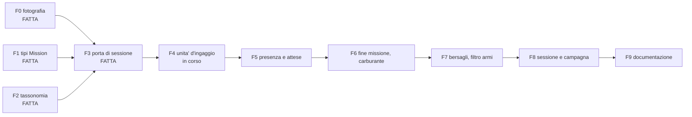

# Capitolo 9 — Limiti noti, punti di estensione, divergenze codice/wiki

> **Stato descritto: commit `533cd1f5` (2026-10-05).** Il manuale descrive il motore a quel commit, cioè
> **dopo le fasi F0-F3** del piano di implementazione della Missione
> (`Analysis/Document/Piano_Implementazione_Missione.md`). Le fasi **F4-F9** sono **in corso o da fare**
> e non sono descritte come codice: F4 la missione come unità d'ingaggio, F5 presenza e attese, F6 fine
> missione e carburante nel tempo, F7 bersagli e filtro armi, F8 sessione e campagna, F9 documentazione
> (questo stesso aggiornamento ne è parte). Il loro stato è in §9.5. Tutto ciò che il capitolo elenca come
> "limite" va letto rispetto a quel commit: parte dei limiti è proprio ciò che quelle fasi risolvono.

## 9.1 Limiti noti (dichiarati nel codice, non difetti nascosti)

Raccolti dai "Cosa NON fa" dei singoli moduli, già citati nei capitoli precedenti; qui riuniti
per avere un solo punto di riferimento.

### Selezione dell'arma dai registri — fatta (2026-09-24), estesa al cannone di bordo (2026-09-26) e alla gittata delle bombe (2026-09-27)

Aggiornamento rispetto alla stesura iniziale di questo manuale: `fire_control` resta sempre
**iniettata** dal chiamante (`Logic/Engagement_Resolver.py:24-28`, il contratto non è cambiato,
esteso solo per accettare anche una sequenza di opzioni, v. sotto), ma esiste ora
un'implementazione che seleziona davvero l'arma dai registri
(`Logic/Fire_Control.make_registry_fire_control`, capitolo 4, §4.16), consultando
`Ground_Weapon_Data`/`Ship_Weapon_Data`/il loadout assegnato dell'aereo invece di una tabella di
ruoli. Dal 2026-09-26 (decisione A5) non seleziona più solo l'arma a Pk massima: restituisce
**tutte** le armi adatte in ordine di preferenza Pk/costo (`rank_weapons`, capitolo 4, §4.16), e
il risolutore prova le opzioni in ordine, sparando con la prima che ha ancora scorta (v. sotto).
Resta da fare, dichiarato nel modulo stesso (`Logic/Fire_Control.py:135-144`): la modulazione
della Pk con la posizione nell'inviluppo (distanza, aspetto) — i valori restano quelli di
template, indipendenti da dove avviene realmente il tiro nella finestra; e il filtro per tipo di
missione/bersaglio (ROE) non esiste (decisione A4 rimandata). **Aggiornamento a `533cd1f5`**: l'entità
`Mission` ora esiste (fase F1, capitolo 2 §2.6) e attraversa la porta di sessione (F3), ma **né il
risolutore né la `fire_control` la consultano**: il filtro delle armi per tipo di missione, ruolo
dell'asset e categoria d'arma è la fase F7 — un caccia intercettore sceglierebbe oggi le stesse armi in
missione CAP o in missione strike. Gli scenari lo simulano con stand-in di test (`ifv_only`,
`maverick_only_fire_control` di S19AD, capitolo 8 §8.6).

**Risolto rispetto alla stesura precedente di questo manuale — il cannone di bordo è ora candidato**
(decisione A2, 2026-09-26, commit `8bd69727`, v. capitolo 4 §4.16bis): campo `gun` di
`Aircraft_Data` (37 modelli) più `get_aircraft_gun_rounds` per la ripartizione proporzionale di un
armamento misto, propria voce di scorta e candidatura in `_candidate_weapons`. Non risolto: nessun
filtro per tipo di missione (A4, fase F7, come sopra); l'AJ/ASJ 37 Viggen resta senza `gun` per un'anomalia
dei dati (`gun_rounds` nel loadout ma nessun cannone interno proprio nel registro per quella
variante — v. capitolo 4 §4.16bis).

**Risolto in parte rispetto alla stesura precedente — le bombe hanno ora gittata e tempo di caduta
reali** (decisione B6, 2026-09-27, commit `6754bf1c`, v. capitolo 4 §4.20): per le 29 bombe su 32
con dati di rilascio (`AIR_WEAPONS['BOMBS'][...]['release']`, commit `4ddbb089`), `shot_spec_for`
non produce più `max_range = None` contro un bersaglio di superficie, ma la gittata obliqua e il
tempo di caduta dalla balistica di `Logic/Weapon_Delivery.bomb_engagement_estimate`, alla quota
tiratore−bersaglio e alla velocità `attack` del loadout. **Risolto il 2026-09-28 (decisione D4)**: le tre
KGBU-2AO/2PTAB/96r senza dati di rilascio erano un dispenser KMGU-2 mal identificato; ora `KMGU-2AO` e
`KMGU-2PTAB` hanno dati di rilascio (KGBU-96r è eliminata) e, dopo l'aggiunta di 23 bombe DCS
(`0df5ddf9`), **tutte le 54 bombe** del registro hanno il campo `release` (capitolo 7 §7.12): nessuna bomba
produce più `max_range = None` per mancanza di dato. Restano, dichiarati nel modulo `Weapon_Delivery` (v. capitolo 7,
§7.9): la geometria della picchiata/cabrata non entra nel tratto valutato per la gittata (solo
nella balistica); la sfera di portata del DES non ha distanza minima; quota e velocità fuori dalla
finestra di rilascio sono portate (clampate) al bordo ammesso invece di far fallire il tiro, come
fa l'IA di DCS. Negli scenari di validazione (capitolo 8) il ruolo di `fire_control` è ancora
coperto anche da `Scenario_Fixtures.make_fire_control`, dichiarato esplicitamente come tabella di
ruoli non calibrata, per gli scenari che non hanno bisogno di una selezione reale dai registri.

### Scorta munizioni indifferenziata per arma — **risolta** (2026-09-26, decisione A1/A3, commit `1d0c1127`)

Aggiornamento rispetto alla stesura iniziale di questo manuale: fino a questa data la scorta di
un asset era **un contatore scalare aggregato** (`Mobile.ammunition`, decisione R3 del
2026-09-23) che sommava armi eterogenee — bombe, missili, colpi di cannone — in un solo intero.
La fire control sceglieva un'arma specifica per nome, ma il risolutore consumava sempre lo stesso
scalare aggregato, **indipendentemente** da quale arma avesse davvero sparato: un A-10 con 4
Maverick reali a bordo ne lanciava 642 nella simulazione, pagati dai colpi del cannone nello
stesso contatore; un BMP-2 con 4 missili Konkurs poteva lanciarne 252. Non era un limite
dichiarato nella stesura iniziale di questo manuale (il capitolo 4, §4.4, descriveva
semplicemente il contatore aggregato come lo stato dell'epoca), ma un difetto di modello
verificato e corretto (`Analysis/Document/Proposta_Munizioni_Compatibili_e_Rotte_Attacco.md §1`).

**Risoluzione**: la scorta **per modello d'arma** (`Mobile._stores`, nuovo modulo
`Asset/Weapon_Stores.py`) è ora lo stato primario; `ammunition`/`interceptor_stock` sono viste
calcolate su di essa; `Fire_Control` dichiara l'arma in ogni `ShotSpec.weapon` e il risolutore
consuma la voce di quell'arma, non più l'aggregato (v. capitolo 4, §4.19, e capitolo 7, §7.6, per
il dettaglio completo). La regola del "SAM puro" (`interceptor_shares_ammunition`) non serve più
ed è stata eliminata: la condivisione fra fuoco offensivo e intercettazione sulla stessa voce di
scorta è ora per costruzione, per qualunque asset con armi AD modellate per arma.

**Limiti noti che RESTANO, non corretti da questo lavoro**:

- Il **cannone di bordo** degli aerei — risolto separatamente il 2026-09-26 (decisione A2, commit
  `8bd69727`, v. sopra e capitolo 4 §4.16bis): ha ora una propria voce di scorta ed è candidato
  della fire control.
- Il **filtro per tipo di missione/bersaglio** (ROE) non esiste (decisione A4 rimandata alla fase F7): l'entità
  `Mission` esiste dalla F1 ma non è consultata dal motore; l'ordine di preferenza delle armi (v. §4.16) non
  distingue ancora, ad esempio, un'intercettazione aria-aria da una missione di scorta.
- La **scelta dell'arma precede il controllo di portata** (v. capitolo 4, §4.17): il risolutore
  fissa prima la prima opzione della fire control che ha ancora scorta, e solo su quella applica
  il controllo di portata (§4.17). Se l'opzione preferita ha scorta ma è fuori portata, il
  candidato è rimandato o esaurito **anche se** un'opzione meno preferita della stessa
  `fire_control` sarebbe già in portata — il tiratore non "scende" alla seconda opzione per
  motivi di portata, solo per motivi di scorta esaurita. Non corretto: richiederebbe che la
  scelta dell'arma conoscesse la geometria della finestra prima di essere fissata.
- La **taratura della formula Pk/costo** (`WEAPON_COST_EXPONENT = 0.5`, decisione A5) resta una
  stima di principio confermata dall'utente, non un valore calibrato — v. capitolo 4, §4.16.

### Fog-of-war reale — collegato al rilevamento (2026-09-25), ma "debole", e con un bug a monte

Aggiornamento rispetto alla stesura iniziale: il fog-of-war informativo di livello C2
(`Context/Region`/`Logic/Tactical_Analysis`, `recon_cp_snapshot`, `use_recon`, la policy "non
visto → priorità bassa" di `feedback_no_visibility_low_priority`) **è ora collegato** al
rilevamento del motore, tramite `region_recon_detection_factor` (capitolo 4, §4.18): la stessa
istantanea di ricognizione che alimenta le priorità di targeting (`build_recon_cp_snapshot`) è
usata anche per costruire il `detection_factor` iniettato in `resolve_engagement`. Le due nozioni
di "visibilità" — geometrica (nel raggio di un sensore, ciò che `Contact_Scheduler` calcola) e
informativa (confermata dal C2) — sono quindi collegate per la Pd, restando comunque due
meccanismi distinti (l'informativa non decide *se* un sensore rileva, solo *quanto* è probabile
che lo faccia).

**Limite noto, dichiarato, non corretto — la nebbia è "debole"**: `Block.get_recognition_report`
produce sempre un report con `block_id` per **ogni** `Military` nemica selezionata nella regione
(`Block/Block.py:504-521`: `block_id` non è condizionato da `report_item_probability`, a
differenza di `position`/`dimension`/`efficiency`, che possono risultare `None`). Di conseguenza
`unseen` (bersaglio "non visto") oggi scatta **solo per condizioni strutturali** — blocco fuori
regione, non `Military`, categoria non mappata da `Context.MILITARY_CATEGORY_TO_FORCE`, o asset
bersaglio senza blocco — non per un criterio più stringente come `position is None` nel report
stesso. È una scelta **deliberata** per restare fedele alla ricetta già esistente di
`Region.update_military_priorities` (stessa istantanea, stesso significato di "visto"), non un
bug: ma il risultato è che la nebbia di guerra copre oggi meno casi di quanto il nome
suggerirebbe. Un criterio più stringente è un'estensione futura (v. §9.3).

**Bug trovato durante l'implementazione (2026-09-25), non corretto**:
`Region.get_blocks_by_criteria(category='Military')` (`Context/Region.py:291-301`) scarta
`Military` **reali** la cui `category` non è esattamente la stringa `'Military'` — comune nelle
fixture di test che non la impostano esplicitamente (default `''`). La causa è la struttura
`if`/`elif`/`elif`/`elif`: la prima condizione (`category == 'Military' and not
isinstance(block, Military)`) è pensata per "lasciare passare" una vera `Military` quando è
**falsa**, ma essendo un `elif` e non un `else` indipendente, Python valuta comunque l'ultimo
ramo della catena (`elif block.category != category: continue`) anche quando il blocco È una
`Military` — e lo scarta se il suo attributo `category` non vale letteralmente `'Military'`.
Impatta ogni chiamante che filtra per `category='Military'`, **incluse** `side_recon_efficiency`
(§4.18) e `Region.get_recon_reports` — quindi potenzialmente sia la nebbia di guerra sia
`update_military_priorities` (già esistente, non introdotto da questo lavoro). Non corretto:
tocca chiamanti esistenti al di fuori del perimetro di questo lavoro, da decidere a parte (v.
memoria di progetto `project_session_2026_09_25_summary.md`).

### Re-scheduling delle finestre di contatto dopo un cambio di rotta — rimandato

Se un asset cambia rotta durante una finestra di contatto già calcolata dallo scheduler (Fase 3),
la finestra andrebbe invalidata e ricalcolata: questo meccanismo **non esiste**, perché finora
nessun consumatore modifica una rotta dopo che le finestre sono state prodotte
(`Logic/Engagement_Resolver.py:209-211`, R4 seconda parte). Concretamente, una forza che si
disingaggia è solo **segnalata** nell'esito (`ForceOutcome.outcome = DISENGAGED`); il nuovo
instradamento e il ricalcolo delle finestre spettano a un livello superiore (C2/campagna), non
ancora costruito. V. §9.2 per la divergenza fra questo comportamento e il testo originale della
decisione che lo ha proposto.

### La Pd non distingue radar da ottico

`weather_detection_factor` applica un fattore di degradazione **unico** a qualunque sensore
abbia prodotto la portata della finestra di contatto, perché la finestra stessa non porta
l'informazione "quale sensore" (`Logic/Engagement_Resolver.py:289-301`, `:716-763`). Un radar non dovrebbe
subire la stessa degradazione notturna di un sensore ottico, ma oggi la subisce comunque, con un
compromesso pesato verso il radar. La discriminazione per tipo di sensore richiede che la
finestra di contatto porti anche il sensore che l'ha prodotta — un cambiamento nello strato 1.

### Altri limiti dichiarati, minori

- **Ripartizione del fuoco**: round-robin locale per tiratore (`_schedule_next`,
  `Logic/Engagement_Resolver.py:1614-1779`), non un'assegnazione ottima arma-bersaglio (nessun
  WTA, nessun peso per valore del bersaglio; la Pk della coppia entra solo nella saturazione della
  dottrina di tiro, §4.25). Dal 2026-09-28/29 il round-robin è preceduto dalla priorità ai lanciatori
  (L2/L3, §4.24) e dal filtro dei bersagli bloccati (§4.25).
- **`salvo_window` di default 0.0**: solo impatti simultanei formano un evento-salva; la finestra
  giusta per raggruppare impatti ravvicinati è un punto aperto di modello, da decidere con la
  taratura (`Logic/Engagement_Resolver.py:2665`, `:2703-2705`).
- **Nessun movimento fisico fra sessioni**: `run_session` non aggiorna `asset.position` a fine
  rotta; una campagna che concatena sessioni vede le forze ripartire dalle posizioni iniziali a
  ogni sessione, a meno che il chiamante non aggiorni le posizioni da sé
  (`Test/Test_Session_Validation.py:281-285`, v. capitolo 8, §8.3).
- **Carburante esaurito a metà rotta**: l'asset non viene fermato sulla rotta né i contatti già
  calcolati vengono ricorretti; l'informazione (`FuelEvent.exhausted`) è nell'esito, e la userà
  un livello superiore (capitolo 6, §6.5).
- **`calcFightResult` (fallback aggregato a rapporto di forze) resta invariato**: nessuna delle 7
  fasi lo ha toccato, per scelta esplicita (wiki `decisions/soglie-disingaggio-e-attrito-aggregato`
  §P2); se mai verrà riscritto, il bersaglio dichiarato è una forma eterogenea a matrice di
  letalità incrociata con coefficienti solo da ATCAL interno, mai da tabelle a mano.
- **Sensori 'ground' assenti nei registri** per carri/corazzati/artiglieria e per le navi (v.
  capitolo 8, §8.1): senza un'iniezione esplicita, due forze terrestri non si vedono mai. Non è
  un bug del motore, è un dato mancante nei registri d'arma che nessun chiamante di produzione
  compensa ancora.
- **Nessun rifornimento nel motore**: né di munizioni né di carburante. È dichiarato materia del
  ciclo di campagna in entrambi i moduli (`Logic/Fuel_Model.py:31-32`, wiki
  `decisions/risolutore-ingaggio-salva-fase4` §R3).

### Limiti introdotti o resi evidenti dalle estensioni del 2026-09-28/30 (commit `72c7f7c8`...`a500fdf3`)

**Soglia di rottura stocastica** (capitolo 4 §4.7, §4.21; `Proposta_Soglia_Rottura_Stocastica.md` §8):

- **Coefficienti dichiarati, non tarati**: `erosion = 0.30` è una stima di partenza; dispersione, pesi di
  morale, rapporto di forze, fuoco senza risposta, postura e `shock_min_losses` sono stime senza fonte
  (`Context/Doctrine.py:115-127`), da ricalibrare con ATCAL. I tre lati hanno gli stessi valori.
- **Rottura parziale non modellata**: il disingaggio resta per **forza intera** (decisione P1): una parte
  della forza non può cedere mentre l'altra resiste. Nessun contagio fra forze dello stesso lato né legame C2
  (Fase 0 della gerarchia C2, mai toccata).
- **Il morale non è alimentato**: il risolutore lo riceve come ingresso (`morale_for`); `Block.morale`
  (`Block/Block.py:434-449`) vale `0.0` quando manca il dato e nessun modulo registra gli esiti delle
  missioni. **Nessun chiamante di produzione** passa `morale_for` né `enemy_estimate_for` a `run_session`:
  oggi il fattore di morale è sempre neutro e la stima a priori sempre assente (decisione D9: correggere
  `Block.morale` più avanti).
- **Minaccia percepita sulla scorta di dotazione**: un SAM che ha sparato tutto continua a pesare come se
  fosse carico (decisione dell'utente, 2026-09-29): chi osserva non conosce la scorta residua.
- **Fuoco senza risposta** conta solo la percezione del tiratore, non la capacità di ingaggiarlo; **senza
  RWR un aereo non percepisce mai i SAM** (nessun sensore in modo `ground` nei registri aerei).

**E(N) e pesi di minaccia** (capitolo 4 §4.22): bersaglio di riferimento fisso (`Aircraft_Attacker` med),
velocità 200 m/s e attraversamento lungo il diametro sono stime dichiarate; `EFFICACY_CORRECTIONS` è vuota;
il peso di superficie è binario (1 o 0, SAM puri a 0) e quello aereo dei caccia è fisso a 1.

**RWR e classi** (capitolo 4 §4.23, capitolo 7 §7.10): settori, `ewr` e `confidence` sono nei dati ma non
consumati da nessun codice (rimandati a rotte/evasione e a un SEAD); la classe RWR pesa con la **media** del
catalogo (può sottostimare); `run_session` non inoltra `rwr_catalogue`; il catalogo di default è l'intero
registro, non l'inventario del nemico (serve la corrispondenza lato → paesi).

**Difesa dai missili A6** (capitolo 4 §4.24): il **legame C2 fra unità non è modellato** (ogni tiratore usa il
proprio profilo di reazione: una batteria integrata assegnerebbe più in fretta di unità indipendenti); Osa e
Stinger non sono intercettori (D-AM1, in attesa di una verifica in DCS di quali unità l'IA fa sparare contro
missili); la regola L1 valuta il volume del **singolo** intercettore (Q1); i colpi lanciati da dentro la zona
non si intercettano mai (Q2); il lanciatore deve essere già rilevato dal tiratore (Q5).

**Dottrina di tiro** (capitolo 4 §4.25): le intercettazioni possibili sono ignorate nella stima di copertura
(stima ottimistica); il tetto "due missili" conta solo i colpi **in volo** dello stesso tiratore; i valori
0.9 e 2 sono stime dichiarate (0.9 scelto dall'utente); la regola è greedy locale, non un'assegnazione ottima.

**R-INT** (capitolo 4 §4.26): tempo di volo dell'intercettore trascurato, RCS del colpo non modellata,
traiettoria rettilinea, rilevamento per asset e non per forza (tutte semplificazioni ottimistiche per la
difesa, dichiarate nella proposta §4).

### Limiti della Missione a `533cd1f5` (fasi F0-F3 fatte, F4-F9 no)

Ciò che segue è **atteso** dal piano e non un difetto nascosto; v. §9.5 per la mappa fase per fase.

- **Il motore non consulta la Missione tranne per la geometria**: ruoli degli asset, regole (ROE, allerta,
  EMCON, reazione alla minaccia, formazione), bersaglio, criteri di fine, `Operation` e `OutcomeRule` sono
  validati e portati dalla porta ma **non letti** da alcun modulo di `Logic` (ricerca sull'albero: nessun
  consumatore fuori da `Mission_Types`, `Session_Types` e `Mission_Adapter`). Solo rotta, partenza,
  velocità e offset di formazione hanno effetto (capitolo 6 §6.10).
- **L'unità d'ingaggio è ancora la forza (blocco)**, non la missione: due missioni dello stesso blocco
  condividono disingaggio, soglia di rottura e `committed` (F4).
- **Il `mission_id` non entra nell'RNG** (`order.rng(mission_id=None, ...)`): v. §9.6.
- **Nessuna presenza prima della partenza né dopo la fine**: un asset senza movimento o con missione
  conclusa non esiste per lo scheduler fuori dai suoi tratti di rotta (F5); nessun `WAIT` (sosta, orbita);
  gli scenari aerei finiscono sull'obiettivo senza rientro (capitolo 8 §8.1).
- **Esito di missione di prima forma**: solo `COMPLETED`/`FAILED`/`DESTROYED`; nessun `ABORTED`, nessun
  criterio di stato (bingo, winchester, danno, minaccia: F6); una missione **senza rotta** con asset
  sopravvissuti risulta `FAILED` perché manca lo stato "in corso" (capitolo 6 §6.11); l'esito di
  un'`Operation` non è calcolato da nessuno.
- **Carburante**: ancora un `FuelEvent` per asset, distanza e regime unici; nessun consumo nel tempo e
  nessun bingo a priori (F6).
- **`Activation.ON_EVENT` è solo dichiarabile**: `mission_start` solleva `ValueError`; condizioni sullo stato e
  re-scheduling restano fuori piano (N2.d, R4 seconda parte).
- **Missioni fuori finestra**: una partenza derivata anteriore all'inizio della sessione è un errore, ma una
  rotta che supera la fine è ritagliata in silenzio (`clamp_legs`) e i controlli di durata (default 2 h,
  massimo 4 h) sono della F8.
- **Vincolo di sessione**: un asset in **una sola** missione per sessione (un blocco può averne più).
- **Elenchi di prima stesura**: `EMCON_STATES`, `THREAT_REACTIONS`, `FORMATIONS` come nomi generici, e
  `MITER_LIMIT = 2.0` dell'offset di formazione sono stime di progetto (capitolo 2 §2.6, capitolo 6 §6.10);
  la tabella `MISSION_TYPE_POSTURES` è solo un dato, il secondo stadio "postura → tipi di missione" non esiste.
- **Aircraft**: 13 loadout hanno un task di supporto; ne resta **1 con `tasks` vuoto** (il piano ne
  ipotizzava 14 da assegnare).

### Limiti del pianificatore di rotta e del pianificatore d'attacco (2026-09-26/27, commit `815dc35f`/`6754bf1c`)

Non fanno parte del motore DES in senso stretto (v. capitolo 7, §7.8-7.9), ma ne alimentano
l'input (§4.20) o condividono lo stesso schema di volumi (`ThreatAA`/`DetectionThreat`); raccolti
qui perché dichiarati esplicitamente nel codice come punti aperti:

- **`Contact_Scheduler.route_threat_windows` resta senza consumatori di produzione**: sia il
  pianificatore di rotta (`Logic/Air_Route_Manager.py`, metriche di rilevamento del `Path`) sia il
  pianificatore d'attacco (`Logic/Weapon_Delivery._evaluate_exposure`) usano l'intervallo analitico
  più veloce `Air_Route_Manager._segment_cylinder_interval` — geometria sympy della funzione del
  capitolo 3 resta disponibile, ma su segmenti rettilinei dà lo stesso risultato e nessun
  chiamante di produzione la esercita ancora.
- **Geometria di picchiata/cabrata isolata dalla balistica**: `plan_attack_profile` valuta
  l'esposizione alle minacce sul tratto IP → sgancio → uscita a quota e velocità **costanti**; il
  profilo (livellato/picchiata/cabrata) entra solo nel calcolo di gittata e tempo di caduta
  (`Weapon_Delivery` livello 1), non nella traiettoria usata per calcolare quanto tempo l'aereo
  passa dentro un volume di minaccia.
- **La sfera di portata del DES non ha una distanza minima**: sia per il controllo di portata di
  §4.17 sia per la gittata delle bombe di §4.20, un aereo già sopra (o vicinissimo a) il bersaglio
  risulta "in portata" per costruzione — nessun vincolo geometrico impedisce uno sgancio a distanza
  quasi nulla.
- **Clamp della quota/velocità fuori dalla finestra di rilascio**: sia `bomb_engagement_estimate`
  (DES, §4.20) sia `plan_attack_profile` (pianificazione, §7.9) portano un tiratore fuori
  inviluppo al bordo ammesso più vicino invece di rifiutare il tiro — scelta dichiarata, identica
  al comportamento noto dell'IA di DCS ("will choose closest altitude"), non un errore silenzioso.
- **Dati di rilevamento mancanti per alcuni asset** (decisione D-4, sospesa): ZSU-57-2 e M163-VADS
  non hanno sensori nei registri, quindi `build_detection_threat` restituisce sempre `None` per
  loro (nessun volume di rilevamento, non un errore); i dati EWR dedicati e il sensore visivo di
  ripiego (D-4b/c) restano da ricercare separatamente.
- **Reti di sensori/cueing EWR→SAM (D-7) fuori perimetro**: ogni sito calcola il proprio
  rilevamento in isolamento; un EWR che passa una traccia a un SAM lontano non è modellato.
- **Attraversamento a corda limitata del solo rilevamento (D-5, opzione 2) non implementato**:
  richiederebbe un dato di tempo di permanenza del sensore e un cambio della legge di Pd del
  risolutore, non fatto in questo lavoro.
- ~~**KGBU-2AO/2PTAB/96r senza dati di rilascio**~~ (RISOLTO 2026-09-28, v. §9.1).

## 9.2 Divergenze fra il codice e la wiki di progetto

Verificate confrontando il codice a HEAD con i tre documenti indicati come fonte
(`Analysis/WIKI_LLM_SIMULATION/wiki/decisions/virtual-session-engine-des.md`,
`risolutore-ingaggio-salva-fase4.md`, `soglie-disingaggio-e-attrito-aggregato.md`). Il codice
prevale; qui si segnala dove il testo della wiki, letto alla lettera, descrive un comportamento
diverso da quello implementato.

### D1 — Re-scheduling dopo disingaggio: la proposta originale (P1) descrive un comportamento non implementato

Il corpo della decisione P1 in `soglie-disingaggio-e-attrito-aggregato.md` (§"P1 — Soglia di
disingaggio come esito di ingaggio di prima classe") dice testualmente: *"al superamento,
l'ingaggio termina con esito `DISENGAGED` distinto da `DESTROYED`, e **la forza che si
disingaggia rientra nello scheduler dei contatti con una nuova rotta** (non sparisce)"*.

Il codice implementato non fa questo: `Logic/Engagement_Resolver.py:160-162` dichiara
esplicitamente che il "re-scheduling dopo spostamento fisico" (di cui il rientro nello scheduler
con una nuova rotta è un caso) è la **seconda parte di R4, rimandata** — non Fase 4. Una forza
`DISENGAGED` è oggi **solo segnalata** nel `ForceOutcome`: nessun codice la re-instrada né
ricalcola le finestre di contatto per lei. Questo non è un'incoerenza nascosta: il blocco di
stato in cima a `soglie-disingaggio-e-attrito-aggregato.md` (`status: accepted`, aggiornato
2026-09-23) e il blocco equivalente in `risolutore-ingaggio-salva-fase4.md` §"Punti aperti —
RISOLTI" registrano correttamente che "R4: re-scheduling ora o rimandato → **rimandato** ...al
primo consumatore reale". Il corpo originale della proposta P1, però, non è stato riscritto per
riflettere questa decisione successiva, e un lettore che si fermasse al solo corpo della sezione
P1 (senza leggere fino ai blocchi di stato/punti aperti) si farebbe un'idea sbagliata del
comportamento attuale. Vale quindi la correzione: **oggi il rientro nello scheduler non esiste**,
coerentemente con quanto descritto in questo manuale al capitolo 4, §4.9 e qui sopra in §9.1.

### D2 — Nessun'altra divergenza sostanziale trovata

Il resto dei tre documenti (decisioni Q1-Q3, R1-R4 prima parte, P1 negli esiti/soglie, P3) è
coerente con il codice a HEAD punto per punto, per quanto verificato nella stesura di questo
manuale: soglie di dottrina in `Context/Doctrine.py` come dichiarato; saturazione con funzione
dedicata (`Military.salvo_interception_capacity`, distinta da `air_defense_power`) come
dichiarato in R1; munizioni per asset senza rifornimento nel motore come dichiarato in R3;
congelamento del payload come dichiarato in R4 prima parte; batteria S1-S19 con la stessa regola
dichiarata in P3 (composizione e domanda, mai numeri precalcolati).

## 9.3 Punti di estensione (dove agganciare sviluppi futuri)

Riassunto operativo per chi estenderà il motore, con il punto esatto del codice:

| Estensione | Punto di aggancio |
|---|---|
| Selezione arma dai registri | **Fatta** (`Logic/Fire_Control.make_registry_fire_control`, capitolo 4 §4.16), con ordine di preferenza Pk/costo dal 2026-09-26, cannone di bordo candidato dal 2026-09-26 (§4.16bis) e gittata/tempo di caduta reali per le bombe dal 2026-09-27 (§4.20); resta da fare: modulare la Pk con la posizione nell'inviluppo di tiro (distanza, aspetto), (i dati di rilascio delle KGBU, ora KMGU-2*, sono stati aggiunti il 2026-09-28, D4 chiusa). |
| Scorta per modello d'arma | **Fatta** (`Asset/Weapon_Stores.py`, decisione A1/A3, capitolo 4 §4.19, capitolo 7 §7.6), cannone di bordo incluso dal 2026-09-26 (decisione A2); resta da fare: filtro missione/bersaglio (decisione A4, fase F7: l'entità `Mission` esiste ma il motore non la consulta), far precedere il controllo di portata alla scelta per scorta (v. §9.1). |
| Fog-of-war reale | **Fatto** (`region_recon_detection_factor`/`recon_detection_factor_fn`, capitolo 4 §4.18, composto con il meteo tramite `combine_detection_factors`); resta da fare: un criterio di "non visto" più stringente (es. `position is None` nel report) per una nebbia meno "debole" (v. §9.1), e la correzione del bug di `Region.get_blocks_by_criteria(category='Military')` (`Context/Region.py:291-301`, v. §9.1) che la sessione di lavoro ha trovato ma non corretto. |
| Volumi di rilevamento e intercettazione nel pianificatore di rotta | **Fatto** (`Logic/Air_Route_Manager.py`, `ThreatAA`/`DetectionThreat`, `ThreatMode.AVOID_DETECTION`, capitolo 7 §7.8); resta da fare: dati EWR/sensore visivo per ZSU-57-2/M163 (D-4b/c), reti di sensori/cueing EWR→SAM (D-7), attraversamento a corda limitata del solo rilevamento (D-5 opzione 2), cambio di quota per aggirare un volume di rilevamento (ricostruzione alla nuova quota, proposta §3.6 Attività D). |
| Pianificatore d'attacco (quota e profilo di sgancio) | **Fatto** (`Logic/Weapon_Delivery.py`, `Command/Attack_Types.py`, capitolo 7 §7.9, alimenta il DES via §4.20); resta da fare: collegare `MissionAsset.attack_profile` (campo già presente, capitolo 2 §2.6) al motore (fase F7), missili aria-superficie (fuori scope dichiarato), geometria di picchiata/cabrata nel tratto d'esposizione (v. §9.1). |
| Missione come unità d'ingaggio | Fase F4: una vista di forza per missione (`name` = `mission_id`, `salvo_interceptors` ristretto agli asset della missione) da passare a `resolve_engagement`, che accetta già "qualunque oggetto con `assets`, `side`, `name`" (`Logic/Engagement_Resolver.py:2675-2677`); il `mission_id` entra nell'RNG (`Logic/Session_Simulator.py:709`); da verificare che `morale_for`, `enemy_estimate_for`, soglia di rottura e `committed` usino solo quegli attributi. |
| Presenza, attese, fine missione | Fasi F5-F6: tratti fermi prima/dopo la rotta in `Contact_Scheduler._asset_legs`; azione `WAIT`; criteri di fine di `EndCriteria` come "fine di attività" senza cambio di rotta nel risolutore; `Fuel_Model` per tratto; `MissionOutcome` completo (`ABORTED`). |
| Filtro armi e bersagli espliciti | Fase F7: involucro di `fire_control` per missione (stesso schema di `ifv_only` di S19AD) e bersaglio di posizione stimata (salva su area, da progettare). |
| Alimentazione di morale e stima del nemico | Fornire `morale_for`/`enemy_estimate_for` a `run_session` da `Block.morale` corretto (decisione D9) e dalla ricognizione/C2 (capitolo 4 §4.21). |
| Settori RWR, `ewr`, `confidence` | Consumo nel modulo rotte/evasione e in un futuro SEAD (`Asset/Aircraft_Rwr_Data.py`, capitolo 7 §7.10). |
| Legame C2 fra unità di difesa | Fase 0 della gerarchia C2: tracce condivise per R-INT (§4.26), assegnazione più rapida per L3 (§4.24). |
| Re-scheduling dopo disingaggio | Livello C2/campagna: leggere `ForceOutcome.outcome == DISENGAGED` dal `SessionOutcome`, decidere una nuova rotta, e far ripartire `Contact_Scheduler.schedule_contacts` per quella forza in una sessione successiva (non dentro `resolve_engagement`, che è a stato ombra e non muta rotte). |
| Pd per tipo di sensore | La finestra di contatto (`ContactWindow`) dovrebbe portare il sensore che l'ha prodotta, non solo la portata; `detection_factor` potrebbe allora distinguere radar da ottico (`Logic/Contact_Scheduler.py:188-223`, `Logic/Engagement_Resolver.py:716-763`). |
| Assegnazione ottima arma-bersaglio | Sostituire la regola greedy round-robin di `_schedule_next` (`Logic/Engagement_Resolver.py:1614-1779`) con un algoritmo di weapon-target assignment, mantenendo l'invariante del payload congelato (R4 prima parte). |
| Movimento fisico persistente fra sessioni | Far scrivere a `run_session` (o a un futuro `Theater_Session_Manager`) la posizione finale di ogni asset mobile a fine sessione, oggi non aggiornata (`Logic/Session_Simulator.py`, v. capitolo 6 §6.5 e capitolo 8 §8.3). |
| Rifornimento (munizioni/carburante) | Materia esplicitamente del ciclo di campagna, non del motore DES: da costruire come passo separato che precede una nuova `SessionOrder`, consumando `Mobile.load_stores_from_registry`/`load_fuel_from_registry` o equivalenti. |

## 9.4 Stato del motore a questo commit

Le 7 fasi della roadmap (contratto+RNG, cinematica, percezione, scheduler dei contatti,
risolutore d'ingaggio, applicazione dello stato/carburante, orchestratore, validazione — 7 fasi
enumerate nella wiki, con la cinematica e la percezione assorbite nelle precondizioni delle fasi
successive) sono **complete**: non c'è un "prossimo passo obbligatorio" per il motore DES in sé.
Le due estensioni allora "in corso in parallelo" — selezione arma dai registri e collegamento del
fog-of-war reale — sono state completate dopo la stesura iniziale di questo manuale (commit
`15350cc5` e `388e6ea3`, capitolo 4 §4.16-4.18) e aggiornate qui di conseguenza. Una terza
estensione, non prevista nella stesura iniziale, è stata completata il 2026-09-26 (commit
`1d0c1127`, "Proposta A"): la scorta per modello d'arma (`Asset/Weapon_Stores.py`, capitolo 4
§4.19), che ha sostituito il contatore aggregato per asset come stato primario delle munizioni e
ha reso l'ordine di preferenza della fire control sensibile anche al costo dell'arma (decisione
A5, capitolo 4 §4.16), non solo alla Pk.

**Aggiornamento 2026-09-28/30 e fasi F0-F3 della Missione (a `533cd1f5`)**: dopo le estensioni di
settembre il motore ha acquisito, in ordine: la capacità `Anti_Missile` e l'ordine F fra intercettori
(`37ca477e`), lo scenario S19AD (`aedd7fa5`), le regole L1 (`24a43d10`) e L2/L3 (`6f31333e`), la soglia di
rottura stocastica con l'efficacia antiaerea E(N) (`72c7f7c8`), il puntamento condiviso e la minaccia su
dotazione stimata (`4d225ffb`), la classificazione SAM e la RWR per classi (`d261062c`), la dottrina di tiro
contro l'overkill (`22cbe91e`), la regola R-INT (`a500fdf3`) e il peso di classe della RWR (`440a8823`);
sul lato dati le armi DCS mancanti (`0df5ddf9`), il KMGU-2 (`89f1aa34`) e il rename `Retrait` → `Retreat`
(`1d5dc863`); poi la Missione: fotografia di non regressione (`d3af6980`), tipi di dominio (`20b6de72`,
`680dfcb6`), tassonomia (`4e18d7d8`, `8f16cc3c`), porta di sessione (`533cd1f5`). Diversamente dalle
estensioni di settembre, le ultime sono **modifiche al risolutore e alla porta**, non solo ai moduli
satellite. La suite è a **3922 test, OK (skipped=7)**.

**Aggiornamento 2026-09-26/27**: quattro estensioni ulteriori, tutte sui moduli satellite che
alimentano il motore dall'esterno, non sul motore in sé: (1) le finestre di rilascio di 29 bombe
su 32 (commit `4ddbb089`, dato di registro, prerequisito delle altre); (2) il cannone di bordo come
arma candidata reale, con propria voce di scorta (commit `8bd69727`, decisione A2, capitolo 4
§4.16bis); (3) i volumi di rilevamento e intercettazione distinti nel pianificatore di rotta
(commit `815dc35f`, capitolo 7 §7.8); (4) il pianificatore d'attacco con quota e profilo di
sgancio, che alimenta il DES con una gittata e un tempo di caduta reali per le bombe (commit
`6754bf1c`, decisione B6, capitolo 4 §4.20, capitolo 7 §7.9). La suite di test è passata da 3371 a
**3645 test, OK (skipped=5)** attraverso queste sette estensioni (capitolo 8).

I seguiti possibili restano quelli di §9.3: i limiti "minori ma non corretti" già presenti (bug di
`get_blocks_by_criteria`; le tre KGBU senza dati di rilascio) più quelli appena aggiunti (filtro
missione/bersaglio assente — decisione A4, manca l'entità `Mission`; scelta per scorta che precede
il controllo di portata; modulazione della Pk con la posizione nell'inviluppo; un criterio di "non
visto" più stringente; geometria di picchiata/cabrata isolata dalla balistica nel pianificatore
d'attacco; dati EWR/sensore visivo mancanti per alcuni asset AD; reti di sensori/cueing EWR→SAM;
`route_threat_windows` ancora senza consumatori di produzione), e il resto della lista già presente
(assegnazione ottima arma-bersaglio, movimento persistente fra sessioni, rifornimento, Pd per tipo
di sensore).

## 9.5 Stato del piano della Missione (F0-F9) a `533cd1f5`

Fonte: `Analysis/Document/Piano_Implementazione_Missione.md`. **Il manuale descrive lo stato di `533cd1f5`**:
le fasi F4 e successive non sono descritte come codice. Nel checkout principale la fase F4 è in lavorazione
(modifiche non committate a `Logic/Mission_Adapter.py`, `Logic/Session_Simulator.py`, fixture e test di
scenario): non è oggetto di questo aggiornamento.

| Fase | Contenuto | Stato a `533cd1f5` | Dove nel manuale |
|---|---|---|---|
| F0 | fotografia di non regressione degli scenari | **fatta** (`d3af6980`) | cap. 8 §8.7 |
| F1 | tipi di dominio della Missione (`Mission_Types`) | **fatta** (`20b6de72`, `680dfcb6`) | cap. 2 §2.6 |
| F2 | tassonomia dei tipi di missione, tabella tipo → posture | **fatta** (`4e18d7d8`, `8f16cc3c`) | cap. 2 §2.7 |
| F3 | la Missione attraversa la porta di sessione; `Mission_Adapter`; esito di prima forma | **fatta** (`533cd1f5`) | cap. 2 §2.2-2.3, cap. 6 §6.10-6.11 |
| F4 | missione come unità d'ingaggio, postura continua, `mission_id` nell'RNG | **in corso / da fare** | §6.3, §9.1 |
| F5 | presenza prima/dopo la rotta, `WAIT`, ETA effettive | da fare | §9.1 |
| F6 | fine missione (bingo, winchester, danno, minaccia), carburante nel tempo, `ABORTED` | da fare | §9.1 |
| F7 | bersagli espliciti e filtro armi per missione (A4); salva su area | da fare | §4.4, §9.1 |
| F8 | validatore di sessione e campagna (durata, prontezza, posizione persistente) | da fare | §9.1 |
| F9 | documentazione | questo aggiornamento + sintesi/proposta da allineare | — |

Fuori piano per decisione (D5.a, N2.d/D2.a/R4 seconda parte, N1, N3.f secondo stadio, C2/TSM): rifornimento in
volo simulato, condizioni sullo stato e re-scheduling, adapter DCS, secondo stadio di scelta del tipo di
missione nel pianificatore, `Theater_Session_Manager`. Domande ancora aperte nel piano: Q3 (salva su area,
proposta di dettaglio all'inizio della F7).

*Diagramma D29 — fasi F0-F9 del piano della Missione e loro stato a `533cd1f5`.*

## 9.6 Incoerenze trovate fra documenti di progetto e codice a `533cd1f5`

Il codice prevale; qui sono **riportate, non corrette**. Letti: `Piano_Implementazione_Missione.md`,
`Proposta_Struttura_Missione_Decisioni.md`, `Proposta_Regole_Allocazione_SAM.md`,
`Proposta_Soglia_Rottura_Stocastica.md`, `Proposta_Uso_Classi_Settori_RWR.md`, `Proposta_Intercettazione_Reazione.md`.

1. **`mission_id` nell'RNG**: il piano (F3) prevede il `mission_id` reale nell'RNG e la rigenerazione della
   fotografia in un commit dedicato; il codice lo rimanda a F4 (`Logic/Session_Simulator.py:99-105`, `:709`: ancora
   `mission_id=None`) e la fotografia resta identica a `18a772d6` (messaggio del commit `533cd1f5`).
2. **Parametri `routes`/`starts`/`speeds`**: il piano (F3) li mantiene "come strada interna ed equivalente"
   fino alla migrazione (domanda Q2); il codice li ha **rimossi** (Q2 decisa dall'utente: una sola strada,
   `Logic/Session_Simulator.py:34-41`).
3. **Rotta aerea "da base a base"** (piano F1, validazione D2.c): `Mission` controlla solo i **ruoli**
   (`DEPARTURE` all'inizio, `LAND` alla fine, `Command/Mission_Types.py:938-965`), non che i punti siano
   basi.
4. **Loadout con task vuoto** (piano F2): il piano parla di 14 loadout da assegnare; ne sono stati
   assegnati 13 a task di supporto e ne resta 1 con `tasks` vuoto (verificato su `AIRCRAFT_LOADOUTS`).
5. **`Salvo.launch_position`** (proposta SAM §7.5): il campo opzionale non esiste in `Salvo`
   (`Logic/Engagement_Resolver.py:435-454`); L1 ricava le posizioni all'istante del lancio dai tratti di rotta
   (`_position_at`, `:2102-2115`).
6. **Regola L2 come "primo elemento della chiave"** (proposta SAM §7.7 Q3): nel codice è una selezione di pool
   (`priority or viable`, `:1719-1727`) che ignora anche la restrizione al primo istante utile
   (`:1740`); equivalente nello spirito, non nella forma.
7. **Esito di una missione sul posto**: il piano la descrive "ancora in corso"; `MissionStatus` non ha quello
   stato e l'esito è `FAILED` (capitolo 6 §6.11).
8. **Docstring di `Session_Simulator` obsolete**: `:129-135` ("la selezione dell'arma dai registri resta
   fuori, rimandata dalla Fase 4") e `:177-179` ("non seleziona l'arma") non riflettono
   `Fire_Control.make_registry_fire_control`, esistente dal 2026-09-24 (la `fire_control` resta comunque
   iniettata).
9. **`rwr_catalogue`** (proposta R-CLS §2, "aggancio per il futuro"): è un parametro di `resolve_engagement`
   ma `run_session` non lo inoltra: per usarlo bisogna chiamare il risolutore direttamente.
10. **Morale e stima del nemico**: la proposta li descrive come ingressi del risolutore; nel codice di
    produzione nessuno li fornisce (`morale_for`/`enemy_estimate_for` sono usati solo dai test), quindi
    l'effetto descritto in proposta §3.2-3.3 non si manifesta oltre i test.

